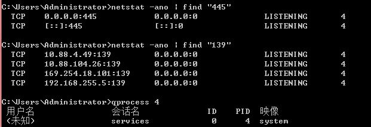

## windows

查看当前登录用户

	query user

查看系统中所有用户

	1. net user
	2. 开始-运行-lusrmgr.msc
	3. 查看C:\Users目录排查是否新建用户目录，如果存在则排查对应用户的download和desktop目录是否有可疑文件

注册表查看启动项

	开始-运行-regedit
	\HKEY_LOCAL_MACHINE\SOFTWARE\Microsoft\Windows\CurrentVersion\Run


	\HKEY_CURRENT_USER\Software\Microsoft\Windows\CurrentVersion\Run


命令行查看启动项

	wmic startup list full

Recent目录

此目录可以看到程序或文件最后被打开和使用的日期时间。

	C:\Users\Administrator\Recent

安全日志

计算机-管理-事件查看器-windows日志-安全(或**eventvwr.msc**)

根据时间排查安全日志里的登录事件，用户创建等事件情况


着重寻找登录事件(ID4624)且登录类型为3和10等远程登录方式


windows安全日志文件：

	C:\Windows\System32\winevt\Logs\Security.evtx 查看其大小是否为20M左右，若远远小于20M则有可能被清理过

排查可疑进程

导出正在运行的进程及其命令

	wmic process get caption,commandline /value >> ./tmp.txt

查看可疑网络连接（```netstat -b``` 需要管理员权限）

	netstat -b -n

根据网络连接寻找pid

	netstat -ano | findstr xxx

根据pid寻找进程

	tasklist | findstr xxx

**杀死可疑进程**

	taskkill /F /PID process_id

**查看外部连接**

	netstat /


查看开放端口

	netstat -ano 
	netstat -ano | find "445"

根据pid寻找进程

	tasklist | findstr xxx

或：

	qprocess PID




例如结束smb进程:


发现杀不掉，需要关服务。


排查计划任务

	schtasks /query /fo table /v

	或运行-taskschd.msc

如果在win7下出错，可以调整 936 中文GBK编码为 437 美国编码 则可以运行，但是无法打印出非ascii字符。（非ascii字符都变?.问号"?"）

查看cmd 编码

	chcp


工具使用

PECmd

使用PECmd导出最近活动项目

LastActivityView

使用LastActivityView图形化工具查看最近活动项目

查询账户sid:

	wmic useraccount get name,sid


查询进程的进程id，命令行：

	wmic process where caption="svchost.exe" get caption,handle,commandline


## linux

查看所有用户计划任务：

	for u in `cat /etc/passwd | cut -d":" -f1`;do crontab -l -u $u;done


定位有多少IP在爆破主机的root帐号:

    grep "Failed password for root" /var/log/secure*| awk '{print $11}'| sort | uniq -c| sort -nr |more

登录成功的IP有哪些:

    grep "Accepted " /var/log/secure*| awk '{print $11}' | sort | uniq -c |sort -nr | more


## 参考链接

[windows事件id大全_实用工具：快速查看安全事件中的远程登陆](https://blog.csdn.net/weixin_39538789/article/details/111163482)