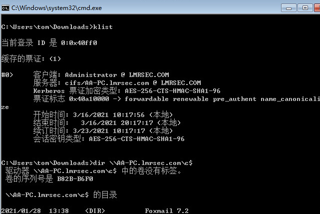
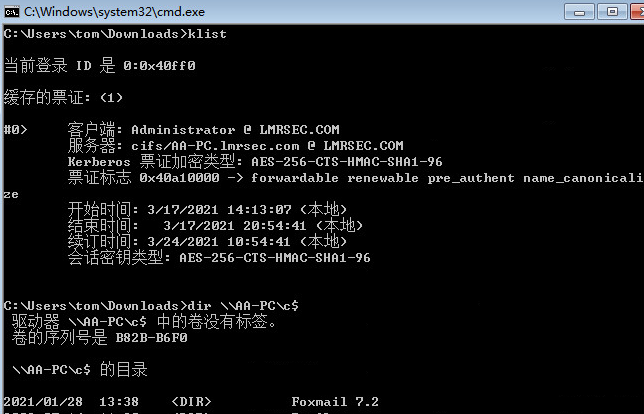

## 约束委派

## 原理

因为非约束委派很不安全，所以微软又发布了约束委派，区别在于不会直接把TGT给服务，所发送的认证信息中包含了允许访问的服务，即不允许服务代表用户去访问其他服务。

其实现主要依靠一组kerberos扩展：[S4U2self](https://docs.microsoft.com/en-us/openspecs/windows_protocols/ms-sfu/02636893-7a1f-4357-af9a-b672e3e3de13)（Service for User to Self）和 [S4U2proxy](https://docs.microsoft.com/en-us/openspecs/windows_protocols/ms-sfu/bde93b0e-f3c9-4ddf-9f44-e1453be7af5a)（Service for User to Proxy）。

Service for User (S4U): Extensions to the Kerberos protocol that allow a service to obtain a Kerberos service ticket for a user that has not authenticated to the Key Distribution Center (KDC). S4U includes S4U2proxy and S4U2self.

Service for User to Self (S4U2self): An extension that allows a service to obtain a Kerberos service ticket to itself. The service ticket contains the user's groups and can therefore be used in authorization decisions.

Service for User to Proxy (S4U2proxy): An extension that allows a service to obtain a service ticket on behalf of a user to a different service.

S4U2self扩展在第二步使用，模拟用户请求了KDC，实际上是代表了用户，让KDC验证用户是否合法，而S4U2proxy则是让服务1以用户身份只能通过ST1获取到ST2，禁止服务1直接去访问其他服务。

如果我们能获取到开启了约束委派的服务用户的**明文密码或者NTLM Hash**，我们就可以伪造S4U请求，进而伪装成服务用户以任意账户的权限申请访问某服务的ST。

### 环境搭建

域内机器：```win7 10.10.40.53  \\AA-PC```

域管：```win2016 10.10.40.50  \\AD```  

域内机器：```win7 10.10.40.52 \\tony-PC 普通用户tom权限登录  作为攻击机```

域用户 tom，tony，其中tony为服务用户。

打开 “Active Directory 用户和计算机”：

单击 “开始” -> “运行” -> 输入 “dsa.msc” :


加上spn之后委派的选项卡才会出现，因为只有服务账户和计算机账户才可以被委派。


以windows server 2016域控为例：


右键点击属性-》点击“委派”，默认是“不信任此计算机来委派”：


启动约束委派：


点击 “添加”:


点击 “用户或计算机”:


点击检查名称，点击确定：

在弹出来的选择服务界面发现有N多服务：


很多服务具体干啥的不清楚，随便选择一个cifs服务：

设置了服务用户tony对AA-PC的cifs服务的委派：


点击应用，设置完了再打开就变成这样：


这里需要一个工具[kekeo](https://github.com/gentilkiwi/kekeo)提取 tgt。

已经知道**服务用户明文密码**的条件下，我们可以用kekeo请求该用户的TGT：

登录域内另一台机器 tony-PC：

	tgt::ask /user:tony /domain:lmrsec.com /password:Passw0rd /ticket:1.kirbi

	参数：
	
	/user: 服务用户的用户名
	
	/password: 服务用户的明文密码
	
	/domain: 所在域名
	
	/ticket: 指定票据名称，不过这个参数没有生效，可以忽略


得到服务用户tony的TGT：	```TGT_tony@LMRSEC.COM_krbtgt~lmrsec.com@LMRSEC.COM.kirbi```

然后我们可以使用这张TGT通过伪造s4u请求以administrator用户身份请求访问AA-PC CIFS服务的ST：

	tgs::s4u /tgt:TGT_tony@LMRSEC.COM_krbtgt~lmrsec.com@LMRSEC.COM.kirbi /user:Administrator@lmrsec.com /service:cifs/AA-PC.lmrsec.com


**S4U2Self获取到的ST1以及S4U2Proxy获取到的AA-PC CIFS服务的ST2**会保存在当前目录下：


ST1和ST2分别对应的就是kekeo生成的```TGS_Administrator@lmrsec.com@LMRSEC.COM_tony@LMRSEC.COM.kirbi```和```TGS_Administrator@lmrsec.com@LMRSEC.COM_cifs~AA-PC.lmrsec.com@LMRSEC.COM.kirbi```

最终用到是ST2，ST1可以看作一个中间产物，在攻击机上进行ptt就能得到AA-PC cifs的访问权限了

然后我们用mimikatz将ST2导入当前会话即可（这一步是本地行为，无网络流量）：

	kerberos::ptt TGS_Administrator@lmrsec.com@LMRSEC.COM_cifs~AA-PC.lmrsec.com@LMRSEC.COM.kirbi

成功访问到AA-PC的cifs服务:




如果 service1 有了 protocol transition 权限的话，service1 可以以任何一个域内用户的身份向 KDC 申请一张访问 service1 自身的票据，而且不需要知道目标用户的密码。比如 service1 可以以域管理员 Administrator 的身份向 KDC 申请一张访问 service1自身的票据。（如果你能找到这么一个服务，并且可以通过这个服务执行代码的话，你是有可能直接利用这个功能提权至域管理员的，当然这个时候你获取到的域管权限是被限制在这台机器上的，无法访问别的服务器。）

### 其他情况

kekeo同样也支持使用NTLM Hash，在请求服务用户的TGT那步直接把```/password```改成```/NTLM```即可。

适用于拿到服务用户tony的NTLM hash。

<font color='red'>**windows 10 和 windows server 2012 及以上版本mimikatz 无法dump明文密码。**</font>

假设我们已经通过其他方式拿到tony用户的NTLM hash为 ```a87f3a337d73085c45f9416be5787d86```,

使用kekeo:

	tgt::ask /user:tony /domain:lmrsec.com /NTLM:a87f3a337d73085c45f9416be5787d86

	tgs::s4u /tgt:TGT_tony@LMRSEC.COM_krbtgt~lmrsec.com@LMRSEC.COM.kirbi /user:Administrator@lmrsec.com /service:cifs/AA-PC.lmrsec.com


然后再用mimikatz 导入ST2，跟上面命令一样。

#### 另一种情况

如果我们不知道服务用户的明文和NTLM Hash，但是我们有了服务用户登陆的主机权限（需要本地管理员权限），我们可以用mimikatz直接从内存中把服务用户的TGT dump出来：

	mimikatz.exe "privilege::debug" "sekurlsa::tickets /export" exit

windows 2003 本地管理员权限导出的ticket(但无法运行kekeo，ticket传到其他机器上利用):


win7 导出的ticket，(下面和上面win2003导出的ticket都可以用来请求TGT，并利用成功):


**```sekurlsa::tickets```是列出和导出所有会话的Kerberos票据，```sekurlsa::tickets```和```kerberos::list```不同，sekurlsa是从内存读取，也就是从lsass进程读取，这也就是为什么```sekurlsa::tickets /export```需要管理员权限的原因。并且```sekurlsa::tickets```的导出不受密钥限制，sekurlsa可以访问其他会话（用户）的票证。**

既然服务用户的TGT导出来了，我们就跳过```tgt::ask```请求TGT这步，直接使用kekeo请求```tgs::s4u```:

	tgs::s4u /tgt:[0;5b278]-2-0-40e10000-tony@krbtgt-LMRSEC.COM.kirbi /user:Administrator@lmrsec.com /service:cifs/AA-PC.lmrsec.com


最后再用mimikatz ptt：

	kerberos::ptt TGS_Administrator@lmrsec.com@LMRSEC.COM_cifs~AA-PC.lmrsec.com@LMRSEC.COM.kirbi



## 流量分析

kekeo 工具模拟委派请求(```tgt::ask```和```tgs::s4u```)的流量：

可以看到用户tony首先向KDC请求一张TGT：


AS-REP请求里返回TGT，这张TGT代表的是tony这个用户：


流量包见 ```tgt ask user tony domain lmrsec.com password Passw0rd ticket 1.kirbi.pcap```。

然后用这张TGT发送S4U2self请求，以Administrator的名义向TGS申请了一张访问自身服务的票据，我们这里就称为ST1吧：


得到ST1之后，然后会带上ST1再次向KDC发起SU42Proxy请求，以Administrator的名义请求一张访问AA-PC cifs服务的票据，我们这里就称为ST2吧：

多了一个 ```additional-tickets```节点，带上S4U2self返回的票据(ST1)


最后以Administrator的名义返回一张访问AA-PC cifs服务的票据(ST2)：


### 名词解释

cname

      This field contains the name part of the client's principal
      identifier.

principal ： 使用Kerberos进行身份验证的用户或服务的唯一名称。A principal follows the form root[/instance]@REALM。(the root is the same as their login ID)。

sname

      This field specifies all components of the name part of the
      server's identity, including those parts that identify a specific
      instance of a service.

PA-DATA

	   Historically, PA-DATA have been known as "pre-authentication data",
	   meaning that they were used to augment the initial authentication
	   with the KDC.  Since that time, they have also been used as a typed
	   hole with which to extend protocol exchanges with the KDC.

PA-TGS-REQ

	   In the case of requests for additional tickets (KRB_TGS_REQ),
	   padata-value will contain an encoded AP-REQ.  The checksum in the
	   authenticator (which MUST be collision-proof) is to be computed over
	   the KDC-REQ-BODY encoding.

服务主体名称（SPN）是Kerberos客户端用于唯一标识给特定Kerberos目标计算机的服务实例名称。

## 后记

1.复盘一下，在最开始信息搜集阶段如何知道设置了**服务用户tony对主机AA-PC的cifs服务的约束委派**？


使用[PowerSploit](https://github.com/PowerShellMafia/PowerSploit/tree/dev)，只不过需要dev版而不是master版：

	Get-DomainUser -TrustedToAuth -Domain lmrsec.com


2.可能是域网络的DNS不稳定，导致复现有时成功，有时失败。


3.对kerberos协议的理解还很浅显。域管配置了服务用户tony对主机AA-PC的cifs服务的约束委派，就只能拿到AA-PC的控制权限，但之前已经拿到tony用户的明文密码或tony的NTLM hash或tony的ticket了，可以用这些信息登录更多机器，所以实战很少会用到约束委派。

4.可以去AA-PC收集信息，很大几率管理员会登陆，后门基本都搞白银和黄金票据，还有就是域管DSRM的密码 (每一个域控制器都有一个本地管理员账户其实也就是所谓的目录服务还原模式（DSRM）账户。)，基于资源的约束委派就比这个常用。


[**域控权限持久化之DSRM----使用DSRM帐户密码进行Hash传递攻击**](https://www.freebuf.com/articles/network/80968.html)

## 参考资料

[The Kerberos Network Authentication Service (V5)](https://datatracker.ietf.org/doc/rfc4120/?include_text=1)

[Protocol Overview](https://docs.microsoft.com/en-us/openspecs/windows_protocols/ms-sfu/1fb9caca-449f-4183-8f7a-1a5fc7e7290a)

[域渗透——Kerberos委派攻击](https://xz.aliyun.com/t/7217)

[域渗透--Kerberos委派](https://eviladan0s.github.io/2020/04/14/kerberos-delegation/)

[**mimikatz在Win10及2012系统以后的明文抓取方式**](https://blog.csdn.net/netsec_steven/article/details/107257325)

[利用 Kerberos delegation 打造变种黄金票据](https://paper.seebug.org/620/)

[Kerberos身份验证流程](https://www.cnblogs.com/zpchcbd/p/11707302.html)


[windows中关于委派(delegation)的理解](https://shanfenglan.blog.csdn.net/article/details/108777247)

[基于windows中委派的攻击思路(上)-约束性委派与非约束性委派](https://blog.csdn.net/qq_41874930/article/details/110633298)

