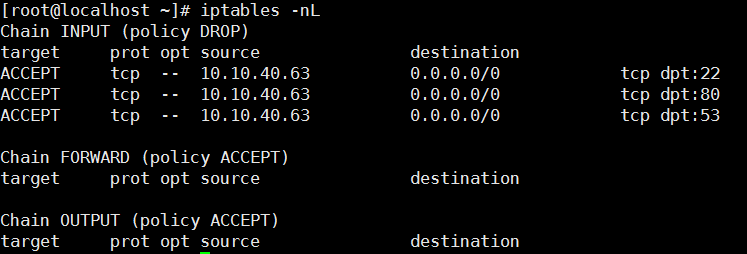
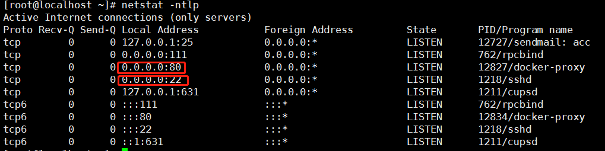

## 要求

配置linux断网机40.64： 仅开启40.64的 22,80,53端口，仅40.63可访问。

## 配置

	yum -y install iptables-services
	iptables -P INPUT DROP
	iptables -I INPUT -s 10.10.40.63 -p tcp --dport 22 -j ACCEPT
	systemctl restart iptables.service

也可以直接改 /etc/sysconfig/iptables 文件，然后restart下服务也行

装了这个iptables ,重启系统，iptables 策略就不会丢失了

