#要求

40.55作为一台可以出不可以入的windows“断网机”，icmp 放行，40.63入站放行。

#配置

##命令

###配置入站拒绝，出站放行

	netsh advfirewall set allprofiles firewallpolicy blockinbound,allowoutbound

###icmp 放行

	netsh advfirewall add rule name="permit icmp" dir=in action=allow protocol=icmpv4

###40.63入站放行

	netsh advfirewall add rule name="40.63 permit all" dir=in action=allow localip=10.10.40.55 remoteip=10.10.40.63

## 图形化界面

###配置入站拒绝，出站放行

打开防火墙高级设置

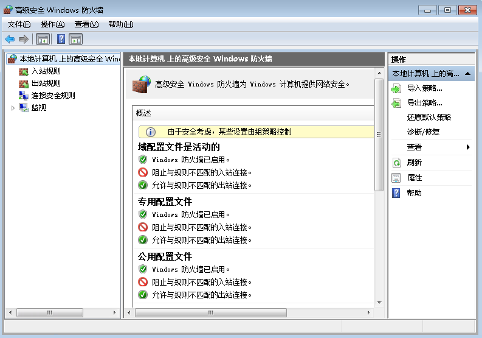

右键本地计算机——>属性，确保入站连接：阻止，出站连接：允许

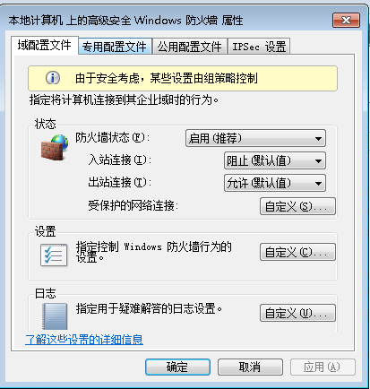

###icmp 放行

右键入站规则，新建规则

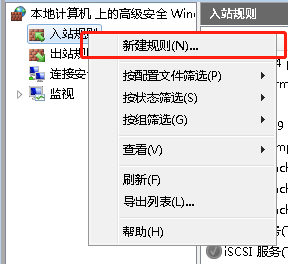

自定义->下一步

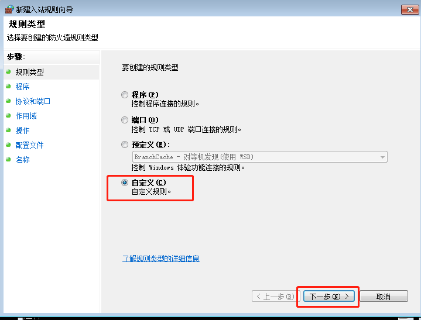

所有程序，下一步->协议设置icmpv4->下一步

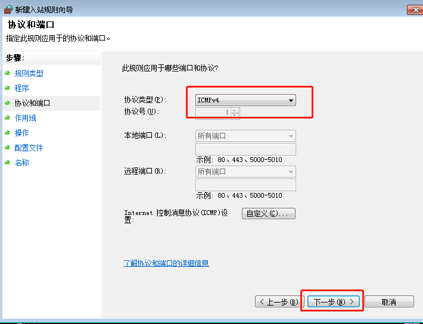

下一步，下一步，下一步->设置名称描述->完成

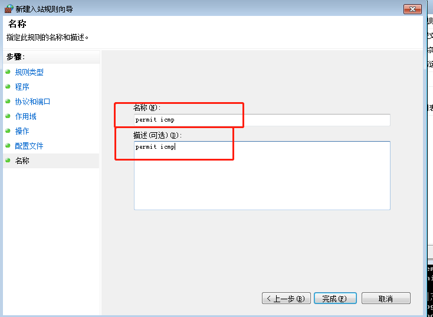

###40.63入站放行

新建规则->自定义->下一步

所有程序，下一步->协议类型任何->下一步

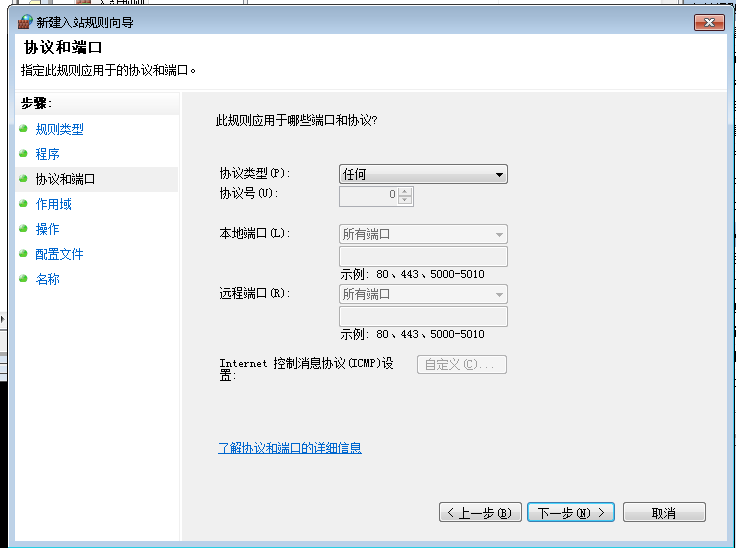

设置本地ip，远程ip->下一步

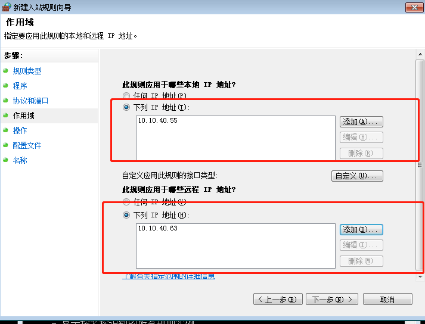

允许连接，下一步，下一步->设置名称描述，完成

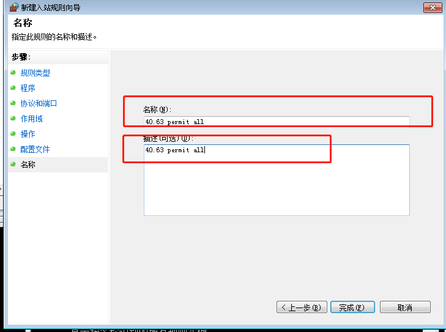

## 远程桌面解决

(**这里是取消特例放行**)

打开防火墙，找到允许的程序

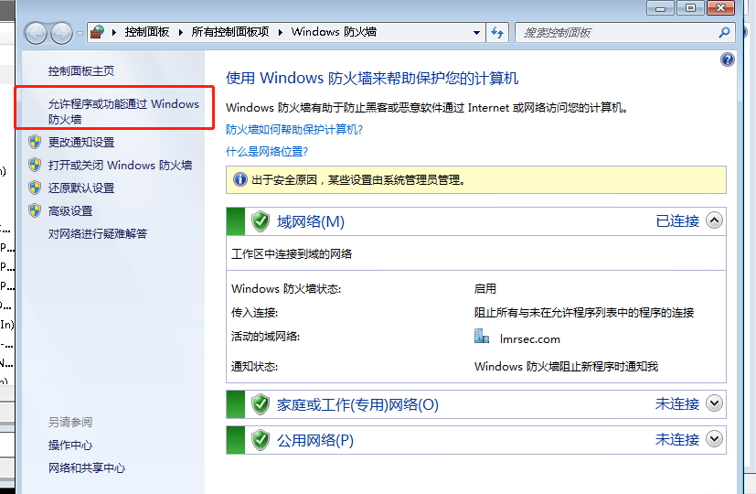

把有关远程桌面的选项勾掉

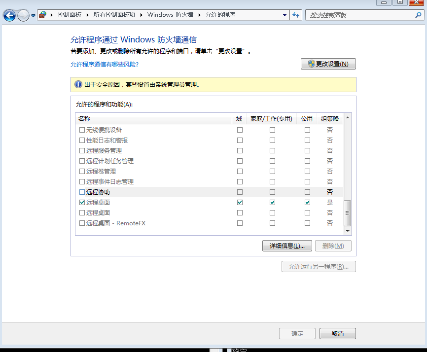
