## 2.0 3.0 秘钥协商区别

老版冰蝎工具在连接Webshell的时候会存在一个密钥协商的过程，这个过程是纯明文的数据交换，冰蝎存在这样的特征：发起一共两次的密钥协商。

新版冰蝎新增了无动态密钥交互。只有在无动态密钥交互失败后，才会进入常规的密钥交互阶段。密钥生成可以看出，使用密码的md5结果的前16位。

## 反编译调试

1.点击jar包，右键，Add as Library。

获取源码，发现都被锁了，无法解锁修改文件，但可以运行，运行后UI里的main，出现GUI界面。

2.这里使用 jd-gui.exe 工具将源码反编译，再导出桌面，再导入IDEA，就可以自由编辑了。

这里会出现许多报错，所以需要把缺失的/反编译报错的类修复，实现基本功能可用即可。


[为什么Java 的jar包反编译后很多泛型参数都被擦除了？](https://www.zhihu.com/question/278593769/answer/401664334)

[Luyten](https://github.com/deathmarine/Luyten)

### 调试

1.PHP

入口：

Main.java 引用 fxml(javaFX 的图形化框架)，FXML是一种基于XML的声明式标记语言，用于描述JavaFX应用程序的用户界面。

Main.fxml 里定义了controller: ```net.rebeyond.behinder.ui.controller.MainController```，推测是在fxml.xml里设定程序的主controller。


MainController 的构造函数调用 ShellManager:

net.rebeyond.behinder.dao.ShellManager,主要是数据库的增删改查，可以直接跳过。

之后会进入MainController的initialize()：

初始化一些元素；

之后弹出冰蝎界面；

在点击操作。是```net.rebeyond.behinder.ui.controller.MainWindowController```:

MainWindowController 里面的每个属性都加了 @FXML注解

变量的名称为刚才在FXML文件中声明的控件的id属性

进入 MainWindowController的init()，shellEntity对象里存储已经保存的冰蝎shell的一些属性。

	this.currentShellService = new ShellService(shellEntity);

然后进入 core.ShellService 

它的构造函数会读取url，key，以及session等，是所有shell功能的入口。

构造函数的initHeaders()方法,会定义默认的header；

对于php，会额外定义一个header;  

	Accept: text/html,application/xhtml+xml,application/xml;q=0.9,image/webp,image/apng,*/*;q=0.8,application/signed-exchange;v=b3;q=0.9
	Accept-Language: zh-CN,zh;q=0.9,en-US;q=0.8,en;q=0.7


php 会额外添加头：

	Content-Type: text/html;charset=utf-8


MainController 的 openShell方法，发送http请求：

猜测可能和MainWindowController中的listener类有关:

	import javafx.beans.value.ChangeListener;
	import javafx.beans.value.ObservableValue;


AES的加密模式，默认是ECB模式 有IV的是CBC模式

net.rebeyond.behinder.core.Constants

有一个奇怪的属性：

	public static String[] cookieProperty = new String[] { "expires", "max-age", "domain", "path", "secure", "httponly", "samesite" };

net.rebeyond.behinder.core.Constants.userAgents

默认内置UA，为上面类中几种之一：

    public static int ENCRYPT_TYPE_AES = 0;
    public static int ENCRYPT_TYPE_XOR = 1;


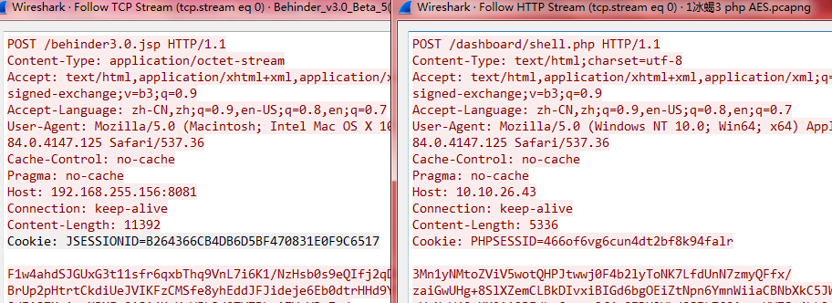

jsp:

Cookie: JSESSIONID=32位字母数字

php:

Cookie: PHPSESSID=26位字母数字

php  post 请求体的前21个字符相同，与密码有关：

	3Mn1yNMtoZViV5wotQHPJ
	
	zWE3FwAJBcrwUo7Z9CENw

jsp post 请求体前面的字符不同。

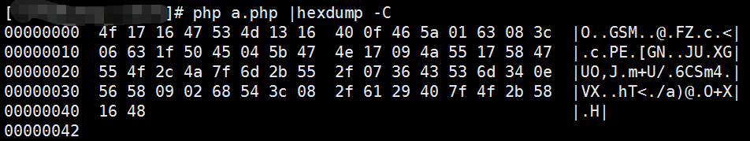

tcp contains 

4f:17:16:47:53:4d:13:16:40:0f:46:5a:01:63:08:3c:06:63:1f:50:45:04:5b:47:4e:17:09:4a:55:17:58:47


在server端源码输出 $func 和 $params：

	$func=$arr[0];
    $params=$arr[1];
	echo $func;
	echo $params;

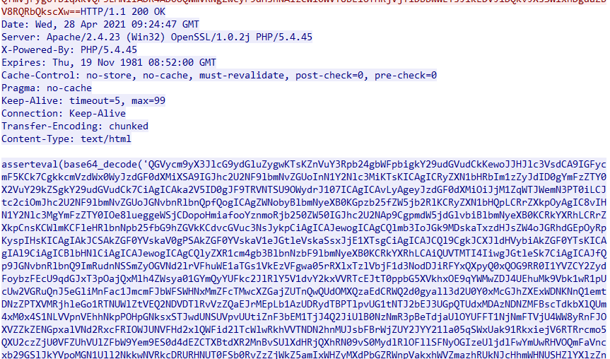

$func 的值就是 assert。

将第2个resp 和 第三个resp base64部分解码：

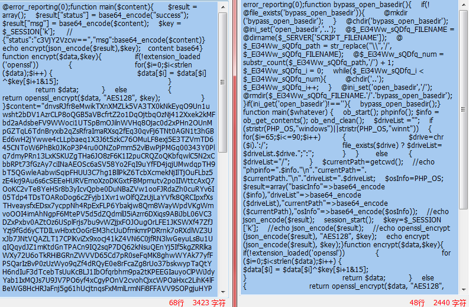

发现分别调用了 echo.php 和 BasicInfo.php 。

但是打印 ```echo $params;``` 会导致冰蝎连接失败，猜测可能是反编译的版本有某些小bug，影响不大。


Utils.java 

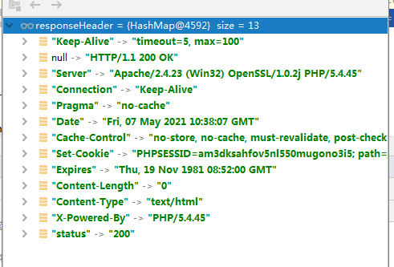

MainWindowController.java

正在获取基本信息，请稍后...

this.currentShellService.getBasicInfo(randString)


debug:


``` MainController.java-> this.initShellList();-> this.initShellTable(); ```


点击添加好的wshell，进入 MainController.java 

之后会进入MainController的initialize()：


	this.initShellList(); ->this.initShellTable(); ->this.openShell(url, shellID); -> MainWindowController.java-> initialize() -> this.initControls(); ->  mainWindowController.init(this.shellManager.findShell(Integer.parseInt(shellID)), this.shellManager, currentProxy); -> init() -> this.currentShellService = new ShellService(shellEntity); ->public ShellService(JSONObject shellEntity) -> initHeaders();//添加默认header头 -> MainWindowController.initialize() -> initControls() -> this.doConnect(); -> boolean connectResult = this.currentShellService.doConnect(); -> ShellService.doConnect() -> JSONObject obj = echo(content); -> echo() -> byte[] data = Utils.getData(this.currentKey, this.encryptType, "Echo", params, this.currentType); ->Utils.getData //根据脚本选择payload模板文件 -> 例如php-> byte[] bincls = Params.getParamedPhp(className, params); -> //含有伪随机字符串的payload模板Echo文件 // 见注释1 -> bincls = Base64.encode(bincls).getBytes(); //base64编码再取bytes -> bincls = ("assert|eval(base64_decode('" + new String(bincls) + "'));").getBytes(); //拼接 assert|eval(base64_decode(' 给server 端使用 -> //见注释2 -> byte[] encrypedBincls = Crypt.EncryptForPhp(bincls, key, encryptType); -> Crypt.EncryptForPhp //默认使用AES，第一个包并不care服务端加密方式，见注释3 -> Cipher cipher = Cipher.getInstance("AES/CBC/PKCS5Padding"); //"算法/模式/补码方式"  -> cipher.init(1, skeySpec, new IvParameterSpec(new byte[] { 0, 0, 0, 0, 0, 0, 0, 0, 0, 0, 0, 0, 0, 0, 0, 0 })); //看server端php解密脚本可以知道 客户端AES 并未使用iv，iv=0， 见注释4 -> return Base64.encode(encrypedBincls).getBytes(); //AES之后一定要base64，不然会出现乱码； -> Map<String, Object> resultObj = Utils.requestAndParse(this.currentUrl, this.currentHeaders, data, this.beginIndex, this.endIndex); -> Utils.requestAndParse -> Utils.sendPostRequestBinary() //配置post参数 -> sendPostRequestBinary.conn.setRequestProperty("Content-Type", "application/octet-stream"); // 添加了Content-type, application/octet-stream // 实测未生效，未覆盖原php content-type，因为只有php提前在header中配置了content-type  text/html;charset=utf-8，所以猜测这一步对其他语言全部生效**；-> #Utils.sendPostRequestBinary.conn.getResponseCode() // 实际post发包的方法，第一个包就是玩 -> 返回 Map<String, Object> resultObj // header 存于 "header"，"body" 存于 "data"。-> #ShellService.echo(String content)  String localResultTxt = "{\"status\":\"c3VjY2Vzcw==\",\"msg\":\"" + Base64.encode(content.getBytes()) + "\"}"; // 定义一个 localResultTxt ，见注释5；-> byte[] localResult = Crypt.Encrypt(localResultTxt.getBytes(), this.currentKey, this.currentType, this.encryptType); -> #Crypt.Encrypt() // php 判断是AES类型后面还要再加一次base64 -> #ShellService.echo()  this.beginIndex = Utils.matchData(resData, localResult); //比较刚刚加密的字符串和响应返回的字符串。 如果不同，返回beginIndex=-1，再将beginIndex和endIndex重置为0； -> #ShellService.echo()  String resultTxt = new String(Crypt.Decrypt(Arrays.copyOfRange(resData, this.beginIndex, resData.length - this.endIndex), this.currentKey, this.encryptType, this.currentType)); //调用AES解密，因为第一个包返回时空，所以解密完返回的 resultTxt也是空； -> #ShellService.echo() JSONObject result = new JSONObject(resultTxt); //等价于new JSONObject("");  会抛出异常 -> #ShellService.doConnect() 捕获了它里面echo()方法抛的这个异常； 将加密方式调整为 XOR！！ 再次重新获取随机字符串，再次调用 JSONObject obj = echo(content); 重复上面的流程； -> 除了加密方式不同，其他一致； ->#ShellService.echo this.beginIndex = Utils.matchData(resData, localResult); 如果本地的localResult和resp body 的resData 一致，会返回 beginIndex=0; // 见注释6 -> #ShellService.echo  JSONObject result = new JSONObject(resultTxt); //将resp body data转化为json对象 ，分别对每个key("status","msg") 的value进行base64解码； -> #ShellService.doConnect()  if (obj.getString("msg").equals(content)) //将resp body 提取的msg和本地生成的content校验；校验数据一致性，如果一致表示 S端C端加密算法一致； ->  #MainWindowController.initControls()  String randString = Utils.getRandomString(randStringLength); //至此可以快乐的发第三个包了，再次获取随机字符串(第三个请求的随机字符串并未使用)，从第二个请求开始会携带cookie，并且第三个请求按照服务端的加密方式加密数据包  -> #MainWindowController.initControls()  JSONObject basicInfoObj = new JSONObject(this.currentShellService.getBasicInfo(randString)); //获取网站的基本信息  -> #ShellService.getBasicInfo  byte[] data = Utils.getData(this.currentKey, this.encryptType, "BasicInfo", params, this.currentType); // 读取payload BasicInfo ，返回base64编码的 加密payload BasicInfo -> #ShellService.getBasicInfo   Map<String, Object> resultObj = Utils.requestAndParse(this.currentUrl, this.currentHeaders, data, this.beginIndex, this.endIndex); //发第三个POST请求 -> #ShellService.getBasicInfo   result = new String(Crypt.Decrypt(resData, this.currentKey, this.encryptType, this.currentType));  // 解密resp body ，最终返回 basicInfoObj 对象 ； 见注释7; ->  


注释1：

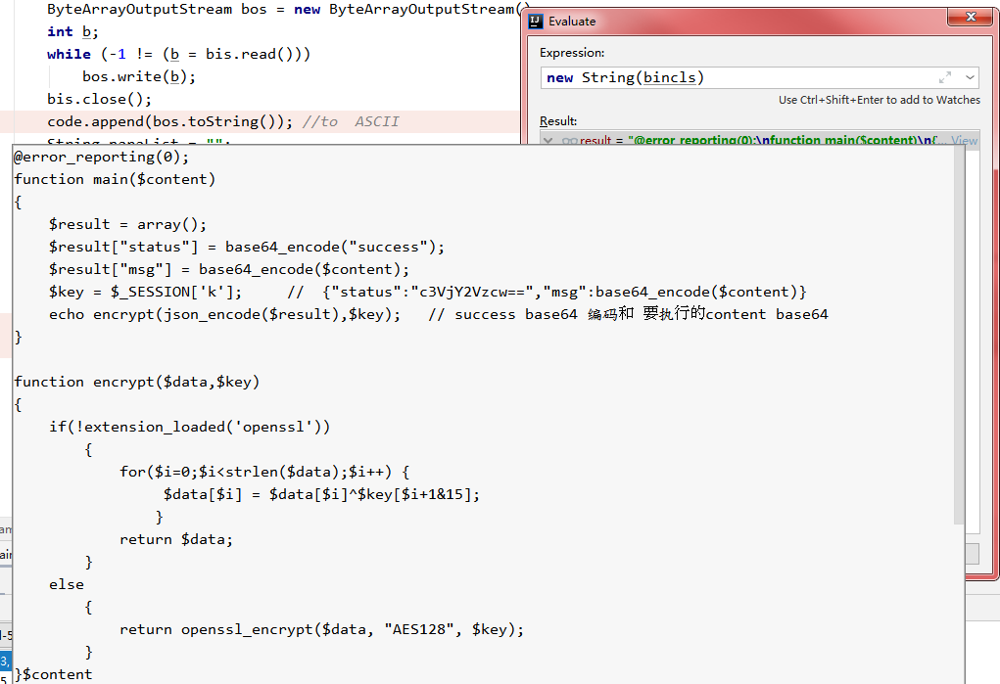

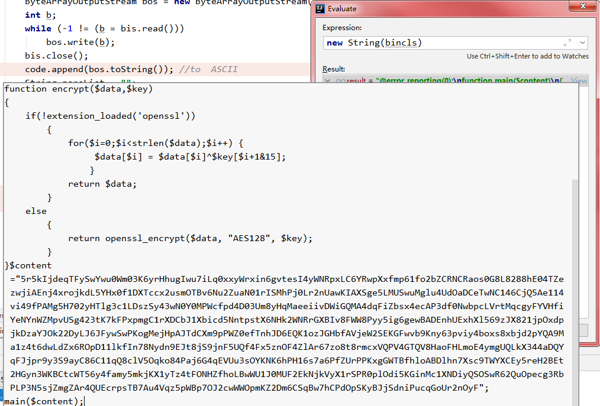

注释2：

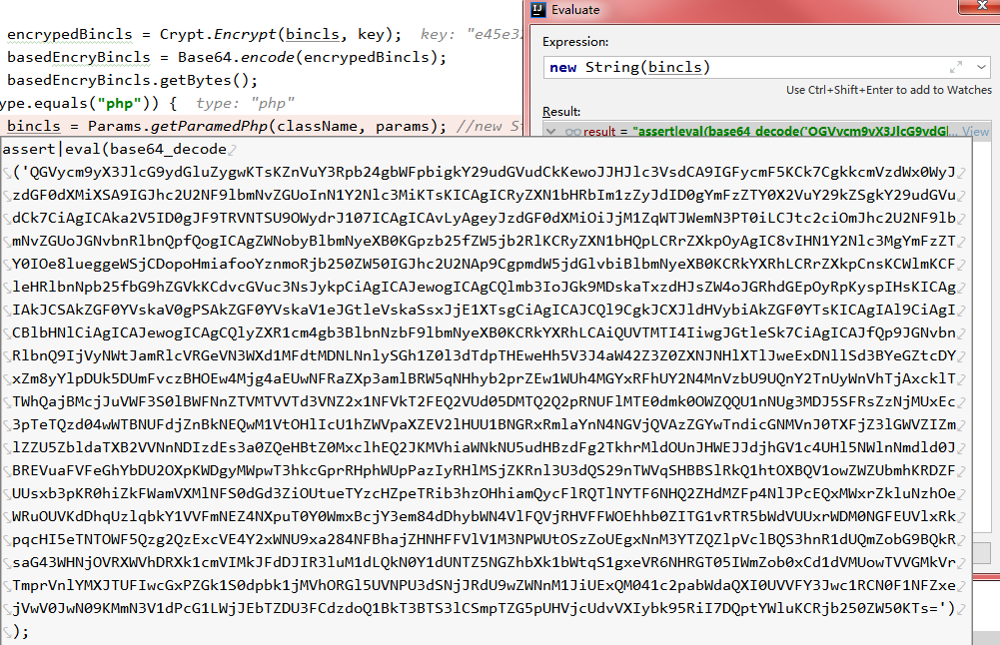

注释3：

ShellService.java

public class ShellService

public int encryptType = Constants.ENCRYPT_TYPE_AES;

//Constants.ENCRYPT_TYPE_AES=0；

byte[] data = Utils.getData(this.currentKey, this.encryptType, "Echo", params, this.currentType); // 返回 base64 编码的 AES payload Echo 模板


注释4：

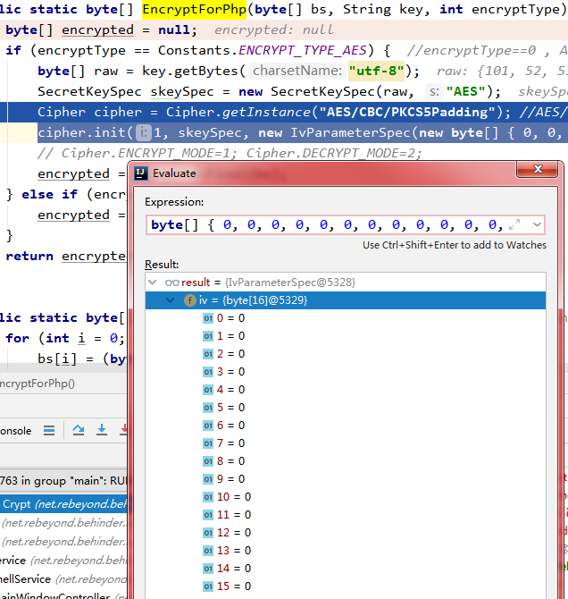

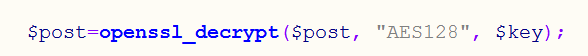

注释5：

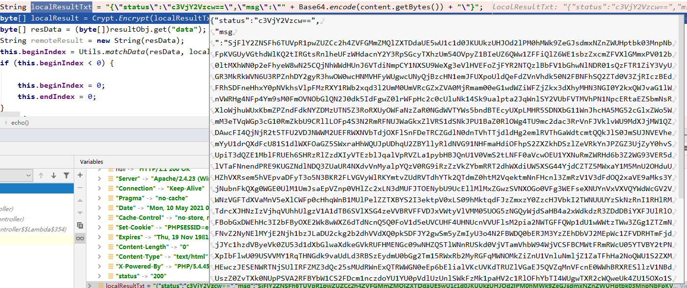

注释6：

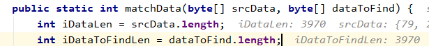

注释7：

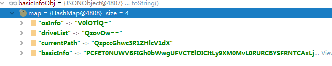


### 异或

XOR 运算有一个很奇妙的特点：如果对一个值连续做两次 XOR，会返回这个值本身。

	// 第一次 XOR
	1010 ^ 1111 // 0101
	// 第二次 XOR
	0101 ^ 1111 // 1010

原始信息是message，密钥是key，第一次 XOR 会得到加密文本cipherText。对方拿到以后，再用key做一次 XOR 运算，就会还原得到message。

## 冰蝎检测

1.文件上传等漏洞

流量形式主要取决于Web应用，是攻击者不好控制的，而且通常都是以明文形式进行传输，所以比较易于检测。

## RASP

在2014年的时候，Gartner引入了“Runtime application self-protection”一词，简称为RASP。它是一种新型应用安全保护技术，它将保护程序像疫苗一样注入到应用程序中，应用程序融为一体，能实时检测和阻断安全攻击，使应用程序具备自我保护能力，当应用程序遭受到实际攻击伤害，就可以自动对其进行防御，而不需要进行人工干预。

RASP技术可以快速的将安全防御功能整合到正在运行的应用程序中，它拦截从应用程序到系统的所有调用，确保它们是安全的，并直接在应用程序内验证数据请求。Web和非Web应用程序都可以通过RASP进行保护。该技术不会影响应用程序的设计，因为RASP的检测和保护功能是在应用程序运行的系统上运行的。

### RASP vs WAF

RASP技术可以做到程序底层拼接的sql语句到数据库之前进行拦截。也就是说，在应用程序将sql语句预编译的时候，RASP可以在其发送之前将其拦截下来进行检测，如果sql语句没有危险操作，则正常放行，不会影响程序本身的功能。如果存在恶意攻击，则直接将恶意攻击的请求进行拦截或净化参数。


2021.4.19 v3.0 Beta 9 更新日志：

6.anti rasp

## 参考资料

[冰蝎v2.0.1核心部分源码浅析](https://xz.aliyun.com/t/7300)

[利用动态二进制加密实现新型一句话木马之Java篇](https://xz.aliyun.com/t/2744)

[冰蝎shell_冰蝎3.0 源码分析](https://blog.csdn.net/weixin_34314939/article/details/112325020)

[利用动态二进制加密实现新型一句话木马之PHP篇](https://xz.aliyun.com/t/2774)

[冰蝎beta6 源码](https://github.com/x1a0t/Behinder-Source)

[冰蝎全版本ClientSource](https://github.com/MountCloud/BehinderClientSource)

[JavaFX入门（二）：JavaFX和FXML](https://blog.csdn.net/theonegis/article/details/50181339)

[PHP explode() 函数](https://www.runoob.com/php/func-string-explode.html?ivk_sa=1024320u)


## 后记

1.一定要在 MainWindowController.java 的 private void doConnect() 方法内下断点。

在下面这一行下断点监控 调用 doConnect() 方法的行为：

	boolean connectResult = this.currentShellService.doConnect();


2.冰蝎默认第一个post 发AES payload，如果php server端无响应，证明php server 加密为 XOR方式。

3.**冰蝎shell不管传什么返回都是200，不会出现500**，除非服务器崩溃。

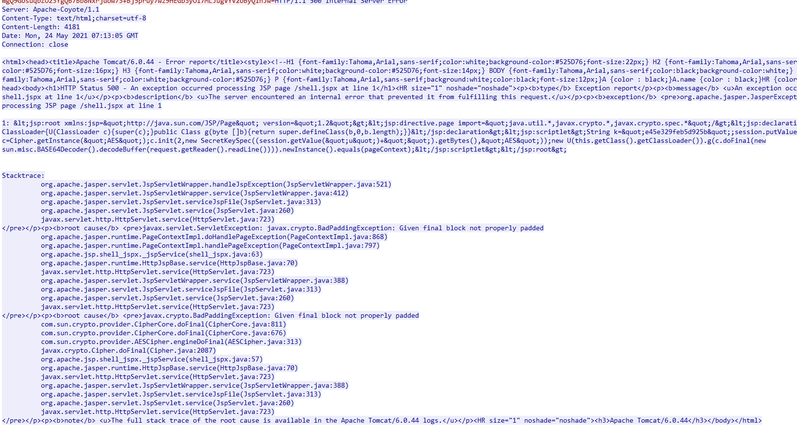

4.冰蝎服务端代码：

1).post body解密；
2).回调函数执行；   (返回值，及返回的加密方法由客户端传入的payload里定义)

返回的加密语句也要在服务端执行，所以无论是加密还是解密，都需要服务端支持。

5.最后总结一下加密交互流程：

以服务端支持XOR为例：

第一个post请求：
	
	$content    //clsName_payload_file--content
	="randomString";
	main($content);

	base64encode(上文);

	assert|eval(base64_decode(base64encode(上文)));

	base64encode(AES(上文))//生成base64编码的AES加密payload模板代码

	发起请求，读取resp

	对返回数据AES解密//客户端payload控制

本地生成字符串：
	
	localResultTxt={"status":"c3VjY2Vzcw==","msg":"Base64.encode(randomString)"}

加密，判断如果是php，如果之前默认使用了AES，则在外层再加base64,即：
	
	Base64.encode(AES(localResultTxt))


第二个post包(如果第一个包校验加密方式不一致，catch捕获异常在第二个包重新发echo payload，如果第一个包加密一致，则第二个包略过，直接发第三个包)：

	$content    //clsName_payload_file--content
	="randomString";
	main($content);

	base64encode(上文);

	assert|eval(base64_decode(base64encode(上文)))；

	
	base64encode(XOR(上文))；//生成base64编码的XOR加密payload模板代码

本地：
	
	XOR(localResultTxt)

	this.beginIndex = Utils.matchData(resData, localResult);

先比较长度，我实验这个包长度都是 3970；

	beginIndex=0；

复制一份响应data,调用对应加密方法，我这里是XOR解密；

	{"status":"c3VjY2Vzcw==","msg":"eFRGbFdrME02aGdySklCSUZ1ZFJ..."}

	JSONObject result = new JSONObject(resultTxt); //转化为json格式

分别对每个key 的value进行base64解码；

校验数据一致性，如果一直表示 S端C端 加密算法一致；

	if (obj.getString("msg").equals(content))
    {
        result = true;
    }

发送第三个POST：

获取基本信息，携带cookie，用前面验证好的加密方式加密post body数据；


6.冰蝎的随机字符串研究

主要影响验证加密算法，也就是前1-2个包(也就是echo payload，取决于第一次连接的加密算法是否猜测正确)

请求body里的伪随机字符串都发送了，实际上服务端只处理了前2个包的伪随机字符串，其他做检测规避用的。

注释掉ECHO payload 的伪随机字符串，发现ECHO请求包的体是固定长度(以PHP XOR为例)：

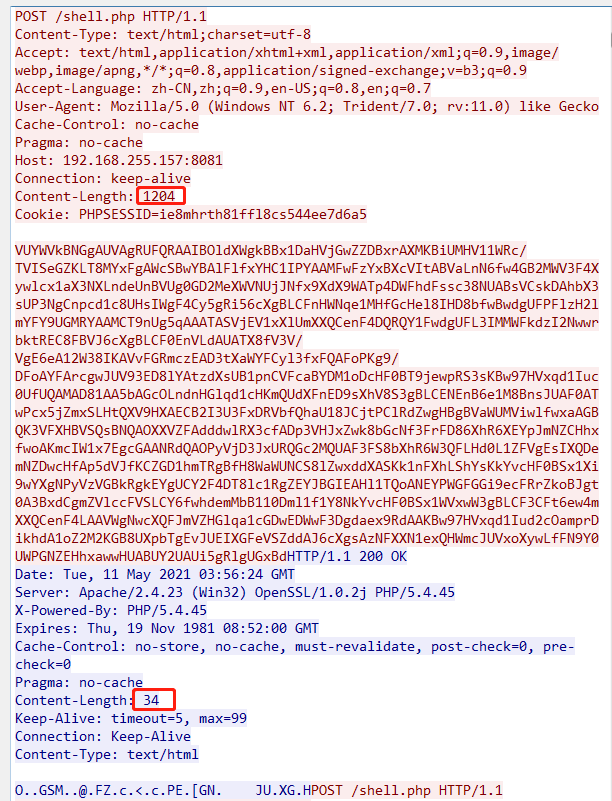

在2020.8.18 v3.0 Beta 3 更新日志：

	请求体增加了随机冗余参数，避免防护设备通过请求体大小识别请求；


//randStringLength = 2501
Content-Length: 5656      (AES)

剩下的长度：3155


883   Content-Length: 2776  (AES)
剩下的长度：1893


973 Content-Length:6452   （XOR）


behinder 6 和 behinder 7及7以后 的 ShellService.initHeaders() 变化挺大的。


behinder 3.0 - Vbeta 6

	private void initHeaders() {
        this.currentHeaders.put("Accept", "text/html,application/xhtml+xml,application/xml;q=0.9,image/webp,image/apng,*/*;q=0.8,application/signed-exchange;v=b3;q=0.9");
        
        this.currentHeaders.put("Accept-Language", "zh-CN,zh;q=0.9,en-US;q=0.8,en;q=0.7");
        if (this.currentType.equals("php"))
        {
            
            this.currentHeaders.put("Content-Type", "text/html;charset=utf-8");
        }
        
        this.currentHeaders.put("User-Agent", getCurrentUserAgent());
    }

behinder 3.0 - Vbeta7 -beta11

	private void initHeaders() {
        this.currentHeaders.put("Accept", "text/html,application/xhtml+xml,application/xml;q=0.9,image/webp,image/apng,*/*;q=0.8,application/signed-exchange;v=b3;q=0.9");
        this.currentHeaders.put("Accept-Encoding", "gzip, deflate, br");
        this.currentHeaders.put("Accept-Language", "zh-CN,zh;q=0.9,en-US;q=0.8,en;q=0.7");
        if (this.currentType.equals("php")) {
            this.currentHeaders.put("Content-type", "application/x-www-form-urlencoded");
        } else if (this.currentType.equals("aspx")) {
            this.currentHeaders.put("Content-Type", "application/octet-stream");
        } else if (this.currentType.equals("jsp")) {
            this.currentHeaders.put("Content-Type", "application/octet-stream");
        }

        this.currentHeaders.put("User-Agent", this.getCurrentUserAgent());
        if (((String)this.currentHeaders.get("User-Agent")).toLowerCase().indexOf("firefox") >= 0) {
            this.currentHeaders.put("Accept", "text/html,application/xhtml+xml,application/xml;q=0.9,image/webp,*/*;q=0.8");
            this.currentHeaders.put("Accept-Language", "zh-CN,zh;q=0.8,zh-TW;q=0.7,zh-HK;q=0.5,en-US;q=0.3,en;q=0.2");
        }

        this.currentHeaders.put("Referer", this.getReferer());
    }


asp cookie:

	Cookie: ASPSESSIONIDQABATCTQ=   

	Cookie: ASPSESSIONIDAADADARR=

	Cookie: ASPSESSIONID\w{8}=

aspx cookie:

	Cookie: ASP.NET_SessionId=

jsp cookie:

	Set-Cookie: JSESSIONID=

jspx cookie:

	Set-Cookie: JSESSIONID=

结论：第二个post请求会根据前面服务器响应成功的 Set-Cookie 返回结果，提交与脚本语言相符的cookie。

7.不同语言，已连接的session会复用，情况比较极端，实战一台server一般只有一种语言服务端程序：

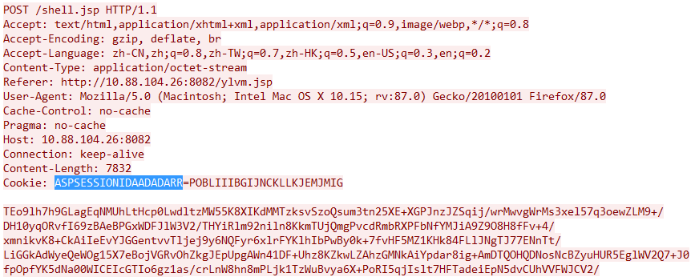

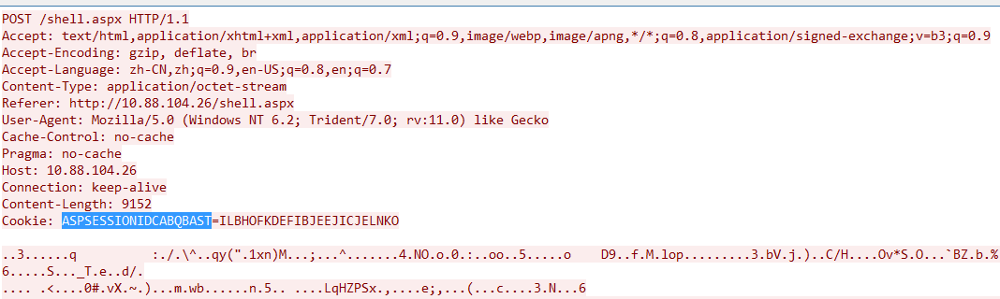

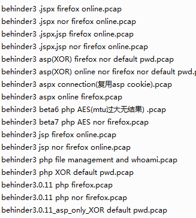

