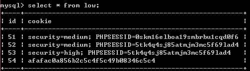

## dvwa 学习 csrf

### 参考资料

[DVWA-1.9全级别教程之CSRF](https://www.freebuf.com/articles/web/118352.html)

### csrf 简介

利用受害者尚未失效的身份认证信息（cookie、会话等），诱骗其点击恶意链接或者访问包含攻击代码的页面，在受害人不知情的情况下以受害者的身份向（身份认证信息所对应的）服务器发送请求，从而完成非法操作（如转账 、改密等）。

**CSRF攻击是源于Web的隐式身份验证机制！Web的身份验证机制虽然可以保证一个请求是来自于某个用户的浏览器，但却无法保证该请求是用户批准发送的。CSRF的攻击一般是由服务端解决。**

CSRF与XSS最大的区别就在于，CSRF并没有盗取cookie而是直接利用。

### session token

当客户端请求页面时，服务器会生成一个随机数Token，并且将Token放置到session当中，然后将Token发给客户端（一般通过构造hidden**表单**）。下次客户端提交请求时，Token会随着表单一起提交到服务器端。

### 环境

dvwa 服务器 192.168.255.151:8081

攻击者vps  192.168.1.101

### 攻击步骤

#### 1.编写 payload

```http://192.168.255.151:8081/dvwa-master/vulnerabilities/csrf/?password_new=password&password_conf=password&Change=Change#```

受害者点击链接之后页面会跳转

需要注意，**CSRF最关键的是利用受害者的cookie向服务器发送伪造请求，所以如果受害者之前用Chrome浏览器登录的这个系统，而用搜狗浏览器点击这个链接，攻击是不会触发的，因为搜狗浏览器并不能利用Chrome浏览器的cookie，所以会自动跳转到登录界面**

可以使用短链接来隐藏URL（点击短链接，会自动跳转到真实网站）：
如 [百度短链接](https://dwz.cn)

实际攻击场景下只要目标服务器的域名不是ip，是可以生成相应短链接的。

#### 2.构造攻击页面

a) 在公网上传一个攻击页面，诱骗受害者去访问

**用隐藏图片的src属性来发起恶意请求**

下面是html代码


	
	
	<h1>404<h1>
	
	<h2>file not found.<h2>


当受害者访问test.html时，会误认为是自己点击的是一个失效的url，但实际上已经遭受了CSRF攻击，密码已经被修改为了hack


b) 服务端验证了 host与 referer，使referer必须包含host

应对：构造文件名为 服务器名

可以将攻击页面命名为192.168.255.151.html ，页面放在攻击者vps上。

c) High级别的代码加入了Anti-CSRF token机制，用户每次访问改密页面时，服务器会返回一个随机的token，向服务器发起请求时，需要提交token参数，而服务器在收到请求时，会优先检查token，只有token正确，才会处理客户端的请求。


由于跨域是不能实现的，所以我们要将攻击代码注入到目标服务器192.168.255.151中，才有可能完成攻击

```ALTER TABLE guestbook MODIFY name VARCHAR(190);```


	

其中，steal.php在 ```https://github.com/leezp/note/blob/master/xss/dvwa-xss/steal.php```

这一步操作和high级别存储型xss一样，如图，获取到token。



可见csrf要和xss结合使用才能发挥最大效果。这种组合叫**XSRF**。  但实际是否会存在一个时间差，获取到token了，如何监控？如何即时诱导用户是以后该思考的问题

## 防御

### Anti CSRF Token

例子： 

	1. 用户访问某个表单页面。 
	
	2. 服务端生成一个Token，放在用户的Session中，或者浏览器的Cookie中。 
	
	3. 在页面表单附带上Token参数。 
	
	4. 用户提交请求后， 服务端验证表单中的Token是否与用户Session（或Cookies）中的Token一致，一致为合法请求，不是则非法请求。 
	
	这个Token的值必须是随机的，不可预测的。由于Token的存在，攻击者无法再构造一个带有合法Token的请求实施CSRF攻击。另外使用Token时应注意Token的保密性，尽量把敏感操作由GET改为POST，以form或AJAX形式提交，避免Token泄露。 

使用token可以有效防重放攻击。如果想要复制token，则必须先对页面访问一次，再复制token进csrf伪造页面发现已经无法使用(get请求使用token的情况(不推荐)，服务端已更新)。

有些服务端不是每次都更新token，而是在成功执行一次“增/删/改”后，server端更新token。这种情况，如果网站存在xss，则有可能通过xss获取token，再结合csrf。


## 后记

1.要避免"加token但不进行校验"的情况，在session中增加了token，但服务端没有对token进行验证，根本起不到防范的作用。 

2.**对数据库有改动的增删改操作，需要加token验证，对于查询操作，一定不要加token，防止攻击者通过查询操作获取token进行csrf攻击。**但并不是这样攻击者就无法获得token，只是增大攻击成本而已。 


## reference

[web安全之token](https://www.cnblogs.com/bukudekong/p/3829875.html)

[**Web安全之CSRF攻击**](https://www.cnblogs.com/lovesong/p/5233195.html)


## csrf 自动化检测思路

[CSRF-Scanner——打造全自动检测CSRF漏洞利器](https://security.tencent.com/index.php/blog/msg/24)