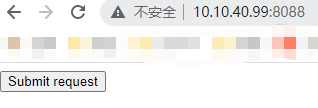

# Wordpress4.7.4-CSRF

## 环境

wordpress-4.7.4（https://cn.wordpress.org/wordpress-4.7.4-zh_CN.zip）

burpsuite

## 简介

管理员后台的添加用户和删除用户处均存在CSRF漏洞。

## 复现
找到添加用户的页面，添加用户

点击添加，抓包分析

将请求包发送到CSRF POC模块中，把原来的test改成test1，test1@test.com，然后更新下方的表单内容

将html代码复制保存为wp-csrf.html，上传到40.99

访问http://10.10.40.99:8088/wp-csrf.html，点击表单

成功添加，CSRF

