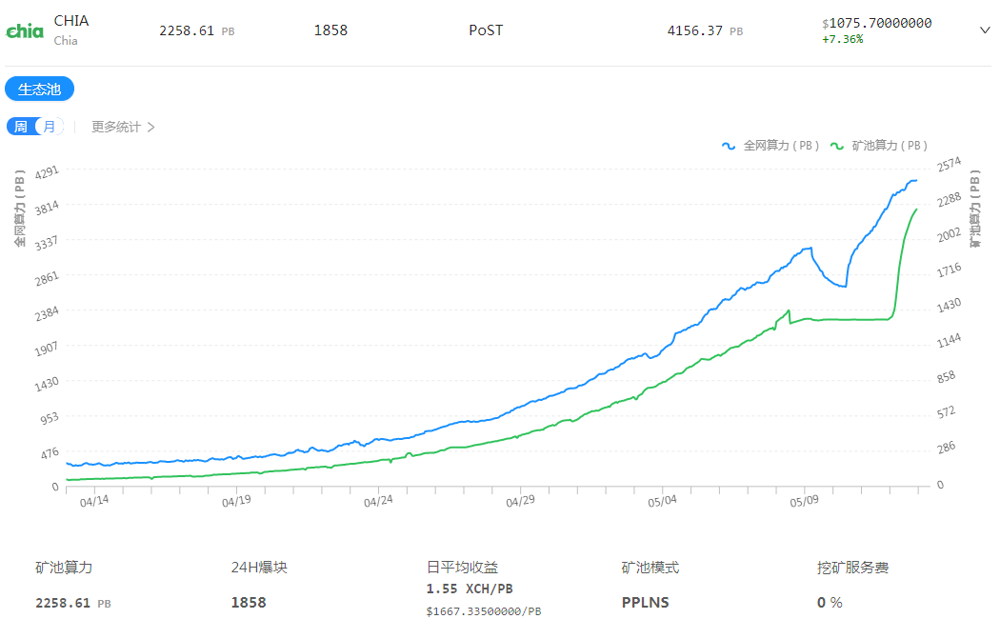
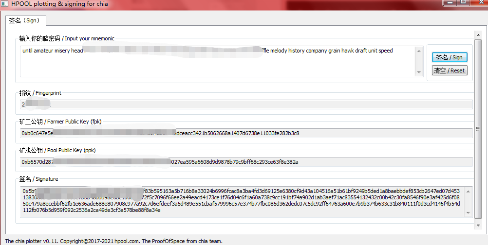
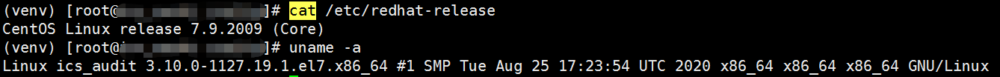
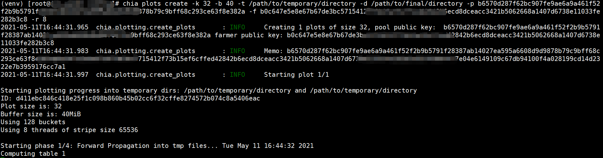
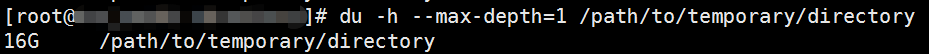
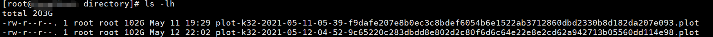
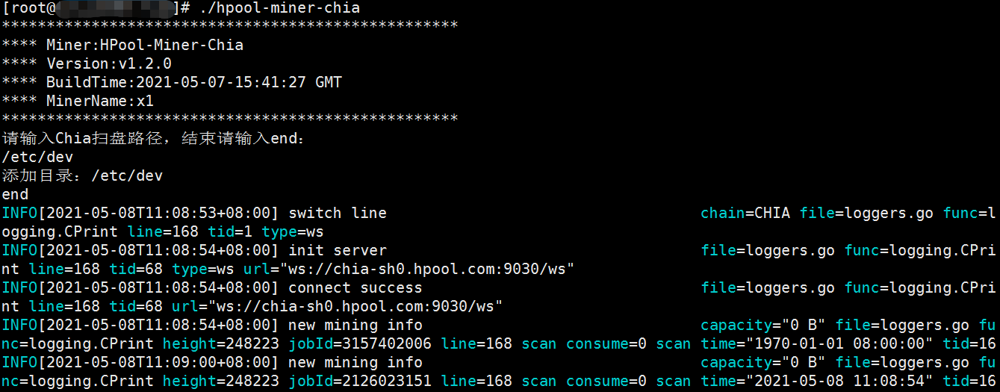
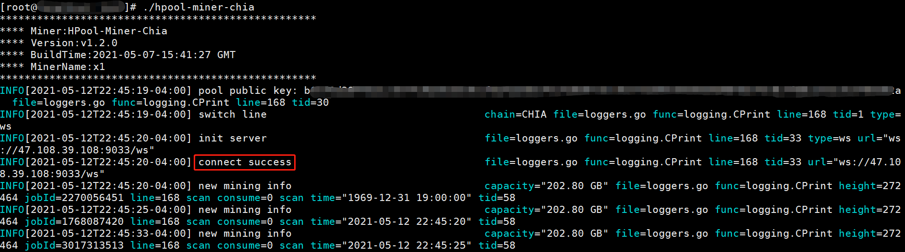
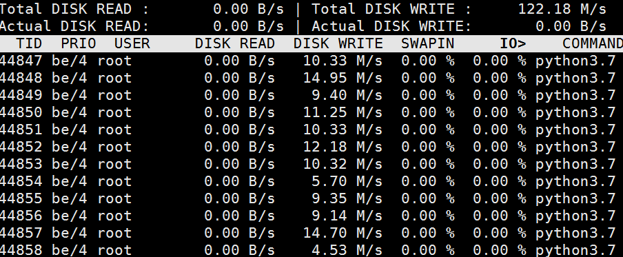

## 概述

2021年3月chia主网正式上线。

2021年4月27日17:00, 新加坡WBF交易所正式上线热门项目Chia代币XCH期货, 并于开放区和掘金区上线XCH/USDT交易对(暂未开通充提), 待Chia主网正式开通交易, 用户可在WBF平台1:1兑换XCH现货。

2021年4月29日, 新加坡WBF交易所重磅开售Chia云算力产品, 一期总认购额度：819200 USDT／10240T, 活动价：80USDT／T, 最低起购量：5T, P盘周期30天（线性增长）, 预计日产出0.008XCH／T, 预计年化收益高达：100%-800%。

根据华尔街专业机构分析：按目前chia的共识和算力增长速度，9月之前都属于头矿期。到8月中旬，预计全网算力可达到6000P，按700元/T硬件与运维技术等成本价计算，砸进去的硬件总成本达42亿人民币，届时总共挖出约140万个xch，每个xch的成本为3000元。按POW的平均市盈率为5计算，届时价格 2000U以上并不是没有可能，也就是210亿人民币的市值，市值排名50位左右。

Chia Network 的区块链依赖于一种新的中本聪共识算法，称为空间证明和时间证明。

空间证明：可以将空间证明视为一种证明您在硬盘驱动器上未使用某些存储的方式。Chia区块链的用户将通过安装软件来“播种”(plot)其硬盘驱动器上未使用的空间，该软件将磁盘上的一组加密数字存储为“密码”。这些用户称为“农民”(farmer)。当区块链广播下一个区块的挑战时，农民可以扫描其plots以查看其是否具有最接近挑战的哈希值。农民赢得一个plots的概率是农民占整个网络的总空间的百分比。

时间证明：需要区块之间经过一小段时间。时间证明是通过可验证延迟函数来实现的，它需要一定的时间来计算，但验证速度非常快。VDF的关键思想是它们需要顺序计算，由于拥有许多并行机器不会产生任何好处，因此电力浪费被降到最低。VDF服务器("Timelords")可能会相对较少，因为最快的服务器总是先完成，网络上只需要一个快速公平的Timelord就可以完成一个区块并将链子向前推进。

在开始挖矿之前需要在闲置硬盘空间进行播种（plots），然后农民（farmer）在已经播种好的P盘文件（plots files）上寻找最佳爆块答案。Chia硬盘挖矿的本质就是先将加密数据写入硬盘（plots过程），然后挖矿程序在P盘文件中寻找最优答案（farmer过程），所以你的P盘文件总容量相对于全网容量占比越高，越容易爆块，对应的挖矿收益也越高。

播种的过程需要占用CPU、内存（每个P盘线程默认需要4G内存空间）和硬盘临时空间（生成K = 32规格的播种文件大概需要占用332G临时空间）。因此播种（Plots）的过程建议采用性能较好的CPU、16G以上内存和固态硬盘（建议合计2T以上的M2.NVME协议SSD）。参考Plots平台硬件配置表

Chia允许你在每台矿机上只运行一个收割机（harvester）程序连接到集中的一个全节点钱包（重钱包full node）上进行挖矿，而不必在每台机器上都运行完整的重钱包。采用这种模式可以让你的系统更简单，使用更少的带宽、空间、CPU，也让你的钱包秘钥更安全。

整个农场（矿场）的架构是由一台运行全节点钱包（重钱包full node）的主机和其他只运行收割机（harvester）的机器组成。其中只有你的全节点钱包主机器会连接到Chia网络，而其他运行收割机的矿机只需要连接你的全节点钱包即可。

可以将图从一台机器移动到另一台机器，而没有任何限制。有些人建造了专用的绘图机，这些绘图机经过优化可以快速执行绘图过程，然后将绘图移至功能较弱的机器上进行采集。

## 实践

到目前[chia](https://www.chia.net/) 钱包官网支持windows和mac版本的程序。可以通过这个gui直接指定农场(硬盘)进行P图(P盘)。

下载钱包：

https://github.com/Chia-Network/chia-blockchain/releases

在windows装钱包，在矿池 [hpool](https://github.com/hpool-dev/chia-plotter/releases) 下载工具，获取绑定矿池的签名：

[将生成的签名绑定矿池](https://www.hpool.in/help/tutorial/21)

我的centos p盘环境：

查看cpu 核心数：

	cat /proc/cpuinfo

centos7 安装:
	
	curl -sL https://rpm.nodesource.com/setup_10.x | sudo bash -
	sudo yum install -y nodejs
	
	python3.7 -m venv venv
	ln -s venv/bin/activate
	. ./activate
	pip install --upgrade pip
	pip install -i https://hosted.chia.net/simple/ miniupnpc==2.1 setproctitle==1.1.10
	
	pip install chia-blockchain==1.1.5

开P图(-r 8 使用8线程；-b 300 p盘内存缓存300M；-p Pool Public Key (ppk)； -f Farmer Public Key (fpk)(使用上面工具生成的去掉0x后的fpk和ppk))：

[-k size](https://github.com/Chia-Network/chia-blockchain/wiki/k-sizes)

	chia plots create -k 32 -r 8 -b 1024 -t /path/to/temporary/directory -d /path/to/final/directory -p b6570d287f62bc907fe9ae6a9a461f52f2b9b5791f28387ab14027ea595a6608d9d9878b79c9bxxxxxxxxxxxxxxxxxxx -f b0c647e5e8e67b67de3bc5715412f73b15ef6cffed42842b6ecd8dceacc3421b5062668a1407dxxxxxxxxxxxxxxxxxxx

Caught plotting error: Not enough memory for sort in memory. Need to sort 0.562481GiB

Caught plotting error: Not enough memory for sort in memory. Need to sort 3.499839GiB

查看p图目录文件大小:

	du -h --max-depth=1 /path/to/temporary/directory

p完盘的回显：

	Finished writing C1 and C3 tables
	2778     Writing C2 table
	2779     Finished writing C2 table
	2780     Final table pointers:
	2781     P1: 0x10c
	2782     P2: 0x3747e3758
	2783     P3: 0x6b5ee9b4e
	2784     P4: 0x9fdb87730
	2785     P5: 0xd55b03ee8
	2786     P6: 0x10d9668ef1
	2787     P7: 0x14e9e3c097
	2788     C1: 0x1909c06e97
	2789     C2: 0x1909daa49f
	2790     C3: 0x1909daa54f
	2791 Time for phase 4 = 1275.524 seconds. CPU (82.150%) Wed May 12 21:39:40 2021
	2792 Approximate working space used (without final file): 269.341 GiB
	2793 Final File size: 101.354 GiB
	2794 Total time = 60425.389 seconds. CPU (96.290%) Wed May 12 21:39:41 2021
	2795 Copied final file from "/path/to/temporary/directory/plot-k32-2021-05-12-04-52-9c65220c283dbdd8e802d2c80f6d6c64e22e8e2cd62a942713b05560dd114     e98.plot.2.tmp" to "/path/to/final/directory/plot-k32-2021-05-12-04-52-9c65220c283dbdd8e802d2c80f6d6c64e22e8e2cd62a942713b05560dd114e98.plot     .2.tmp"
	2796 Copy time = 1366.272 seconds. CPU (19.210%) Wed May 12 22:02:28 2021
	2797 Removed temp2 file "/path/to/temporary/directory/plot-k32-2021-05-12-04-52-9c65220c283dbdd8e802d2c80f6d6c64e22e8e2cd62a942713b05560dd114e98.     plot.2.tmp"? 1
	2798 Renamed final file from "/path/to/final/directory/plot-k32-2021-05-12-04-52-9c65220c283dbdd8e802d2c80f6d6c64e22e8e2cd62a942713b05560dd114e98     .plot.2.tmp" to "/path/to/final/directory/plot-k32-2021-05-12-04-52-9c65220c283dbdd8e802d2c80f6d6c64e22e8e2cd62a942713b05560dd114e98.plot"

p完图自动将 /path/to/temporary/directory 下的文件复制到 /path/to/final/directory 目录下：

一个程序P盘，一个程序爆块。

爆块:

config.yaml:

	token: ""
	path:
	- /path/to/final/directory
	minerName: x1
	apiKey: b0xxxxxx-f796-4ec4-abb9-xxxxxxxxxx96
	cachePath: ""
	deviceId: ""
	extraParams: {}
	log:
	  lv: info
	  path: ./log/
	  name: miner.log
	url:
	  info: ""
	  submit: ""
	  line: ""
	scanPath: true
	scanMinute: 60
	debug: ""
	language: ""

./hpool-miner-chia

or

	url="ws://chia-sh0.hpool.com:9032/ws"

端口随机，域名固定。

上图是空跑程序，下图是成功连接到p图文件，爆块

查看硬盘读写io:

	iotop

## 参考资料

[CentOS/Red Hat/Fedora](https://github.com/Chia-Network/chia-blockchain/wiki/INSTALL#centosred-hatfedora)

[CHIA单机挖矿教程,Chia多机集群挖矿教程(CHIA挖矿流程)](https://www.jb51.net/blockchain/772100.html)

[Chia如何使用CMD命令行或Powershell P盘，操作教程以及解释参数](https://www.yundongfang.com/Yun47564.html)

## 后记

去中心化：

1.在区块链上的资产是“私钥即一切”，有私钥就可以控制区块链上的资产。什么意思，就是你的如果有某个比特币的私钥，你就控制了这个比特币。

2.钱包是私钥的管理软件。

中心化钱包的定义是：私钥由中心化机构控制。比如，你在一个网站上注册账号，对方给你开通了钱包，你充入了比特币，但是对方没有把私钥给你，这就是一个中心化的钱包。

去中心化钱包的定义是：私钥由个人保管，钱包软件不保存私钥。

3.p越大的盘，需要的内存越大。

	
	Bucket 116 QS. Ram: 3.211GiB, u_sort min: 10.000GiB, qs min: 2.500GiB. force_qs: 0
	Bucket 117 QS. Ram: 3.211GiB, u_sort min: 5.000GiB, qs min: 2.500GiB. force_qs: 0
	Forward propagation table time: 29667.325 seconds.
	Caught plotting error: Not enough memory for sort in memory. Need to sort 5.000090GiB

当我未指定内存大小，仅指定k=35：

	Plot size is: 35
	Buffer size is: 3389MiB

这个内存大小是不够的；

不指定 -b ，一般默认是3000多 MiB。

下载地址：https://github.com/hpool-dev/chiapp-miner/releases