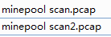

## 用 python 实现挖矿请求

通过 分析 Stratum 协议通信流程，首次通信矿机需要发送订阅到矿池，参数可以为空。

	{"id": 1, "method": "mining.subscribe", "params": []}

也可以任意填写

	{"id": 1, "method": "mining.subscribe", "params": [TestMiner/1]}

通过socket 实现 tcp 协议payload的发送与接收。

1.py 来自于 https://blog.csdn.net/qimoDIY/article/details/116517928

2.py 改变自 https://github.com/ricmoo/nightminer 

运行命令： ```python3 2.py -o stratum+tcp://auto.c3pool.org:13333```

两者实现大同小异。

最近很多国内ip被限制访问矿池，所以用国外的矿池测试。

## reference

[FPGA应用篇【2】比特币SHA256算法实现——挖矿自动化](https://blog.csdn.net/qimoDIY/article/details/116517928)

https://coinspace.datat.one/questions/mining-pools/stratum-protocol-problem-with-implementation-in-python/?zh=c

https://github.com/ricmoo/nightminer

[猫池(需fq)](https://c3pool.com/#/dashboard)

[mining.subscribe与initiate_stratum函数](https://blog.csdn.net/zfgzeng/article/details/103950897)

