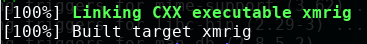

## 编译xmrig

### 环境

kali-linux 2019 （Ubuntu）

Linux root 4.19.0-kali3-amd64 #1 SMP Debian 4.19.20-1kali1 (2019-02-14) x86_64 GNU/Linux

xmrig  v5.5.1

### 步骤

[参考链接：Ubuntu build](https://xmrig.com/docs/miner/ubuntu-build)

	apt-get install git build-essential cmake libuv1-dev libssl-dev libhwloc-dev
	apt-get install automake libtool autoconf
	git clone https://github.com/xmrig/xmrig.git

	cd xmrig/scripts && ./build_deps.sh
	mkdir xmrig/build
	cd build
	cmake .. -DXMRIG_DEPS=scripts/deps
	make -j$(nproc)

编译成功，如图

****

	centos 7 下失败

	/usr/bin/ld: cannot find -lstdc++
	collect2: error: ld returned 1 exit status
	make[2]: *** [xmrig] Error 1
	make[1]: *** [CMakeFiles/xmrig.dir/all] Error 2
	make: *** [all] Error 2

	yum whatprovides libstdc++.so.6

	yum makecache

	yum -C search libstdc

	ln -s libstdc++-devel.x86_64 libstdc++

### 查看钱包余额

在哪个矿池挖就在哪个矿池查

[**猫池**](https://c3pool.com/cn)

### 收益计算器
	
[收益计算器](https://wk588.com/jsq/Monero)

### 参考资料

[js挖矿](http://safe.it168.com/a2018/0530/3206/000003206119.shtml)