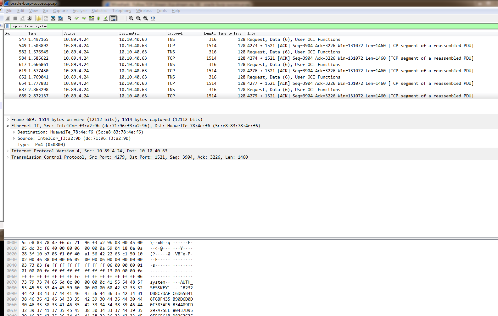

登录失败的信息有：

	invalid username/password


已知数据库用户名为system，用它过滤：



发现有5个流，对应用户名system尝试了5个密码，src.port 分别是 ```4273 4274 4276 4277 4279```。

最后一个流 port=4279 为登录成功。 Follow这个流：tcp.stream eq 19


跟前面一个流 tcp.stream eq 18 登录失败对比：


成功是不返回 Return Status的，返回 Return OPI Parameter，里面的参数个数很多。


## 环境配置

	images：oracle:v0.3
	docker run -itd -h oracle2021 -p1521:1521 oracle:v0.3

	system/oracle   SID:xe

SID表示数据库名


有登录失败太多锁定账户的机制

有更高权限的用户就可以解锁

	#alter user system account unlock;

或者：

	alter profile default limit FAILED_LOGIN_ATTEMPTS unlimited;


linux 下，将oracle驱动放在指定目录，爆破：


