## 云函数原理

本质是一个API网关，

服务端测试代码，多次点击测试：

	def main_handler(event: dict, context: dict):
    	requests.get('http://vps:8000')

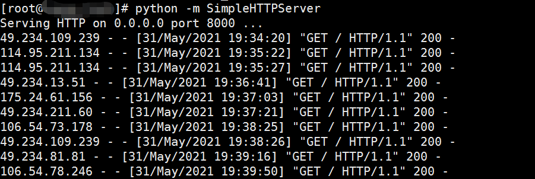

## py3.8 python venv 环境创建

需要提前安装gcc 8.1.0(尽量使用高版本gcc)(推荐直接安装py3.8 rpm)：

https://blog.90.vc/archives/367

	wget http://mirror.hust.edu.cn/gnu/gcc/gcc-8.1.0/gcc-8.1.0.tar.xz
	tar -Jxvf gcc-8.1.0.tar.xz
	cd gcc-8.1.0
	./contrib/download_prerequisites   //下载一些必备的依赖程序，这一步时间较长耐心等待
	cd ..
	mkdir temp_gcc81 && cd temp_gcc81
	../gcc-8.1.0/configure --prefix=/usr/local/gcc-8.1 --enable-threads=posix --disable-checking --disable-multilib
	make
	make install     

gcc编译python3.8相当耗时，不推荐：

https://www.python.org/ftp/python/3.8.9/Python-3.8.9.tgz

	curl -O https://www.python.org/ftp/python/3.8.0/Python-3.8.0.tgz
	tar xf Python-3.8.0.tgz 
	cd Python-3.8.0/
	./configure --enable-optimizations // --enable-optimizations 表示以“官方发布的稳定版本”编译；网上很多人说 --with-ssl 是无效的，编译打印的日志上写了 not recognized option '--with-ssl'。
	make
	make install


**推荐直接安装python3.8 rpm**:
	
	yum install centos-release-scl-rh
	yum install rh-python38
	rpm -ql rh-python38-python

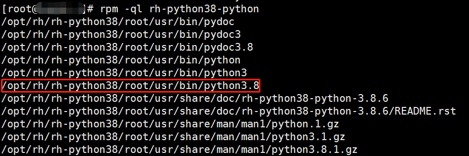

	/opt/rh/rh-python38/root/usr/bin/python3.8

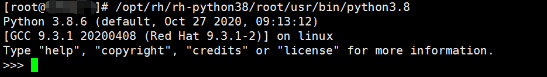

创建软连接：

	which python3.8

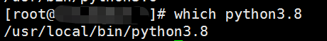

	rm -f /usr/local/bin/python3.8

	ln -s /opt/rh/rh-python38/root/usr/bin/python3.8 /usr/local/bin/python3.8
	ls -l /usr/local/bin/python3.8

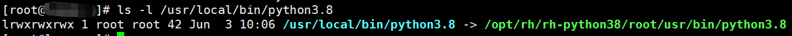

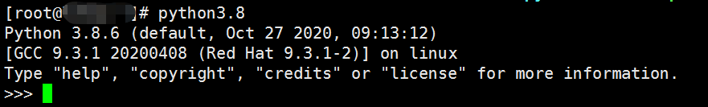

	pip3 install virtualenv

	cd /root         //任意目录
	virtualenv -p  /usr/local/bin/python3.8 ENV3.8   // 当前目录产生 ENV3.8 文件夹
	python3 -m venv /root/ENV3.8   //python3 -m venv /path/to/new/virtual/environment
	source  /root/ENV3.8/bin/activate
	python -V        // 这个时候显示的py版本是py3.8

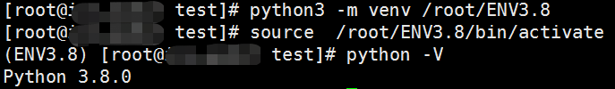


## mitmproxy API

https://github.com/mitmproxy/mitmproxy

mitmdump is the command-line version of mitmproxy. Think tcpdump for HTTP.

wiki https://docs.mitmproxy.org/stable/concepts-howmitmproxyworks/

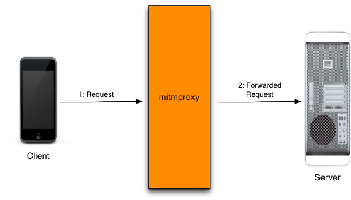

Python API

	from mitmproxy import http
	
	def request(flow: http.HTTPFlow):
	    # redirect to different host
	    if flow.request.pretty_host == "example.com":
	        flow.request.host = "mitmproxy.org"
	    # answer from proxy
	    elif flow.request.path.endswith("/brew"):
	    	flow.response = http.HTTPResponse.make(
	            418, b"I'm a teapot",
	        )
      
针对http，常用的API:

request：

	#http.HTTPFlow 实例 flow
	flow.request.headers #获取所有头信息，包含Host、User-Agent、Content-type等字段
	flow.request.url #完整的请求地址，包含域名及请求参数，但是不包含放在body里面的请求参数
	flow.request.pretty_url #同flow.request.url目前没看出什么差别
	flow.request.host #域名
	flow.request.method #请求方式。POST、GET等
	flow.request.scheme #什么请求 ，如https
	flow.request.path # 请求的路径，url除域名之外的内容
	flow.request.get_text() #请求中body内容，有一些http会把请求参数放在body里面，那么可通过此方法获取，返回字典类型
	flow.request.query #返回MultiDictView类型的数据，url直接带的键值参数
	flow.request.get_content()#bytes,结果如flow.request.get_text() 
	flow.request.raw_content #bytes,结果如flow.request.get_content()
	flow.request.urlencoded_form #MultiDictView，content-type：application/x-www-form-urlencoded时的请求参数，不包含url直接带的键值参数
	flow.request.multipart_form #MultiDictView，content-type：multipart/form-data时的请求参数，不包含url直接带的键值参

response：

	flow.response.status_code #状态码
	flow.response.headers # headers
	flow.response.cookies # cookies
	flow.response.text#返回内容，已解码
	flow.response.content #返回内容，二进制
	flow.response.setText()#修改返回内容，不需要转码


demo:

	from mitmproxy import ctx
	# 实例化输出类
	info = ctx.log.info
	
	# 所有发出的请求数据包都会被这个方法所处理
	# 所谓的处理，我们这里只是打印一下一些项；当然可以修改这些项的值直接给这些项赋值即可
	def request(flow):
	    # 获取请求对象
	    request = flow.request
	    # 打印请求的url
	    info(request.url)
	    # 打印请求方法
	    info(request.method)
	    # 打印host头
	    info(request.host)
	    # 打印请求端口
	    info(str(request.port))
	    # 打印所有请求头部
	    info(str(request.headers))
	    # 打印cookie头
	    info(str(request.cookies))         //MultiDictView[]
	
	# 所有服务器响应的数据包都会被这个方法处理
	# 所谓的处理，我们这里只是打印一下一些项
	def response(flow):
	    # 获取响应对象
	    response = flow.response
	    # 打印响应码
	    info(str(response.status_code))
	    # 打印所有头部
	    info(str(response.headers))
	    # 打印cookie头部
	    info(str(response.cookies))
	    # 打印响应报文内容
	    info(str(response.text))

mitm加载脚本：

	./mitmdump -s mitmproxy_demo.py -p 8081 --no-http2

使用代理访问：

	curl http://www.cip.cc/ --proxy http://127.0.0.1:8081

mitm输出：

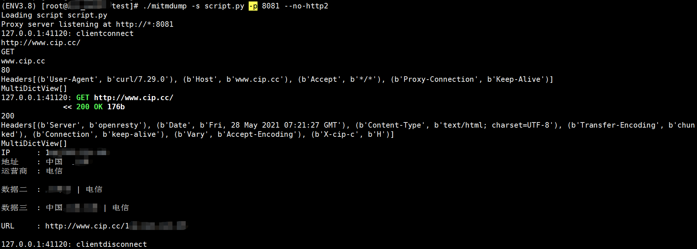


## debug
	
	def request(flow):
	    scf_server = choice(scf_servers)
	    scf_server='http://www.yunsee.cn'
	    info = ctx.log.info
	
	    r = flow.request
	    info(r.method)
	    info(str(r.headers))
	    data = {
	        "method": r.method,
	        "url": r.pretty_url,
	        "headers": dict(r.headers),
	        "cookies": dict(r.cookies),
	        "params": dict(r.query),
	        "data": b64encode(r.raw_content).decode("ascii"),
	    }
	    flow.request = flow.request.make(
	        "POST",
	        url=scf_server,
	        content=json.dumps(data),
	        headers={
	            "Accept": "text/html,application/xhtml+xml,application/xml;q=0.9,*/*;q=0.8",
	            "Accept-Encoding": "gzip, deflate, compress",
	            "Accept-Language": "en-us;q=0.8",
	            "Cache-Control": "max-age=0",
	            "User-Agent": "Mozilla/5.0 (Windows NT 6.1; WOW64) AppleWebKit/537.36 (KHTML, like Gecko) Chrome/58.0.3029.110 Safari/537.36",
	            "Connection": "close",
	            "Host": urlparse(scf_server).netloc,
	            "SCF-Token": SCF_TOKEN,
	        }
	    )


其中，如下分别用dict和str尝试：

	"headers": dict(r.headers),
	"cookies": dict(r.cookies),
	"params": dict(r.query),

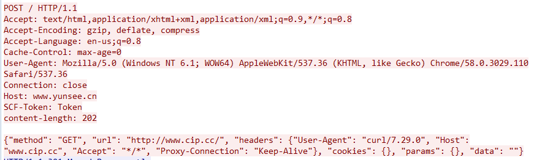
	
	"headers": str(r.headers),
	"cookies": str(r.cookies),
	"params": str(r.query),

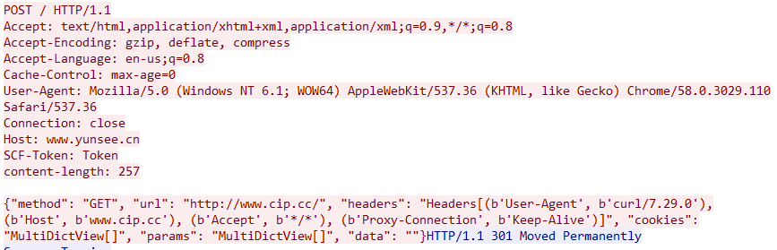

## 云函数简单调试

server段代码：  

index.py

	import requests
	import json
	
	SCF_TOKEN = "Token"
	
	def main_handler(event: dict, context: dict):
	    if event["headers"]["scf-token"] == SCF_TOKEN:
	        data = event["body"]
	        kwargs = json.loads(data)
			# Prohibit automatic redirect to avoid network errors such as connection reset
	        r = requests.request(**kwargs, verify=False, allow_redirects=False)
	        return {
	            "isBase64Encoded": False,
	            "statusCode": 200,
	            "headers": {},
	            "body": str(r.text)
	        }

客户端代码：

	from urllib.parse import urlparse
	import requests
	
	data = '''{"method": "GET", "url": "http://www.cip.cc/", "headers": {"User-Agent": "curl/7.29.0", "Host": "www.cip.cc", "Accept": "*/*", "Proxy-Connection": "Keep-Alive"}, "cookies": {}, "params": {}, "data": ""}'''
	
	api = 'Cloud_function_API'
    #api='http://vps:8000'  //因为云函数是https请求，在vps测试，抓包debug流量
	headers = {
	    "Accept": "text/html,application/xhtml+xml,application/xml;q=0.9,*/*;q=0.8",
	    "Accept-Encoding": "gzip, deflate, compress",
	    "Accept-Language": "en-us;q=0.8",
	    "Cache-Control": "max-age=0",
	    "User-Agent": "Mozilla/5.0 (Windows NT 6.1; WOW64) AppleWebKit/537.36 (KHTML, like Gecko) Chrome/58.0.3029.110 Safari/537.36",
	    "Connection": "close",
	    "Host": urlparse(api).netloc,
	    "SCF-Token": "Token"
	}
	r = requests.post(api, data=data, headers=headers)
	print(r.text)

实际向云函数发的https流量就是这种格式。本地和云函数网关之间走的是https。

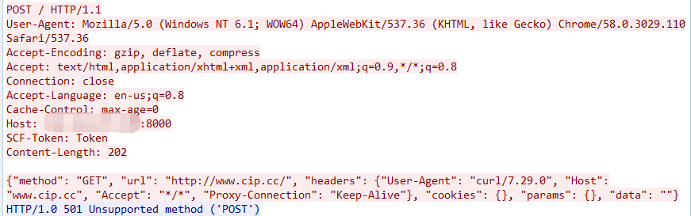

执行客户端代码，回显：

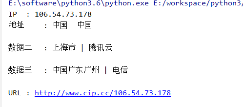

每执行一次，动态改变。

### 优化客户端代码 client.py

**联动 mitmdump**：

	# -*- coding:utf-8 -*-
	import sys
	
	sys.path.append("/usr/local/lib/python3.6/site-packages")
	sys.path.append("/usr/lib/python3.6/site-packages")
	import json
	from typing import List
	from random import choice
	from urllib.parse import urlparse
	from base64 import b64encode, b64decode
	from mitmproxy import ctx
	import mitmproxy
	from mitmproxy import http
	from mitmproxy.net.http import Headers
	
	scf_servers: List[str] = ['Cloud_function_API']
	SCF_TOKEN = "Token"
	info = ctx.log.info
	
	
	def request(flow: mitmproxy.http.HTTPFlow):
	    scf_server = choice(scf_servers)
	    # scf_server='http://vps:2333'
	    r = flow.request
	    data = {
	        "method": r.method,
	        "url": r.pretty_url,
	        "headers": dict(r.headers),
	        "cookies": dict(r.cookies),
	        "params": dict(r.query),
	        "data": b64encode(r.raw_content).decode("ascii")
	    }
	    # 自动发起请求
	    flow.request = flow.request.make(
	        "POST",
	        url=scf_server,
	        content=json.dumps(data),
	        headers={
	            "Accept": "text/html,application/xhtml+xml,application/xml;q=0.9,*/*;q=0.8",
	            "Accept-Encoding": "gzip, deflate, compress",
	            "Accept-Language": "en-us;q=0.8",
	            "Cache-Control": "max-age=0",
	            "User-Agent": "Mozilla/5.0 (Windows NT 6.1; WOW64) AppleWebKit/537.36 (KHTML, like Gecko) Chrome/58.0.3029.110 Safari/537.36",
	            "Connection": "close",
	            "Host": urlparse(scf_server).netloc,
	            "SCF-Token": SCF_TOKEN
	        }
	    )
	
	
	def response(flow):
	    if flow.response.status_code == 200:
	        resp = flow.response
	        # headers = resp.headers
	        # statusCode = resp.status_code
	        # info(str(statusCode))
	        # 将响应返回
	        flow.response = flow.response.make(
	            content=resp.content
	        )

客户端设置代理：

	./mitmdump -p 8080 --listen-host 0.0.0.0 -v --set block_global=false -k -s ./client.py 

使用curl查看代理是否配置成功：

	curl http://www.cip.cc/ -x http://vps:8080

浏览器上网尝试:

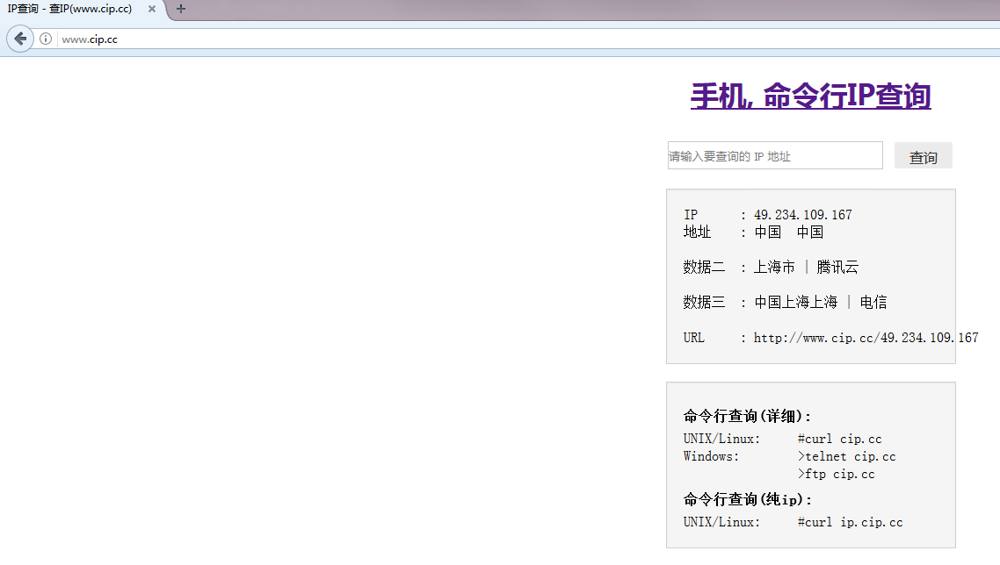

## sock5 代理

参考 https://github.com/shimmeris/SCFProxy/tree/main/SOCKS5

使用py3.8 环境。

客户端执行:

	python socks5.py -u "https://service-o4t2xyb9-XXXXXX.kr.apigw.tencentcs.com/release/XXXXXX" -bp 2333 -sp 8080 --user test --passwd test

使用curl测试sock5代理：

	curl -I https://www.baidu.com -x socks5://vps:8080 -U test:test -v   //-I 是head请求

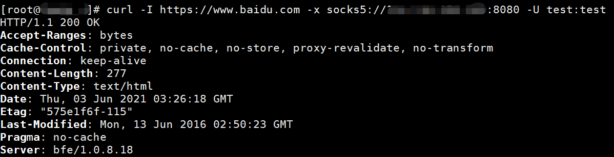

多次执行，代理端回显：

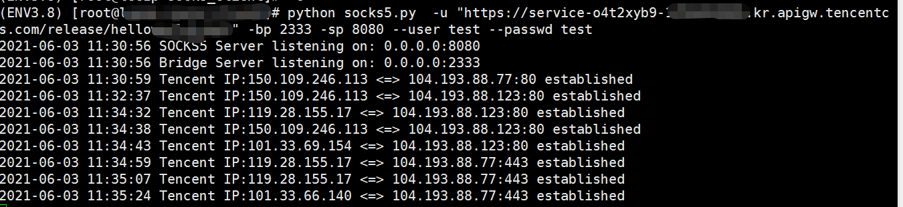

左边为腾讯云动态ip，右边是baidu.com解析的百度ip。

SOCKS5 是长连接，云函数服务端用了个 while 循环来同步 IO，会一直执行直到超时。需要将云函数超时时间设置成最大900s。

## 参考资料

[Mitmproxy 实现HTTP监控与篡改--适合windows](https://blog.csdn.net/weixin_42719822/article/details/105714483)

[shimmeris--HTTP Proxy](https://github.com/shimmeris/SCFProxy/tree/main/HTTP)

[浅谈云函数的利用面](https://xz.aliyun.com/t/9502)

## 后记

1.使用kali docker 和 firefox 调试，类似于burp添加一个代理。

docker：

	docker pull mitmproxy/mitmproxy
	
	docker run --rm -it -p 8080:8080 mitmproxy/mitmproxy

环境失败了，没测试成功。

2.[mitmdump命令下无法导入python第三方包（requests）的问题](https://blog.csdn.net/weixin_44683798/article/details/102487338)

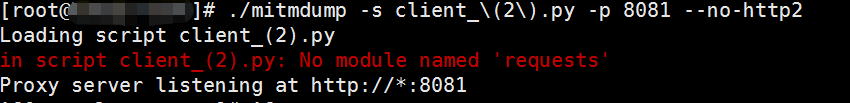

	pip3 show requests

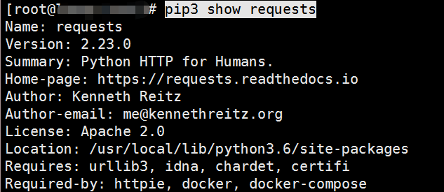

将路径添加到py最开始位置：

	import sys
	sys.path.append("/usr/local/lib/python3.6/site-packages")

重新运行，依次将报错的包添加：

3.mitmproxy下载https证书：

服务端执行：

	./mitmdump -p 8080 --listen-host 0.0.0.0 -v --set block_global=false -k

客户端访问web网页  ```http://mitm.it/```

windows安装：双击证书 mitmproxy-ca-cert.p12安装：
	
	1.Double-click the P12 file to start the import wizard.
	2.Select a certificate store location. This determines who will trust the certificate – only the current Windows user or everyone on the machine. Click Next.
	3.Click Next again.
	4.Leave Password blank and click Next.
	5.Select Place all certificates in the following store, then click Browse, and select Trusted Root Certification Authorities.
	Click OK and Next.
	6.Click Finish.
	7.Click Yes to confirm the warning dialog.

linux安装：

pem转crt:

	openssl x509 -in mitmproxy-ca-cert.pem -inform PEM -out mitmproxy-ca-cert.crt

centos7:

	update-ca-trust force-enable
	cp mitmproxy-ca-cert.crt /etc/pki/ca-trust/source/anchors/
	update-ca-trust extract

4**.云函数超时时间默认3s，设置成1分钟**。

5.cdn全国各地都有，要访问gg，要选择国外cdn才可以。

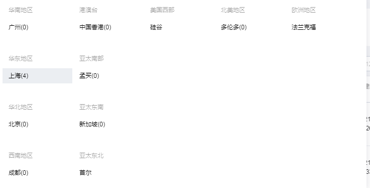

使用下面命令测试：

	curl -I https://www.google.com/ -x http://proxy:8080 -k -v

经测试，使用浏览器代理方式访问gg不行，curl探测可以。

6.使用云函数http访问网站和不使用区别：

左边是使用云函数代理，有便是正常访问：

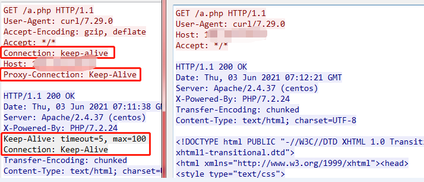

可见使用云函数多了个 ```Proxy-Connection: Keep-Alive```。

我是用 mitmproxy 测试的，不清楚请求头改变是否与这个工具有关。

sock5云函数代理访问网站和用户自己访问网站无区别。

7.理论上，客户端与云函数通信流量我们抓不到，如果能抓到，说明攻击者在环境内部。

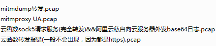


