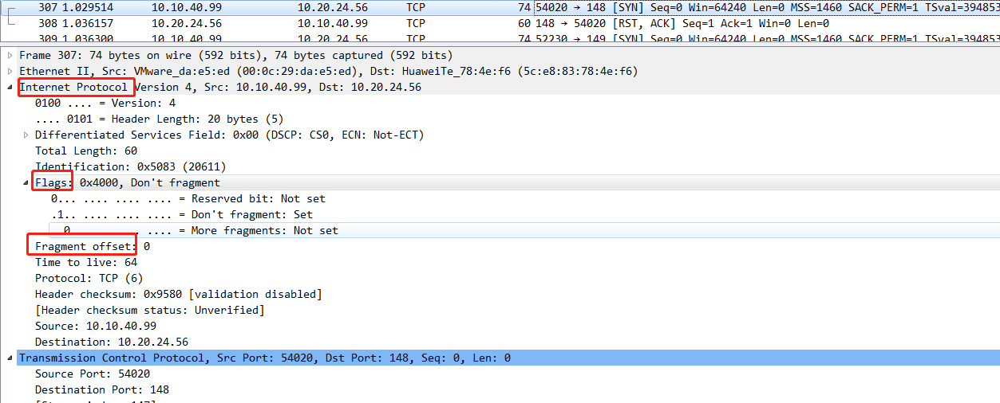

IP数据包的分片机制中有着重要作用的是Flags和Fragment Offset两个字段。Flags字段占3位，最低位保留，必须为0；第二位为0表示该数据包支持分片，1表示不可分片；第三位为0表示当前数据包时分片的最后一个包，为1表示后面还有分片的包。

fragbits关键字使用R/D/M分别匹配Flags的三位：



suricata 中用 ```fragbits:D;``` 表示数据包不允许分片


[window关键字](https://suricata.readthedocs.io/en/latest/rules/header-keywords.html#window)


