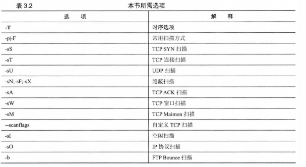
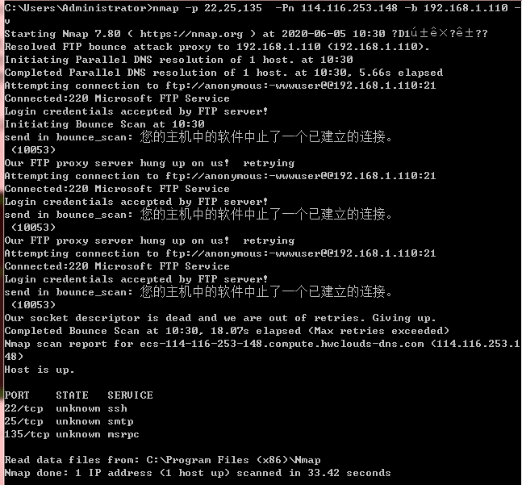
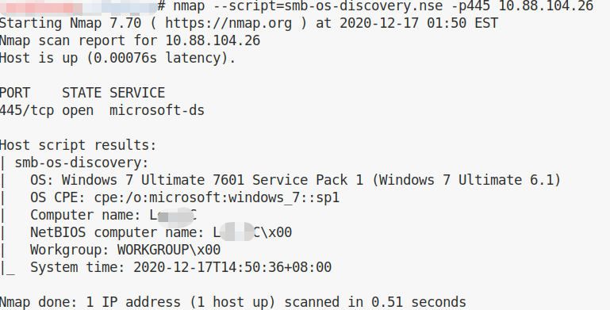
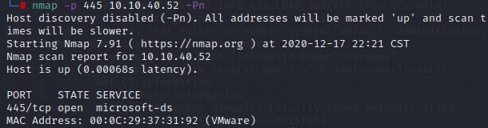
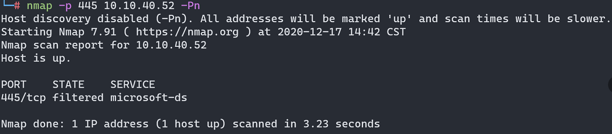
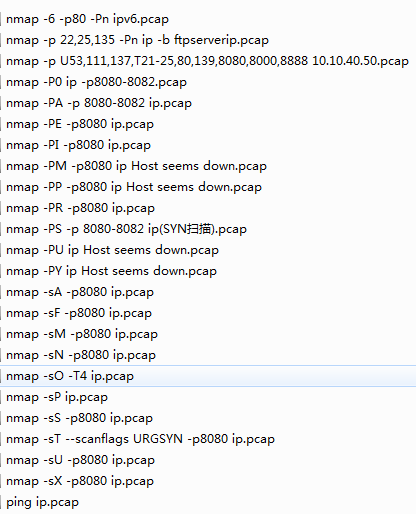

## 参考文档

[C段扫描](https://blog.csdn.net/jpygx123/article/details/84074654)

[**在线子域名查询**](https://phpinfo.me/domain/)

### 扫单个ip

```nmap -sV ip```

-sV 打开系统版本检测，检测端口对应服务的版本

-O 尝试识别远程操作系统

### 扫多个ip

```nmap ip ip2```

```nmap 49.232.X.23-25```

### 扫c段

```nmap -n -sn ip/24```

-sn 不扫描端口

-n  不进行dns解析

可以加快扫描速度，每个ip大概耗时 4-5s左右。

-PE ICMP扫描

```nmap -n -sn -PE ip/24```

每个ip大概耗时 2-3s左右

### 扫描指定端口

```nmap -p 3306 ip```

```nmap -p 3306 ip/24```

耗时70s左右

```nmap -sS -p 3306 -oG - ip/24```

-oG 表示以一种易于检索的格式记录信息，即每台主机都以单独的行来记录所有信息。

-sS TCP SYN 扫描 (又称半开放,或隐身扫描)

耗时64s左右

**只列出所有3306端口开放的ip**

```nmap -sS -p 3306 -oG - 49.232.6.24/24 | grep open```

	Host: 49.X.X.12 ()    Ports: 3306/open/tcp//mysql///
	Host: 49.X.X.24 ()    Ports: 3306/open/tcp//mysql///
	Host: 49.X.X.29 ()    Ports: 3306/open/tcp//mysql///
	Host: 49.X.X.139 ()   Ports: 3306/open/tcp//mysql///
	Host: 49.X.X.141 ()   Ports: 3306/open/tcp//mysql///
	Host: 49.X.X.169 ()   Ports: 3306/open/tcp//mysql///
	Host: 49.X.X.179 ()   Ports: 3306/open/tcp//mysql///
	Host: 49.X.X.204 ()   Ports: 3306/open/tcp//mysql///
	Host: 49.X.X.221 ()   Ports: 3306/open/tcp//mysql///
	Host: 49.X.X.228 ()   Ports: 3306/open/tcp//mysql///
	Host: 49.X.X.229 ()   Ports: 3306/open/tcp//mysql///


### 端口扫描

	nmap -p U53,111,137,T21-25,80,139,8080,8000,8888 10.10.40.50

## 其他

仅主机 Ping扫描

	nmap -sP ip

禁止主机发现扫描(无ping扫描，避免被防火墙发现)

	nmap -P0 ip

	nmap -Pn ip

SYN Ping扫描

	nmap -PS -p 8080-8082 ip

ACK Ping扫描

	nmap -PA -p 8080-8082 ip

	与TCP SYN Ping 扫描是很相似的，唯一的区别是设置TCP的标志位是ACK而不是SYN，使用这种方式扫描可以探测阻止SYN包或ICMP Echo请求的主机。
	
	如果目标主机不是存活状态则不响应该请求，如果目标主机在线则会返回一个RST包。

	例如ACK扫描显示主机不在线，SYN扫描显示主机在线。说明TCP ACK包被目标主机阻止了。

还可以同时使用-PS与-PA来既发送SYN又发送ACK

	nmap -PA -PS -p 8080-8082 ip

**禁ping设置**

临时

echo 1 >/proc/sys/net/ipv4/icmp_echo_ignore_all

参考资料：  [Linux 禁止和开启 ping 的方法](https://www.linuxprobe.com/linux-forbid-ping.html)


UDP Ping 扫描

	nmap -PU ip

-PU是发送一个空的UDP报文到给定的端口。如果不指定端口则默认为40125,使用 UDP Ping 扫描时Nmap 会发送一个空的UDP包到目标主机，如果目标主机响应则返回一个ICMP端口不可达错误，如果目标主机不是存活状态则会返回各种ICMP错误信息。

ICMP Ping Types扫描

使用-PE; -PP; -PM 选项可以进行ICMP Ping Types扫描。

-PE Nmap发送一个ICMP type 8(Echo request)报文到目标IP地址，从运行的主机得到一个type 0(Echo reply)报文。

	nmap -PE -p8080 ip

-PP 选项是ICMP时间戳Ping扫描，可以使用ICMP时间戳来确定目标主机是否存活。

	nmap -PP -p8080 ip

-PM选项可以进行ICMP地址掩码Ping扫描。这种扫描方式会试图用备选的ICMP等级Ping指定主机，通常有不错的穿透防火墙的效果。

	nmap -PM -p8080 ip

ICMP ping

	nmap -PI -p8080 ip

ARP Ping扫描

	nmap -PR -p8080 ip

扫描列表

	nmap -sL ip/24

列表扫描是主机发现的退化形式，它仅仅列出指定网络上的每台主机，**不发送任何报文到目标主机(无数据包)**。默认情况下，Nmap仍然对主机进行反向域名解析以获取它们的名字。

禁止反向域名解析

	nmap -sL -n ip/24

	-n选项意为禁止解析域名，使用该选项的时候Nmap永远不对目标IP地址作反向域名解析。

[**IPv6地址查询工具**](http://ip.zxinc.org/ipquery)

扫描一个IPV6地址

	nmap -6 -p80 ipv6

路由跟踪

	nmap --traceroute www.baidu.com -v

使用 nmap  --traceroute 选项即可进行路由跟踪，使用路由跟踪帮户用户了解网络的通行情况，通过此选项可以轻松地查出本地计算机到目标主机之间经过的网络节点，并可以看到通过各个节点的时间。

SCTP INIT Ping扫描

SCTP是一种传输层协议，可以看做是TCP协议的改进，它改进了TCP的一些不足之处，SCTP INIT Ping扫描通过发送INIT包，根据目标主机的响应判断目标主机是否存活。

	nmap -PY ip




时序选项

	nmap -T(0-5) ip

	T0 非常慢的扫描，用于IDS逃避
	T1 缓慢扫描，用于IDS逃避
	T2 降低速度来降低带宽
	T3 默认，根据目标反应自动调整时间
    T4 快速扫描，常用的方式，需要网络较好
    T5 急速扫描，牺牲准确度来提高准确度

常用的是T3和T4, 可以配合 -F 提高扫描效果。

-F ip  快速扫描有限的端口(扫描少量的常用端口)


TCP SYN 扫描

	nmap -sS ip

SYN扫描速度快，每秒可扫描上千个端口。SYN扫描是相对来说比较隐蔽的扫描方式，很难被防火墙发现，因为它不会进行TCP连接。它常被称为半开放扫描，因为它不打开一个完全的TCP连接。

工作流程为 nmap向目标主机发送一个SYN包请求连接，如果收到RST包则表明无法连接目标主机，即目标主机端口关闭。如果目标主机端口是开放的，nmap的工作流程为向目标主机发送一个SYN包，请求连接，目标主机收到请求包后会响应一个 SYN/ACK包，当nmap收到主机的响应后，则向目标发送一个RST替代ACK包，连接结束，三次握手没有完成。

隐蔽扫描

	-sN/-sF/-sX

TCP ACK 扫描

	nmap -sA ip

ACK扫描当扫描未被过滤的系统时，open和closed端口都会返回RST报文。缺点：不能确定端口是开放的还是被过滤的。

自定义TCP扫描

--scanflags 启用自定义标志位TCP扫描。 选项可以是一个数字标记值，也可以用字符名，比如：URG、ACK、PSH、RST、SYN、FIN 的任何组合都可以。  

	nmap -sT --scanflags URGSYN ip

空闲扫描 [原理](https://nmap.org/book/idlescan.html)

	-sI

允许进行端口完全欺骗扫描。可以使攻击者能够不使用自己的IP向目标主机发送数据包，它可以利用不活跃的僵尸主机反弹给攻击者一个旁通信道，从而进行端口扫描。IDS会把不活跃的僵尸主机当作攻击者，这是一种隐蔽的扫描方式。

测试未成功，你也可以使用proxychains工具实现代理。

IP协议扫描

-p 选项选择需要扫描的协议号。

	-sO

	nmap -sO -T4 ip

IP 协议扫描可以帮助用户确定目标主机哪些是支持IP协议的，例如TCP、ICMP、IGMP。

[FTP反弹攻击](https://nmap.org/book/scan-methods-ftp-bounce-scan.html)

	-b

连接到防火墙后面的一台FTP服务器做代理，接着进行端口扫描。

[windows 通过iis开通本地的ftp](https://zhidao.baidu.com/question/543348086.html)




### nmap 脚本

smb-os-discovery.nse

经测试，只有扫描同网段真机时才有附加信息。




其次，内网同网段使用nmap扫描可以识别出VM



跨网段即使网络互通也没识别出VM




