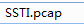

## 概述

Web应用程序广泛使用模板引擎，以通过网页和电子邮件呈现动态数据。在模板中不安全地嵌入用户输入会导致服务器端模板注入，模板注入可用于直接攻击Web服务器的内部，并经常获得远程代码执行（RCE）。

Web应用程序经常使用模板系统（例如Twig和FreeMarker）将动态内容嵌入到网页和电子邮件中。当用户输入以不安全的方式嵌入模板时，将发生模板注入。

## 脆弱性代码示例

	#python3
	#Flask version:0.12.2
	#Jinja2: 2.10
	from flask import Flask, request
	from jinja2 import Template
	app = Flask(__name__)
	@app.route("/")
	def index():
	    name = request.args.get('name', 'guest')
	    t = Template("Hello " + name)
	    return t.render()
	if __name__ == "__main__":
	    app.run('0.0.0.0');

## tplmap自动化攻击

	git clone https://github.com/epinna/tplmap

	./tplmap.py -u <url>

## 参考资料

[服务器端模板注入](https://portswigger.net/research/server-side-template-injection)

[SSTI (服务器模板注入)](https://blog.csdn.net/qq_40657585/article/details/83657220)

