## 经典版dog-tunnel (V0.80)

https://github.com/vzex/dog-tunnel

## 安装


安装 go

利用 go get命令一键获取代码、编译并安装

安装依赖：

	go get github.com/go-sql-driver/mysql
	
	go get github.com/klauspost/reedsolomon
	
	go get github.com/cznic/zappy

编译程序 

	go get -u -d github.com/vzex/dog-tunnel && cd $GOPATH/src/github.com/vzex/dog-tunnel/ && git checkout master && make

在这个路径 ```/root/go/src/github.com/vzex/dog-tunnel/```下面编译的

编译完生成一个bin目录，bin目录下 有 linux，windows，mac版本的可执行文件。

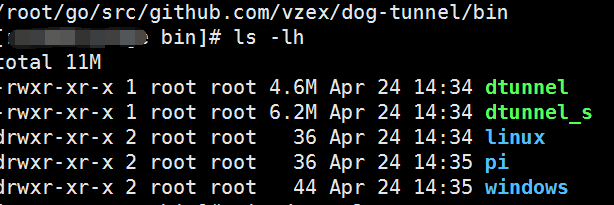

可以看到 go 编译的程序还是很大的，4M多。

也可以直接下载Lite版本(Lite 版本不支持P2P模式) https://github.com/vzex/dog-tunnel/tree/udpVersion

最新版 https://github.com/vzex/dog-tunnel/tree/tunnel_rs

**服务端** 作为 P2P 的桥梁，放在公网VPS上。

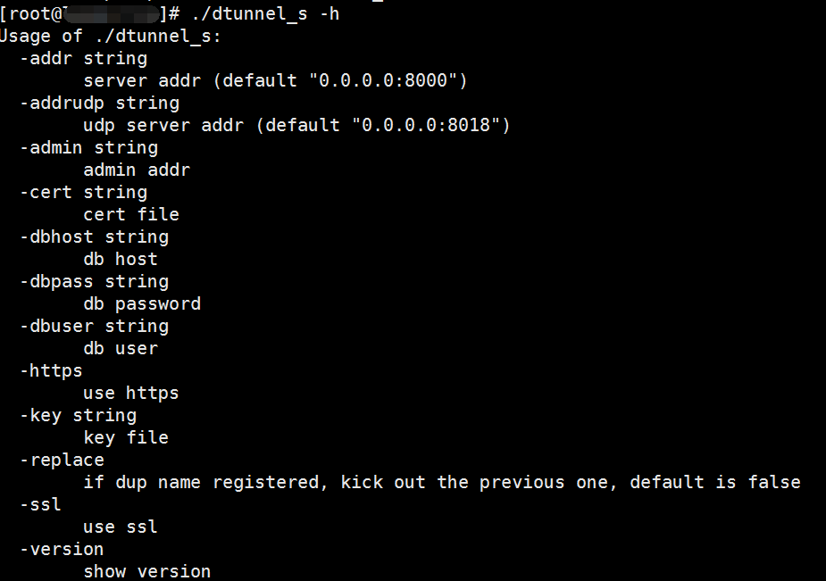

参数说明

	•	-addr：服务端地址，默认是：0.0.0.0:8000
	•	-addrudp：UDP服务端地址，用于P2P辅助打洞，默认是：0.0.0.0:8018
	•   -admin：管理接口，用于提供API方便管理
	•	-ssl：启用ssl支持，启用需要指定-cert和-cert参数，默认关闭，有bug，必须加上-ssl=false来关闭ssl
	•	-https：启用管理接口的HTTPS支持，需要指定-cert和-cert参数，默认关闭
	•	-cert：证书路径
	•	-key：证书密钥路径
	•	-dbhost：数据库服务器
	•	-dbpass：数据库密码
	•	-dbuser：数据库用户
	•	-replace：如果客户端注册名冲突，踢掉之前的，默认关闭
	•	-version：显示版本


服务端开启监听

	./dtunnel_s -addr 0.0.0.0:2333 -ssl=false

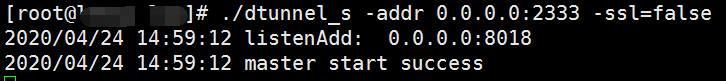

**客户端**

近端和远端都需安装客户端，实现P2P打洞。

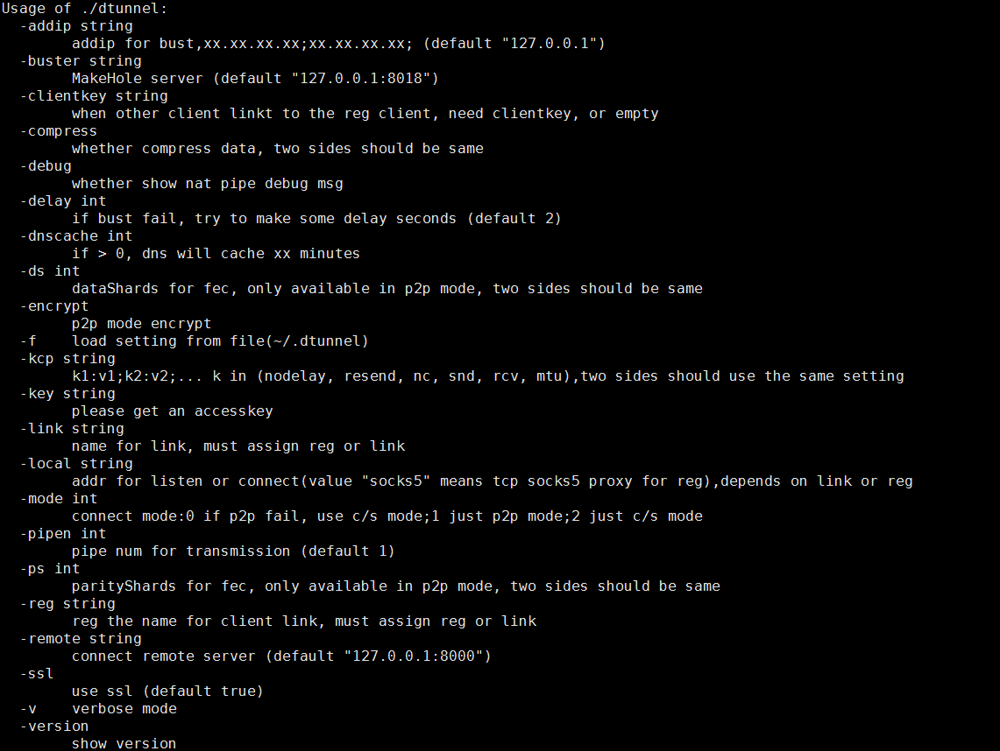

参数说明

	•	-addip：出口IP(单个或列表)，注意:对于多公网ip的终端，请用-stun参数指定stun服务器辅助连接，或者用-addip参数手工指定出口ip列表，默认是：127.0.0.1
	•	-buster：打洞服务器，用于P2P模式，对应服务端-addrudp端口地址	
	•	-clientkey：客户端Key，用于远端和近端认证，需一致
	•	-compress：压缩数据，远端和近端需一致
	•	-debug：调试模式
	•	-delay：打洞失败后重试延迟，秒
	•	-dnscache：(有加速效果)当socks5(socks5_smart)模式时有效，指定dns缓存时间，默认0，单位分钟,socks5_smart模式下近端也可指定该参数,因为会有请求通过近端解析
	•	-ds：dataShards for fec, only available in p2p mode, two sides should be same
	•	-encrypt：P2P模式加密，近端才能使用
	•	-f：从文件中加载配置(~/.dtunnel)
	•	-kcp：kcp配置，远端和近端需一致
	•	-key：访问Key(服务端数据库中的AuthKey)
	•	-link：连接的注册名，近端使用，用于识别连接远端, must assign reg or link
	•	-local：本地监听端口，填socks5则为socks5代理服务
	•	-mode：连接模式(0:P2P打洞失败后切换为C/S   1:只使用P2P   2:只使用C/S)
	•	-pipen：传输的管道数(default 1)
	•   -ps int：parityShards for fec, only available in p2p mode, two sides should be same
	•	-reg：注册名，远端使用, must assign reg or link
	•	-remote：连接远程服务器，用于C/S模式，对应服务端-addr地址端口
	•   -ssl：use ssl (default true)
	•   -v：verbose mode


远端映射redis服务：

	./dtunnel -buster [vps]:8018 -remote [vps]:2333 -mode 1 -reg redis -local :6379 -addip 127.0.0.1 -clientkey password -ssl=false

远端回显：

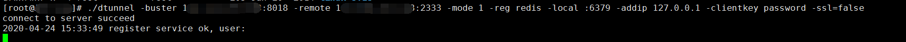
	
vps回显：

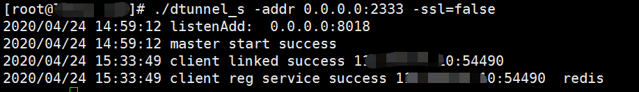

近端开启映射(可选参数  ```-encrypt```)：

	./dtunnel -buster [vps]:8018 -remote [vps]:2333 -mode 1 -link redis -local :9999 -addip 127.0.0.1 -clientkey password -ssl=false

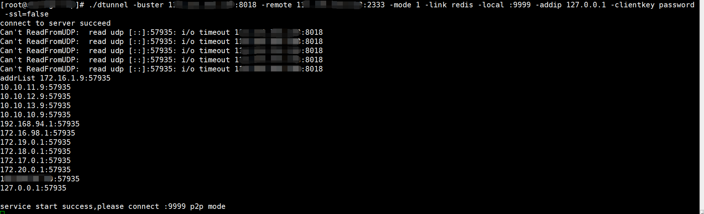

远端回显：

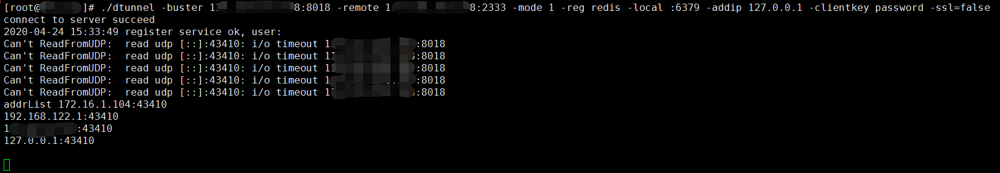

vps回显：

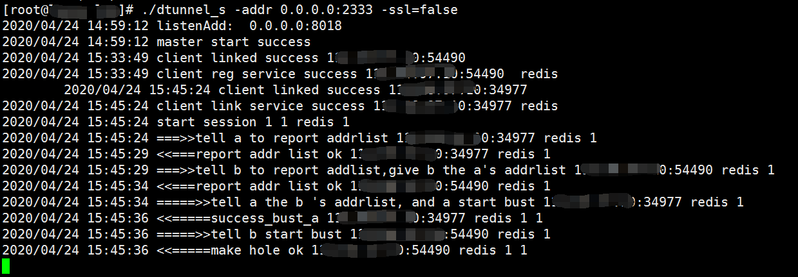


建立隧道成功：

近端打开 9999 即可连接远端redis 服务器。

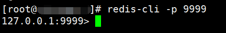


这个P2P打洞完成了，但是效果不明显，近端会同时访问远端出口流量公网ip和中介vps ip，远端也会访问近端ip和vps ip。这次 近端，远端，中介vps均用公网ip测试一下具体的流量走向。


## 实验环境

媒介vps ip 1xx.xxx.xxx.xx8，近端主机 ip 139.xxx.xxx.134, 远端主机模拟真实内网ip，172.16.1.104。近端和远端ip不可互通。

建立P2P成功后：

近端回显：

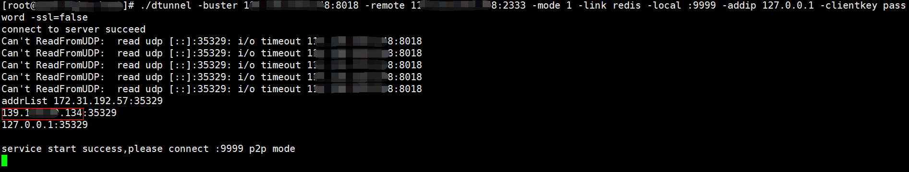

这里的 addrList中的 172.31.192.57为 近端vps的内网ip，139.xxx.xxx.134 为近端外网ip。

远端回显：

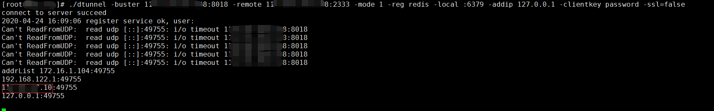

这里的 addrList中的 1xx.xxx.xxx.10 为远端内网机器归属地的外网出口ip地址。

媒介vps回显：

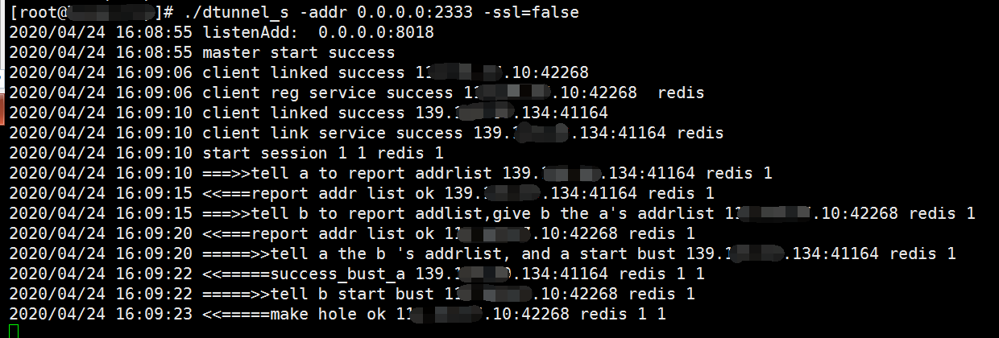

这里显示了 近端、远端主机与媒介vps通信的过程。

本来以为近端和远端并不知道真正的通信人，双方通过中间人VPS进行通信，实际抓包发现近端和远端有直接通信的数据包。即使近端是内网ip，远端也会访问内网ip的出口流量所在地的公网ip地址，暴露近端所在位置。


## 测试网络是否互通的方法

有时候禁用 ping命令。

使用任何一个开放的端口，ssh、telnet、nmap、直接访问等。

ssh例如：ssh root@192.168.1.100

如果靶机开启ssh端口，结果为 ```ssh: connect to host 192.168.1.100 port 22: Connection timed out```

网络不连通。

如果出现让你输入密码，证明网络连通。


抓取数据包流量传输不清晰，改用3台vps重新抓包。

近端：

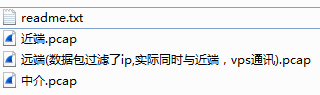

vps端：

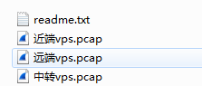