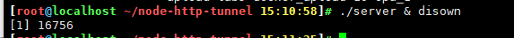
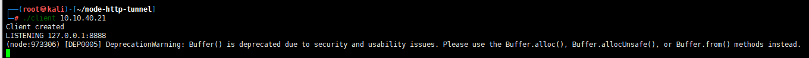
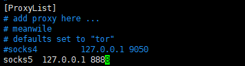
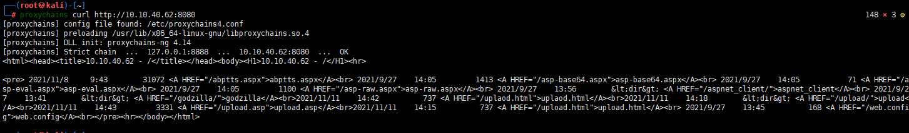
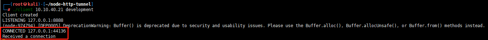
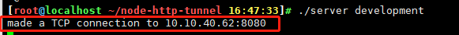
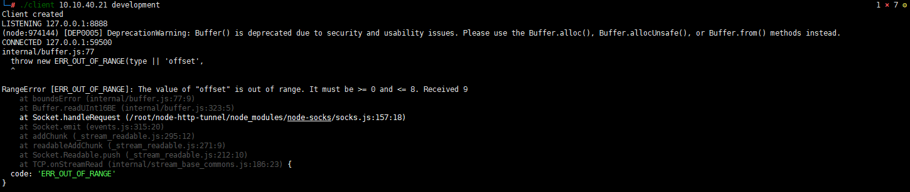
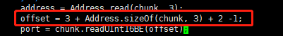

## node.js tunnel

https://github.com/johncant/node-http-tunnel   (star 67)

### default mode

1.开启server端  

 10.10.40.21

   
	./server & disown
   

2.开启client端

 10.10.40.99

	./client 10.10.40.21 

3.配置proxychains socks5代理

vim /etc/proxychains4.conf
后面添加
 
	socks5 127.0.0.1 8888
   

4.使用代理

   
	proxychains curl http://10.10.40.62:8080
   

### development mode

	./server development
	
	./client 10.10.40.21 development

客户端与服务端都有收到连接

客户端：

服务端：

### 源码 BUG

运行报错

RangeError [ERR_OUT_OF_RANGE]: The value of "offset" is out of range. It must be >= 0 and <= 8. Received 9

解决

	vim node_modules/node-socks/socks.js
	定位到156行（156gg）
	在offset后面-1

### SSH连接

尝试失败

## 后记

https://github.com/leezp/note/blob/master/tunnel/node-http-tunnel/node-http-tunnel-master/package.json

本来的内容是 

	{
	    "name": "node-http-tunnel"
	  , "version": "0.0.1"
	  , "dependencies": {
	      "node-socks": "git://github.com/johncant/node-socks.git"
	    , "request": "2.9.203"
	    , "event-stream": "2.1.8"
	  }
	}

因为github一直报安全问题，所以提高了node版本，更改后并未测试。

更改后的配置文件为：

	{
	    "name": "node-http-tunnel"
	  , "version": "0.0.1"
	  , "dependencies": {
	      "node-socks": "git://github.com/johncant/node-socks.git"
	    , "request": "2.68.0"   
	    , "event-stream": "2.1.8"
	  }
	}