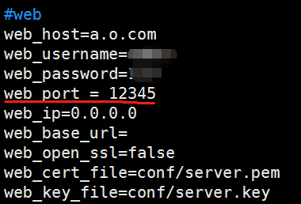
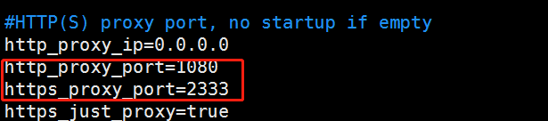
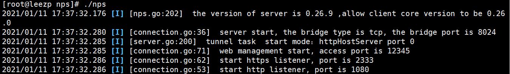
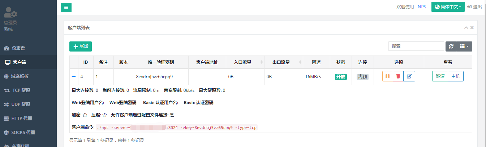
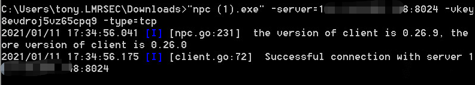
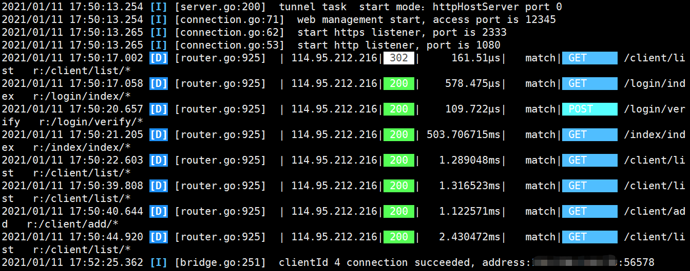
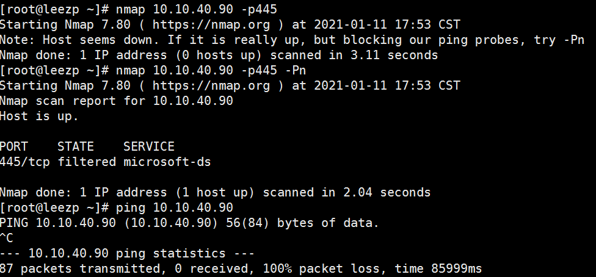
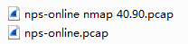

[nps](https://github.com/ehang-io/nps)

**一款轻量级、高性能、功能强大的内网穿透代理服务器。支持tcp、udp、socks5、http等几乎所有流量转发，可用来访问内网网站、本地支付接口调试、ssh访问、远程桌面，内网dns解析、内网socks5代理等等……，并带有功能强大的web管理端。**

经测试好像不支持icmp协议... 因为icmp是第三层协议，不属于 tcp udp 协议。

这个隧道工具使用很简单。

分为server端和client端。

修改配置文件确保端口不被占用，在vps防火墙和管理控制台添加开放端口。

在vps启动server端：

访问web，添加一个客户端，界面显示了客户端该输入的命令。

client 端传输到跳板机，输入命令启动C端，连接成功。

S端也提示成功：

nmap测试扫内网：

