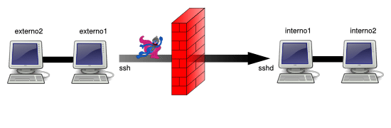
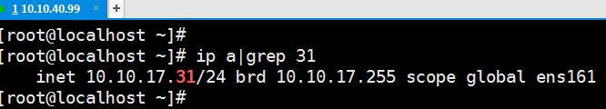
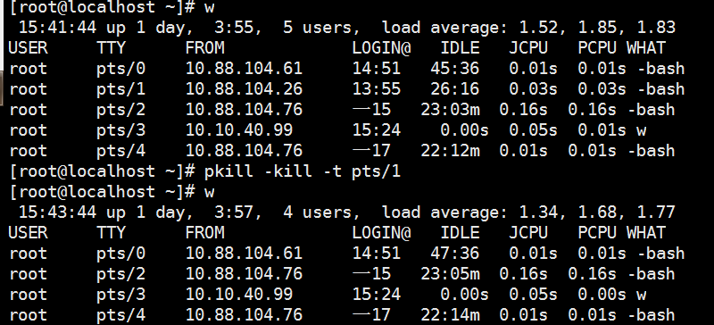

interno1 10.10.17.31

externo1 10.10.40.99

## 场景一  反向转发

interno1：

	ssh -R 0.0.0.0:2333:localhost:9200 root@10.10.40.99

externo1 (10.10.40.99):

	netstat -lnt

	tcp        0      0 127.0.0.1:2333          0.0.0.0:*               LISTEN
	tcp6       0      0 ::1:2333                :::*                    LISTEN


出于安全的原因，如果我们直接执行该命令的话可能不会生效，因为我们需要修改 SSH 服务端的一个参数值 GatewayPorts，它的默认值是：no。 GatewayPorts该参数指定了远程主机是否允许客户端访问转发端口。默认情况下，sshd 只允许本机进程访问转发端口。或者设置为 “clientspecified” 则表示由客户端来选择哪些主机地址允许访问转发端口。

	vim /etc/ssh/sshd_config
	修改如下配置：
	GatewayPorts yes

或 ```GatewayPorts clientspecified```

	service sshd restart

重新登录：

10.10.40.99 

	netstat -lnt

	tcp        0      0 0.0.0.0:2333            0.0.0.0:*               LISTEN 
	tcp6       0      0 :::2333                 :::*                    LISTEN

成功地将 interno1 上的 9200 端口反向转发到了 externo1 的 2333 端口。

如果因为网络波动导致ssh -R 连接断了，就是去连接了，有一个叫做 autossh 的软件，可以自动的检测断线，并在断线的时候重连。

	apt-get install autossh / yum install autossh / brew install autossh

在 interno1 安装 autossh。

interno1：

	autossh -M 3333 -NR 2333:localhost:9200 root@10.10.40.99

	-M 3333 意思是使用内网主机 interno1 的 3333 端口监视 SSH 连接状态，连接出问题了会自动重连
	
	-N 意思是不执行远程命令
	
	-R 意思是将远程主机（externo1）的某个端口转发到本地指定机器的指定端口

注意不要加 -f ，加了以后就不用我输入externo1密码了，也不好使了，原因未知。

[利用AutoSSH建立SSH隧道，实现内网穿透](https://zhuanlan.zhihu.com/p/112227542)

## 场景二  正向转发

在 externo1 节点访问由 interno1 节点提供的 TCP 服务（本地端口转发 / 绑定地址 = localhost / 主机 = localhost ）

externo1：

	ssh -L 2333:localhost:9200 root@10.10.17.31

执行完输入 interno1 的密码进入 interno1 的控制台

	externo1 $ netstat -ltn
	Active Internet connections  (only servers)
	Proto Recv-Q  Send-Q  Local Address Foreign Address State      
	...
	tcp        0      0 127.0.0.1:2333          0.0.0.0:*               LISTEN 
	tcp6       0      0 ::1:2333                :::*                    LISTEN
	...

只需要在 externo1 节点上执行如下命令

	curl localhost:2333 即可访问 interno1 的9200服务。

**如果想被其他机器访问**，则：

	ssh -L 0.0.0.0:2333::9200 root@10.10.17.31

或

	ssh -L 0.0.0.0:2333:localhost:9200 root@10.10.17.31


	externo1 $ netstat -ltn
	Active Internet connections  (only servers)
	Proto Recv-Q  Send-Q  Local Address Foreign Address State      
	...
	tcp        0      0 0.0.0.0:2333            0.0.0.0:*               LISTEN
	...


使用另一台机器 curl 请求

interno1显示：

	channel 2: open failed: administratively prohibited: open failed

默认openssh 不允许 tcp转发，

	vim /etc/ssh/sshd_config
	修改如下配置：
	PermitTunnel yes

也可能是这个属性：```AllowTcpForwarding yes```

[ssh端口转发禁用](https://blog.csdn.net/lianzerong/article/details/84687700)

参考上面的文章，不知道实际影响参数的是哪个，反正改完之后改回去也可以转发了。 

可能执行了 ```service sshd restart```

缺点是要登录上去



## reference

[通过 SSH 实现 TCP / IP 隧道（端口转发）](https://www.linuxprobe.com/ssh-port-forward.html)

[SSH 基本用法](https://abcdabcd987.com/ssh/)

## 后记

linux 踢用户

	pkill -kill -t pts/1



