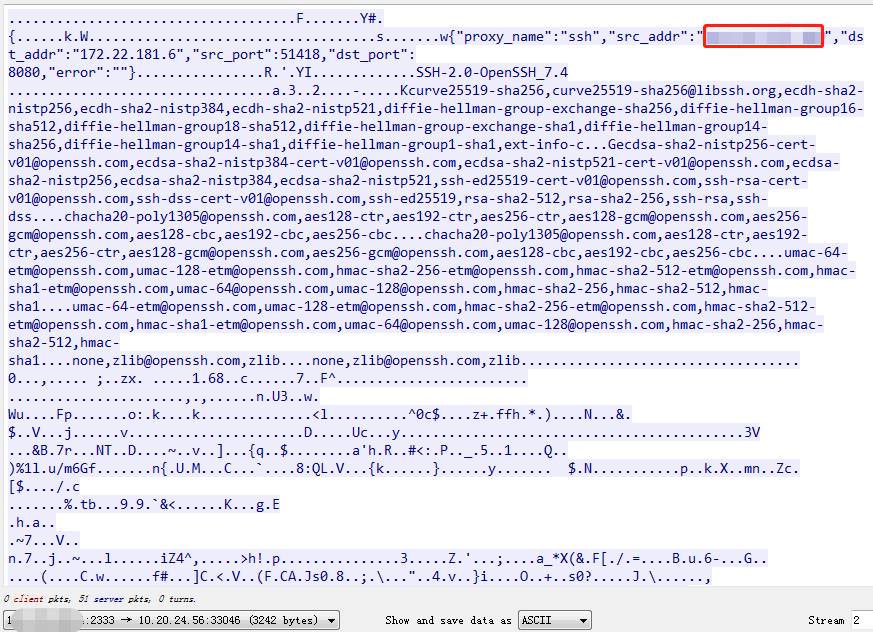

[frp](https://github.com/fatedier/frp)

[frp 中文文档](https://www.bookstack.cn/read/frp/spilt.2.README_zh.md)

A fast reverse proxy to help you expose a local server behind a NAT or firewall to the internet.
	
	server 端配置

	[common]
	bind_port = 7000
	token = token
	dashboard_port = 7500
	dashboard_user = admin
	dashboard_pwd = admin
	vhost_http_port = 8080
	vhost_https_port = 10443


	服务端启动

	nohup ./frps -c ./frps.ini


	客户端配置

	[common]
	server_addr = vpsip
	server_port = 7000
	token = token
	[ssh]
	type = tcp
	local_ip = 127.0.0.1
	local_port = 3389
	remote_port = 6000
	[smb]
	type = tcp
	local_ip = 127.0.0.1
	local_port = 445
	remote_port = 6001
	[web01]
	type = http
	local_ip = 127.0.0.1
	local_port = 9001
	use_encryption = false
	use_compression = true
	custom_domains= your domain registrated


## ssh隧道

server： 映射```vps_ip```

	[common]
	bind_port = 2333

client：本地 10.20.24.56

	[common]
	server_addr = vps_ip
	server_port = 2333
	#token = token
	[ssh]
	type = tcp
	local_ip = 127.0.0.1
	local_port = 22
	remote_port = 8080    # 设置将本地22端口映射到远程vps 8080端口上


建立隧道后，攻击者访问映射```vps_ip```的ssh服务，在受害者 ```dst_addr```抓包:

2333表示，中介vps开放的端口，在捕获的流量包里可以看到：


8080表示本地的服务端口映射到中介vps的端口，在流量包中也可以看到，具体本地什么服务的端口进行了映射只能从流量包大致猜测；

60870端口为本地随机开的与中介vps通讯的端口。

过滤单向流量，映射```vps_ip```的ssh服务向靶机发起请求：



红框中```src_addr```为访问10.20.24.56映射到的```vps_ip```的8080 ssh服务的攻击者ip，```dst_addr```为10.20.24.56映射到的```vps_ip```的内网ip，```dst_port```为```vps_ip```起的ssh服务端口号。

## 使用sock5代理

server:

	bind_port = 2333

client:

	[common]
	server_addr = vps_ip
	server_port = 2333

	[socks5]
	type = tcp
	remote_port = 8080         #需要 vps server提前开放8080端口
	plugin = socks5


## reference

[红蓝对抗攻防演习日记：内网穿透工具frp剖析](http://www.yidianzixun.com/article/0PgDHr7V)

[魔改frp隐藏/修改流量特征](https://blog.csdn.net/uiop_uiop_uiop/article/details/110897561)

[socks5代理安全性隐私性如何？](https://www.zhihu.com/question/55431809)

## 后记

另，有师傅测试：

1、Earthworm不能过杀软！被秒杀…

2、Tunnel非常不稳定，web都动不动崩溃，更别说支持3389了…

3、ptunnel该环境在内网多限制情况才可利用，局限性大…


socks5的本质就是流量转发，rfc1928也没有任何加密的规定。

github上的源码，都是很朴素的转发流量，没有加密。抛开握手、线程池、NIO、Buffer、状态机、连接失效补偿，整个socks5的协议就是4行代码（java为例）：

	Socket clientSocket = serverSocket.accept();
	Socket tgtSocket=new Socket("tgtHost",tgtPort);
	int data = clientSocket.getInputStream().read();
	tgtSocket.getOutputStream().write(data);
