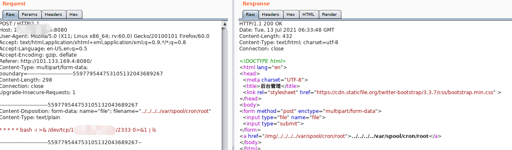
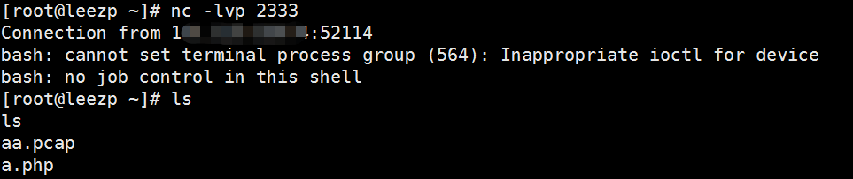
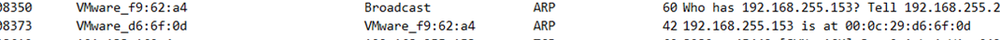
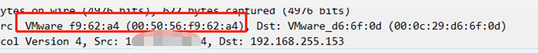
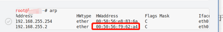
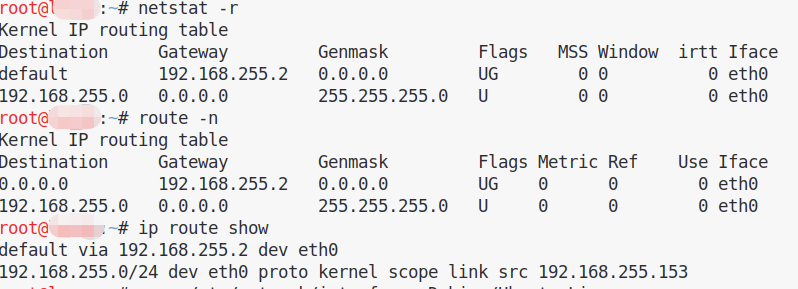

上传文件如果对文件名没有进行过滤，可能会造成文件目录穿越。

linux一切皆文件。





目录漫游的 ```../``` 尽可能多，漫游到根目录。


## 后记

奇怪的广播包:




前面的mac 不是我vps的。

因为我是在虚拟机里访问外网，这个mac居然是我虚拟机的网关mac：



linux 查看网关方法：

	netstat -r
	route -n
	ip route show


