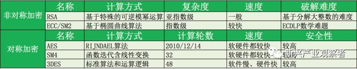
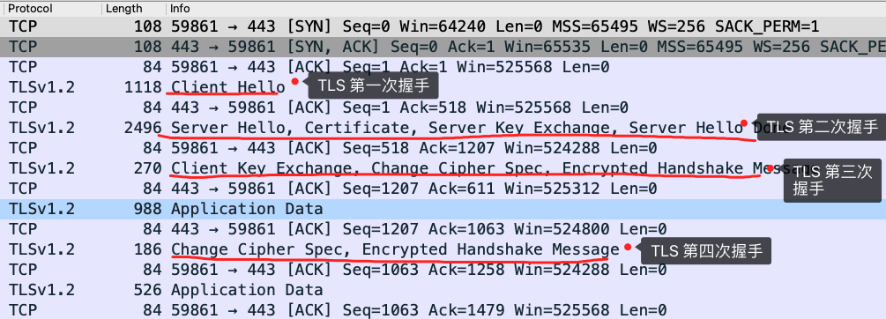

在签名算法中，私钥用于对数据进行签名，公钥用于对签名进行验证。

RSA签名体制。签名体制同样包含3个算法：KeyGen（密钥生成算法），Sign（签名算法），Verify（验证算法）。RSA的原理，两个大质数(p,q)乘积(n)难以逆向求解，所以pq是对等的，公钥和私钥也是对等的。

公钥和私钥可以用任意一个加密，然后用另一个解密。实际环境中，私钥一定是个满足一定条件，最起码足够大的数，使之在短时间内无法暴力破解。

1.私钥加密公钥解密，用于权威的“私钥拥有者” 对 “公众” 证明他的身份（仅你可写但别人不可写，因大众无法伪造密文，任何人都可读）。用于数字签名（Digital Signature)。

2.公钥加密私钥解密，用于公众个人传送私密信息给权威的“私钥拥有者”（因大众无法解密密文）。确保发送的信息，只有“私钥拥有者” 能够接收，（如果用私钥加密，传递数据，则会被公钥持有者（可能有很多持有者） 解密，失去对信息的保护），认证（Authentication）。

签名就是在信息的后面再加上一段内容，可以证明信息没有被修改过

对称加密与非对称加密的结合，这种方式将加密过程分为两个阶段，阶段一使用非对称加密进行秘钥的分发使得对方安全地得到对称加密的秘钥，阶段二使用对称加密对原文进行加解密。

“客户”在确认了“服务器”的身份后，“客户”自己选择一个对称加密算法和一个密钥，把这个对称加密算法和密钥一起用公钥加密后发送给“服务器”。注意，由于对称加密算法和密钥是用公钥加密的，就算这个加密后的内容被“黑客”截获了，由于没有私钥，“黑客”也无从知道对称加密算法和密钥的内容。

**公钥可以加密防窃听，不能防止中间人。**

安全风险:

“黑客只需”要自己生成一对公钥和私钥，然后把公钥发送给“客户”，自己保留私钥，这样由于“客户”可以用黑客的公钥解密黑客的私钥加密的内容，“客户”就会相信“黑客”是“服务器”，从而导致了中间人攻击。这里问题的根源就在于，大家都可以生成公钥、私钥对，无法确认公钥对到底是谁的。

为了解决这个问题，数字证书出现了，它可以解决我们上面的问题。先大概看下什么是数字证书，一个证书包含下面的具体内容：

	证书的发布机构
	证书的有效期
	公钥
	证书所有者（Subject）
	签名所使用的算法
	指纹以及指纹算法

数字证书可以保证数字证书里的公钥确实是这个证书的所有者(Subject)的，或者证书可以用来确认对方的身份。

“服务器”把自己的证书发给了“客户”，而不是发送公钥。“客户”可以根据证书校验这个证书到底是不是“服务器”的，也就是能校验这个证书的所有者是不是“服务器”，从而确认这个证书中的公钥的确是“服务器”的。后面的过程和以前是一样，“客户”让“服务器”证明自己的身份，“服务器”用私钥加密一段内容连同明文一起发给“客户”，“客户”把加密内容用数字证书中的公钥解密后和明文对比，如果一致，那么对方就确实是“服务器”，然后双方协商一个对称加密来保证通信过程的安全。

## 解密https相关

### 密钥交换算法

密钥交换算法目前常用的有RSA和Diffie-Hellman。

对于密钥交换使用RSA算法，pre-master-secret由客户端生成，并使用公钥加密传输给服务器。

对于密钥交换使用Diffie-Hellman算法，pre-master-secret则通过在Key Exchange阶段交换的信息，由各自计算出pre-master-secret。所以pre-master-secret没有存到硬盘，也没有在网络上传输，wireshark就无法获取session key，也就无法解密应用数据。那我们是否可以反向计算出pre-master-secret呢？理论上可以，但是非常困难。

wireshark解密数据？我们可以通过下面几种方法来使wireshark能解密https数据包。

1. 中间人攻击
2. 设置web服务器使用RSA作为交换密钥算法
3. 如果是用chrome,firefox，可以设置导出pre-master-secret log，然后wireshark设置pre-master-secret log路径，这样就可以解密了

### 秘钥交换算法的演进

static DH 算法里有一方的私钥是静态的，也就说每次密钥协商的时候有一方的私钥都是一样的，一般是服务器方固定，即 a 不变，客户端的私钥则是随机生成的。

于是，DH 交换密钥时就只有客户端的公钥是变化，而服务端公钥是不变的，那么随着时间延长，黑客就会截获海量的密钥协商过程的数据，因为密钥协商的过程有些数据是公开的，黑客就可以依据这些数据暴力破解出服务器的私钥，然后就可以计算出会话密钥了，于是之前截获的加密数据会被破解，所以 static DH 算法不具备前向安全性。

既然固定一方的私钥有被破解的风险，那么干脆就让双方的私钥在每次密钥交换通信时，都是随机生成的、临时的，这个方式也就是 DHE 算法，E 全称是 ephemeral（临时性的）。

所以，即使有个牛逼的黑客破解了某一次通信过程的私钥，其他通信过程的私钥仍然是安全的，因为每个通信过程的私钥都是没有任何关系的，都是独立的，这样就保证了「前向安全」。

#### ECDHE 算法

DHE 算法由于计算性能不佳，因为需要做大量的乘法，为了提升 DHE 算法的性能，所以就出现了现在广泛用于密钥交换算法 —— ECDHE 算法。

使用了 ECDHE，在 TLS 第四次握手前，客户端就已经发送了加密的 HTTP 数据，而对于 RSA 握手过程，必须要完成 TLS 四次握手，才能传输应用数据。所以，ECDHE 相比 RSA 握手过程省去了一个消息往返的时间。

## 参考资料

[**数字证书原理**](https://www.cnblogs.com/JeffreySun/archive/2010/06/24/1627247.html)

[RSA的公钥和私钥到底哪个才是用来加密和哪个用来解密？--知乎](https://www.zhihu.com/question/25912483)

[wireshark 解密https的两种方法](https://www.cnblogs.com/yurang/p/11505741.html)

[Diffie-Hellman](https://en.wikipedia.org/wiki/Diffie%E2%80%93Hellman_key_exchange)

[**图解 ECDHE 密钥交换算法**](http://www.likecs.com/default/index/show?id=124371)

[https流量解密方案综述](https://www.freebuf.com/articles/web/276186.html)