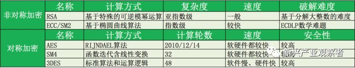

在签名算法中，私钥用于对数据进行签名，公钥用于对签名进行验证。

RSA签名体制。签名体制同样包含3个算法：KeyGen（密钥生成算法），Sign（签名算法），Verify（验证算法）。RSA的原理，两个大质数(p,q)乘积(n)难以逆向求解，所以pq是对等的，公钥和私钥也是对等的。

公钥和私钥可以用任意一个加密，然后用另一个解密。实际环境中，私钥一定是个满足一定条件，最起码足够大的数，使之在短时间内无法暴力破解。

1.私钥加密公钥解密，用于权威的“私钥拥有者” 对 “公众” 证明他的身份（仅你可写但别人不可写，因大众无法伪造密文，任何人都可读）。用于数字签名（Digital Signature)。

2.公钥加密私钥解密，用于公众个人传送私密信息给权威的“私钥拥有者”（因大众无法解密密文）。确保发送的信息，只有“私钥拥有者” 能够接收，（如果用私钥加密，传递数据，则会被公钥持有者（可能有很多持有者） 解密，失去对信息的保护），认证（Authentication）。

签名就是在信息的后面再加上一段内容，可以证明信息没有被修改过

对称加密与非对称加密的结合，这种方式将加密过程分为两个阶段，阶段一使用非对称加密进行秘钥的分发使得对方安全地得到对称加密的秘钥，阶段二使用对称加密对原文进行加解密。

“客户”在确认了“服务器”的身份后，“客户”自己选择一个对称加密算法和一个密钥，把这个对称加密算法和密钥一起用公钥加密后发送给“服务器”。注意，由于对称加密算法和密钥是用公钥加密的，就算这个加密后的内容被“黑客”截获了，由于没有私钥，“黑客”也无从知道对称加密算法和密钥的内容。

**公钥可以加密防窃听，不能防止中间人。**

安全风险:

“黑客只需”要自己生成一对公钥和私钥，然后把公钥发送给“客户”，自己保留私钥，这样由于“客户”可以用黑客的公钥解密黑客的私钥加密的内容，“客户”就会相信“黑客”是“服务器”，从而导致了中间人攻击。这里问题的根源就在于，大家都可以生成公钥、私钥对，无法确认公钥对到底是谁的。

为了解决这个问题，数字证书出现了，它可以解决我们上面的问题。先大概看下什么是数字证书，一个证书包含下面的具体内容：

	证书的发布机构
	证书的有效期
	公钥
	证书所有者（Subject）
	签名所使用的算法
	指纹以及指纹算法

数字证书可以保证数字证书里的公钥确实是这个证书的所有者(Subject)的，或者证书可以用来确认对方的身份。

“服务器”把自己的证书发给了“客户”，而不是发送公钥。“客户”可以根据证书校验这个证书到底是不是“服务器”的，也就是能校验这个证书的所有者是不是“服务器”，从而确认这个证书中的公钥的确是“服务器”的。后面的过程和以前是一样，“客户”让“服务器”证明自己的身份，“服务器”用私钥加密一段内容连同明文一起发给“客户”，“客户”把加密内容用数字证书中的公钥解密后和明文对比，如果一致，那么对方就确实是“服务器”，然后双方协商一个对称加密来保证通信过程的安全。

## 参考资料

[**数字证书原理**](https://www.cnblogs.com/JeffreySun/archive/2010/06/24/1627247.html)

