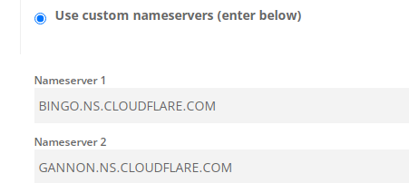
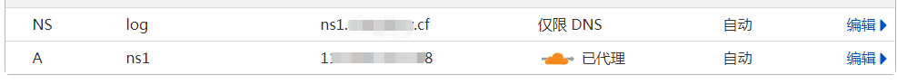
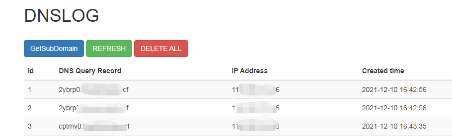

[freenom](https://my.freenom.com/)  注册域名

部分域名提供商只允许修改 NS 记录为已经认证过的 NS 地址。所以需要找一个支持修改 NS 记录为自己 NS 的域名提供商。比如 [cloudflare](https://dash.cloudflare.com/)。

cloudflare 里有cdn，有一定隐藏ip作用

下载 https://github.com/sa1tor/dnslog

	pip install  tornado==5.1.1
	python server.py --port=8000

## reference

https://github.com/sa1tor/dnslog

## 后记

一些其他的dns server推荐

log.xn--9tr.com

**建议搭建dnsmasq**

	yum install dnsmasq
	vim /etc/dnsmasq.conf

dnslog位置：

	log-queries
	log-facility=/opt/dnsmasq.log
